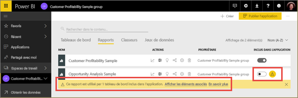
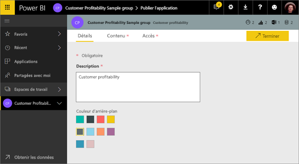
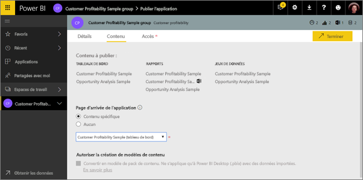
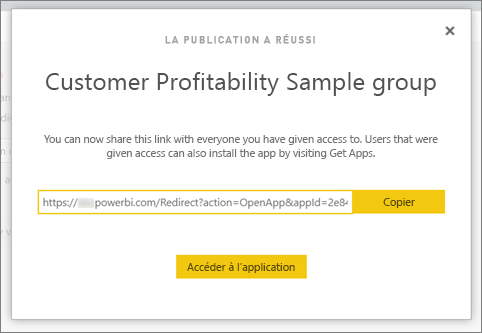
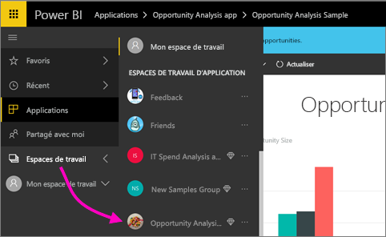
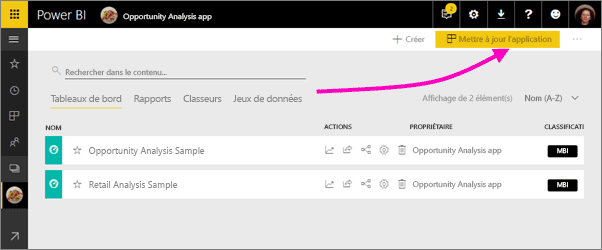
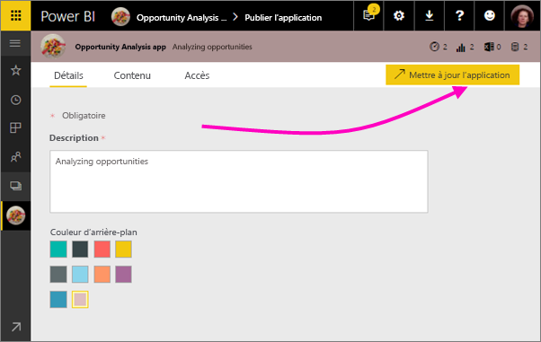

# Publier des applications avec des tableaux de bord et des rapports dans Power BI

Dans Power BI, vous pouvez publier des *applications* avec des collections de tableaux de bord et de rapports associés. Vous créez des applications dans des *espaces de travail d’application*, où vous pouvez collaborer sur du contenu Power BI avec vos collègues. Vous pouvez ensuite publier les applications terminées auprès de grands groupes de personnes dans votre organisation. Pour plus d’informations, consultez [Création d’espaces de travail d’application](service-create-workspaces.md).

Vos utilisateurs en entreprise ont souvent besoin de plusieurs tableaux de bord et rapports Power BI pour effectuer leur travail. Avec les applications Power BI, vous pouvez créer des collections de tableaux de bord et de rapports et publier ces applications pour toute votre organisation ou pour des personnes ou groupes spécifiques. Pour vous, en tant que créateur de rapports ou en tant qu’administrateur, les applications facilitent la gestion des autorisations sur ces collections.

Les utilisateurs obtiennent vos applications de différentes manières. Si l’administrateur Power BI vous y autorise, vous pouvez installer des applications automatiquement dans les comptes Power BI de vos collègues. Autrement, ceux-ci peuvent installer vos applications à partir de Microsoft AppSource ou d’un lien direct que vous leur envoyez. Ils peuvent facilement trouver et revenir à votre contenu, car celui-ci figure dans un emplacement unique. Ils ne peuvent pas modifier le contenu de l’application, mais peuvent interagir avec celle-ci dans le service Power BI ou dans l’une des applications mobiles en filtrant, en mettant en surbrillance et en triant eux-mêmes les données. Ils obtiennent les mises à jour automatiquement, et vous pouvez contrôler la fréquence à laquelle les données sont actualisées. Pour en savoir plus, voir l’[expérience d’application pour les utilisateurs professionnels](consumer/end-user-apps.md).

**Le saviez-vous ?** Power BI propose une nouvelle expérience d’espace de travail en préversion. Lisez [Créer de nouveaux espaces de travail (préversion)](service-create-the-new-workspaces.md) pour voir comment les espaces de travail seront à l’avenir. 

## Applications et packs de contenu d’organisation
Les applications sont l’évolution des packs de contenu d’organisation. Les packs de contenu ne sont pas disponibles dans les expériences des nouveaux espaces de travail en préversion. Une fois l’expérience des nouveaux espaces de travail en disponibilité générale, vous ne pourrez plus utiliser des packs de contenu dans les espaces de travail nouvellement créés. Si vous ne l’avez pas déjà fait, commencez à migrer vos packs de contenu vers des applications.

## Vidéo : applications et espaces de travail d’application
<iframe width="640" height="360" src="https://www.youtube.com/embed/Ey5pyrr7Lk8?showinfo=0" frameborder="0" allowfullscreen></iframe>

## Licences pour des applications
Chaque membre d’un espace de travail d’application doit avoir une licence Power BI Pro. Pour les utilisateurs des applications, il existe deux options.

* Option 1 : tous les utilisateurs professionnels ont besoin de licences **Power BI Pro** pour consulter votre application. 
* Option 2 : si votre application se trouve dans une capacité Power BI Premium, les utilisateurs gratuits de votre organisation peuvent consulter le contenu de l’application. Pour plus de détails, consultez [Qu’est-ce que Power BI Premium ?](service-premium.md).

## Publier votre application
Quand les tableaux de bord et rapports de votre espace de travail sont prêts, vous choisissez les tableaux de bord et les rapports que vous voulez publier, puis vous les publiez en tant qu’application. Vous pouvez envoyer un lien direct à un public plus large, ou les destinataires de votre application peuvent trouver celle-ci sous l’onglet Applications en accédant à **Télécharger et explorer d’autres applications d’AppSource**. 

1. Dans l’affichage liste de l’espace de travail, choisissez les tableaux de bord et rapports à inclure dans l’application.

     

     Si vous choisissez de ne pas publier un rapport, un avertissement s’affiche en regard du rapport et du tableau de bord associé. Vous pouvez toujours publier l’application, mais le tableau de bord associé ne contiendra pas les vignettes de ce rapport.

     

2. En haut à droite, sélectionnez le bouton **Publier l’application** pour démarrer le processus de partage de tout le contenu de cet espace de travail.
   
     

3. Dans **Détails**, remplissez la description pour aider les utilisateurs à trouver l’application. Vous pouvez définir une couleur d’arrière-plan pour personnaliser l’application.
   
     

4. Dans **Contenu** apparaît le contenu qui sera publié avec l’application, c’est-à-dire tout ce que vous avez sélectionné dans cet espace de travail. Vous pouvez également définir la page d’accueil de l’application, c’est-à-dire le tableau de bord ou le rapport que les utilisateurs voient en premier quand ils accèdent à celle-ci. Vous pouvez choisir **Aucun**. Dans ce cas, les utilisateurs accèdent à une liste répertoriant tout le contenu de l’application. 
   
     

5. Dans **Accès**, choisissez qui a accès à l’application : tous les membres de l’organisation, des personnes spécifiques ou des groupes de sécurité Active Directory. Si vous disposez des autorisations nécessaires, vous pouvez installer l’application automatiquement pour les destinataires. Vous pouvez activer ce paramètre dans le [portail d’administration Power BI](#how-to-enable-pushing-apps). Vous pouvez découvrir plus d’informations sur [les applications poussées](#how-to-enable-pushing-apps).

    

6. Lorsque vous sélectionnez **Terminer**, un message confirme que l’application est prête pour publication. Dans la boîte de dialogue confirmant le succès de la création de l’application, vous pouvez copier l’URL qui est le lien direct vers l’application, puis envoyer ce lien aux personnes avec lesquelles vous voulez partager celle-ci.
   
     

Pour en savoir plus, voir l’[expérience d’application pour les utilisateurs professionnels](consumer/end-user-apps.md).

## Modifier votre application publiée
Une fois votre application publiée, il se peut que vous souhaitiez la modifier ou la mettre à jour. Il est facile de mettre à jour l’application si vous êtes un administrateur ou un membre de l’espace de travail d’application, ou un contributeur dans un nouvel espace de travail d’application. 

1. Ouvrez l’espace de travail d’application correspondant à l’application. 
   
     
2. Ouvrez le tableau de bord ou le rapport. Vous voyez que vous pouvez apporter toutes les modifications de votre choix.
   
     L’espace de travail d’application étant votre zone intermédiaire, vos modifications ne sont pas visibles dans l’application tant que vous ne la republiez pas. Cela vous permet d’apporter des modifications sans affecter les applications publiées.  
 
3. Revenez à la liste de contenu de l’espace de travail de l’application, puis sélectionnez **Mettre à jour l’application**.
   
     

4. Si nécessaire, mettez à jour les options **Détails**, **Contenu** et **Accès**, puis sélectionnez **Mettre à jour l’application**.
   
     

Les personnes pour lesquelles vous avez publié l’application voient automatiquement la version mise à jour de celle-ci. 

## Installer automatiquement des applications pour les utilisateurs finaux
Les applications fournissent les données dont vos utilisateurs finaux ont besoin pour effectuer leurs tâches. Si un administrateur vous y autorise, vous pouvez installer automatiquement des applications pour les utilisateurs finaux afin de faciliter la distribution des applications appropriées aux personnes ou aux groupes appropriés. Votre application apparaît automatiquement dans la liste des contenus des applications de vos utilisateurs finaux, ce qui leur évite de la rechercher dans Microsoft AppSource ou de suivre un lien d’installation. De cette façon, vous pouvez déployer du contenu Power BI standard plus facilement pour vos utilisateurs.

### Comment installer une application automatiquement pour les utilisateurs finaux
Une fois que l’administrateur vous a affecté des autorisations, vous disposez d’une nouvelle option pour **installer l’application automatiquement**. Quand vous cochez la case et que vous sélectionnez **Terminer** (ou **Mettre à jour l’application** pour les applications existantes), l’application est envoyée (push) à tous les utilisateurs ou groupes définis dans la section **Autorisations** de l’application, sous l’onglet **Accès**.

### Comment les utilisateurs obtiennent les applications qui ont été poussées
Dès que vous poussez une application, elle s’affiche automatiquement dans la liste Applications. Vous pouvez gérer les applications qui doivent être disponibles pour des rôles d’utilisateurs ou de travail spécifiques dans l’organisation.

### Considérations sur l’installation automatique des applications
Voici quelques points à garder à l’esprit quand vous envoyez (push) des applications à des utilisateurs finaux :

* L’installation automatique d’une application pour les utilisateurs peut prendre un certain temps. La plupart des applications s’installent immédiatement, mais si vous les poussez, cela peut prendre du temps.  Tout dépend du nombre d’éléments dans l’application et du nombre de personnes qui y ont accès. Nous vous recommandons de pousser les applications pendant les heures creuses et suffisamment avant que l’utilisateur en ait besoin. Vérifiez auprès de plusieurs utilisateurs avant d’envoyer une communication générale sur la disponibilité des applications.

* Actualisez votre navigateur. Pour que l’application poussée apparaisse dans la liste Applications, l’utilisateur doit peut-être actualiser son navigateur, ou le fermer et le rouvrir.

* Si l’utilisateur ne voit pas immédiatement l’application dans la liste Applications, il doit actualiser son navigateur, ou le fermer et le rouvrir.

* Évitez de surcharger les utilisateurs. Ne poussez pas trop d’applications pour laisser la possibilité aux utilisateurs de se rendre compte de l’utilité des applications préinstallées. Il est préférable de contrôler qui peut pousser des applications pour les utilisateurs finaux afin de coordonner la planification. Vous pouvez mettre en place dans votre organisation un point de contact d’obtention des applications poussées pour les utilisateurs finaux.

* Les applications ne sont pas installées automatiquement pour les utilisateurs invités qui n’ont pas accepté l’invitation.  

## Annuler la publication d’une application
Tout membre d’un espace de travail d’application peut annuler la publication de l’application.

* Dans un espace de travail d’application, sélectionnez les points de suspension (**...**) dans l’angle supérieur droit > **Annuler la publication d’application**.
  
     

Cette action désinstalle l’application pour toutes les personnes pour lesquelles vous l’avez publiée, qui cessent d’y avoir accès. Elle ne supprime ni l’espace de travail d’application ni son contenu.

## Étapes suivantes
* [Créer un espace de travail d’application](service-create-workspaces.md)
* [Installer et utiliser des applications dans Power BI](consumer/end-user-apps.md)
* [Applications Power BI pour des services externes](service-connect-to-services.md)
* [Portail d’administration Power BI](https://docs.microsoft.com/power-bi/service-admin-portal)
* Vous avez des questions ? [Essayez d’interroger la communauté Power BI](http://community.powerbi.com/)
