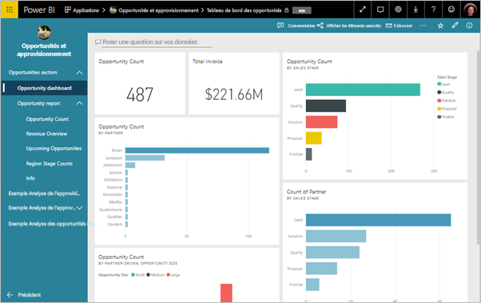
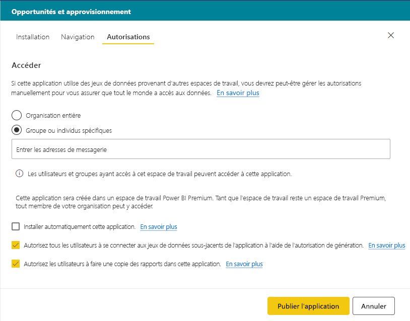
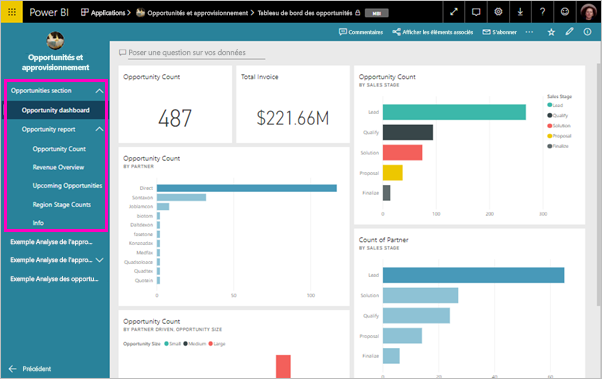

# Publier une application dans Power BI

Dans Power BI, vous pouvez créer du contenu empaqueté officiel, puis le distribuer à un large public sous forme d’*application*. Vous créez des applications dans des *espaces de travail d’application*, où vous pouvez collaborer sur du contenu Power BI avec vos collègues. Vous pouvez ensuite publier les applications terminées auprès de grands groupes de personnes dans votre organisation. 

Vos utilisateurs en entreprise ont souvent besoin de plusieurs tableaux de bord et rapports Power BI pour effectuer leur travail. Avec les applications Power BI, vous pouvez créer des collections de tableaux de bord et de rapports et publier ces applications pour toute votre organisation ou pour des personnes ou groupes spécifiques. Pour vous, en tant que créateur de rapports ou en tant qu’administrateur, les applications facilitent la gestion des autorisations sur ces collections.

Les utilisateurs en entreprise obtiennent vos applications de différentes manières :

- Ils peuvent rechercher et installer votre application à partir de Microsoft AppSource.
- Vous pouvez leur envoyer un lien direct.
- Vous pouvez l’installer automatiquement dans les comptes Power BI de vos collègues si l’administrateur Power BI vous y autorise.

Vous pouvez créer l’application avec sa propre navigation intégrée afin de permettre à vos utilisateurs d’explorer facilement votre contenu. Ils ne peuvent pas modifier le contenu de l’application. Ils peuvent interagir avec lui dans le service Power BI ou dans l’une des applications mobiles, en filtrant, en mettant en surbrillance et en triant eux-mêmes les données. Ils obtiennent les mises à jour automatiquement, et vous pouvez contrôler la fréquence à laquelle les données sont actualisées. Pour en savoir plus, voir l’[expérience d’application pour les utilisateurs professionnels](consumer/end-user-apps.md).

## Licences pour des applications
Pour créer ou mettre à jour une application, vous devez être titulaire d’une licence Power BI Pro. Pour les *consommateurs* d’une application, il existe deux options.

* Option 1 : Tous les utilisateurs professionnels ont besoin de licences **Power BI Pro** pour consulter votre application. 
* Option 2 : Si votre espace de travail d’application se trouve dans une capacité Power BI Premium, les utilisateurs gratuits de votre organisation peuvent consulter le contenu de l’application. Pour plus de détails, consultez [Qu’est-ce que Power BI Premium ?](service-premium.md).

## Publier votre application
Quand les tableaux de bord et rapports de votre espace de travail sont prêts, vous choisissez les tableaux de bord et les rapports que vous voulez publier, puis vous les publiez en tant qu’application. 

1. Dans la vue Liste de l’espace de travail, choisissez les tableaux de bord et les rapports qui doivent être **inclus dans l’application**.

     

     Si vous choisissez de ne pas inclure un rapport ayant un tableau de bord associé, un avertissement s’affiche en regard du rapport. Vous pouvez toujours publier l’application, mais le tableau de bord associé ne contiendra pas les vignettes de ce rapport.

     

2. En haut à droite, sélectionnez le bouton **Publier l’application** pour démarrer le processus de création et de publication d’une application à partir de cet espace de travail.
   
     

3. Dans **Configurer**, remplissez le nom et la description pour aider les utilisateurs à trouver l’application. Vous pouvez définir une couleur de thème pour personnaliser cette dernière. Vous pouvez également ajouter un lien vers un site de support.
   
     

4. Sur **Navigation**, vous sélectionnez le contenu à publier comme partie de l’application. Vous ajoutez ensuite la navigation d’application afin d’organiser le contenu dans des sections. Pour plus d’informations, consultez [Concevoir l’expérience de navigation pour votre application](#design-the-navigation-experience-for-your-app) dans cet article.
   
     

5. Sur **Autorisations**, déterminez qui a accès à l’application, et ce que leurs utilisateurs peuvent faire avec elle. 
    - Dans [Espaces de travail classiques](service-create-workspaces.md) : tout le monde dans votre organisation, des personnes spécifiques ou des groupes de sécurité Azure Active Directory (AAD).
    - Dans les [espaces de travail de nouvelle expérience](service-create-the-new-workspaces.md) : des personnes spécifiques, des listes de distribution et des groupes de sécurité AAD, ainsi que des groupes Office 365. Tous les utilisateurs de l’espace de travail ont automatiquement accès à l’application pour cet espace de travail.
    - Vous pouvez autoriser les utilisateurs d’applications à se connecter aux jeux de données sous-jacents de l’application à l’aide de l’autorisation de génération. Ces jeux de données figureront dans les expériences de recherche des jeux de données.
    - Vous pouvez autoriser les utilisateurs d’applications à créer une copie des rapports de cette application dans leur espace Mon espace de travail. 
    
    >[!IMPORTANT]
    >Si votre application repose sur des jeux de données provenant d’autres espaces de travail, il vous appartient de vérifier que tous les utilisateurs de l’application ont accès aux jeux de données sous-jacents.
> 
>     

6. Vous pouvez installer l’application automatiquement pour les destinataires, si votre administrateur Power BI a activé ce paramètre pour vous dans le portail d’administration Power BI. D’autres informations sur l’[installation automatique d’une application](#automatically-install-apps-for-end-users) sont disponibles dans cet article.

     

7. Quand vous sélectionnez **Publier l’application** , un message confirme que l’application est prête à être publiée. Dans la boîte de dialogue **Partager cette application**, vous pouvez copier l’URL qui est un lien direct vers cette application.
   
     

Vous pouvez envoyer ce lien direct aux personnes avec lesquelles vous avez partagé votre application, ou les destinataires de celles-ci peuvent la trouver sous l’onglet Applications en accédant à **Télécharger et explorer d’autres applications depuis AppSource**. Pour en savoir plus, voir l’[expérience d’application pour les utilisateurs professionnels](consumer/end-user-apps.md).

## Modifier votre application publiée
Une fois votre application publiée, il se peut que vous souhaitiez la modifier ou la mettre à jour. Il est facile de la mettre à jour si vous êtes administrateur ou membre du nouvel espace de travail d’application. 

1. Ouvrez l’espace de travail d’application correspondant à l’application. 
   
     

2. Apportez les changements souhaités aux tableaux de bord ou aux rapports.
 
     L’espace de travail d’application étant votre zone intermédiaire, vos modifications ne sont pas visibles dans l’application tant que vous ne la republiez pas. Cela vous permet d’apporter des modifications sans affecter les applications publiées.  
 
    > [!IMPORTANT]
    > Si vous supprimez un rapport et que vous mettez à jour l’application, même si vous rajoutez le rapport à l’application, les consommateurs de votre application perdent toutes les personnalisations comme les signets, les commentaires, etc.  
 
3. Revenez à la liste de contenu de l’espace de travail de l’application, puis sélectionnez **Mettre à jour l’application** en haut à droite.
   
1. Si nécessaire, mettez à jour **Configuration**, **Navigation** et **Autorisations**, puis sélectionnez **Mettre à jour l’application**.
   
Les personnes pour lesquelles vous avez publié l’application voient automatiquement la version mise à jour de celle-ci. 

## Concevoir l’expérience de navigation pour votre application
L’option **Nouveau générateur de navigation** vous permet de générer une navigation personnalisée pour votre application. La navigation personnalisée permet à vos utilisateurs de rechercher et d’utiliser plus facilement le contenu de l’application. Cette option est désactivée pour les applications existantes et elle est activée par défaut pour les nouvelles applications.

Quand l’option est désactivée, vous pouvez sélectionner la **Page d’arrivée de l’application** pour qu’elle affiche du **Contenu spécifique**, par exemple un tableau de bord ou un rapport, ou sélectionner **Aucun** pour afficher la liste de contenu de base à l’utilisateur.

Quand vous activez **Nouveau générateur de navigation**, vous pouvez concevoir une navigation personnalisée. Par défaut, tous les rapports, tableaux de bord et classeurs Excel que vous avez inclus dans votre application sont listés sous forme de liste plate. 

Vous pouvez personnaliser davantage la navigation dans l’application en effectuant les opérations suivantes :
* Réorganisation des éléments à l’aide des flèches de direction vers le haut/vers le bas. 
* Renommage des éléments dans les **Détails du rapport** , les **Détails du tableau de bord** et les **Détails du classeur**.
* Masquage des certains éléments dans le volet de navigation.
* Utilisation de l’option **Nouveau** pour ajouter des **sections** afin de regrouper du contenu associé.
* Utilisation de l’option **Nouveau** pour ajouter un **lien** vers une ressource externe au volet de navigation gauche. 

Quand vous ajoutez un **lien**, dans **Détails du lien**, vous pouvez choisir l’emplacement d’ouverture du lien. Par défaut, les liens s’ouvrent sous l’**Onglet actif**, mais vous pouvez sélectionner **Nouvel onglet** ou **Zone de contenu**. 

### Considérations pour l’utilisation de l’option Nouveau générateur de navigation
Voici des informations générales à prendre en compte quand vous utilisez le nouveau générateur de navigation :
* Les pages de rapport s’affichent dans la zone de navigation de l’application sous forme de section pouvant être développée
* Si vous désactivez le nouveau générateur de navigation, puis que vous publiez ou mettez à jour votre application, vous perdez les personnalisations que vous avez apportées. Par exemple, les sections, le classement, les liens et les noms personnalisés pour les éléments de navigation sont tous perdus.

Quand vous ajoutez des liens à la navigation dans votre application et que vous sélectionnez l’option Zone de contenu :
* Vérifiez que le lien peut être incorporé. Certains services bloquent l’incorporation de leur contenu dans des sites tiers comme Power BI.
* L’incorporation du contenu d’un service Power BI comme des rapports ou des tableaux de bord dans d’autres espaces de travail n’est pas prise en charge. 
* Incorporez du contenu Power BI Report Server par le biais du contenu de son URL incorporée native à partir d’un déploiement local. Utilisez les étapes décrites dans [Création de l’URL Power BI Report Server](https://docs.microsoft.com/power-bi/report-server/quickstart-embed#creating-the-power-bi-report-server-report-url) pour obtenir l’URL. Sachez que les règles d’authentification standard s’appliquent. Par conséquent, l’affichage du contenu nécessite une connexion VPN au serveur local. 
* Un avertissement de sécurité s’affiche au-dessus du contenu incorporé pour indiquer que le contenu ne se trouve pas dans Power BI.

## Installer automatiquement des applications pour les utilisateurs finaux
Si un administrateur vous octroie des autorisations, vous pouvez installer des applications automatiquement, en les *envoyant (par push)* aux utilisateurs finaux. Cette fonctionnalité d’envoi (par push) facilite la distribution des applications appropriées aux bonnes personnes ou aux bons groupes. Votre application s’affiche automatiquement dans la liste des contenus des applications de vos utilisateurs finaux. Ils n’ont pas besoin de la rechercher dans Microsoft AppSource ou de suivre un lien d’installation. Découvrez comment les administrateurs activent l’[envoi (par push) d’applications à des utilisateurs finaux](service-admin-portal.md#push-apps-to-end-users) dans l’article sur le portail d’administration de Power BI.

### Comment envoyer automatiquement (par push) une application à des utilisateurs finaux
Une fois que l’administrateur vous a affecté des autorisations, vous disposez d’une nouvelle option pour **installer l’application automatiquement**. Quand vous cochez la case et que vous sélectionnez **Publier l’application** (ou **Mettre à jour l’application**), l’application est envoyée (par push) à tous les utilisateurs ou groupes définis dans la section **Autorisations** de l’application sous l’onglet **Accès**.

### Comment les utilisateurs obtiennent les applications que vous leur envoyez (par push)
Dès que vous envoyez (par push) une application, elle s’affiche automatiquement dans leur liste Applications. Ainsi, vous pouvez organiser les applications qui doivent être disponibles pour des utilisateurs ou des fonctions principales spécifiques de votre organisation.

### Considérations sur l’installation automatique des applications
Voici quelques points à garder à l’esprit quand vous envoyez (push) des applications à des utilisateurs finaux :

* L’installation automatique d’une application pour les utilisateurs peut prendre un certain temps. La plupart des applications s’installent immédiatement pour les utilisateurs, mais si vous les envoyez (par push), cela peut prendre du temps.  Tout dépend du nombre d’éléments dans l’application et du nombre de personnes qui y ont accès. Nous vous recommandons de pousser les applications pendant les heures creuses et suffisamment avant que l’utilisateur en ait besoin. Vérifiez auprès de plusieurs utilisateurs avant d’envoyer une communication générale sur la disponibilité des applications.

* Actualisez le navigateur. Pour que l’application poussée apparaisse dans la liste Applications, l’utilisateur doit peut-être actualiser son navigateur, ou le fermer et le rouvrir.

* Si les utilisateurs ne voient pas immédiatement l’application dans la liste Applications, ils doivent actualiser leur navigateur, ou le fermer et le rouvrir.

* Évitez de surcharger les utilisateurs. Ne poussez pas trop d’applications pour laisser la possibilité aux utilisateurs de se rendre compte de l’utilité des applications préinstallées. Il est préférable de contrôler qui peut pousser des applications pour les utilisateurs finaux afin de coordonner la planification. Mettez en place dans votre organisation un point de contact pour obtenir les applications envoyées (par push) aux utilisateurs finaux.

* Les applications ne sont pas installées automatiquement pour les utilisateurs invités qui n’ont pas accepté l’invitation.  

## Autoriser les utilisateurs à se connecter aux jeux de données sous-jacents de l’application
En cochant l’option permettant à tous les utilisateurs de se connecter aux jeux de données sous-jacents de l’application, les utilisateurs de l’application reçoivent l’autorisation de génération sur le jeu de données sous-jacent. Cela permet aux utilisateurs d’[utiliser les jeux de données d’application dans les espaces de travail](service-datasets-across-workspaces.md) pour rechercher ces jeux de données dans Power BI Desktop et les expériences d’obtention de données du service, et de créer des rapports et des tableaux de bord utilisant ces jeux de données. 

Quand vous décochez cette option, les nouveaux utilisateurs que vous ajoutez à l’application ne reçoivent plus l’autorisation de génération. Cependant, les autorisations existantes sur les jeux de données sous-jacents ne changent pas. Vous pouvez utiliser l’interface utilisateur fournie pour supprimer manuellement l’autorisation de génération des utilisateurs de l’application qui ne doivent plus en bénéficier. Découvrez plus en détail l’[autorisation de génération](service-datasets-build-permissions.md#build-permissions-for-shared-datasets).

## Autoriser les utilisateurs à faire une copie des rapports dans l’application
En cochant l’option **Autorisez les utilisateurs à effectuer une copie des rapports dans cette application**, vous autorisez les utilisateurs à enregistrer n’importe quel rapport de l’application dans leur espace Mon espace de travail. Ils peuvent ensuite personnaliser les rapports en fonction de leurs besoins spécifiques. Cette option nécessite l’activation de l’option **Autorisez tous les utilisateurs à se connecter aux jeux de données sous-jacents de l’application à l’aide de l’autorisation de génération**. Cette fonctionnalité se comporte comme la nouvelle fonctionnalité de [copie de rapports à partir d’autres espaces de travail](service-datasets-copy-reports.md).

## Annuler la publication d’une application
Tout membre d’un espace de travail d’application peut annuler la publication de l’application.

>[!IMPORTANT]
>Lorsque vous annulez la publication d’une application, les utilisateurs de l’application perdent leurs personnalisations. Ils perdent tous les signets personnels, commentaires ou abonnements associés au contenu de l’application. N’annulez la publication d’une application que si vous devez la supprimer.
> 
> 

* Dans un espace de travail d’application, sélectionnez les points de suspension ( **...** ) dans l’angle supérieur droit > **Annuler la publication d’application**.
  
     

Cette action désinstalle l’application pour toutes les personnes pour lesquelles vous l’avez publiée, qui cessent d’y avoir accès. Elle ne supprime ni l’espace de travail d’application ni son contenu.

## Afficher votre application publiée

Quand les consommateurs de votre application ouvrent cette dernière, ils voient la navigation que vous avez créée, au lieu du volet de navigation de gauche standard de Power BI. La navigation dans l’application liste les rapports et les tableaux de bord dans les sections que vous avez définies. Elle liste également les pages individuelles de chaque rapport, plutôt que simplement le nom du rapport.

## Étapes suivantes
* [Créer un espace de travail d’application](service-create-workspaces.md)
* [Installer et utiliser des applications dans Power BI](consumer/end-user-apps.md)
* [Applications Power BI pour des services externes](service-connect-to-services.md)
* [Portail d’administration Power BI](https://docs.microsoft.com/power-bi/service-admin-portal)
* Vous avez des questions ? [Essayez d’interroger la communauté Power BI](http://community.powerbi.com/)
