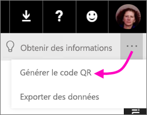

# Créer un code QR pour une vignette dans Power BI à utiliser dans les applications mobiles
Les codes QR dans Power BI peuvent connecter n’importe quel élément du monde réel directement à des informations connexes en matière de décisionnel. Aucune navigation ni recherche n’est nécessaire.

Vous pouvez créer un code QR dans le service Power BI pour les vignettes dans n’importe quel tableau de bord, même ceux que vous ne pouvez pas modifier. Placez ensuite le code QR dans un emplacement clé. Par exemple, vous pouvez le coller dans un message électronique ou l’imprimer et le coller dans un emplacement spécifique. 

Les collègues avec lesquels vous avez partagé le tableau de bord peuvent [scanner le code QR pour accéder à la vignette directement à partir de leur appareil mobile](consumer/mobile/mobile-apps-qr-code.md). Ils peuvent utiliser le scanner de code QR situé dans l’application Power BI ou tout autre scanner QR installé sur leur appareil.

## Créer un code QR pour une vignette
1. Ouvrez un tableau de bord dans le service Power BI.
2. Sélectionnez les points de suspension (...) en haut à droite de la vignette, puis sélectionnez **Mode focus** .
3. Sélectionnez les points de suspension (...) en haut à droite, puis choisissez **Générer le code QR**. 
   
    
4. Une boîte de dialogue présente le code QR. 
   
    
5. À ce stade, vous pouvez scanner le code QR ou le télécharger et l’enregistrer afin de pouvoir l’utiliser comme suit : 
   
   * l’ajouter à un message électronique ou un autre document ; 
   * l’imprimer et le placer dans un emplacement spécifique. 

## Imprimer le code QR
Power BI génère le code QR en tant que fichier JPG prêt pour l’impression. 

1. Sélectionnez **Téléchargez**, puis ouvrez le fichier JPG sur un ordinateur connecté à une imprimante.  
   
   > [!TIP]
   > Le fichier JPG porte le même nom que la vignette. Par exemple, « Nombre d’opportunités - par mois, étape de vente.jpg ».
   > 
   > 
2. Imprimez le fichier à 100 % ou « taille réelle ».  
3. Découpez le code QR et collez-le dans un emplacement approprié pour la vignette. 

## Étapes suivantes
* [Se connecter aux données Power BI réelles](consumer/mobile/mobile-apps-data-in-real-world-context.md) avec les applications mobiles
* [Scanner un code QR Power BI à partir de votre appareil mobile](consumer/mobile/mobile-apps-qr-code.md)
* [Créer un code QR pour un rapport](service-create-qr-code-for-report.md)
* Vous avez des questions ? [Essayez d’interroger la communauté Power BI](http://community.powerbi.com/)

