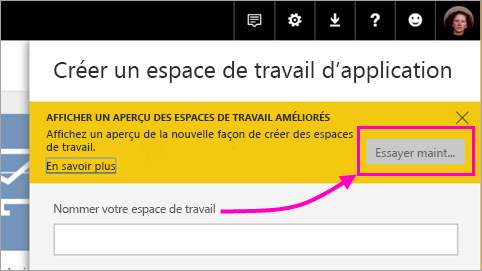
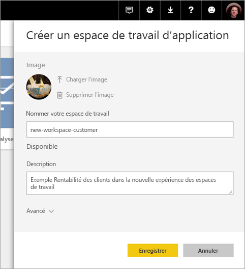
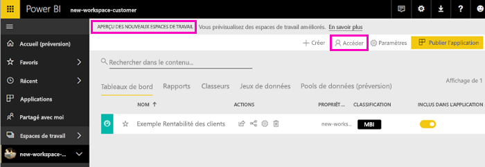
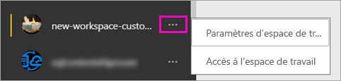

# Créer les nouveaux espaces de travail (préversion) dans Power BI

Power BI introduit une nouvelle expérience d’espace de travail en préversion. Les espaces de travail restent des endroits destinés à collaborer avec des collègues pour créer des collections de tableaux de bord et de rapports, que vous pouvez regrouper en *applications* et distribuer dans toute votre organisation, ou à des personnes ou des groupes spécifiques. 

Avec la préversion des nouveaux espaces de travail, vous pouvez désormais :

- Affecter des rôles d’espace de travail à des groupes d’utilisateurs : groupes de sécurité, listes de distribution, groupes Office 365 et personnes individuelles.
- Créer un espace de travail dans Power BI sans créer un groupe Office 365.
- Utiliser des rôles d’espace de travail plus granulaires, pour une gestion plus flexible des autorisations dans un espace de travail.

Pour plus d’informations, consultez l’article sur les [nouveaux espaces de travail (préversion)](service-new-workspaces.md).

## Créer un nouvel espace de travail d’application

1. Commencez par créer l’espace de travail d’application. Sélectionnez **Espaces de travail** > **Créer un espace de travail d’application**.
   
     

2. Dans **Afficher un aperçu des espaces de travail améliorés**, sélectionnez **Essayer maintenant**.
   
     

2. Nommez l’espace de travail. Si le nom n’est pas disponible, modifiez-le de façon à obtenir un ID unique.
   
     L’application aura le même nom que l’espace de travail.
   
1. Si vous le souhaitez, ajoutez une image. La taille du fichier doit être inférieure à 45 Ko.
 
    

1. Sélectionnez **Enregistrer**.

    Ici, dans l’écran **Bienvenue** pour votre nouvel espace de travail, vous pouvez ajouter des données. 

    

1. Par exemple, sélectionnez **Exemples** > **Exemple Rentabilité des clients**.

    Maintenant, dans la liste des contenus de l’espace de travail, vous voyez **Aperçu des nouveaux espaces de travail**. Comme vous êtes administrateur, vous voyez également voir une nouvelle action, **Accéder**.

    

1. Sélectionnez **Accéder**.

1. Ajoutez des groupes de sécurité, des listes de distribution, des groupes Office 365 ou des personnes individuelles à ces espaces de travail en tant que membres, contributeurs ou administrateurs. Consultez [Rôles dans les nouveaux espaces de travail](service-new-workspaces.md#roles-in-the-new-workspaces) pour une explication des différents rôles.

    

9. Sélectionnez **Ajouter** > **Fermer**.

1. Power BI crée l’espace de travail et l’ouvre. Vous le voyez dans la liste des espaces de travail dont vous êtes membre. Comme vous êtes administrateur, vous pouvez sélectionner les points de suspension (…) pour revenir en arrière afin d’apporter des modifications aux paramètres de l’espace de travail, ajouter des membres ou changer leurs autorisations.

     

## Ajouter du contenu à votre espace de travail d’application

Une fois que vous avez créé un espace de travail d’application du nouveau type, vous pouvez y ajouter du contenu. L’ajout de contenu est similaire dans les espaces de travail anciens et nouveaux, à une exception près. Dans les espaces de travail d’application des deux types, vous pouvez charger des fichiers ou vous y connecter exactement comme vous le feriez dans Mon espace de travail. Dans les nouveaux espaces de travail, vous ne pouvez pas vous connecter à des packs de contenu d’organisation ou à des packs de contenu tiers, comme Microsoft Dynamics CRM, Salesforce ou Google Analytics. Dans les espaces de travail actuels, vous pouvez vous connecter à des packs de contenu.

Quand vous visualisez du contenu de la liste de contenu dans un espace de travail d’application, le nom de l’espace de travail d’application apparaît en tant que propriétaire.

### Connexion à des services tiers dans les nouveaux espaces de travail (préversion)

Dans la nouvelle expérience des espaces de travail, nous avons apporté une modification qui met l’accent sur les *applications*. Les applications de services tiers permettent aux utilisateurs d’obtenir des données plus facilement auprès des services qu’ils utilisent comme Microsoft Dynamics CRM, Salesforce ou Google Analytics.
Les applications d’organisation donnent à vos utilisateurs les données dont ils ont besoin. Nous prévoyons d’ajouter des fonctionnalités aux applications d’organisation pour que les utilisateurs puissent personnaliser le contenu qu’ils trouvent dans les applications. Avec cette fonctionnalité, vous n’aurez plus besoin de packs de contenu. 

Avec la préversion des nouveaux espaces de travail, vous ne pouvez pas créer ni consommer des packs de contenu d’organisation. Au lieu de cela, vous pouvez utiliser les applications fournies pour vous connecter à des services tiers ou demander à vos équipes internes de fournir des applications pour les packs de contenu que vous utilisez actuellement. 

## Distribuer une application

Quand le contenu est prêt, vous choisissez les tableaux de bord et les rapports que vous voulez publier, puis vous les publiez en tant *qu’application*. Vous pouvez créer une application à partir de chaque espace de travail. Vos collègues peuvent obtenir votre application de différentes manières. Vous pouvez l’installer automatiquement dans les comptes Power BI de vos collègues si l’administrateur Power BI vous y autorise. Sinon, ils peuvent rechercher et installer votre application à partir de Microsoft AppSource ou d’un lien direct que vous leur envoyez. Ils obtiennent les mises à jour automatiquement, et vous pouvez contrôler la fréquence à laquelle les données sont actualisées. Pour plus d’informations, consultez [Publier des applications avec des tableaux de bord et des rapports dans Power BI](service-create-distribute-apps.md).

## Convertir les anciens espaces de travail d’application en nouveaux espaces de travail d’application

Pendant la période de préversion, vous ne pouvez pas convertir automatiquement vos anciens espaces de travail d’application en nouveaux espaces. Vous pouvez cependant créer un nouvel espace de travail d’application et publier votre contenu sur le nouvel emplacement. 

Quand les nouveaux espaces de travail seront en disponibilité générale, vous pourrez choisir de migrer les anciens automatiquement. À un moment donné après la disponibilité générale, vous devrez les migrer.

## Étapes suivantes
* Découvrir l’[organisation du travail dans les nouveaux espaces de travail (préversion) dans Power BI](service-new-workspaces.md)
* [Créer les espaces de travail actuels](service-create-workspaces.md)
* [Installer et utiliser des applications dans Power BI](service-create-distribute-apps.md)
* Vous avez des questions ? [Essayez d’interroger la communauté Power BI](http://community.powerbi.com/)
