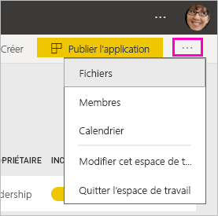

# Créer les nouveaux espaces de travail dans Power BI

Power BI introduit une nouvelle expérience d’espace de travail. Les espaces de travail restent des espaces de collaboration qui vous permettent de créer des collections de tableaux de bord, de rapports et de rapports paginés avec vos collègues. Vous pouvez ensuite regrouper cette collection dans une *application* et la distribuer dans toute votre organisation ou à des personnes ou groupes spécifiques. 

Voici ce qui est différent. Dans les nouveaux espaces de travail, vous pouvez :

- Affecter des rôles d’espace de travail à des groupes d’utilisateurs : groupes de sécurité, listes de distribution, groupes Office 365 et personnes individuelles.
- Créer un espace de travail dans Power BI sans créer un groupe Office 365.
- Utiliser des rôles d’espace de travail plus granulaires, pour une gestion plus flexible des autorisations dans un espace de travail.

> [!NOTE]
> Pour appliquer la sécurité au niveau des lignes (RLS) pour les utilisateurs Power BI Pro qui parcourent du contenu dans un espace de travail, continuez à utiliser les [espaces de travail classiques](service-create-workspaces.md). Sélectionnez l'option **Les membres peuvent uniquement voir le contenu Power BI**. Vous pouvez également publier une application Power BI pour ces utilisateurs, ou utiliser le partage pour distribuer du contenu. Le rôle Lecteur à venir permettra ce scénario dans les nouveaux espaces de travail.

Pour plus d’informations, consultez l’article sur les [nouveaux espaces de travail](service-new-workspaces.md).

## Créer un nouvel espace de travail

1. Commencez par créer l’espace de travail. Sélectionnez **Espaces de travail** > **Créer un espace de travail**.
   
     

2. Vous créez automatiquement un espace de travail mis à niveau, sauf si vous choisissez **Revenir au type classique**.
   
     
     
     Si vous sélectionnez **Revenir au type classique**, vous créez un espace de travail basé sur un groupe Office 365. Utilisez cette option si vous avez besoin l’option **Les membres peuvent uniquement voir le contenu Power BI** applique la sécurité au niveau des lignes (RLS) pour les membres de l’espace de travail.

2. Nommez l’espace de travail. Si le nom n’est pas disponible, modifiez-le de façon à obtenir un nom unique.
   
     L’application de l’espace de travail aura le même nom et la même icône que l’espace de travail.
   
1. Voici quelques éléments facultatifs que vous pouvez définir pour votre espace de travail :

    Téléchargez une **image d’espace de travail**. Les fichiers peuvent être au format .png ou .jpg. La taille du fichier doit être inférieure à 45 ko.
    
    [Ajoutez une **Liste de contacts**](#workspace-contact-list). Par défaut, les administrateurs de l’espace de travail sont les contacts. 
    
    [Spécifiez **OneDrive de l'espace de travail**](#workspace-onedrive) en tapant simplement le nom d’un groupe Office 365 existant, et non pas l’URL. Cet espace de travail peut désormais utiliser l’emplacement de stockage de fichiers de ce groupe Office 365. 

    

    Pour affecter l’espace de travail à une **Capacité dédiée**, sous l’onglet **Premium**, sélectionnez **Capacité dédiée**.
     
    

1. Sélectionnez **Enregistrer**.

    Power BI crée l’espace de travail et l’ouvre. Vous le voyez dans la liste des espaces de travail dont vous êtes membre. 

## Liste de contacts de l’espace de travail

La nouvelle liste de contacts de l’espace de travail vous permet de spécifier les utilisateurs qui reçoivent une notification concernant les problèmes qui se produisent dans l’espace de travail. Par défaut, tout utilisateur ou groupe spécifié comme administrateur de l’espace de travail est averti, mais vous pouvez personnaliser la liste. Les utilisateurs ou groupes répertoriés dans la liste de contacts seront affichés dans l’interface utilisateur (IU) pour aider les utilisateurs à obtenir de l’aide concernant l’espace de travail.

1. Accédez au nouveau paramètre **Liste de contacts** de l’une des deux manières suivantes :

    Dans le volet **Créer un espace de travail**, lors de sa création.

    Dans le volet de navigation gauche, sélectionnez la flèche en regard **d’Espaces de travail**, sélectionnez les points de suspension (...) en regard du nom de l’espace de travail > **Paramètres de l’espace de travail**. Le volet **Paramètres** s’ouvre.

    

2. Sous **Avancé** > **Liste de contacts**, acceptez les **Administrateurs de l'espace de travail** ou ajoutez votre propre liste **Utilisateurs ou groupes spécifiques**. 
3. Sélectionnez **Enregistrer**.

## OneDrive de l’espace de travail

La fonctionnalité OneDrive de l’espace de travail vous permet de configurer un groupe Office 365 dont le stockage fichier de la bibliothèque de documents SharePoint est disponible pour les utilisateurs de l’espace de travail. Vous devez d’abord créer le groupe en dehors de Power BI. 

Power BI ne synchronise pas les autorisations des utilisateurs ou des groupes qui sont configurés pour avoir accès à l’espace de travail avec l’appartenance au groupe Office 365. La meilleure pratique consiste à attribuer au même groupe Office 365, dont vous configurez le stockage de fichiers dans ce groupe Office 365, [l’accès à l’espace de travail](#give-access-to-your-workspace). Gérez ensuite l’accès à l’espace de travail en gérant l’appartenance du groupe Office 365. 

1. Accédez au nouveau paramètre **OneDrive de l’espace de travail** de l’une des deux manières suivantes :

    Dans le volet **Créer un espace de travail**, lors de sa création.

    Dans le volet de navigation gauche, sélectionnez la flèche en regard **d’Espaces de travail**, sélectionnez les points de suspension (...) en regard du nom de l’espace de travail > **Paramètres de l’espace de travail**. Le volet **Paramètres** s’ouvre.

    

2. Sous **Avancé** > **OneDrive de l’espace de travail**, saisissez le nom du groupe Office 365 que vous avez créé plus tôt. Power BI récupère automatiquement le OneDrive du groupe.

    

3. Sélectionnez **Enregistrer**.

### Accéder à l’emplacement OneDrive de l’espace de travail

Une fois que vous avez configuré l’emplacement OneDrive, vous pouvez y accéder à partir de différents emplacements dans l’espace de travail :

- Sélectionnez **Espaces de travail** > *Nom de l’espace de travail* > Points de suspension( **...** ) > **Fichiers**. 

    

- Sélectionnez les points de suspension ( **...** ) dans le coin supérieur droit de l’espace de travail > **Fichiers**.

    
    
- Dans l’expérience **Obtenir des données** > **Fichiers**. L'entrée **OneDrive - Entreprise** est votre propre OneDrive Entreprise. Le deuxième OneDrive est celui que vous avez ajouté.

    

## Ajouter du contenu à votre espace de travail

Une fois que vous avez créé un espace de travail pour la nouvelle expérience, il est temps d’y ajouter du contenu. L’ajout de contenu est similaire dans les espaces de travail nouveaux et classiques. Utilisez le bouton Créer ou utilisez l’option Obtenir des données pour ajouter du contenu à votre espace de travail.

1. Dans l’écran **Bienvenue** pour votre nouvel espace de travail, vous pouvez ajouter du contenu. 

    

1. Par exemple, sélectionnez **Exemples** > **Exemple Rentabilité des clients**.

> [!NOTE]
> Vous ne pouvez pas ajouter de packs de contenu d’organisation ou de packs de contenu tiers aux nouveaux espaces de travail. Des applications sont disponibles pour de nombreux packs de contenu tiers que vous avez utilisés précédemment. Utilisez les espaces de travail classiques si vous devez continuer à utiliser mes packs de contenu. Les packs de contenu sont déconseillés, c’est pourquoi il est recommandé d’utiliser des applications à la place.

Quand vous visualisez du contenu de la liste de contenu dans un espace de travail, le nom de l’espace de travail apparaît en tant que propriétaire.

### Connexion à des services tiers dans les nouveaux espaces de travail

Dans la nouvelle expérience des espaces de travail, nous avons apporté une modification qui met l’accent sur les *applications*. Les applications de services tiers permettent aux utilisateurs d’obtenir des données plus facilement auprès des services qu’ils utilisent comme Microsoft Dynamics CRM, Salesforce ou Google Analytics.

Dans la nouvelle expérience d’espace de travail, vous ne pouvez pas créer ni consommer des packs de contenu d’organisation. Au lieu de cela, vous pouvez utiliser les applications fournies pour vous connecter à des services tiers ou demander à vos équipes internes de fournir des applications pour les packs de contenu que vous utilisez actuellement. 

## Accorder l’accès à votre espace de travail

1. Dans la liste de contenu de l’espace de travail, dans la mesure où vous êtes un administrateur, vous voyez une nouvelle action, **Accéder**.

    

1. Sélectionnez **Accéder**.

1. Ajoutez des groupes de sécurité, des listes de distribution, des groupes Office 365 ou des personnes individuelles à ces espaces de travail en tant que membres, contributeurs ou administrateurs. Consultez [Rôles dans les nouveaux espaces de travail](service-new-workspaces.md#roles-in-the-new-workspaces) pour une explication des différents rôles.

    

9. Sélectionnez **Ajouter** > **Fermer**.

## Distribuer une application

Si vous voulez distribuer du contenu officiel à un large public au sein de votre organisation, vous pouvez publier une application à partir de votre espace de travail.  Quand le contenu est prêt, vous choisissez les tableaux de bord et les rapports que vous voulez publier, puis vous les publiez en tant qu’*application*. Vous pouvez créer une application à partir de chaque espace de travail.

Découvrir comment [Publier une application à partir des nouveaux espaces de travail](service-create-distribute-apps.md)

## Étapes suivantes
* Découvrir l’[organisation du travail dans la nouvelle expérience d’espace de travail dans Power BI](service-new-workspaces.md)
* [Créer des espaces de travail classiques](service-create-workspaces.md)
* [Publier une application à partir des nouveaux espaces de travail dans Power BI](service-create-distribute-apps.md)
* Vous avez des questions ? [Essayez d’interroger la communauté Power BI](http://community.powerbi.com/)
