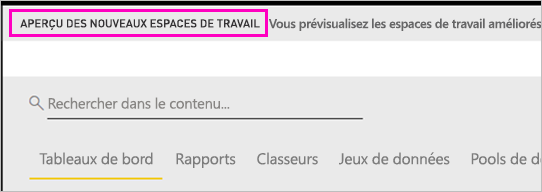
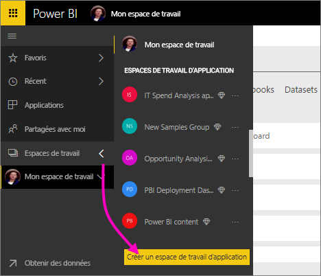
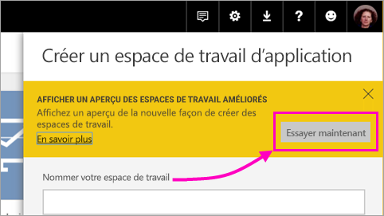
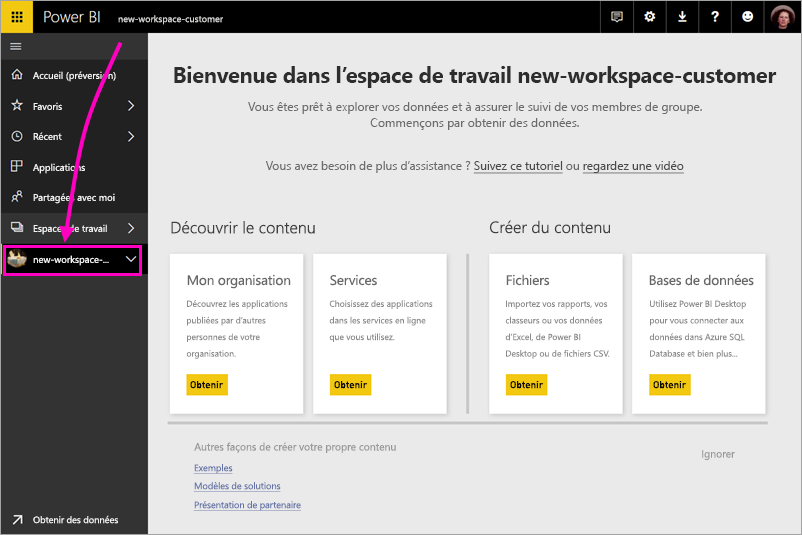
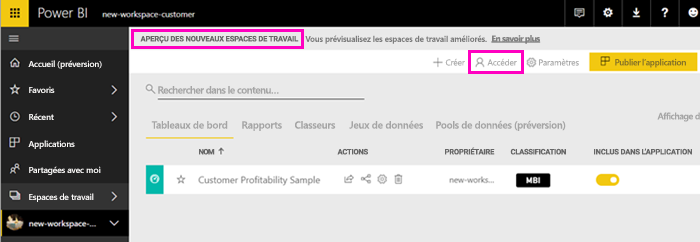
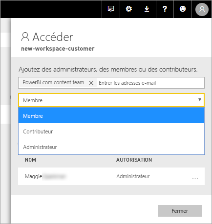
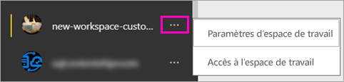

# Créer les nouveaux espaces de travail (préversion) dans Power BI

Power BI introduit une nouvelle expérience d’espace de travail en préversion. Les espaces de travail restent des endroits destinés à collaborer avec des collègues pour créer des collections de tableaux de bord et de rapports, que vous pouvez regrouper en *applications* et distribuer dans toute votre organisation, ou à des personnes ou des groupes spécifiques. 

Avec la préversion des nouveaux espaces de travail, vous pouvez désormais :

- Affecter des rôles d’espace de travail à des groupes d’utilisateurs : groupes de sécurité, listes de distribution, groupes Office 365 et personnes individuelles.
- Créer un espace de travail dans Power BI sans créer un groupe Office 365.
- Utiliser des rôles d’espace de travail plus granulaires, pour une gestion plus flexible des autorisations dans un espace de travail.
 
Quand vous créez un des nouveaux espaces de travail, vous ne créez pas de groupe Office 365 associé sous-jacent. Toute l’administration des espaces de travail se fait dans Power BI et non pas dans Office 365. Vous pouvez toujours ajouter un groupe Office 365 à l’espace de travail pour continuer à gérer l’accès des utilisateurs au contenu via des groupes Office 365. Cependant, vous pouvez en plus utiliser des groupes de sécurité et des listes de distribution, et ajouter des personnes une par une directement dans Power BI, ce qui représente un moyen souple de gérer l’accès à l’espace de travail. L’administration de l’espace de travail se trouvant à présent dans Power BI, ce sont les administrateurs Power BI qui choisissent quels membres de l’organisation peuvent créer des espaces de travail. Pour plus d’informations, consultez [l’article sur le portail d’administration de Power BI, section Espaces de travail](service-admin-portal.md#workspace-settings). 

Vous ajoutez des groupes d’utilisateurs ou des personnes individuelles aux nouveaux espaces de travail en tant que membres, contributeurs ou administrateurs. Tous les utilisateurs d’un groupe d’utilisateurs reçoivent le rôle que vous avez défini. Si une personne est dans plusieurs groupes d’utilisateurs, elle reçoit le niveau d’autorisation le plus élevé fourni par le rôle.  Consultez [Rôles dans les nouveaux espaces de travail](#roles-in-the-new-workspaces) plus loin dans cet article pour une explication des différents rôles.

Toutes les personnes que vous ajoutez à un espace de travail d’application doivent avoir une licence Power BI Pro. Dans l’espace de travail, ces utilisateurs peuvent collaborer sur des tableaux de bord et des rapports que vous prévoyez de publier pour un public plus large, ou même pour votre organisation toute entière. Si vous voulez distribuer du contenu à d’autres utilisateurs au sein de votre organisation, vous pouvez leur attribuer des licences Power BI Pro ou placer l’espace de travail dans une capacité Power BI Premium.

Avec les nouveaux espaces de travail, nous proposons une nouvelle conception de certaines fonctionnalités. Voir [Fonctionnalités de l’espace de travail d’applications fonctionnant différemment](#app-workspace-features-that-work-differently) plus loin dans cet article pour connaître les modifications de la préversion qui seront vraisemblablement rendues permanentes. Comme il s’agit d’une fonctionnalité en préversion, elle est soumise à certaines limitations que vous devez connaître. Voir [Problèmes connus](#known-issues) plus loin dans cet article pour trouver une explication des limitations actuelles. 

## Déployer les nouveaux espaces de travail d’application

Pendant la période de la préversion, les espaces de travail anciens et nouveaux peuvent coexister côte à côte, et vous pouvez créer des espaces des deux types. À la fin de la préversion des nouveaux espaces de travail et une fois qu’ils seront en disponibilité générale, les anciens espaces de travail pourront continuer à exister pendant un certain temps. Vous ne pourrez plus en créer et vous devez vous préparer à migrer vos espaces de travail vers l’infrastructure des nouveaux espaces de travail. Ne vous inquiétez pas : vous disposerez de plusieurs mois pour effectuer la migration.

## Créer un nouvel espace de travail d’application

1. Commencez par créer l’espace de travail d’application. Sélectionnez **Espaces de travail** > **Créer un espace de travail d’application**.
   
     

2. Dans **Afficher un aperçu des espaces de travail améliorés**, sélectionnez **Essayer maintenant**.
   
     

2. Nommez l’espace de travail. Si le nom n’est pas disponible, modifiez-le de façon à obtenir un ID unique.
   
     L’application aura le même nom que l’espace de travail.
   
1. Si vous le souhaitez, ajoutez une image. La taille du fichier doit être inférieure à 45 Ko.
 
    

1. Sélectionnez **Enregistrer**.

    Ici, dans l’écran **Bienvenue** pour votre nouvel espace de travail, vous pouvez ajouter des données. 

    

1. Par exemple, sélectionnez **Exemples** > **Exemple Rentabilité des clients**.

    Maintenant, dans la liste des contenus de l’espace de travail, vous voyez **Aperçu des nouveaux espaces de travail**. Comme vous êtes administrateur, vous voyez également voir une nouvelle action, **Accéder**.

    

1. Sélectionnez **Accéder**.

1. Ajoutez des groupes de sécurité, des listes de distribution, des groupes Office 365 ou des personnes individuelles à ces espaces de travail en tant que membres, contributeurs ou administrateurs. Consultez [Rôles dans les nouveaux espaces de travail](#roles-in-the-new-workspaces) plus loin dans cet article pour une explication des différents rôles.

    

9. Sélectionnez **Ajouter** > **Fermer**.

1. Power BI crée l’espace de travail et l’ouvre. Celui-ci figure dans la liste des espaces de travail dont vous êtes membre. Comme vous êtes administrateur, vous pouvez sélectionner les points de suspension (…) pour revenir en arrière afin d’apporter des modifications aux paramètres de l’espace de travail, ajouter des membres ou changer leurs autorisations.

     

## Ajouter du contenu à votre espace de travail d’application

Une fois que vous avez créé un espace de travail d’application du nouveau type, vous pouvez y ajouter du contenu. L’ajout de contenu est similaire dans les espaces de travail anciens et nouveaux, à une exception près. Dans les espaces de travail d’application des deux types, vous pouvez charger des fichiers ou vous y connecter exactement comme vous le feriez dans Mon espace de travail. Dans les nouveaux espaces de travail, vous ne pouvez pas vous connecter à des packs de contenu d’organisation ou à des packs de contenu tiers, comme Microsoft Dynamics CRM, Salesforce ou Google Analytics. Dans les espaces de travail actuels, vous pouvez vous connecter à des packs de contenu.

Quand vous visualisez du contenu de la liste de contenu dans un espace de travail d’application, le nom de l’espace de travail d’application apparaît en tant que propriétaire.

### Connexion à des services tiers dans les nouveaux espaces de travail (préversion)

Dans la nouvelle expérience des espaces de travail, nous avons apporté une modification qui met l’accent sur les applications. Les applications de services tiers facilitent l’obtention par les utilisateurs de données auprès des services qu’ils utilisent, comme Microsoft Dynamics CRM, Salesforce ou Google Analytics.
Les applications d’organisation donnent à vos utilisateurs les données dont ils ont besoin. Nous prévoyons d’ajouter des fonctionnalités aux applications d’organisation pour que les utilisateurs puissent personnaliser le contenu qu’ils trouvent dans les applications. Ceci supprimera la nécessité des packs de contenu. 

Avec la préversion des nouveaux espaces de travail, vous ne pouvez pas créer ni consommer des packs de contenu d’organisation. Au lieu de cela, vous pouvez utiliser les applications fournies pour vous connecter à des services tiers ou demander à vos équipes internes de fournir des applications pour les packs de contenu que vous utilisez actuellement. 

## Rôles dans les nouveaux espaces de travail

Les rôles vous permettent de gérer qui peut faire quoi dans un espace de travail, ce qui permet aux équipes de collaborer. Les nouveaux espaces de travail vous permettent d’affecter des rôles à des personnes individuelles et à des groupes d’utilisateurs : groupes de sécurité, groupes Office 365 et listes de distribution. 

Quand vous affectez des rôles à un groupe d’utilisateurs, les personnes individuelles du groupe ont accès au contenu. Si vous imbriquez des groupes d’utilisateurs, tous les utilisateurs qui en font partie ont les autorisations associées. Un utilisateur qui est dans plusieurs groupes d’utilisateurs ayant des rôles différents reçoit le niveau d’autorisation le plus élevé qui leur est accordé. 

Les nouveaux espaces de travail offrent trois rôles : administrateurs, membres et contributeurs.

**Les administrateurs peuvent :**

- Mettre à jour et supprimer l’espace de travail. 
- Ajouter/supprimer des personnes, y compris d’autres administrateurs.
- Faire tout ce que les membres peuvent faire.

**Les membres peuvent :** 

- Ajouter des membres ou d’autres rôles avec des autorisations inférieures.
- Publier et mettre à jour une application.
- Partager un élément ou une application.
- Permettre à d’autres utilisateurs de repartager des éléments.
- Faire tout ce que les contributeurs peuvent faire.

**Les contributeurs peuvent :** 

- Créer, modifier et supprimer du contenu dans l’espace de travail. 
- Publier des rapports sur l’espace de travail, supprimer du contenu.
- Ils ne peuvent pas donner accès au contenu à de nouvelles personnes ; ils ne peuvent pas partager du nouveau contenu, mais peuvent partager avec une personne avec laquelle l’espace de travail, l’élément ou l’application est déjà partagé. 
- Ils ne peuvent pas modifier les membres du groupe.
 
Nous créons des flux de travail Demander l’accès dans l’ensemble du service, pour que les utilisateurs qui n’ont pas d’accès puissent le demander. Les flux de travail Demander l’accès existent actuellement pour les tableaux de bord, les rapports et les applications.

## Distribuer une application

Quand le contenu est prêt, vous choisissez les tableaux de bord et les rapports que vous voulez publier, puis vous les publiez en tant *qu’application*. Vous pouvez créer une application à partir de chaque espace de travail. Vos collègues peuvent obtenir votre application de différentes manières. Vous pouvez l’installer automatiquement dans les comptes Power BI de vos collègues si l’administrateur Power BI vous y autorise. Sinon, ils peuvent rechercher et installer votre application à partir de Microsoft AppSource ou d’un lien direct que vous leur envoyez. Ils obtiennent les mises à jour automatiquement, et vous pouvez contrôler la fréquence à laquelle les données sont actualisées. Pour plus d’informations, consultez [Publier des applications avec des tableaux de bord et des rapports dans Power BI](consumer/end-user-create-apps.md).

## Convertir les anciens espaces de travail d’application en nouveaux espaces de travail d’application

Pendant la période de préversion, vous ne pouvez pas convertir automatiquement vos anciens espaces de travail d’application en nouveaux espaces. Vous pouvez cependant créer un nouvel espace de travail d’application et publier votre contenu sur le nouvel emplacement. 

Quand les nouveaux espaces de travail seront en disponibilité générale, vous pourrez choisir de migrer les anciens automatiquement. À un moment donné après la disponibilité générale, vous devrez les migrer.

## Forum aux questions sur les applications Power BI

### En quoi les nouveaux espaces de travail d’application diffèrent-ils des espaces de travail d’application actuels ?
* La création d’espaces de travail d’application n’a pas pour effet de créer des entités correspondantes dans Office 365, au contraire de la création d’espaces de travail d’application. (Vous pouvez toujours ajouter un groupe Office 365 à votre espace de travail en lui affectant un rôle). 
* Dans les espaces de travail d’application actuels, vous pouvez ajouter seulement des personnes individuelles aux listes de membres et d’administrateurs. Dans les nouveaux espaces de travail d’application, vous pouvez ajouter plusieurs groupes de sécurité Active Directory, des listes de distribution ou des groupes Office 365 à ces listes, ce qui facilite la gestion des utilisateurs. 
- Vous pouvez créer un pack de contenu d’organisation à partir d’un espace de travail d’application actuel. Vous ne pouvez pas en créer un à partir des nouveaux espaces de travail d’application.
- Vous pouvez consommer un pack de contenu d’organisation à partir d’un espace de travail d’application actuel. Vous ne pouvez pas en consommer un à partir des nouveaux espaces de travail d’application.
- Pendant la période de préversion, certaines fonctionnalités ne sont pas encore activées pour les nouveaux espaces de travail d’application. Pour plus d’informations, consultez la section suivante [Autres fonctionnalités planifiées pour les nouveaux espaces de travail](service-create-the-new-workspaces.md#other-planned-new-app-workspace-preview-features).

## Fonctionnalités planifiées pour les nouveaux espaces de travail d’application en préversion

Certaines autres fonctionnalités des nouveaux espaces de travail d’application en préversion sont toujours en cours de développement, mais elles ne sont pas encore disponibles au moment où nous lançons la préversion :

- Pas de bouton **Quitter l’espace de travail**.
- Les métriques d’utilisation ne sont pas encore prises en charge.
- Fonctionnement de Premium : vous pouvez affecter et créer des espaces de travail dans une capacité Premium, mais pour déplacer un espace de travail entre des capacités, accédez aux paramètres de l’espace de travail.
- L’incorporation de composants WebPart de SharePoint n’est pas encore prise en charge.
- Pas de bouton **OneDrive** pour les groupes Office 365 dans Obtenir des données/Fichiers.

## Fonctionnalités de l’espace de travail d’application fonctionnant différemment

Certaines fonctionnalités des espaces de travail d’application actuels fonctionnent différemment dans les nouveaux espaces de travail d’application. Ces différences sont intentionnelles et basées sur le feedback que nous avons reçu des clients. Elles permettent une approche plus souple de la collaboration avec des espaces de travail :

- Les membres peuvent ou non repartager : remplacé par le rôle Contributeur
- Espaces de travail en lecture seule : au lieu d’accorder aux utilisateurs un accès en lecture seule à un espace de travail, vous affecterez les utilisateurs à un rôle Visiteur prochainement disponible, qui permet un accès en lecture seule similaire au contenu dans un espace de travail.

## Problèmes connus

Les problèmes suivants sont connus et des correctifs sont en cours de développement :

- Les utilisateurs ou les groupes d’utilisateurs gratuits ajoutés comme destinataires des abonnements aux e-mails peuvent ne pas recevoir des e-mails qui devraient leur être envoyés. Le problème se produit quand l’expérience des nouveaux espaces de travail se fait dans une capacité Premium, mais que l’espace Mon espace de travail de l’utilisateur qui crée l’abonnement n’est pas dans une capacité Premium. Si l’espace Mon espace de travail est dans une capacité Premium, les utilisateurs et les groupes d’utilisateurs gratuits reçoivent bien les e-mails.
- Après le déplacement d’un espace de travail d’une capacité Premium vers une capacité partagée, dans certains cas, les utilisateurs et les groupes d’utilisateurs gratuits continuent de recevoir des e-mails qu’ils ne devraient pas recevoir. Le problème se produit quand l’espace Mon espace de travail de l’utilisateur qui crée l’abonnement est dans une capacité Premium.

## Étapes suivantes

- [Créer les espaces de travail actuels](service-create-workspaces.md)
* [Installer et utiliser des applications dans Power BI](consumer/end-user-apps.md)
* Vous avez des questions ? [Essayez d’interroger la communauté Power BI](http://community.powerbi.com/)
