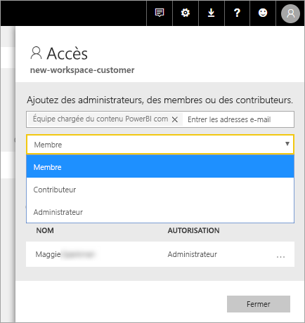

# Créer de nouveaux espaces de travail dans Power BI

Power BI introduit une nouvelle expérience de l’espace de travail. Espaces de travail sont toujours l’endroit idéal pour collaborer avec des collègues pour créer des collections de tableaux de bord, rapports et des rapports paginés. Puis vous pouvez les regrouper cette collection en un *application* et le distribuer dans toute votre organisation ou à des personnes ou groupes spécifiques. 

Voici ce qui est différent. Dans les nouveaux espaces de travail, vous pouvez :

- Affecter des rôles d’espace de travail à des groupes d’utilisateurs : groupes de sécurité, listes de distribution, groupes Office 365 et personnes individuelles.
- Créer un espace de travail dans Power BI sans créer un groupe Office 365.
- Utiliser des rôles d’espace de travail plus granulaires, pour une gestion plus flexible des autorisations dans un espace de travail.

> [!NOTE]
> Pour appliquer une sécurité au niveau des lignes (RLS) pour Power BI Pro aux utilisateurs de naviguer dans un espace de travail, continuer à utiliser [des espaces de travail classiques](service-create-workspaces.md). Sélectionnez le **membres peuvent uniquement afficher le contenu Power BI** option. Vous pouvez également publier une application Power BI aux utilisateurs, ou utiliser le partage pour distribuer du contenu. Le rôle de visionneuse à venir permettra ce scénario dans les futures dans l’espace de travail expérience espaces de travail.

Pour plus d’informations, consultez le [nouveaux espaces de travail](service-new-workspaces.md) article.

## Créer un nouvel espace de travail d’application

1. Commencez par créer l’espace de travail d’application. Sélectionnez **Espaces de travail** > **Créer un espace de travail d’application**.
   
     

2. Vous créez automatiquement un espace de travail mis à niveau, sauf si vous optez pour **revenir en arrière**.
   
     
     
     Si vous sélectionnez **revenir en arrière**, vous créez un espace de travail basé sur un groupe Office 365. Utilisez cette option si vous avez besoin du **membres peuvent uniquement afficher le contenu Power BI** option pour appliquer la sécurité au niveau des lignes (RLS) pour les membres de l’espace de travail.

2. Nommez l’espace de travail. Si le nom n’est pas disponible, modifiez-le pour arriver à un nom unique.
   
     L’application pour l’espace de travail aura le même nom et l’icône en tant que l’espace de travail.
   
1. Voici quelques éléments facultatifs, que vous pouvez définir pour votre espace de travail :

    Charger un **image de l’espace de travail**. Les fichiers peuvent être au format .png ou .jpg. Taille du fichier doit être inférieure à 45 Ko.
    
    [Ajouter un **Contact list**](#workspace-contact-list). Par défaut, les administrateurs de l’espace de travail sont les contacts. 
    
    [Spécifiez un **OneDrive de l’espace de travail** ](#workspace-onedrive) en tapant simplement le nom d’un groupe de 365 Office existant, pas l’URL. Cet espace de travail pouvez désormais utiliser un emplacement de stockage de fichiers de ce groupe Office 365. 

    

    Pour affecter l’espace de travail à un **une capacité dédiée**, dans le **Premium** onglet sélectionnez **une capacité dédiée**.
     
    

1. Sélectionnez **Enregistrer**.

    Power BI crée l’espace de travail et l’ouvre. Vous le voyez dans la liste des espaces de travail dont vous êtes membre. 

## Liste de contacts d’espace de travail

La nouvelle liste de contact d’espace de travail vous permet de spécifier les utilisateurs qui reçoivent une notification concernant les problèmes qui se produisent dans l’espace de travail. Par défaut, tout utilisateur ou groupe spécifié comme un espace de travail administrateur est averti, mais vous pouvez personnaliser la liste. Les utilisateurs ou groupes répertoriés dans la liste des contacts seront affichera dans l’interface utilisateur (IU) pour aider aux utilisateurs obtiennent aide relatives à l’espace de travail.

1. Accéder à la nouvelle **Contact list** définition de deux manières :

    Dans le **créer un espace de travail** volet lorsque vous la créez tout d’abord.

    Dans le volet de navigation gauche, sélectionnez la flèche à côté **espaces de travail**, sélectionnez les points de suspension (...) en regard du nom de l’espace de travail > **paramètres de l’espace de travail**. Le **paramètres** volet s’ouvre.

    

2. Sous **avancé** > **Contact list**, acceptez la valeur par défaut, **administrateurs de l’espace de travail**, ou ajouter votre propre liste de **des utilisateurs ou groupes**. 
3. Sélectionnez **Enregistrer**.

## OneDrive de l’espace de travail

La fonctionnalité OneDrive de l’espace de travail vous permet de configurer un groupe Office 365 dont le stockage fichier bibliothèque de documents SharePoint est disponible aux utilisateurs de l’espace de travail. Vous créez tout d’abord le groupe en dehors de Power BI. 

Power BI ne synchronise pas les autorisations des utilisateurs ou groupes qui sont configurés pour avoir accès d’espace de travail avec l’appartenance au groupe Office 365. La meilleure pratique est donner le même groupe Office 365, dont vous configurez dans ce groupe de paramètres Office 365, le stockage de fichiers [accès à l’espace de travail](#give-access-to-your-workspace). Puis gérer l’accès de l’espace de travail en gérant l’appartenance au groupe Office 365. 

1. Accéder à la nouvelle **OneDrive de l’espace de travail** définition de deux manières :

    Dans le **créer un espace de travail** volet lorsque vous la créez tout d’abord.

    Dans le volet de navigation gauche, sélectionnez la flèche à côté **espaces de travail**, sélectionnez les points de suspension (...) en regard du nom de l’espace de travail > **paramètres de l’espace de travail**. Le **paramètres** volet s’ouvre.

    

2. Sous **avancé** > **OneDrive de l’espace de travail**, tapez le nom du groupe Office 365 que vous avez créé précédemment. Power BI récupère automatiquement le OneDrive pour le groupe.

    

3. Sélectionnez **Enregistrer**.

### Accéder à l’emplacement OneDrive de l’espace de travail

Une fois que vous avez configuré l’emplacement OneDrive, vous pouvez y accéder à partir de différents endroits dans l’espace de travail :

- Sélectionnez **espaces de travail** > *nom de l’espace de travail* > les points de suspension ( **...** ) menu > **fichiers**. 

    

- Sélectionnez les points de suspension ( **...** ) menu dans le coin supérieur droit de l’espace de travail > **fichiers**.

    
    
- Dans le **obtenir des données** > **fichiers** rencontrer. Le **OneDrive entreprise** entrée est votre propre OneDrive entreprise. Le deuxième OneDrive est celui que vous avez ajouté.

    

## Ajouter du contenu à votre espace de travail d’application

Une fois que vous avez créé un espace de travail expérience espace de travail, il est temps pour y ajouter du contenu. Ajout de contenu est similaire dans les espaces de travail nouvelles et classiques. Utilisez le bouton Créer ou obtenir des données pour ajouter du contenu à votre espace de travail.

1. Dans le **Bienvenue** écran pour votre nouvel espace de travail, vous pouvez ajouter du contenu. 

    

1. Par exemple, sélectionnez **Exemples** > **Exemple Rentabilité des clients**.

> [!NOTE]
> Dans les nouveaux espaces de travail, vous ne peut pas consommer les packs de contenu organisationnels, ou les packs de contenu tiers. Les applications sont disponibles pour tous les contenus tiers packs d’administration vous précédemment utilisé. Utiliser des espaces de travail classiques si vous souhaitez continuer à utiliser des packs de contenu. Packs de contenu sont déconseillés, il est recommandé d’utiliser des applications à la place.

Quand vous visualisez du contenu de la liste de contenu dans un espace de travail d’application, le nom de l’espace de travail d’application apparaît en tant que propriétaire.

### Connexion à des services tiers dans les nouveaux espaces de travail

Dans la nouvelle expérience des espaces de travail, nous avons apporté une modification qui met l’accent sur les *applications*. Les applications de services tiers permettent aux utilisateurs d’obtenir des données plus facilement auprès des services qu’ils utilisent comme Microsoft Dynamics CRM, Salesforce ou Google Analytics.

Dans la nouvelle expérience de l’espace de travail, vous ne peut pas créer ou consommer des packs de contenu organisationnels. Au lieu de cela, vous pouvez utiliser les applications fournies pour vous connecter à des services tiers ou demander à vos équipes internes de fournir des applications pour les packs de contenu que vous utilisez actuellement. 

## Donner accès à votre espace de travail

1. Dans la liste de contenu de l’espace de travail, parce que vous êtes un administrateur vous voyez une nouvelle action, **accès**.

    

1. Sélectionnez **Accéder**.

1. Ajoutez des groupes de sécurité, des listes de distribution, des groupes Office 365 ou des personnes individuelles à ces espaces de travail en tant que membres, contributeurs ou administrateurs. Consultez [Rôles dans les nouveaux espaces de travail](service-new-workspaces.md#roles-in-the-new-workspaces) pour une explication des différents rôles.

    

9. Sélectionnez **Ajouter** > **Fermer**.

## Distribuer une application

Si vous souhaitez distribuer du contenu officielle à un large public au sein de votre organisation, vous pouvez publier une application à partir de votre espace de travail.  Lorsque le contenu est prêt, vous choisissez les tableaux de bord et les rapports que vous souhaitez publier, puis publier en tant qu’un *application*. Vous pouvez créer une application à partir de chaque espace de travail.

En savoir plus sur [publication d’une application à partir de nouveaux espaces de travail](service-create-distribute-apps.md)

## Étapes suivantes
* En savoir plus sur [organiser le travail dans la nouvelle expérience d’espaces de travail dans Power BI](service-new-workspaces.md)
* [Créer des espaces de travail classiques](service-create-workspaces.md)
* [Publier une application à partir de nouveaux espaces de travail dans Power BI](service-create-distribute-apps.md)
* Vous avez des questions ? [Essayez d’interroger la communauté Power BI](http://community.powerbi.com/)
