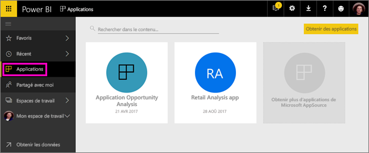
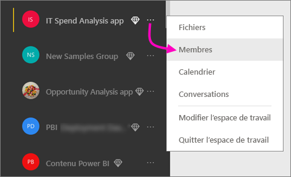
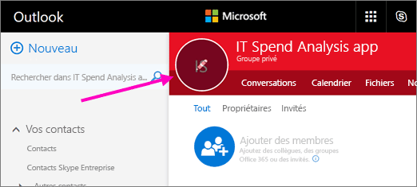
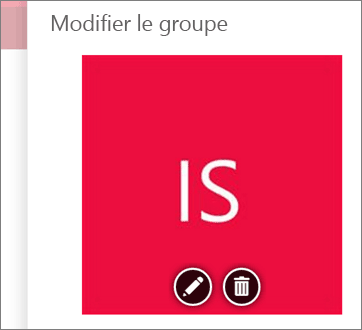
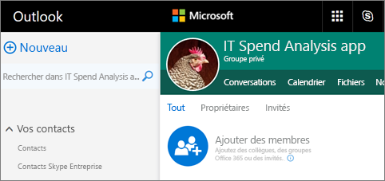

# Créer des espaces de travail avec vos collègues dans Power BI

Dans Power BI, vous pouvez créer des *espaces de travail*, qui sont endroits où collaborer avec des collègues pour créer et affiner des collections de tableaux de bord et des rapports. Vous les regroupez ensuite en *applications* que vous pouvez distribuer dans toute votre organisation, ou seulement à des personnes ou des groupes spécifiques. 

Quand vous créez un espace de travail, vous créez un groupe Office 365 associé sous-jacent. Toute l’administration des espaces de travail se fait dans Office 365. Vous pouvez ajouter des collègues à ces espaces de travail en tant que membres ou administrateurs. Dans l’espace de travail, vous pouvez tous collaborer sur des tableaux de bord, des rapports et d’autres articles que vous prévoyez de publier pour un public plus large. Toutes les personnes que vous ajoutez à un espace de travail d’application doivent avoir une licence Power BI Pro. 

**Le saviez-vous ?** Power BI propose une nouvelle expérience d’espace de travail en préversion. Consultez [Organiser le travail dans les nouveaux espaces de travail (préversion)](service-new-workspaces.md) pour plus d’informations sur les nouveaux espaces de travail. 

## Vidéo : Applications et espaces de travail d’application
<iframe width="640" height="360" src="https://www.youtube.com/embed/Ey5pyrr7Lk8?showinfo=0" frameborder="0" allowfullscreen></iframe>

## Créer un espace de travail d’application basé sur un groupe Office 365

Quand vous créez un espace de travail d’application, il est basé sur un groupe Office 365.

[!INCLUDE [powerbi-service-create-app-workspace](./includes/powerbi-service-create-app-workspace.md)]

Quand vous le créez, vous devez attendre environ une heure pour qu’il se propage à Office 365. 

### Ajouter une image à votre espace de travail d’application Office 365 (facultatif)
Par défaut, Power BI crée un petit cercle de couleur pour votre application, contenant les initiales de celle-ci. Vous pouvez le personnaliser avec une image. Pour ajouter une image, vous avez besoin d’une licence Exchange Online.

1. Sélectionnez **Espaces de travail**, sélectionnez les points de suspension (…) en regard du nom de l’espace de travail, puis choisissez **Membres**. 
   
     
   
    Le compte Office 365 Outlook pour l’espace de travail s’ouvre dans une nouvelle fenêtre de navigateur.
2. Lorsque vous pointez sur le cercle de couleur dans l’angle supérieur gauche, il se transforme en une icône de crayon. Sélectionnez-la.
   
     
3. Sélectionnez de nouveau l’icône de crayon, puis cherchez l’image que vous souhaitez utiliser.
   
     

4. Sélectionnez **Enregistrer**.
   
     
   
    L’image remplace le cercle de couleur dans la fenêtre Office 365 Outlook. 
   
     
   
    Après quelques minutes, l’image apparaît également dans l’application dans Power BI.
   
     

## Ajouter du contenu à votre espace de travail d’application

Une fois que vous avez créé un espace de travail d’application, vous pouvez y ajouter du contenu. Cela s’apparente à l’ajout de contenu à Mon espace de travail, sauf que les autres personnes au sein de l’espace de travail peuvent également en voir le contenu et travailler dessus. Une différence importante est que, lorsque vous avez terminé, vous pouvez publier le contenu en tant qu’application. Quand vous visualisez du contenu de la liste de contenu dans un espace de travail d’application, le nom de l’espace de travail d’application apparaît en tant que propriétaire.

### Se connecter à des services tiers dans des espaces de travail d’application

Des applications sont fournies pour tous les services tiers pris en charge par Power BI, ce qui facilite l’obtention de données auprès des services que vous utilisez, comme Microsoft Dynamics CRM, Salesforce ou Google Analytics. Vous pouvez publier des applications d’organisation pour donner aux utilisateurs les données dont ils ont besoin.

Dans les espaces de travail actuels, vous pouvez également vous connecter avec des packs de contenu d’organisation et des packs de contenu tiers, comme Microsoft Dynamics CRM, Salesforce ou Google Analytics. Envisagez de migrer vos packs de contenu d’organisation vers des applications.

## Distribuer une application

Quand le contenu est prêt, vous choisissez les tableaux de bord et les rapports que vous voulez publier, puis vous les publiez en tant *qu’application*. Vos collègues peuvent obtenir vos applications de différentes manières. Vous pouvez les installer automatiquement dans les comptes Power BI de vos collègues si l’administrateur Power BI vous y autorise. Sinon, ils peuvent rechercher et installer vos applications à partir de Microsoft AppSource ou d’un lien direct que vous leur envoyez. Ils obtiennent les mises à jour automatiquement, et vous pouvez contrôler la fréquence à laquelle les données sont actualisées. Pour plus d’informations, consultez [Publier des applications avec des tableaux de bord et des rapports dans Power BI](service-create-distribute-apps.md).

## Forum aux questions sur les applications Power BI

### En quoi les applications diffèrent-elles des packs de contenu d’organisation ?
Les applications sont l’évolution des packs de contenu d’organisation. Si vous avez déjà des packs de contenu d’organisation, ceux-ci continuent à fonctionner parallèlement aux applications. Les applications et les packs de contenu présentent quelques différences majeures. 

* Quand des utilisateurs professionnels installent un pack de contenu, celui-ci perd son identité groupée : il s’agit simplement d’une liste de tableaux de bord et de rapports entremêlés avec d’autres tableaux de bord et rapports. En revanche, les applications conservent leur regroupement et leur identité même après installation. Les utilisateurs peuvent ainsi continuer à y accéder facilement au fil du temps.
* Vous pouvez créer plusieurs packs de contenu à partir de tout espace de travail, mais une application a une relation un-à-un avec son espace de travail. 
* Étant donné que nous prévoyons de déconseiller progressivement les packs de contenu d’organisation, nous vous recommandons de commencer à créer des applications dès à présent.  
* Avec la préversion de la nouvelle expérience des espaces de travail, nous effectuons les premières étapes vers la dépréciation des packs de contenu d’organisation. Vous ne pouvez pas les consommer ou les créer dans les espaces de travail en préversion.

Consultez [Quelles sont les différences entre les espaces de travail d’application nouveaux et existants ?](service-new-workspaces.md#how-are-the-new-workspaces-different-from-current-workspaces) pour comparer les deux. 

## Étapes suivantes
* [Installer et utiliser des applications dans Power BI](service-create-distribute-apps.md)
- [Créer de nouveaux espaces de travail (préversion)](service-create-the-new-workspaces.md)
* Vous avez des questions ? [Essayez d’interroger la communauté Power BI](http://community.powerbi.com/)
