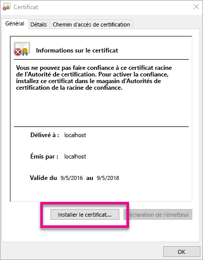
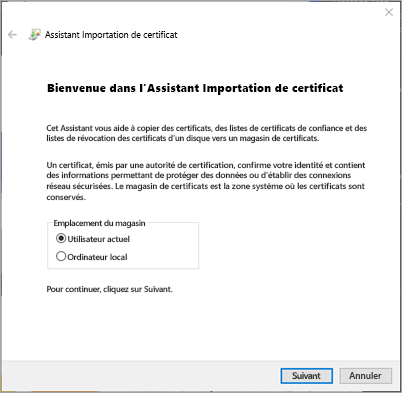
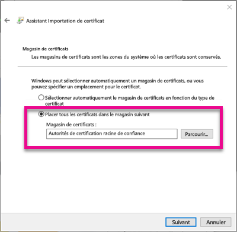
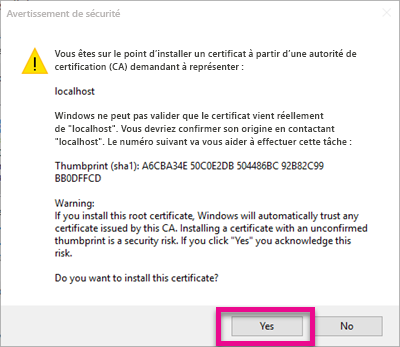
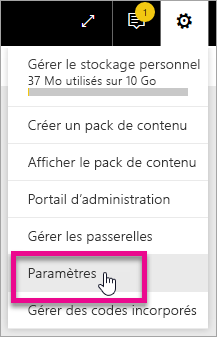
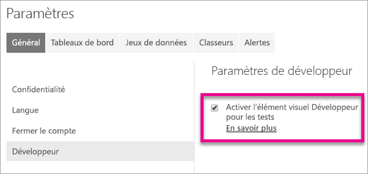
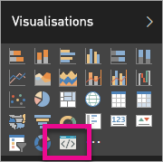

# <a name="use-developer-tools-to-create-custom-visuals"></a>Créer des visuels personnalisés à l’aide des outils de développement
Les éléments visuels personnalisés vous permettent de répondre aux besoins de vos utilisateurs et de vous mettre en adéquation avec le design de votre application. Découvrez comment créer un élément visuel personnalisé pour Power BI à l’aide des outils de développement.

> [!NOTE]
> Ce document vous permettra de devenir opérationnel. Pour plus de détails, voir les informations de référence dans la [documentation Git relative aux éléments visuels dans Power BI](https://github.com/Microsoft/PowerBI-visuals).
> 
> 

## <a name="requirements"></a>Configuration requise
* NodeJS 4.0+ requis (version 5.0 ou ultérieure recommandée) [Télécharger NodeJS](https://nodejs.org)

## <a name="install-nodejs-and-the-power-bi-tools"></a>Installer NodeJS et Power BI Tools
Pour créer un élément visuel personnalisé, vous devrez installer NodeJS. NodeJS est requis pour exécuter les outils en ligne de commande.

1. Téléchargez et installez [NodeJS](https://nodejs.org). La version 4.0 est requise, mais il est recommandé d’utiliser la version 5.0 ou un version ultérieure.
2. Installez les outils en ligne de commande. Exécutez la commande suivante à partir d’une invite de commandes.
   
        npm install -g powerbi-visuals-tools
3. Vous pouvez vérifier que les outils sont installés en exécutant la commande suivante sans aucun paramètre.
   
        pbiviz
   
    Vous devriez voir la sortie de l’aide.
   
    <pre><code>
         +syyso+/
    oms/+osyhdhyso/
    ym/       /+oshddhys+/
    ym/              /+oyhddhyo+/
    ym/                     /osyhdho
    ym/                           sm+
    ym/               yddy        om+
    ym/         shho /mmmm/       om+
     /    oys/ +mmmm /mmmm/       om+
    oso  ommmh +mmmm /mmmm/       om+
   ymmmy smmmh +mmmm /mmmm/       om+
   ymmmy smmmh +mmmm /mmmm/       om+
   ymmmy smmmh +mmmm /mmmm/       om+
   +dmd+ smmmh +mmmm /mmmm/       om+
         /hmdo +mmmm /mmmm/ /so+//ym/
               /dmmh /mmmm/ /osyhhy/
                 //   dmmd
                       ++
   
       PowerBI Custom Visual Tool
   
    Usage: pbiviz [options] [command]
   
    Commands:
   
    new [name]        Create a new visual
    info              Display info about the current visual
    start             Start the current visual
    package           Package the current visual into a pbiviz file
    update [version]  Updates the api definitions and schemas in the current visual. Changes the version if specified
    help [cmd]        display help for [cmd]
   
    Options:
   
    -h, --help      output usage information
    -V, --version   output the version number
    --install-cert  Install localhost certificate
    </code></pre>

<a name"ssl-setup"></a>

### <a name="server-certificate-setup"></a>Installation de certificat de serveur
Pour activer un aperçu instantané de votre élément visuel, vous avez besoin d’un serveur HTTPS approuvé. Avant de commencer, vous devez installer un certificat SSL permettant le chargement d’éléments visuels dans votre navigateur web. 

> [!NOTE]
> Il s’agit d’une installation unique pour votre station de travail de développement.
> 
> 

Pour *Ajouter* un certificat, exécutez la commande suivante.

    pbiviz --install-cert

**Système d’exploitation Windows**

1. Sélectionnez **Installer le certificat...**.
   
    
2. Sélectionnez **Utilisateur actuel**, puis **Suivant**.
   
    
3. Sélectionnez **Placer tous les certificats dans le magasin suivant**, puis **Parcourir...**.
4. Sélectionnez **Autorités de certification racines de confiance**, puis **OK**. Sélectionnez **Suivant**.
   
    
5. Sélectionnez **Terminer**.
   
    
6. Sélectionnez **Oui** dans la boîte de dialogue sécurité.
   
    
7. Fermez les navigateurs que vous avez ouverts.

> [!NOTE]
> Si le certificat n’est pas reconnu, il se peut que vous deviez redémarrer votre ordinateur.
> 
> 

**OSX**

1. Si le verrou dans le coin supérieur gauche est verrouillé, sélectionnez-le pour le déverrouiller. Recherchez *localhost*, puis double-cliquez sur le certificat.
   
    
2. Sélectionnez **Toujours faire confiance**fermez la fenêtre.
   
    
3. Entrez vos nom d’utilisateur et mot de passe. Sélectionnez **Mettre à jour les paramètres**.
   
    
4. Fermez les navigateurs que vous avez ouverts.

> [!NOTE]
> Si le certificat n’est pas reconnu, il se peut que vous deviez redémarrer votre ordinateur.
> 
> 

## <a name="enable-live-preview-of-developer-visual"></a>Activer l’aperçu instantané de l’élément visuel de développeur
Pour activer un aperçu instantané de votre élément visuel personnalisé, procédez comme suit. Cela permet d’utiliser l’élément visuel dans le service Power BI lors de la modification des rapports.

1. Accédez et connectez-vous à [app.powerbi.com](https://app.powerbi.com).
2. Sélectionnez l’**icône d’engrenage**, puis **Paramètres**.
   
    
3. Sélectionnez **Développeur**, puis **Activer l’élément visuel Développeur pour les tests**.
   
    
4. Dans le volet **Visualisation**, sélectionnez **Élément visuel de développeur**.
   
    
   
   > [!NOTE]
   > Cela nécessite que vous ayez exécuté `pbiviz start` à partir du dossier d’éléments visuels sur votre ordinateur de développement. Pour plus d’informations sur la création de votre visuel, voir [Créer un visuel](#create-a-new-visual) dans cet article.
   > 
   > 
5. Sélectionnez l’élément visuel dans le canevas de rapport. Vous pouvez associer des données de la même façon que d’autres éléments visuels.

Vous pouvez maintenant commencer à développer votre élément visuel.

## <a name="create-a-new-visual"></a>Créer un élément visuel
Vous pouvez créer un projet d’élément visuel en exécutant la commande suivante.

```
pbiviz new My Visual name
```

Vous pouvez remplacer *Nom de mon élément visuel* par le nom que vous voulez attribuer à cet élément. Vous pouvez le modifier ultérieurement via les champs `name` et `displayName` du fichier `pbiviz.json` généré.

Cette commande crée un dossier dans le répertoire dans lequel elle a été exécutée. Elle génère un modèle de démarrage pour votre élément visuel. Une fois l’exécution de la commande terminée, vous pouvez ouvrir le répertoire et utiliser votre éditeur favori pour commencer à travailler sur votre nouvel élément visuel.

## <a name="testing-your-visual-in-power-bi"></a>Test de votre élément visuel dans Power BI
Vous pouvez tester votre élément visuel dans le service Power BI, à l’intérieur des rapports et tableaux de bord.

<a name="running-your-visual"></a>

### <a name="running-your-visual"></a>Exécution de votre élément visuel
Vous pouvez exécuter votre élément visuel en procédant comme suit.

1. Ouvrez une invite de commandes.
2. Faites de votre répertoire votre dossier d’éléments visuels. Il s’agit du dossier contenant le fichier `pbiviz.json`.
3. Exécutez la commande suivante.
   
    ```
    pbiviz start
    ```
   
    

Si vous êtes dans le mauvais emplacement, un message d’erreur similaire au suivant s’affiche.

```
    error  LOAD ERROR Error: pbiviz.json not found. You must be in the root of a visual project to run this command.
        at e (C:\Users\[user]\AppData\Roaming\npm\node_modules\powerbi-visuals-tools\lib\VisualPackage.js:67:35)
        at Function.loadVisualPackage (C:\Users\[user]\AppData\Roaming\npm\node_modules\powerbi-visuals-tools\lib\VisualPackage.js:62:16)
        at Object.<anonymous> (C:\Users\[user]\AppData\Roaming\npm\node_modules\powerbi-visuals-tools\bin\pbiviz-start.js:43:15)
        at Module._compile (module.js:556:32)
        at Object.Module._extensions..js (module.js:565:10)
        at Module.load (module.js:473:32)
        at tryModuleLoad (module.js:432:12)
        at Function.Module._load (module.js:424:3)
        at Module.runMain (module.js:590:10)
        at run (bootstrap_node.js:394:7)
```

### <a name="viewing-your-visual-in-power-bi"></a>Affichage de votre élément visuel dans Power BI
Pour afficher votre élément visuel dans un rapport, accédez à celui-ci, puis sélectionnez l’élément visuel dans le volet **Visualisations**.

> [!NOTE]
> Avant de faire cela, vous devez exécuter la commande `pbiviz start`, comme décrit dans la section [Exécution de votre élément visuel](#running-your-visual).
> 
> 


Vous voyez ensuite le modèle de démarrage pour l’élément visuel.


| Élément de la barre d’outils | Description |
| --- | --- |
| Actualiser l’élément visuel |Sert à actualiser manuellement l’élément visuel si le rechargement automatique est désactivé. |
| Activer/désactiver le rechargement automatique |Quand le rechargement automatique est activé, l’élément visuel est automatiquement actualisé chaque fois que vous enregistrez son fichier. |
| Afficher le Dataview |Affiche la vue de données sous-jacente de l’élément visuel à des fins de débogage. |
| Obtenir de l’aide |Documentation dans GitHub |
| Envoyer des commentaires |Dites-nous comment améliorer votre expérience. (nécessite un compte GitHub). |

## <a name="package-your-visual-for-use-in-power-bi-desktop-and-distribution"></a>Empaqueter votre élément visuel pour une utilisation dans Power BI Desktop et la distribution
Pour pouvoir charger votre élément visuel dans [Power BI Desktop](https://powerbi.microsoft.com/desktop/) ou le partager avec la communauté dans la [galerie d’éléments visuels de Power BI](https://visuals.powerbi.com), vous devez générer un fichier `pbiviz`.

Vous pouvez empaqueter votre élément visuel en procédant comme suit.

1. Ouvrez une invite de commandes.
2. Faites de votre répertoire votre dossier d’éléments visuels. Il s’agit du dossier contenant le fichier `pbiviz.json`.
3. Exécutez la commande suivante.
   
    ```
    pbiviz package
    ```

Cette commande crée un fichier `pbiviz` dans le répertoire `dist/` de votre projet d’élément visuel. Si un fichier `pbiviz` y figure déjà, il est remplacé.

## <a name="updating-the-visuals-api-version"></a>Mise à jour de la version d’API d’éléments visuels
Lorsque vous créez un élément visuel à l’aide de `pbiviz new`, une copie des définitions et schémas json de type d’API appropriés est placée dans le répertoire de votre élément visuel. Si nécessaire, la commande `pbiviz update`permet de mettre à jour ces fichiers. Cela peut être utile si nous publions un correctif pour une version d’API antérieure, ou si vous souhaitez procéder à une mise à jour vers la dernière version d’API.

### <a name="updating-your-existing-api-version"></a>Mise à jour de votre version d’API
Si nous publions une mise à jour pour une API existante, vous pouvez obtenir la dernière version en procédant comme suit.

```
#Update your version of pbiviz
npm install -g powerbi-visuals-tools

#Run update from the root of your visual project, where pbiviz.json is located
pbiviz update
```

Cela a pour effet de télécharger les outils les plus récents de npm,  qui incluent les définitions et schémas de type mis à jour. `pbiviz update` remplace la propriété `apiVersion` dans votre fichier *pbiviz.json* par la version la plus récente.

### <a name="upgrading-to-a-different-api-version"></a>Mise à niveau vers une autre version d’API
Vous pouvez effectuer une mise à jour vers une autre version d’API en procédant de la manière décrite ci-dessus. Vous pouvez spécifier explicitement la version d’API à utiliser.

```
#Update your version of pbiviz
npm install -g powerbi-visuals-tools

#Run update from the root of your visual project, where pbiviz.json is located
pbiviz update 1.2.0
```

Cela a pour effet de mettre à jour votre élément visuel vers la version d’API 1.2.0. Vous pouvez remplacer `1.2.0` la version de votre choix.

> [!WARNING]
> La version d’API par défaut dont se servent les outils est toujours la version stable de l’API. Les versions postérieures à la version d’API par défaut sont instables et susceptibles de changer. Elles peuvent avoir des comportements inattendus, et le service Power BI et Power BI Desktop peuvent opérer différemment. Pour la version d’API stable actuelle, voir le [journal des modifications](https://github.com/Microsoft/PowerBI-visuals/blob/master/ChangeLog.md). Pour plus d’informations sur les versions précommerciale, voir la [feuille de route](https://github.com/Microsoft/PowerBI-visuals/blob/master/Roadmap/README.md).
> 
> 

## <a name="inside-the-visual-project"></a>À l’intérieur du projet d’élément visuel
Votre projet d’élément visuel est le dossier créé lorsque vous exécutez la commande `pbiviz new`. 

### <a name="file-structure"></a>Structure des fichiers
| Élément | Description |
| --- | --- |
| assets/ |Utilisé pour stocker les ressources visuelles (icône, captures d’écran, etc.). |
| dist/ |Lorsque vous exécutez `pbiviz package`, le fichier pbiviz est généré ici. |
| src/ |Code TypeScript de votre élément visuel. |
| style/ |Styles LESS de votre élément visuel. |
| .gitignore |Indique à git d’ignorer les fichiers qui ne doivent pas être suivis dans le référentiel. |
| capabilities.json |Utilisé pour définir les [fonctionnalités](https://github.com/Microsoft/PowerBI-visuals/blob/master/Capabilities/Capabilities.md) de votre élément visuel. |
| package.json |Utilisé par [npm](https://www.npmjs.com/) pour gérer les modules. |
| pbiviz.json |Fichier de configuration principal. |
| tsconfig.json |Paramètres du compilateur TypeScript. En savoir plus sur [tsconfig.json](https://www.typescriptlang.org/docs/handbook/tsconfig-json.html). |

### <a name="pbivizjson"></a>pbiviz.json
Ce fichier est le fichier de configuration principal de votre élément visuel. Il contient des métadonnées ainsi que des informations sur vos fichiers, nécessaires pour créer votre élément visuel.

```
{
    "visual": {
        "name": "myVisual", // internal visual name (should not contain spaces)
        "displayName": "My Visual!", // visual name displayed to user (used in gallery)
        "guid": "PBI_CV_xxxxxxx", // a unique id for this visual MUST BE UNIQUE
        "visualClassName": "Visual" // the entry class for your visual
        "version": "1.0.0", // visual version. Should be semantic version (increment if you update the visual)
        "description": "", // description used in gallery
        "supportUrl": "", // url to where users can get support for this visual
        "gitHubUrl": "" // url to the source in github (if applicable)
    },
    "apiVersion": "1.0.0", //API version this visual was created with
    "author": {
        "name": "", // your name
        "email": "" // your e-mail
    },
    "assets": {
        "icon": "assets/icon.png" // relative path to your icon file (20x20 png)
    },
    "style": "style/visual.less", // relative path to your less file
    "capabilities": "capabilities.json" // relative path to your capabilities definition 
}
```

### <a name="visual-source-typescript"></a>Visual Source (TypeScript)
Le code de l’élément visuel doit être écrit en TypeScript, qui est un sur-ensemble de JavaScript prenant en charge des fonctionnalités plus avancées et un accès en avant-première aux fonctionnalités de ES6/ES7.

Tous les fichiers TypeScript doivent être stockés dans le répertoire `src/`et ajoutés au tableau `files`dans `tsconfig.json`. Cela permet au compilateur TypeScript de les charger et d’en déterminer l’ordre.

Lors de la génération de votre élément visuel, tous le code TypeScript est compilé dans un simple fichier JavaScript. Cela vous permet de référencer les éléments exportés à partir d’autres fichiers sans devoir les `require` manuellement tant que les deux fichiers sont répertoriés dans tsconfig.

Vous pouvez créer le nombre de fichiers et de classes nécessaires à la création de votre élément visuel.

En savoir plus sur [TypeScript](http://www.typescriptlang.org/).

### <a name="visual-style-less"></a>Style d’élément visuel (LESS)
Les styles d’éléments visuels sont gérés à l’aide de feuilles de style en cascade (CSS). Pour votre facilité, nous utilisons le précompilateur LESS qui prend en charge certaines fonctionnalités avancées, telles que l’imbrication, les variables, les mixins, les conditions, les boucles, etc. Si vous ne souhaitez pas utiliser ces fonctionnalités, vous pouvez simplement écrire une feuille de style CSS brute dans le fichier LESS.

Tous les fichiers LESS doivent être stockés dans le répertoire `style/`. Le fichier spécifié dans le champ `style`au sein de votre fichier `pbiviz.json` sera chargé. Tous les autres fichiers doivent être chargés à l’aide de `@import`.

En savoir plus sur [LESS](http://lesscss.org/).

## <a name="debugging"></a>Débogage
Pour obtenir des conseils sur le débogage de votre élément visuel personnalisé, voir le [guide de débogage](https://github.com/Microsoft/PowerBI-visuals/blob/master/tools/debugging.md).

## <a name="submit-your-visual-to-appsource"></a>Soumettre votre visuel à AppSource
Vous pouvez répertorier votre visuel pour que d’autres utilisateurs puissent s’en servir, mais en le soumettant à AppSource. Pour plus d’informations sur ce processus, consultez [Publier des visuels personnalisés dans AppSource](developer/office-store.md).

## <a name="troubleshooting"></a>Résolution des problèmes
**Commande Pbiviz introuvable (ou erreurs similaires)**

Si vous exécutez `pbiviz` dans votre terminal/ligne de commande, vous devez voir l’écran d’aide. Si ce n’est pas le cas, cela signifie qu’il n’est pas installé correctement. Assurez-vous d’avoir au moins la version 4.0 de NodeJS installée.

Pour plus d’informations, voir [Installer NodeJS et Power BI Tools](#install-nodejs-and-the-power-bi-tools).

**Impossible de trouver l’élément visuel de débogage sous l’onglet Visualisations**

L’élément visuel de débogage ressemble à une icône d’invite sous l’onglet **Visualisations**.


Si vous ne le voyez pas, assurez-vous que vous l’avez activé dans les paramètres de Power BI. 

> [!NOTE]
> L’élément visuel de débogage est actuellement disponible uniquement dans le service Power BI, pas dans Power BI Desktop ou dans l’application mobile. L’élément visuel empaqueté fonctionne partout.
> 
> 

Pour plus d’informations, voir [Activer l’aperçu instantané de l’élément visuel de développeur](#enable-live-preview-of-developer-visual).

**Impossible de contacter le serveur de visuels**

Exécutez le serveur d’éléments visuels avec la commande `pbiviz start` dans votre terminal/ligne de commande à partir de la racine de votre projet d’élément visuel. Si le serveur est en cours d’exécution, il est probable que votre certificats SSL n’ont pas été correctement installés.

Pour plus d’informations, voir [Exécution de votre élément visuel](#running-your-visual) ou [Installation de certificat de serveur](#ssl-setup).

## <a name="next-steps"></a>Étapes suivantes
[Visualisations dans Power BI](power-bi-report-visualizations.md)  
[Visualisations personnalisées dans Power BI](power-bi-custom-visuals.md)  
[Publier des visuels personnalisés dans l’Office Store](developer/office-store.md)  
[TypeScript](http://www.typescriptlang.org/)  
[CSS LESS](http://lesscss.org/)  

D’autres questions ? [Essayez d’interroger la communauté Power BI](http://community.powerbi.com/)

