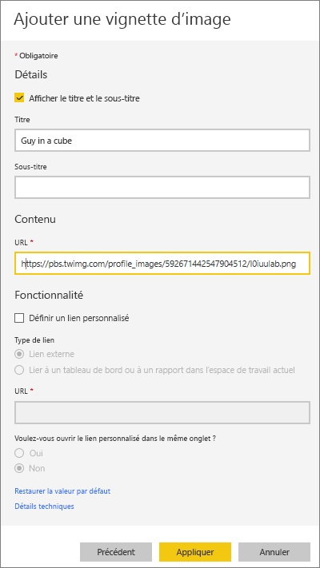
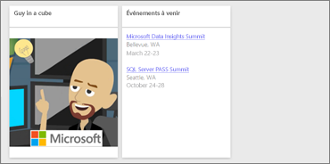
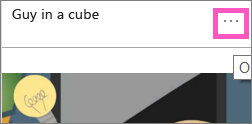
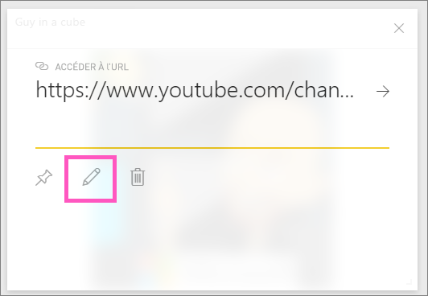

# <a name="add-images-videos-and-more-to-your-dashboard"></a>Ajouter des images, des vidéos et plus encore à votre tableau de bord

En ajoutant une vignette à votre tableau de bord, vous pouvez placer une image, une zone de texte, une vidéo, des données de streaming ou du code web sur votre tableau de bord. 

Regardez Amanda ajouter des vignettes à un tableau de bord.

   
<iframe width="560" height="315" src="https://www.youtube.com/embed/e2PD8m1Q0vU" frameborder="0" allowfullscreen></iframe>


## <a name="add-an-image-video-or-other-tile"></a>Ajouter une image, une vidéo ou une autre vignette
Vous pouvez ajouter une image, une zone de texte, une vidéo, des données de streaming ou du code web directement à votre tableau de bord.

1. Sélectionnez **Ajouter une vignette** dans la barre de menus supérieure de votre tableau de bord. Selon les limitations d’espace, vous pouvez voir uniquement le signe plus .
   
    
2. Sélectionnez le type de vignette à ajouter : 

    **[Contenu web](#add-web-content)**

    **[Image](#add-an-image)**

    **[Zone de texte](#add-a-text-box-or-dashboard-heading)**

    **[Vidéo](#add-a-video)**

    **[Données de streaming personnalisées](#add-streaming-data)**
   
    

## <a name="add-an-image"></a>Ajouter une image
Si vous souhaitez ajouter le logo de votre société ou une autre image à votre tableau de bord, enregistrez le fichier image en ligne et définissez un lien vers celui-ci. Vérifiez que des informations d’identification de sécurité ne sont pas nécessaires pour accéder au fichier image. Par exemple, comme OneDrive et SharePoint demandent une authentification, les images qui y sont stockées ne peuvent pas être ajoutées à un tableau de bord de cette façon.  

1. Dans la fenêtre **Ajouter une vignette**, sélectionnez **Image** > **Suivant**.

2. Dans la fenêtre **Ajouter une vignette d’image**, ajoutez les informations de l’image :   
   
   a. Pour afficher un titre au-dessus de l’image, sélectionnez **Afficher le titre et le sous-titre** et entrez un **Titre** et un **Sous-titre** facultatif.

   b. Entrez l’**URL** de l’image.

   c. Pour transformer la vignette en lien hypertexte, sélectionnez **Définir un lien personnalisé** et entrez l’**URL**. 

      Quand vos collègues cliquent sur l’image ou sur le titre, ils sont dirigés vers cette URL.

   d. Sélectionnez **Appliquer**. 

      

3. Dans le tableau de bord, redimensionnez et déplacez l’image selon vos besoins.
     
     

## <a name="add-a-text-box-or-dashboard-heading"></a>Ajouter une zone de texte ou un en-tête de tableau de bord

Pour ajouter un en-tête de tableau de bord, tapez l’en-tête dans la zone de texte et augmentez la taille de la police.

1. Dans la fenêtre **Ajouter une vignette**, sélectionnez **Zone de texte** > **Suivant**.

2. Mettez en forme la zone de texte :
   
   a. Pour afficher un titre au-dessus de la zone de texte, sélectionnez **Afficher le titre et le sous-titre** et entrez un **Titre** et un **Sous-titre** facultatif.

   b. Entrez et mettez en forme le **contenu** de la zone de texte.  

   c. Définissez éventuellement un lien personnalisé pour le titre. Un lien personnalisé peut être un site externe ou un tableau de bord ou rapport dans votre espace de travail. En revanche, dans cet exemple, comme nous avons ajouté des liens hypertexte dans la zone de texte elle-même, nous allons laisser la case **Définir un lien personnalisé** décochée.

   d. Sélectionnez **Appliquer**. 

     
   
3. Dans le tableau de bord, redimensionnez et déplacez la zone de texte selon vos besoins.
   
   

## <a name="add-a-video"></a>Ajouter une vidéo
Quand vous ajoutez une vignette de vidéo YouTube ou Vimeo à votre tableau de bord, la vidéo est lue directement dans votre tableau de bord.

1. Dans la fenêtre **Ajouter une vignette**, sélectionnez **Vidéo** > **Suivant**.
2. Ajoutez des informations sur la vidéo dans la fenêtre **Ajouter une vignette de vidéo** :   
   
   a. Pour afficher un titre et un sous-titre en haut de la vignette vidéo, sélectionnez **Afficher le titre et le sous-titre** et entrez un **Titre** et un **Sous-titre** facultatif. Dans cet exemple, nous ajoutons un **Sous-titre**, puis nous le convertissons en lien hypertexte dans la playlist sur YouTube.

   b. Entrez l’**URL de la vidéo**.

   c. Ajoutez un lien hypertexte pour le **Titre** et le **Sous-titre**, afin que vos collègues puissent voir l’intégralité de la playlist sur YouTube après avoir visionné la vidéo incorporée. Pour ce faire, sous **Fonctionnalité**, sélectionnez **Définir un lien personnalisé**, puis entrez l’**URL** de la playlist.

   d. Sélectionnez **Appliquer**.  

   

3. Dans le tableau de bord, redimensionnez et déplacez la vidéo selon vos besoins.
     
   
4. Sélectionnez la vignette de la vidéo pour lire la vidéo.
5. Sélectionnez le sous-titre pour accéder à la playlist sur YouTube.

## <a name="add-streaming-data"></a>Ajouter des données de streaming
Vous pouvez utiliser PubNub pour ajouter des données de streaming, telles que des flux Twitter ou des données de capteur, à une vignette dans votre tableau de bord. Power BI a créé une intégration pour récupérer les données à partir de PubNub. Nous allons expliquer son fonctionnement.
   

<iframe width="560" height="315" src="https://www.youtube.com/embed/kOuINwgkEkQ" frameborder="0" allowfullscreen></iframe>

1. Dans la fenêtre **Ajouter une vignette**, sélectionnez **Données de streaming personnalisées** > **Suivant**.
2. Sélectionnez **Ajouter un jeu de données de streaming**.
3. Créez un **jeu de données de streaming** à l’aide de l’API Power BI ou de PubNub.
4. Renseignez les champs **Nom du jeu de données**, **Clé d’abonnement** et **Nom du canal**. S’il s’agit d’une connexion sécurisée, elle dispose également d’une clé d’autorisation. Vous pouvez utiliser les exemples de valeurs de PubNub pour l’essayer.
5. Sélectionnez **Suivant**.
    Vous voyez les champs qui sont disponibles dans le jeu de données, avec leurs types de données et leur format JSON.
6. Sélectionnez **Se connecter**.
    Vous avez créé un jeu de données de streaming.
7. Revenez au tableau de bord et resélectionnez **Ajouter une vignette** > **Données de streaming personnalisées** > **Suivant**.
8. Sélectionnez le jeu de données de capteur que vous avez créé > **Suivant**.
9. Sélectionnez le type de visuel souhaité. Souvent, un graphique en courbes fonctionne bien pour ces données.
10. Sélectionnez l’**Axe**, la **Légende** et les **Valeurs**.
11. Déterminez la durée d’affichage, en secondes, minutes ou heures.
12. Sélectionnez **Suivant**.
13. Donnez-lui un **Titre** et un **Sous-titre**, si vous le souhaitez.
14. Épinglez-le à votre tableau de bord.


1. Dans la fenêtre **Ajouter une vignette**, sélectionnez **Données de streaming personnalisées** > **Suivant**.

2. Sélectionnez **Ajouter un jeu de données de streaming**.

3. Créez un **jeu de données de streaming** à l’aide de l’API Power BI ou de PubNub.

4. Renseignez les champs **Nom du jeu de données**, **Clé d’abonnement** et **Nom du canal**. S’il s’agit d’une connexion sécurisée, elle dispose également d’une clé d’autorisation. Vous pouvez utiliser les exemples de valeurs de PubNub pour l’essayer.

5. Sélectionnez **Suivant**.

   Vous voyez les champs qui sont disponibles dans le jeu de données, avec leurs types de données et leur format JSON.

6. Sélectionnez **Se connecter**.

   Vous avez créé un jeu de données de streaming.

7. Revenez au tableau de bord et resélectionnez **Ajouter une vignette** > **Données de streaming personnalisées** > **Suivant**.

8. Sélectionnez le jeu de données de capteur que vous avez créé > **Suivant**.

9. Sélectionnez le type de visuel souhaité. Souvent, un graphique en courbes fonctionne bien pour ces données.

10. Sélectionnez l’**Axe**, la **Légende** et les **Valeurs**.

11. Déterminez la durée d’affichage, en secondes, minutes ou heures.

12. Sélectionnez **Suivant**.

13. Si vous le souhaitez, donnez-lui un **Titre** et un **Sous-titre**.

14. Épinglez-le à votre tableau de bord.

## <a name="add-web-content"></a>Ajouter du contenu web
Vous pouvez coller ou taper tout contenu HTML, sous forme de vignette, dans votre rapport ou tableau de bord. Entrez le code intégré manuellement ou copiez et collez-le à partir de sites tels que Twitter, YouTube ou embed.ly.

1. Dans la fenêtre **Ajouter une vignette**, sélectionnez **Contenu web** > **Suivant**.

2. Ajoutez des informations dans la fenêtre **Ajouter une vignette de contenu web** :
   
   a. Pour afficher un titre au-dessus de la vignette, sélectionnez **Afficher le titre et le sous-titre** et entrez un **Titre** et un **Sous-titre** facultatif.

   b. Entrez le code incorporé. Dans cet exemple, nous allons copier et coller un flux Twitter.

   c. Sélectionnez **Appliquer**.

   
   

3. Dans le tableau de bord, redimensionnez et déplacez le contenu web selon vos besoins.
     
   

### <a name="tips-for-embedding-web-content"></a>Conseils pour l'incorporation de contenu web
* Pour des IFrames, utilisez une source sécurisée. Si vous entrez votre code intégré d’IFrame et obtenez une vignette vide, veillez à ne pas utiliser le protocole *http* pour la source IFrame. Si vous l’utilisez, remplacez-le par *https*.
  
  ```html
  <iframe src="https://xyz.com">
  ```
* Modifiez les informations de largeur et de hauteur. Le code intégré incorpore une vidéo et définit le lecteur vidéo à 560 x 315 pixels. Cette taille ne change pas lors du redimensionnement de la vignette.
  
  ```html
  <iframe width="560" height="315"
  src="https://www.youtube.com/embed/Cle_rKBpZ28" frameborder="0"
   allowfullscreen></iframe>
  ```
  
  Si vous souhaitez que le lecteur doit être redimensionné pour s’ajuster à la taille de la vignette, définissez les largeur et hauteur à 100 %.
  
  ```html
  <iframe width="100%" height="100%"
  src="https://www.youtube.com/embed/Cle_rKBpZ28" frameborder="0"
   allowfullscreen></iframe>
  ```
* Ce code incorpore un tweet et conserve, sous forme de liens séparés dans le tableau de bord, des liens pour les éléments suivants : podcast AFK, page Twitter de \@GuyInACube, Suivre, #analytics, répondre, retweeter et j’aime.  Sélectionner la vignette elle-même ouvre le podcast sur Twitter.
  
  ```html
  <blockquote class="twitter-tweet" data-partner="tweetdeck">
  <p lang="en" dir="ltr">Listen to
  <a href="https://twitter.com/GuyInACube">@GuyInACube</a> talk to
  us about making videos about Microsoft Business Intelligence
  platform
  <a href="https://t.co/TmRgalz7tv">https://t.co/TmRgalz7tv </a>
  <a href="https://twitter.com/hashtag/analytics?src=hash">
  #analytics</a></p>&mdash; AFTK Podcast (@aftkpodcast) <a
  href="https://twitter.com/aftkpodcast/status/693465456531771392">
  January 30, 2016</a></blockquote> <script async src="//platform.twitter.com/widgets.js" charset="utf-8"></script>
  ```

## <a name="edit-a-tile"></a>Modifier une vignette
Pour apporter des modifications à une vignette existante :

1. Placez le curseur en haut à droite de la vignette, puis sélectionnez **Plus d’options** (...).
   
    
2. Sélectionnez **Modifier les détails** pour afficher la fenêtre **Détails de la vignette** et apporter des modifications.
   
    

## <a name="considerations-and-troubleshooting"></a>Considérations et résolution des problèmes
* Pour faciliter le déplacement de la vignette sur votre tableau de bord, ajoutez un titre et un sous-titre facultatif.
* Si vous souhaitez incorporer du contenu à partir d’un site web, mais que celui-ci ne dispose pas de code intégré à copier et coller, consultez embed.ly pour découvrir comment générer ce code intégré.

## <a name="next-steps"></a>Étapes suivantes
[Introduction aux vignettes de tableau de bord pour les concepteurs Power BI](service-dashboard-tiles.md)

D’autres questions ? [Posez vos questions à la Communauté Power BI](https://community.powerbi.com/).

