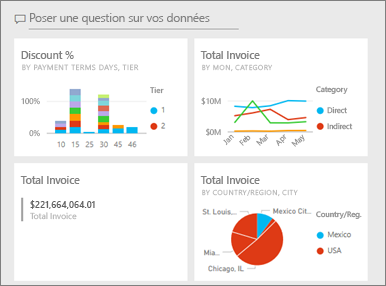
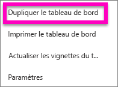
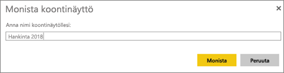

# Créer une copie d’un tableau de bord Power BI

Il existe de nombreuses raisons pour effectuer une copie d’un tableau de bord que vous possédez. La copie est enregistrée dans le même espace de travail actif. Vous voulez peut-être y apporter des modifications et tester ses performances par rapport à l’original, ou créer des versions légèrement différentes à distribuer par collègue, région ou équipe. Par exemple un collègue admire la conception de votre tableau de bord et souhaite l’utiliser pour générer des rapports destinés à ses responsables. Ou bien, vous avez une base de données avec la même structure de données et les mêmes types de données, et vous souhaitez réutiliser le tableau de bord que vous avez déjà créé. Cela est également possible dans Power BI Desktop, mais nécessiterait du travail. 

Les tableaux de bord qui ont été partagés avec vous en tant qu’application ne peuvent pas être dupliqués.

1. Ouvrez le tableau de bord.
2. Dans l’angle supérieur droit, sélectionnez les points de suspension (…), puis choisissez **Dupliquer le tableau de bord**.
   
   
3. Nommez le tableau de bord, puis sélectionnez **Dupliquer**. 
   
   
4. Le nouveau tableau de bord est enregistré dans le même espace de travail que l’original. 
   
   

## Étapes suivantes
* [Modifier, redimensionner et déplacer des vignettes](service-dashboard-edit-tile.md) 
* [Conseils pour la conception d’un tableau de bord réussi](service-dashboards-design-tips.md) 

D’autres questions ? [Posez vos questions à la communauté Power BI](http://community.powerbi.com/)

