# Créer un tableau de bord à partir d’un rapport
Vous avez lu [Tableaux de bord dans Power BI](service-dashboards.md) et vous souhaitez maintenant créer vos propres tableaux de bord. Il existe de nombreuses façons de créer un tableau de bord : à partir d’un rapport, en partant de zéro, à partir d’un jeu de données, en dupliquant un tableau de bord existant, et bien plus encore.  

Il peut être difficile de savoir par où commencer ; nous allons créer un tableau de bord simple et rapide en épinglant des visualisations à partir d’un rapport déjà généré. Lorsque vous aurez suivi ce guide de démarrage rapide, vous aurez une bonne compréhension de la relation entre les tableaux de bord et les rapports ; vous saurez ouvrir le Mode Édition dans l’éditeur de rapport, épingler des vignettes et naviguer entre un tableau de bord et un rapport. Suivez ensuite les liens de la Table des matières à gauche ou des **Étapes suivantes** en bas pour passer à des rubriques plus avancées.

## Qui peut créer un tableau de bord ?
La création d’un tableau de bord est une fonctionnalité de **créateur** qui nécessite des autorisations de modification du rapport. Ces autorisations sont réservées aux créateurs de rapports et aux collègues à qui les premiers ont accordé l’accès. Par exemple, si David crée un rapport dans workspaceABC et vous ajoute comme membre de cet espace de travail, David et vous aurez tous deux des autorisations de modification. Si, à l’inverse, le rapport a été partagé avec vous directement ou dans le cadre d’une [application Power BI](service-install-use-apps.md) (vous êtes **consommateur** du rapport), vous ne pourrez pas épingler des vignettes au tableau de bord.

> **REMARQUE**: les tableaux de bord sont une fonctionnalité du service Power BI et non de Power BI Desktop. Les tableaux de bord ne peut pas être créés dans l’application mobile Power BI, mais ils peuvent être [affichés et partagés](mobile-apps-view-dashboard.md).
>
> 

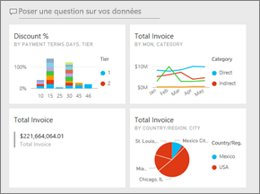

## Vidéo : Créer un tableau de bord en épinglant des éléments visuels et des images provenant d’un rapport
Regardez Amanda créer un tableau de bord en épinglant des visualisations et des images provenant d’un rapport. Ensuite, suivez les étapes sous la vidéo pour essayer par vous-même avec l’exemple Analyse de l’approvisionnement.

<iframe width="560" height="315" src="https://www.youtube.com/embed/lJKgWnvl6bQ" frameborder="0" allowfullscreen></iframe>

### Conditions préalables
Pour la suite, vous devrez télécharger le classeur Excel d’exemple « Analyse de l’approvisionnement » et l’ouvrir dans le service Power BI (app.powerbi.com).

## Importer un jeu de données avec un rapport
Nous allons importer l’un des exemples de jeu de données Power BI et l’utiliser pour créer notre tableau de bord. L’exemple que nous allons utiliser est un classeur Excel avec deux feuilles PowerView. Lorsque Power BI importe le classeur, un jeu de données et un rapport sont ajoutés dans votre espace de travail.  Le rapport est automatiquement créé à partir des feuilles PowerView.

1. [Cliquez sur ce lien](http://go.microsoft.com/fwlink/?LinkId=529784) pour télécharger et enregistrer le fichier Excel de l’exemple Analyse de l’approvisionnement. Nous vous recommandons de l’enregistrer dans votre OneDrive Entreprise.
2. Ouvrez le service Power BI dans votre navigateur (app.powerbi.com).
3. Sélectionnez **Mon espace de travail**.
4. Dans le volet de navigation de gauche, sélectionnez **Obtenir les données**.

    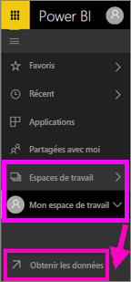
5. Sélectionnez **Fichiers**.

   
6. Naviguez jusqu'à l’emplacement où vous avez enregistré le fichier Excel de l’exemple Analyse de l’approvisionnement. Sélectionnez-le et choisissez **Connecter**.

   
7. Dans cet exercice, sélectionnez **Importer**.

    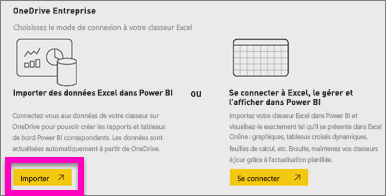
8. Lorsque le message de réussite s’affiche, sélectionnez **x** pour le fermer.

   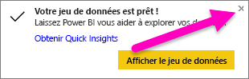

### Ouvrir le rapport et épingler des vignettes à un tableau de bord
1. Sans quitter l’espace de travail, sélectionnez l’onglet **Rapports**. Le rapport nouvellement importé s’affiche avec un astérisque jaune. Sélectionnez le nom du rapport pour l’ouvrir.

    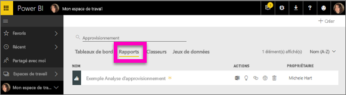
2. Le rapport s’ouvre en [mode Lecture](service-reading-view-and-editing-view.md). Notez qu’il comporte deux onglets en bas : Discount Analysis (Analyse des remises) et Spend Overview (Vue d’ensemble des dépenses). Chaque onglet représente une page du rapport.
    Sélectionnez **Modifier le rapport** pour ouvrir le rapport en Mode Édition.

    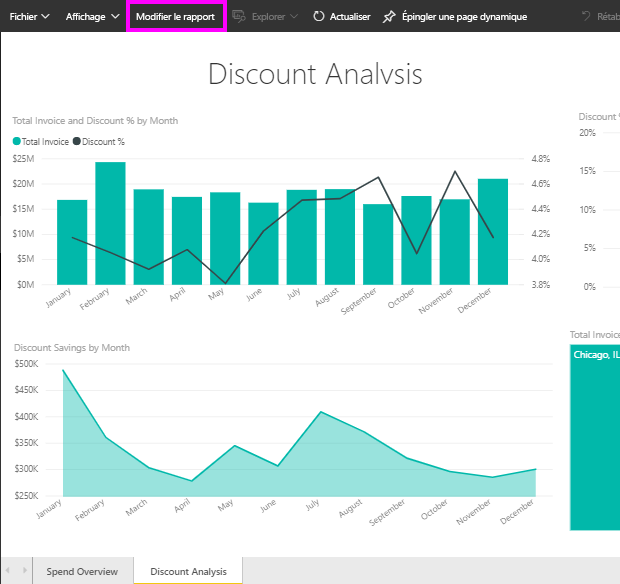
3. Pointez sur une visualisation pour afficher les options disponibles. Pour ajouter une visualisation à un tableau de bord, sélectionnez l’icône d’épingle .

    
4. Étant donné que nous créons un tableau de bord, sélectionnez l’option **Nouveau tableau de bord** et donnez-lui un nom.

   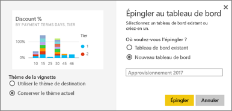
5. Lorsque vous sélectionnez **Épingler**, Power BI crée un nouveau tableau de bord dans l’espace de travail actuel. Lorsque le message **Épinglé au tableau de bord** s’affiche, sélectionnez **Accéder au tableau de bord**. Si vous êtes invité à enregistrer le rapport, choisissez **Enregistrer**.

     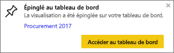
6. Power BI ouvre le nouveau tableau de bord, qui comprend une vignette : la visualisation que nous venons d’épingler.

   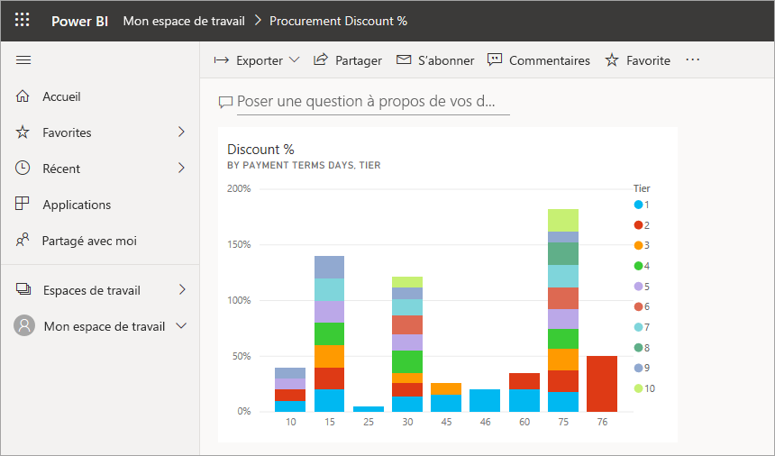
7. Pour revenir au rapport, sélectionnez la vignette. Épinglez d’autres vignettes au nouveau tableau de bord. Cette fois, lorsque la fenêtre **Épingler au tableau de bord** s’affiche, sélectionnez **Tableau de bord existant**.  

   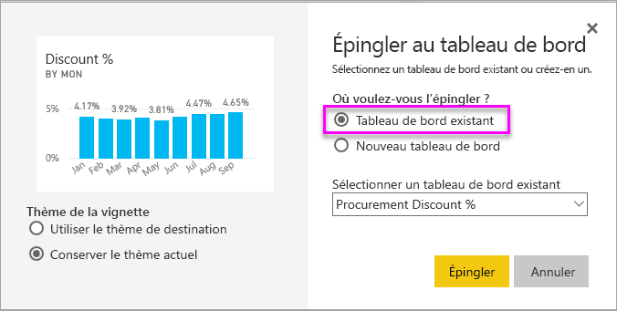

## Épingler la totalité d’une page de rapport à un tableau de bord
Au lieu d’épingler un visuel à la fois, vous pouvez [épingler une page de rapport tout entière comme *vignette dynamique*](service-dashboard-pin-live-tile-from-report.md). C’est parti.

1. Dans l’éditeur de rapport, sélectionnez l’onglet **Vue d’ensemble des dépenses** pour ouvrir la deuxième page du rapport.

   

2. Vous voulez que tous ces visuels apparaissent sur votre tableau de bord.  Dans le coin supérieur droit de la barre de menus, sélectionnez **Épingler une page dynamique**. Dans un tableau de bord, les vignettes de pages dynamiques se mettent à jour à chaque fois que la page est actualisée.

   

3. Lorsque la fenêtre **Épingler au tableau de bord** s’affiche, sélectionnez **Tableau de bord existant**.

   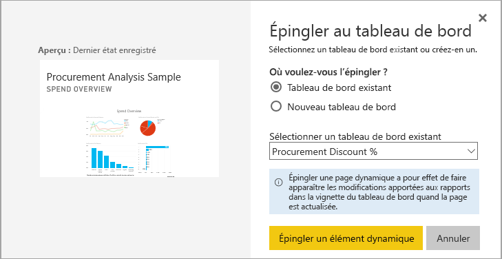

4. Dès que le message de réussite s’affiche, sélectionnez **Accéder au tableau de bord**. Les vignettes que vous avez épinglées à partir du rapport apparaîtront. Dans l’exemple ci-dessous, nous avons épinglé deux vignettes provenant de la première page du rapport et une vignette dynamique correspondant à la deuxième page du rapport.

   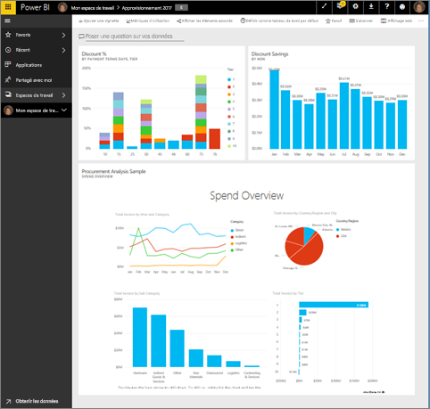

Félicitations pour la création de votre premier tableau de bord ! Maintenant que vous avez un tableau de bord, vous pouvez vous en servir pour de multiples usages.  Essayez l’une des **Étapes suivantes** suggérées ci-dessous ou commencez à vous exercer et à explorer les différentes possibilités qui s’offrent à vous.   

## Étapes suivantes
* [Redimensionner et déplacer des vignettes](service-dashboard-edit-tile.md)
* [Toutes les informations dont vous avez besoin sur les vignettes du tableau de bord](service-dashboard-tiles.md)
* [Partager votre tableau de bord en créant une application](service-create-distribute-apps.md)
* [Power BI – Concepts de base](service-basic-concepts.md)
* [Conseils pour la conception d’un tableau de bord réussi](service-dashboards-design-tips.md)

D’autres questions ? [Posez vos questions à la communauté Power BI](http://community.powerbi.com/)
