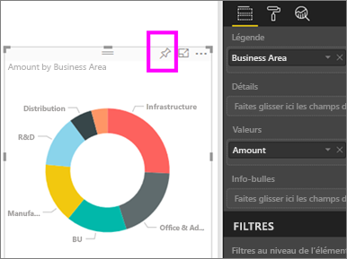
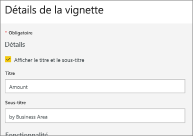
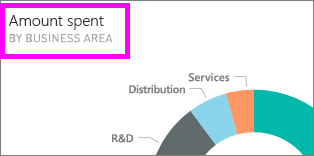
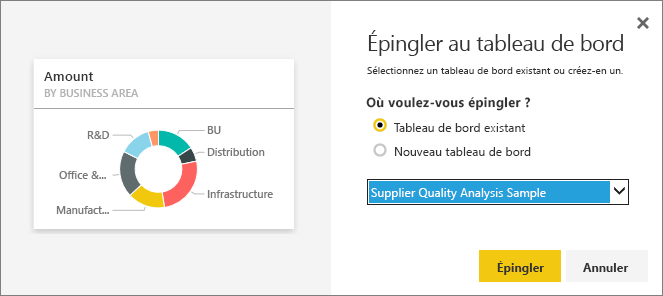

# Modifier ou supprimer une vignette de tableau de bord

## *Propriétaires* et *consommateurs* de tableaux de bord
Lorsque vous créez ou possédez un tableau de bord, vous disposez de nombreuses options pour modifier le comportement par défaut et rechercher des vignettes sur ce tableau de bord. Utilisez les paramètres et les stratégies ci-dessous pour créer l’expérience d’*utilisation* d’un tableau de bord pour vos collègues.  Est-ce que la sélection d’une vignette ouvre le rapport sous-jacent, une URL personnalisée ou un autre tableau de bord ? Vous allez peut-être [ajouter une vignette qui affiche une vidéo ou des données de streaming](service-dashboard-add-widget.md) ? Et vous pouvez même [créer une vignette qui a des segments interactifs](service-dashboard-pin-live-tile-from-report.md). En tant que *créateur*, vous disposez de nombreuses options. 

<iframe width="560" height="315" src="https://www.youtube.com/embed/lJKgWnvl6bQ" frameborder="0" allowfullscreen></iframe>

Cet article aborde les points suivants.

* [Créer une visualisation et l’épingler à un tableau de bord](#create)
* [Déplacer une vignette](#move)
* [Redimensionner une vignette](#resize)
* [Renommer une vignette](#rename)
* [Ajouter un lien hypertexte à une vignette](#hyperlink)
* [Épingler la vignette à un autre tableau de bord](#different)
* [Supprimer une vignette](#delete)
  
 > [!TIP]
 > Pour modifier la visualisation figurant sur la vignette elle-même, supprimez la vignette, puis ajoutez une nouvelle [vignette de tableau de bord](service-dashboard-tiles.md).
 > 

 ### Conditions préalables
 1. Pour effectuer la procédure, ouvrez le service Power BI (pas Power BI Desktop) et [téléchargez l’exemple Analyse des dépenses informatiques](sample-it-spend.md). Lorsque le message de réussite s’affiche, sélectionnez **Accéder au tableau de bord**.

- - -

## Créer une visualisation et l’épingler au tableau de bord
1. Dans le tableau de bord Analyse des dépenses informatiques, sélectionnez la vignette Amount (Quantité) pour ouvrir le rapport.

    

2. Ouvrez le rapport en mode Édition en sélectionnant **Modifier le rapport** dans la barre de menus supérieure.

3. Ajoutez une nouvelle page de rapport en sélectionnant le signe « + » au bas du rapport.

    

4. Dans le volet Champs, sélectionnez **Fact (Fait) > Quantité (Amount)** et **Business Area (Secteur d’activité) > Business Area (Secteur d’activité)**.
 
5. Dans le volet Visualisations, sélectionnez l’icône de graphique en anneau pour convertir la visualisation en graphique en anneau.

    

5. Sélectionnez l’icône en forme d’épingle et épinglez le graphique en anneau au tableau de bord de l’exemple Analyse des dépenses informatiques.

   

6. Lorsque le message de réussite s’affiche, sélectionnez **Accéder au tableau de bord**. Vous êtes invité à enregistrer les modifications. Sélectionnez **Enregistrer**.

- - -

## Déplacer la vignette
Sur le tableau de bord, localisez la nouvelle vignette. Sélectionnez la vignette et faites-la glisser vers un nouvel emplacement sur le canevas de tableau de bord.

- - -

## Redimensionner la vignette
Vous pouvez donner différentes tailles aux vignettes (de 1 x 1 unités de vignette à 5 x 5). Sélectionnez la poignée (dans l’angle inférieur droit) et faites-la glisser pour redimensionner la vignette.

- - -
## Menu de points de suspension (...)

1. Sélectionnez les points de suspension (...) en haut à droite de la vignette. 
   
   

2. Pointez sur la vignette Compte et sélectionnez les points de suspension pour afficher les options. Les options peuvent varier selon le type de vignette.  Par exemple, les options disponibles pour une vignette dynamique sont différentes de celles disponibles pour une vignette de visualisation standard. De plus, si un tableau de bord a été partagé avec vous (vous n’en êtes pas le propriétaire), vous disposez de moins d’options.

   

3. Sélectionnez **Modifier les détails** pour ouvrir la fenêtre Détails de la vignette. 

    Modifiez le titre et le comportement par défaut de la vignette.  Par exemple, vous pouvez décider que quand un *consommateur* sélectionne une vignette, au lieu d’ouvrir le rapport utilisé pour créer cette vignette, un nouveau tableau de bord s’affiche à la place.  
   

### Renommer la vignette
En haut de la fenêtre Détails de la vignette, remplacez **Titre** par **Quantité dépensée**.

### Modifier le lien hypertexte par défaut
Par défaut, si vous sélectionnez une vignette, vous êtes normalement dirigé vers le rapport dans lequel elle a été créée ou vers Questions et réponses (si la vignette a été créée dans Questions et réponses). Pour créer un lien vers une page web, un autre tableau de bord ou rapport (dans le même espace de travail), un rapport SSRS ou autre contenu en ligne, ajoutez un lien personnalisé.

1. Sous l’en-tête Fonctionnalité, sélectionnez **Définir un lien personnalisé**.

2. Sélectionnez **Lier un tableau de bord ou un rapport dans l’espace de travail actuel**, puis effectuez une sélection dans le menu déroulant.  Dans cet exemple, j’ai sélectionné le tableau de bord de l’exemple Ressources humaines. Si vous n’avez pas encore cet exemple dans votre espace de travail, vous pouvez l’ajouter et revenir à cette étape, ou vous pouvez sélectionner un autre tableau de bord. 

    

3. Sélectionnez **Appliquer**.

4. Le nouveau titre s’affiche sur la vignette.  Ensuite, quand vous sélectionnez la vignette, Power BI ouvre le tableau de bord Ressources humaines. 

    

### Épingler la vignette à un autre tableau de bord
1. Dans le menu déroulant des points de suspension, sélectionnez **Épingler la vignette** .
2. Épinglez un doublon de cette vignette à un tableau de bord existant ou nouveau. 
   
   
3. Sélectionnez **Épingler**.

### Supprimer la vignette
1. Pour supprimer définitivement une vignette d’un tableau de bord, sélectionnez **Supprimer la vignette**  dans le menu déroulant des points de suspension. 

2. La suppression d’une vignette n’entraîne pas celle de la visualisation sous-jacente. Ouvrez le rapport sous-jacent en sélectionnant la vignette « Quantité ». Ouvrez la dernière page de votre rapport pour voir que la visualisation d’origine n’a pas été supprimée du rapport. 

- - -
## Étapes suivantes
[Vignettes d’un tableau de bord dans Power BI](service-dashboard-tiles.md)

[Tableaux de bord dans Power BI](service-dashboards.md)

[Power BI – Concepts de base](service-basic-concepts.md)

D’autres questions ? [Posez vos questions à la communauté Power BI](http://community.powerbi.com/)

