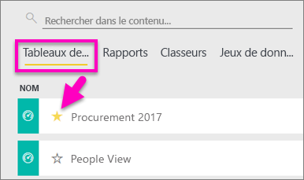
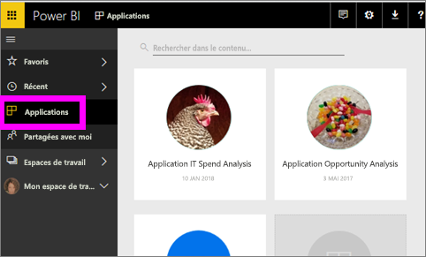
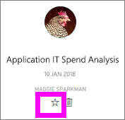
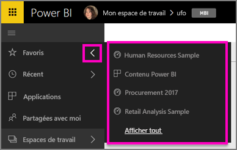
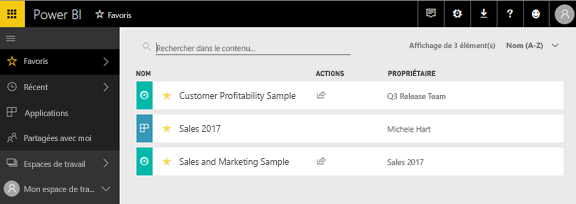
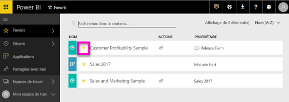

# Tableaux de bord, rapports et applications favoris dans le service Power BI
Quand vous ajoutez du contenu aux *favoris*, vous pouvez y accéder à partir de tous vos espaces de travail.  Les favoris correspondent généralement aux contenus que vous consultez le plus souvent.

> [!NOTE]
> Ce didacticiel s’applique au service Power BI, mais pas à Power BI Desktop.
> 
> 

Vous pouvez également sélectionner un seul tableau de bord comme [Tableau de bord par défaut](service-dashboard-featured.md) dans le service Power BI.

## Ajouter un tableau de bord ou un rapport aux *favoris*
Regardez Amanda ajouter des Favoris à son espace de travail, puis suivez les instructions détaillées sous la vidéo pour essayer vous-même.

<iframe width="560" height="315" src="https://www.youtube.com/embed/G26dr2PsEpk" frameborder="0" allowfullscreen></iframe>

1. Ouvrez un tableau de bord ou un rapport que vous utilisez souvent. Chaque contenu partagé avec vous peut être un *favori*.
2. En haut à droite du service Power BI, sélectionnez **Favori** ou l’icône en forme d’étoile .
   
   
   
   Vous pouvez également définir un tableau de bord ou un rapport comme favori à partir de l’onglet d’affichage de contenu **Tableaux de bord** ou **Rapports** de votre espace de travail.
   
   

## Ajouter une application aux *favoris*

1. Dans le volet de navigation gauche, sélectionnez **Applications**.

   

2. Pointez sur une application pour afficher plus de détails.  Sélectionnez l’icône en forme d’étoile   pour l’ajouter aux favoris.
   
   

## Utilisation de *Favoris*
1. Pour accéder aux favoris, à partir d’un espace de travail, cliquez sur la flèche à droite de **Favoris**.  Vous pouvez sélectionner ici un favori pour l’ouvrir. Seuls cinq favoris sont répertoriés (par ordre alphabétique). Si vous en avez plus de cinq, sélectionnez **Afficher tout** pour ouvrir l’écran Favoris (voir le point 2 ci-dessous). 
   
   
2. Pour afficher **tout** le contenu que vous avez ajouté aux favoris, dans le volet de navigation gauche, sélectionnez **Favoris** ou l’icône Favoris .  
   
    
   
   À ce stade, vous pouvez effectuer une action : ouvrir, identifier les propriétaires et même partager avec vos collègues.

## Retirer du contenu des favoris
Vous n’utilisez plus souvent un rapport ?  Vous pouvez le retirer des favoris. Quand vous retirez du contenu de la liste des favoris, il est retiré de vos favoris mais pas de Power BI.

1. Dans le volet de navigation de gauche, sélectionnez **Favoris** pour ouvrir l’écran **Favoris**.
   
   
2. Sélectionnez l’étoile jaune en regard du contenu à retirer des favoris.

> **REMARQUE** : vous pouvez également retirer un tableau de bord, un rapport ou une application des favoris. Pour cela, il vous suffit d’ouvrir l’élément en question et de désélectionner l’icône jaune.   
> 
> 

## Étapes suivantes
[Prise en main de Power BI](service-get-started.md)

[Power BI – Concepts de base](service-basic-concepts.md)

D’autres questions ? [Posez vos questions à la communauté Power BI](http://community.powerbi.com/)

