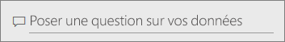
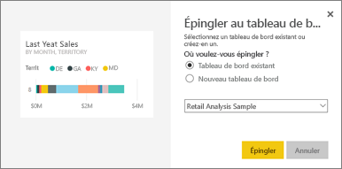
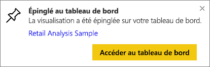

# Épingler une vignette à un tableau de bord à partir de Questions et réponses
## Épingler une vignette à partir de Q&R
Q&R est l’outil de génération de rapports ad hoc de Power BI. Vous avez besoin de données spécifiques ? Posez une question à propos de vos données et recevez une réponse sous la forme d’une visualisation.

La fonctionnalité Questions et réponses est disponible à partir des tableaux de bord et des rapports. Dans cet article, nous allons ouvrir Questions et réponses à partir d’un tableau de bord. Les tableaux de bord sont disponibles uniquement dans le service Power BI et non dans Power BI Desktop. Pour suivre la procédure, ouvrez le tableau de bord [Exemple Analyse de la vente au détail](sample-retail-analysis.md).
> 
> 

1. Ouvrez un [tableau de bord](service-dashboards.md) sur lequel au moins une vignette est épinglée à partir d’un rapport. Lorsque vous posez une question, Power BI cherche la réponse dans un jeu de données dont une vignette est épinglée à ce tableau de bord.  Pour plus d’informations, voir [obtenir des données](service-get-data.md).
2. En haut de votre tableau de bord, dans la zone de question, commencez à taper ce que vous voulez savoir sur vos données.  
   
3. Par exemple, quand vous tapez « ventes de l’année dernière par mois et par secteur »…  
   
   
   la zone des questions vous propose des suggestions.
4. Pour ajouter le graphique à votre tableau de bord sous forme de vignette, sélectionnez l’icône représentant une épingle  en haut à droite du canevas.
5. Épinglez la vignette à un tableau de bord existant ou à un nouveau tableau de bord. 

   

   * Tableau de bord existant : sélectionnez le nom du tableau de bord dans la liste déroulante. Votre choix est limité aux tableaux de bord figurant à l’intérieur de l’espace de travail actuel.
   * Nouveau tableau de bord : tapez le nom du nouveau tableau de bord pour ajouter celui-ci à votre espace de travail actuel.
6. Sélectionnez **Épingler**.
   
   Un message de réussite (dans l’angle supérieur droit) vous indique que la visualisation a été ajoutée, sous forme de vignette, à votre tableau de bord.  
   
   
7. Sélectionnez **Accéder au tableau de bord** pour voir la nouvelle vignette. Vous pouvez [renommer, redimensionner et repositionner la vignette, et y ajouter également un lien hypertexte](service-dashboard-edit-tile.md) depuis votre tableau de bord. 
   
   

## Considérations et résolution des problèmes
* Quand vous commencez à taper une question, Q&R recherche immédiatement la meilleure réponse dans tous les jeux de données associés au tableau de bord actif.  Le « Tableau de bord actuel » est celui indiqué dans la barre de navigation supérieure. Par exemple, cette question est posée dans le tableau de bord **Exemple Analyse de la vente au détail** qui fait partie de l’espace de travail d’application **mihart**.
  
  
* **Comment la fonctionnalité Q&R sait-elle quels jeux de données utiliser ?**  Q&R a accès à tous les jeux de données dont les visualisations sont épinglées au tableau de bord.

## Étapes suivantes
[Renommer, redimensionner, ajouter un lien hypertexte, repositionner la vignette et bien plus encore](service-dashboard-edit-tile.md)    
[Afficher la vignette de votre tableau de bord en mode Focus](service-focus-mode.md)     
[Revenir à Q&R dans Power BI](service-q-and-a.md)  
D’autres questions ? [Posez vos questions à la communauté Power BI](http://community.powerbi.com/)

