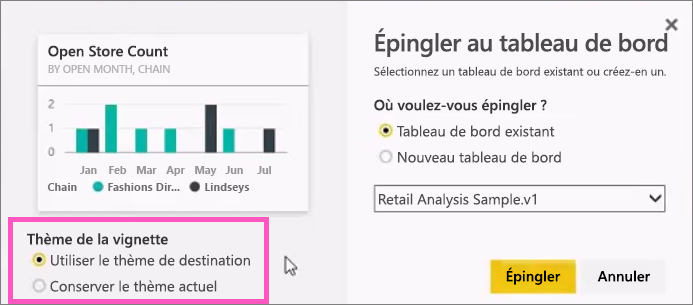
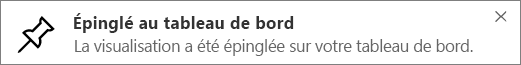

# Épingler une vignette à un tableau de bord Power BI à partir d’un rapport
## Épinglage de vignettes à partir d’un rapport
Vous pouvez ajouter une nouvelle [vignette de tableau de bord](service-dashboard-tiles.md) depuis un [rapport Power BI](service-reports.md). Vous pouvez même ajouter plusieurs vignettes depuis un rapport.  Quand vous cliquez sur ces vignettes, vous êtes redirigé vers le rapport.

Des pages de rapport entières peuvent aussi être épinglées à un tableau de bord.  Ceci s’appelle également une vignette *dynamique* .  *Dynamique* , parce que vous pouvez interagir avec la vignette sur le tableau de bord et que, contrairement aux vignettes de visualisation individuelles, les modifications apportées dans le rapport sont synchronisées avec le tableau de bord. D’autres informations sur ce sujet sont données plus bas.

Vous ne pouvez pas épingler des vignettes provenant de rapports partagés avec vous ou de Power BI Desktop. 

> **CONSEIL** : Certaines visualisations utilisent des images d’arrière-plan. L’épinglage peut ne pas fonctionner si l’image d’arrière-plan est trop grande.  Essayez de réduire la taille de l’image ou de la compresser.  
> 
> 

## Ajouter une vignette à partir d’un rapport
Regardez Amanda créer un tableau de bord en épinglant des éléments visuels et des images provenant d’un rapport Power BI.

<iframe width="560" height="315" src="https://www.youtube.com/embed/lJKgWnvl6bQ" frameborder="0" allowfullscreen></iframe>

À présent, créez votre propre tableau de bord à l’aide de l’un des exemples de rapports Power BI.

1. Pointez sur la visualisation que vous voulez épingler, puis sélectionnez l’icône représentant une épingle . Power BI ouvre l’écran **Épingler au tableau de bord** .
   
     
2. Épinglez la vignette à un tableau de bord existant ou à un nouveau tableau de bord.
   
   * Tableau de bord existant : sélectionnez le nom du tableau de bord dans la liste déroulante. Les tableaux de bord qui ont été partagés avec vous n’apparaissent pas dans la liste déroulante.
   * Nouveau tableau de bord : tapez le nom du nouveau tableau de bord.
3. Dans certains cas, l’élément que vous épinglez peut avoir un *thème* déjà appliqué.  Par exemple, les éléments visuels épinglés à partir d’un classeur Excel. Dans ce cas, sélectionnez le thème à appliquer à la vignette.
4. Sélectionnez **Épingler**.
   
   Un message de réussite (dans l’angle supérieur droit) vous indique que la visualisation a été ajoutée, sous forme de vignette, à votre tableau de bord.
   
   
5. Dans le volet de navigation, sélectionnez le tableau de bord avec la nouvelle vignette. Sélectionnez la vignette pour retourner au rapport. Ou, [modifiez l'affichage et le comportement de la vignette](service-dashboard-edit-tile.md).

## Épingler une page de rapport entière
Une autre option consiste à épingler une page de rapport entière à un tableau de bord. Il s’agit d’un moyen simple d’épingler plusieurs visualisations à la fois.  De plus, quand vous épinglez une page entière, les vignettes sont *dynamiques*: vous pouvez interagir avec elles directement sur le tableau de bord. Les modifications apportées ultérieurement à des visualisations dans l’éditeur de rapports, comme ajouter un filtre ou changer les champs utilisés dans le graphique, sont également répercutées dans la vignette du tableau de bord.  

Pour plus d'informations, consultez [Épingler une page de rapport entière](service-dashboard-pin-live-tile-from-report.md)

## Étapes suivantes
[Tableaux de bord dans Power BI](service-dashboards.md)

[Vignettes d’un tableau de bord dans Power BI](service-dashboard-tiles.md)

[Rapports dans Power BI](service-reports.md)

[Actualisation des données dans Power BI](refresh-data.md)

[Power BI - Concepts de base](service-basic-concepts.md)

D’autres questions ? [Posez vos questions à la communauté Power BI](http://community.powerbi.com/)

