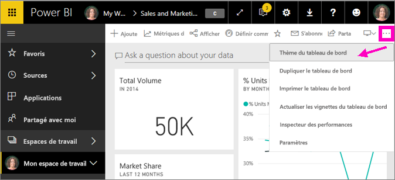
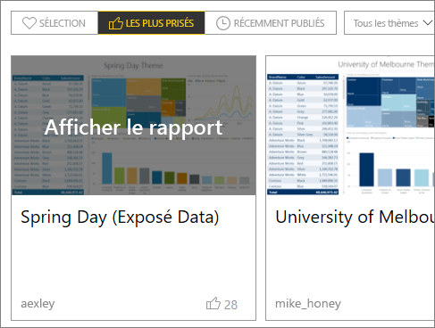

# Utiliser des thèmes de tableau de bord dans le service Power BI
Les **thèmes de tableau de bord** vous permettent d’appliquer un thème de couleur à l’intégralité d’un tableau de bord. Il peut s’agir des couleurs de votre organisation, de teintes liées à la saison ou de tout autre thème de votre choix. Quand vous appliquez un **thème de tableau de bord**, tous les visuels du tableau de bord utilisent les couleurs du thème sélectionné (à quelques exceptions près, décrites plus loin dans cet article).

Le changement des couleurs des visuels du rapport sur le tableau de bord n’affectent pas les visuels du rapport. En outre, quand vous épinglez des vignettes d’un rapport auquel un [thème de rapport](desktop-report-themes.md) est déjà appliqué, vous pouvez choisir de conserver le thème actuel ou d’utiliser le thème du tableau de bord.

## Conditions préalables
* Pour suivre la procédure, ouvrez [l’exemple de tableau de bord Sales and Marketing](sample-datasets.md).

## Fonctionnement des thèmes de tableau de bord
Pour commencer, ouvrez un tableau de bord que vous avez créé (ou que vous avez l’autorisation de modifier) et que vous voulez personnaliser. Sélectionnez les points de suspension (...), puis choisissez **Thème du tableau de bord**. 

Dans le volet du tableau de bord qui apparaît, sélectionnez un des thèmes prédéfinis.  Dans l’exemple ci-dessous, nous avons sélectionné **Foncé**.

## Créer un thème personnalisé

Le thème par défaut pour les tableaux de bord Power BI est **Clair**. Si vous voulez personnaliser les couleurs ou créer votre propre thème, sélectionnez **Personnalisé** dans la liste déroulante. 

Utilisez les options de personnalisation pour créer votre propre thème de tableau de bord. Si vous ajoutez une image d’arrière-plan, nous vous recommandons d’utiliser une image avec une résolution d’au moins 1 920 x 1 080. Pour utiliser une image comme arrière-plan, chargez-la sur un site web public, copiez l’URL et collez-la dans le champ **URL de l’image**. 

### Utilisation de thèmes JSON
Une autre façon de créer un thème personnalisé consiste à télécharger un fichier JSON qui contient des paramètres pour toutes les couleurs que vous voulez utiliser pour votre tableau de bord. Dans Power BI Desktop, les créateurs de rapports utilisent des fichiers JSON pour [créer des thèmes pour les rapports](desktop-report-themes.md). Ces mêmes fichiers JSON peuvent être chargés pour les tableaux de bord ; vous pouvez aussi rechercher et charger des fichiers JSON à partir de la [page Galerie Thèmes](https://community.powerbi.com/t5/Themes-Gallery/bd-p/ThemesGallery) dans la Communauté Power BI. 

Vous pouvez également enregistrer votre thème personnalisé comme fichier JSON et le partager avec d’autres créateurs de tableau de bord. 

### Utiliser un thème de la galerie de thèmes

Comme les options prédéfinies et personnalisées, quand le thème est chargé, les couleurs sont appliquées automatiquement à toutes les vignettes du tableau de bord. 

1. Pointez sur un thème et choisissez **Afficher le rapport**.

    

2. Faites défiler vers le bas et recherchez le lien vers le fichier JSON.  Sélectionnez l’icône de téléchargement, puis enregistrez le fichier.

    

3. Revenez dans le service Power BI et, dans la fenêtre de thème Tableau de bord personnalisé, sélectionnez **Charger le thème JSON**.

    

4. Accédez à l’emplacement où vous avez enregistré le fichier de thème JSON et sélectionnez **Ouvrir**.

5. Dans la page Thème du tableau de bord, sélectionnez **Enregistrer**. Le nouveau thème est appliqué à votre tableau de bord.

    

## Considérations et limitations

* Si votre rapport n’utilise pas le même thème que celui du tableau de bord, vous pouvez déterminer si l’élément visuel doit conserver le thème actuel, ou utiliser le thème du tableau de bord pour garantir la cohérence entre les éléments visuels des différentes sources. Lors de l’épinglage d’une vignette au tableau de bord, pour conserver le thème du rapport, sélectionnez **Conserver le thème actuel**. Le visuel du tableau de bord conserve le thème du rapport, notamment les paramètres de transparence. 

    Le seul moment où les options **Thème de la vignette** apparaissent est le scénario suivant : vous avez créé le rapport dans Power BI Desktop, vous avez [ajouté un thème de rapport](desktop-report-themes.md), puis vous avez publié le rapport sur le service Power BI. 

    

    Essayez en réépinglant la vignette et en sélectionnant **Utiliser le thème du tableau de bord**.

    

* Vous ne pouvez pas appliquer des thèmes de tableau de bord à des pages de rapport dynamique épinglées, à des vignettes iframe, à des vignettes SSRS, à des vignettes de classeur ou à des images.
* Les thèmes de tableau de bord peuvent être visualisés sur des appareils mobiles, mais vous pouvez les créer seulement dans le service Power BI. 
* Les thèmes personnalisés de tableau de bord fonctionnent seulement avec les vignettes épinglées à partir des rapports. 

