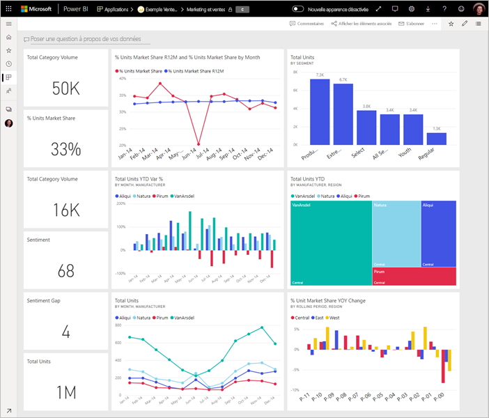

# Conseils pour la conception d’un tableau de bord Power BI
Maintenant que vous avez créé un tableau de bord et ajouté des vignettes, pensez comment vous pourriez rendre votre tableau de bord aussi élégant que fonctionnel. En général, cela consiste à mettre en évidence les informations les plus importantes et à faire en sorte que votre tableau de bord soit clair et non encombré.

> [!TIP]
> Vous aimez ce tableau de bord ? Vous pouvez le télécharger ainsi que les rapports associés à partir d’AppSource. Accédez à **Obtenir des données** > **Services**. Recherchez **Exemple Microsoft - Ventes et marketing** > **Obtenir maintenant**.

De nombreux principes de conception de rapports s’appliquent aussi aux tableaux de bord. Pour plus d’informations, lisez notre livre blanc [Bonnes pratiques en matière de conception de rapports et de visualisations](visuals/power-bi-visualization-best-practices.md).

Voici quelques conseils concernant les tableaux de bord.

## Vidéo présentant les bonnes pratiques concernant la conception de tableau de bord

Regardez cette vidéo, [Bonnes pratiques concernant la conception de tableau de bord dans Power BI](https://www.youtube.com/watch?v=-tdkUYrzrio), pour obtenir des conseils de conception de Marco Russo de SQLBI.com.

## Prenez en compte votre public
Quelles sont les métriques clés qui les aideront à prendre des décisions ? De quelle façon le tableau de bord sera-t-il utilisé ? Quelles hypothèses culturelles peuvent affecter vos choix en matière de conception ? De quelles informations votre public a-t-il besoin pour réussir ?

N’oubliez pas qu’un tableau de bord fournit une vue d’ensemble, un emplacement unique duquel surveiller l’état actuel des données. Le tableau de bord est basé sur des rapports et des jeux de données sous-jacents. Ces éléments contiennent souvent de très nombreux détails. Vos lecteurs peuvent explorer vos rapports depuis votre tableau de bord. Par conséquent, ne placez pas les détails sur le tableau de bord, sauf s’il s’agit des informations que vos lecteurs doivent superviser.

Sur quel type d’appareil le tableau de bord sera-t-il affiché ? S’il s’agit d’un grand écran, vous pouvez y ajouter davantage de contenu. Toutefois, si les lecteurs l’affichent sur leurs tablettes, un tableau de bord comportant moins de vignettes est plus lisible.

## Raconter une histoire sur un écran
Étant donné que les tableaux de bord permettent de lire des informations importantes en un seul coup d’œil, il est préférable que toutes les vignettes se trouvent sur un seul écran. Pouvez-vous éviter l’utilisation d’une barre de défilement dans votre tableau de bord ?

Le tableau de bord est-il encombré ?  Ne gardez que les informations importantes qui sont lues et interprétées facilement.

## Utiliser le mode plein écran
Quand vous présentez un tableau de bord, affichez-le en [mode plein écran](consumer/end-user-focus.md), sans distractions.

## Mettre en évidence les informations les plus importantes
Si le texte et les visualisations de votre tableau de bord ont la même taille, vos lecteurs auront du mal à se concentrer sur ce qui est le plus important. Par exemple, les visualisations de carte sont un bon moyen de mettre en évidence un nombre important :  

N’oubliez pas de préciser le contexte.  

En savoir plus sur la [création d’une vignette avec un seul numéro](visuals/power-bi-visualization-card.md).

## Placer les informations les plus importantes
La plupart des gens lisent de haut en bas. Par conséquent, placez le plus haut niveau de données en haut à gauche et affichez les informations détaillées dans le sens de lecture de vos utilisateurs (de gauche à droite, de haut en bas).

## Utilisez la visualisation qui convient à vos données
Évitez d’utiliser trop de types de visualisations différents.  Les visualisations doivent représenter une image et être faciles à lire et à interpréter.  Pour certaines données et visualisations, une simple visualisation graphique est suffisante. Toutefois, certaines données peuvent nécessiter une visualisation plus complexe : utilisez des titres, des étiquettes et d’autres personnalisations pour aider le lecteur.  

* Soyez prudent quand vous utilisez des visuels qui semblent élégants mais qui sont difficiles à lire, comme des graphiques 3D. 
* Vous pouvez être déçu d’apprendre que les graphiques à secteurs, les graphiques en anneau, les jauges et d’autres types de graphiques circulaires ne sont pas recommandés pour une visualisation de données. Si vous avez moins de huit catégories, les graphiques en secteurs conviendront le mieux. Étant donné que des utilisateurs ne peuvent pas comparer des valeurs côte à côte, il est plus difficile de comparer des valeurs dans un graphique à secteurs que dans un graphique à barres ou dans un histogramme. Les graphiques en secteurs conviennent mieux à l’affichage des relations partie-tout qu’à la comparaison de différentes parties. Les graphiques en jauge conviennent parfaitement à l’affichage de l’état actuel dans le contexte d’un objectif.
* Soyez cohérent avec les échelles des graphiques sur les axes, l’ordre des dimensions des graphiques ainsi que les couleurs utilisées pour les valeurs des dimensions dans les graphiques.
* Encodez soigneusement les données quantitatives. Ne dépassez pas trois ou quatre chiffres pour les nombres. Affichez les mesures avec un ou deux chiffres à gauche de la décimale et procédez à une mise à l’échelle pour les milliers ou les millions (c’est-à-dire 3,4 millions et non 3 400 000).
* Ne mélangez pas les niveaux de précision et les unités de temps. Assurez-vous que les périodes sont bien comprises. Ne mettez pas côte à côte un graphique concernant le mois dernier et des graphiques filtrés concernant un certain mois de l’année.
* Ne mélangez pas les grandes et les petites mesures sur une même échelle, comme sur un graphique en courbes ou un graphique à barres. Par exemple, une mesure en millions et une autre en milliers. Avec une telle échelle, il serait difficile de voir les différences de la mesure en milliers. Si vous devez les combiner, choisissez une visualisation qui permet d’utiliser un deuxième axe.
* N’encombrez pas vos graphiques avec des étiquettes de données qui ne sont pas nécessaires. Les valeurs exprimées sous la forme de graphiques à barres sont généralement comprises et ne nécessitent pas l’affichage du nombre réel.
* Faites attention à la manière dont les [graphiques sont organisés](consumer/end-user-change-sort.md). Si vous voulez attirer l’attention sur le nombre le plus élevé ou le plus bas, effectuez un tri par mesure. Si vous voulez que les utilisateurs trouvent rapidement une catégorie parmi de nombreuses autres catégories, effectuez un tri par axe.  

Pour plus de conseils spécifiques aux visualisations, consultez [Types de visualisations dans Power BI](visuals/power-bi-visualization-types-for-reports-and-q-and-a.md).  

## En savoir plus sur la conception de tableaux de bord
Pour maîtriser l’art de la conception des tableaux de bord, découvrez les principes de base de la Gestalt concernant la perception visuelle et comment communiquer clairement des informations pratiques en contexte. Heureusement, il existe une multitude de ressources qui sont disséminées dans nos blogs. Voici quelques-uns de nos livres préférés :

* *Information Dashboard Design* par Stephen Few  
* *Show Me the Numbers* par Stephen Few  
* *Now You See It* par Stephen Few  
* *Envisioning Information* par Edward Tufte  
* *Advanced Presentations* par Andrew Abela   

## Étapes suivantes
[Créer un tableau de bord à partir d’un rapport](service-dashboard-create.md)  
[Fondamentaux pour les concepteurs dans le service Power BI](service-basic-concepts.md)  
D’autres questions ? [Posez vos questions à la communauté Power BI](http://community.powerbi.com/)
