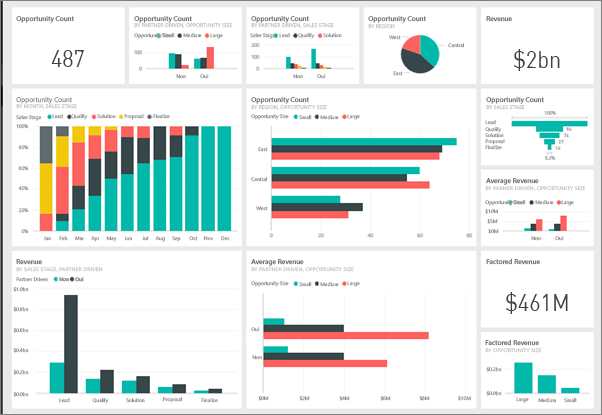
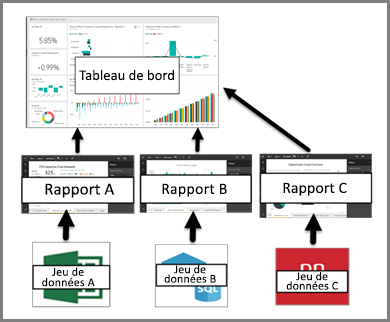

# Tableaux de bord dans le service Power BI

Un ***tableau de bord*** Power BI est une page unique, souvent appelée canevas, qui utilise des visualisations pour raconter une histoire. Comme il est limité à une seule page, un tableau de bord bien conçu contient uniquement les éléments les plus importantes de cette histoire.

Les tableaux de bord sont une fonctionnalité du service Power BI et ne sont pas disponibles dans Power BI Desktop. Les tableaux de bord ne peuvent pas être créés sur les appareils mobiles, mais ils peuvent être [affichés et partagés](mobile-apps-view-dashboard.md).

## Créateurs et utilisateurs de tableaux de bord
Selon votre rôle, vous pouvez être amené à créer des tableaux de bord pour votre usage personnel ou pour les partager avec vos collègues. Vous trouverez des informations pour vous dans **Tableaux de bord pour les créateurs**. Si vous recevez des tableaux de bord d’autres personnes. Vous souhaitez apprendre à comprendre et interagir avec le tableau de bord. Cet article est pour vous !

### Si vous devez recevoir et utiliser des tableaux de bord

Les visualisations que vous voyez dans le tableau de bord sont appelées *vignettes* et sont *épinglées* au tableau de bord à partir de rapports par les *créateurs* de tableaux. Si vous êtes novice dans Power BI, vous pouvez acquérir de bonnes bases en lisant [Power BI – Concepts de base](service-basic-concepts.md).

> [!IMPORTANT]
> [Power BI Pro](service-free-vs-pro.md) est nécessaire pour voir un tableau de bord partagé.

Les visualisations sur un tableau de bord proviennent de rapports, et chaque rapport est basé sur un jeu de données. En fait, on peut considérer un tableau de bord comme une porte d’entrée dans les rapports et les jeux de données sous-jacents. La sélection d’une visualisation vous amène au rapport (et au jeu de données) utilisé(s) pour la créer.

## Avantages des tableaux de bord
Les tableaux de bord sont un moyen formidable pour surveiller votre activité, pour rechercher des réponses et pour afficher vos mesures les plus importantes en un coup d’œil. Les visualisations sur un tableau de bord peuvent provenir d’un ou plusieurs jeux de données sous-jacents et d’un ou plusieurs rapports sous-jacents. Un tableau de bord combine des données locales et issues du cloud, offrant ainsi une vue consolidée, quel que soit l’endroit où les données résident.

Un tableau de bord n’est pas simplement une belle image ; il est extrêmement interactif et les vignettes sont mises à jour au fur et à mesure que les données sous-jacentes changent.

## Tableaux de bord et rapports
Les [rapports](service-reports.md) sont souvent confondus avec les tableaux de bord, car il s’agit également de canevas remplis avec des visualisations. Mais il existe quelques différences majeures pour les consommateurs Power BI.

| **Fonctionnalité** | **Tableaux de bord** | **Rapports** |
| --- | --- | --- |
| Pages |Une seule page |Une ou plusieurs pages |
| Sources de données |Un ou plusieurs rapports et un ou plusieurs jeux de données par tableau de bord |Un seul jeu de données par rapport |
| Disponible dans Power BI Desktop |Non |Oui, les ***créateurs*** peuvent créer et afficher des rapports dans Desktop |
| S’abonner |Possibilité de s’abonner à un tableau de bord |Possibilité de s’abonner à des pages de rapport |
| Filtrage |Impossible de filtrer ou découper |Différentes manières de filtrer, mettre en surbrillance et découper |
| Sélection |Possibilité de définir un tableau de bord comme votre tableau de bord « par défaut » |Impossible de créer un rapport par défaut |
| Favori | Possibilité de définir des tableaux de bord comme *Favoris* | Possibilité de définir des rapports comme *Favoris*
| Définir des alertes |Disponible pour les vignettes de tableau de bord dans certaines circonstances |Non disponible à partir de rapports |
| Requêtes en langage naturel |Disponible à partir du tableau de bord |Non disponible à partir de rapports |
| Possibilité d’afficher les tables et les champs sous-jacents d’un jeu de données |Non. Possibilité d’exporter les données, mais pas de voir les tables et les champs dans le tableau de bord. |Oui. Possibilité de voir les tables d’un jeu de données ainsi que les champs et les valeurs. |
| Personnalisation |Non |En mode Lecture, vous pouvez publier, incorporer, filtrer, exporter, télécharger en tant que .pbix, afficher le contenu associé, générer des codes de QR, analyser dans Excel et plus encore.  |

## Étapes suivantes
* Familiarisez-vous avec les tableaux de bord en effectuant une visite guidée d’un de nos [exemples de tableau de bord](sample-tutorial-connect-to-the-samples.md).
* Apprenez-en plus sur les [vignettes du tableau de bord](service-dashboard-tiles.md) et ce qui se produit lorsque vous sélectionnez une.
* Si vous souhaitez effectuer le suivi d’une vignette du tableau de bord et recevoir un e-mail lorsqu’elle atteint un certain seuil ? [Créer des alertes sur les vignettes](service-set-data-alerts.md).
* Amusez-vous en posant des questions à votre tableau de bord. Découvrez comment utiliser [Power BI Q&A](power-bi-tutorial-q-and-a.md) pour poser une question concernant vos données et obtenir la réponse sous la forme d’une visualisation.
