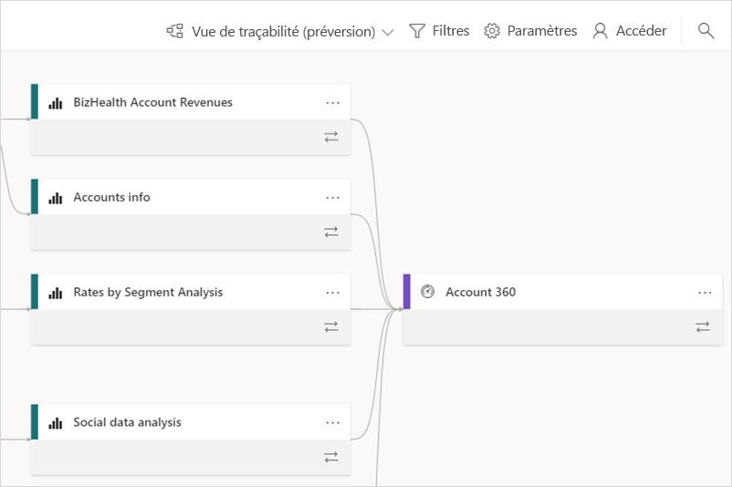
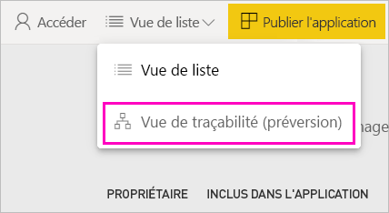
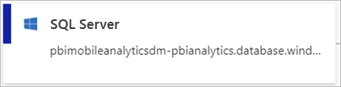
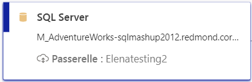
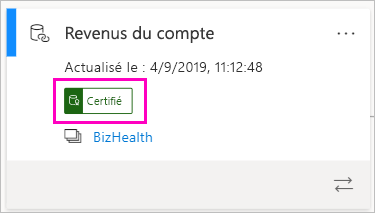
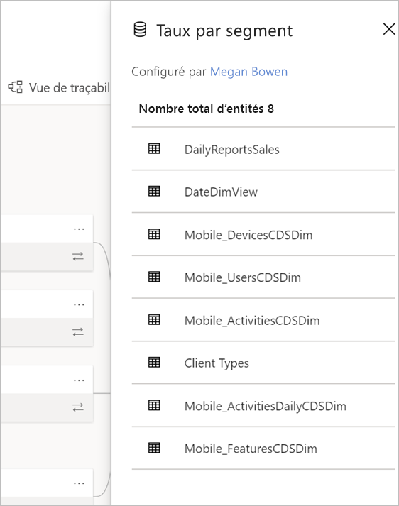
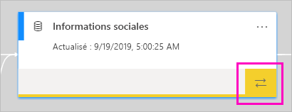
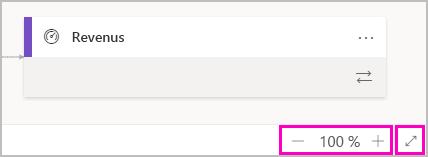

# Traçabilité des données (préversion)
Dans les projets Business Intelligence (BI) modernes, il peut être difficile d’avoir une bonne compréhension du flux de données entre la source de données et la destination. C’est encore plus compliqué si vous avez créé des projets d’analytique avancée qui impliquent de multiples sources de données, artefacts et dépendances.  Il peut alors être difficile de répondre à des questions telles que « Que se passe-t-il si je modifie ces données ? » ou « Pourquoi ce rapport n’est-il pas à jour ? ». Pour trouver les réponses, il faut parfois demander l’aide d’experts ou faire des recherches approfondies. Nous avons conçu une vue de traçabilité des données qui pourra vous aider à répondre à ce genre de questions.

 
Power BI fournit plusieurs types d’artefacts, comme des tableaux de bord, des rapports, des jeux de données et des dataflows. De nombreux jeux de données et dataflows se connectent à des sources de données externes telles que SQL Server et à des jeux de données externes dans d’autres espaces de travail. Quand un jeu de données est externe à un espace de travail dont vous êtes propriétaire, il peut se trouver dans un espace de travail détenu par un membre du service informatique ou par un autre analyste. Les sources de données et jeux de données externes rendent difficile de savoir d’où les données proviennent à l’origine. Dans vos projets, qu’ils soient complexes ou plus simples, vous pouvez utiliser la nouvelle vue de traçabilité. 

Dans la vue de traçabilité, vous voyez les relations de traçabilité entre tous les artefacts dans un espace de travail, et toutes leurs dépendances externes. La vue de traçabilité complète la vue de diagramme qui existait déjà pour les dataflows. Elle montre les connexions entre tous les artefacts de l’espace de travail, y compris les connexions aux dataflows, aussi bien en amont qu’en aval. La vue de diagramme distincte pour les dataflows ne sera plus disponible à partir de novembre.

## Explorer la vue de traçabilité

Hormis dans Mon espace de travail, chaque espace de travail, nouveau ou classique, comporte systématiquement une vue de traçabilité. Pour accéder à cette vue, vous devez avoir au minimum le rôle Contributeur dans l’espace de travail. Pour plus d’informations, consultez [Permissions](#permissions), plus loin dans cet article. 

- Pour accéder à la vue de traçabilité, passez en mode Liste dans l’espace de travail. Appuyez sur la flèche à côté de **Mode Liste** et sélectionnez **Vue de la traçabilité**.

    

    Cette vue montre tous les artefacts de l’espace de travail et la façon dont les flux de données circulent de l’un à l’autre.

**Sources de données**

Vous voyez les sources de données à partir desquelles les jeux de données et les dataflows obtiennent leurs données. Les cartes des sources de données fournissent des informations supplémentaires qui peuvent vous aider à identifier les sources. Par exemple, pour Azure SQL Server, vous voyez également le nom de la base de données.

 
**Passerelles**

Si une source de données est connectée par le biais d’une passerelle locale, les informations sur la passerelle sont ajoutées à la carte de la source de données. Si vous avez des autorisations d’administrateur de la passerelle ou d’utilisateur de la source de données, vous voyez d’autres informations, comme le nom de la passerelle.

**Jeux de données et dataflows**
 
Sur les jeux de données, vous voyez l’heure de la dernière actualisation ainsi qu’une mention indiquant si le jeu de données est certifié ou promu.

 
Si un rapport dans l’espace de travail est basé sur un jeu de données d’un autre espace de travail, le nom de l’espace de travail source est indiqué sur la carte du jeu de données. Sélectionnez le nom de l’espace de travail source pour accéder à cet espace de travail.
 
- Pour tous les artefacts, sélectionnez les points de suspension (...) afin d’afficher le menu d’options. Ce menu comprend les mêmes actions que celles disponibles en mode Liste.
  
Pour afficher davantage de métadonnées sur un jeu de données, sélectionnez la carte du jeu de données. Des informations supplémentaires sur le jeu de données s’affichent dans un volet latéral.

 
## Afficher la traçabilité d’un artefact 

Imaginons que vous souhaitez afficher la traçabilité d’un artefact spécifique.

- Sélectionnez les flèches doubles sous l’artefact.

    

    Power BI met en surbrillance tous les artefacts qui sont associés à cet artefact et estompe le reste. 

## Navigation et plein écran 

La vue de traçabilité est un canevas interactif. Vous pouvez utiliser la souris et le pavé tactile pour naviguer dans le canevas, mais aussi pour effectuer un zoom avant ou arrière.  

- Pour effectuer un zoom avant ou arrière, utilisez le menu en bas à droite ou bien votre souris ou pavé tactile. 

- Pour agrandir l’espace d’affichage du graphique, sélectionnez l’option plein écran dans le coin inférieur droit. 

    

## Autorisations

- Vous avez besoin d’une licence Power BI Pro pour avoir accès à la vue de traçabilité.
- La vue de traçabilité est disponible uniquement pour les utilisateurs ayant accès à l’espace de travail.
- Les utilisateurs doivent avoir un rôle Administrateur, Membre ou Contributeur dans l’espace de travail. Les utilisateurs qui ont un rôle Lecteur ne peuvent pas accéder à la vue de traçabilité.

## Considérations et limitations

La vue de traçabilité n’est pas disponible sur Internet Explorer. Pour plus d’informations, consultez [Navigateurs pris en charge pour Power BI](power-bi-browsers.md).

## Étapes suivantes

- [Présentation du partage de jeux de données entre plusieurs espaces de travail (préversion)](service-datasets-across-workspaces.md)
