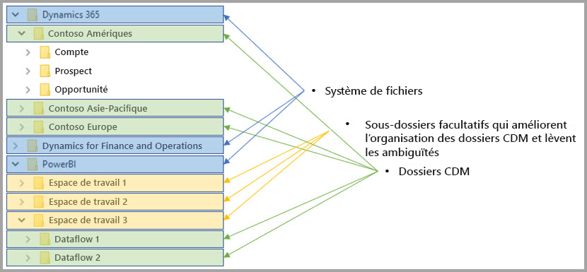

# Flux de données et intégration à Azure Data Lake (préversion)

Par défaut, les données utilisées avec Power BI sont stockées dans le stockage interne offert par Power BI. Avec l’intégration entre les flux de données et Azure Data Lake Storage Gen2 (ADLS Gen2), vous pouvez stocker vos flux de données dans le compte Azure Data Lake Storage Gen2 de votre organisation. 

> [!NOTE]
> La fonctionnalité de flux de données étant en préversion, elle est susceptible de changer et d’être mise à jour avant la disponibilité générale.

## Le rapport entre les dossiers CDM et les flux de données

Avec les **flux de données**, les utilisateurs et les organisations peuvent unifier des données provenant de sources disparates et les préparer pour la modélisation. Le modèle CDM (Common Data Model) permet aux organisations d’utiliser un format de données qui assure une cohérence sémantique entre les applications et les déploiements. Et, avec Azure Data Lake Storage Gen2 (ADLS Gen2), un contrôle précis des accès et des autorisations peut être appliqué à des Data Lakes dans Azure. Ces différents éléments offrent une centralisation et une structuration remarquables des données, un contrôle d’accès précis et une cohérence sémantique pour les applications et les initiatives de l’ensemble de l’entreprise.

Les données stockées au format CDM garantissent la cohérence sémantique des applications et des déploiements de l’organisation. Avec l’intégration entre le format CDM et ADLS Gen2, cette même cohérence structurelle et sémantique est applicable aux données stockées dans ADLS Gen2 à l’aide de dossiers CDM contenant des données schématisées au format CDM standard. Les métadonnées normalisées et les données autodescriptives d’Azure Data Lake facilitent la découverte des métadonnées et l’interopérabilité entre les producteurs et les consommateurs de données, comme Power BI, Azure Data Factory, Azure Data Lake, Databricks et Azure Machine Learning (ML). 

Les flux de données stockent leur définition et leurs données dans des dossiers CDM, aux formats suivants :

**model.json**
* Le fichier de description des métadonnées **model.json** contient des informations sémantiques sur les attributs et les enregistrements d’entités, ainsi que des liens vers les fichiers de données sous-jacents. L’existence du fichier model.json est un signe de conformité avec le format de métadonnées CDM. Ce fichier est susceptible de comporter des entités standard qui englobent des métadonnées sémantiques supplémentaires, riches et prêtes à l’emploi, utilisables par les applications.
* Power BI stocke également des informations sur chacune des sources de données avec **la requête et les transformations** générées par l’expérience de l’éditeur de flux de données dans le service Power BI. Les mots de passe des sources de données ne sont pas stockés dans le fichier model.json.

**Fichiers de données**
* Les fichiers de données, dans le dossier CDM, suivent une structure et un format bien définis (sous-dossiers facultatifs, cf. plus loin dans cet article). Il y est fait référence dans le fichier model.json. Actuellement, ils doivent être au format .csv, mais des formats supplémentaires pourront être pris en charge dans les mises à jour à venir. 

Le diagramme suivant illustre un exemple de dossier CDM, créé par un flux de données Power BI, contenant trois entités :

Le fichier de métadonnées model.json de l’image précédente fournit des pointeurs vers les fichiers de données d’entité dans l’ensemble du dossier CDM.

## Power BI organise les dossiers CDM dans le Data Lake

Avec les flux de données Power BI et leur intégration à ADLS Gen2, Power BI peut produire des données dans un Data Lake. En tant que producteur de données, Power BI doit créer un dossier CDM pour chaque flux de données contenant le fichier model.json et les fichiers de données associées. Power BI stocke ses données séparément des autres producteurs de données du Data Lake à l’aide de *systèmes de fichiers*. Pour plus d’informations sur le système de fichiers Azure Data Lake Storage Gen2 et l’espace de noms hiérarchique, lisez [l’article correspondant](https://docs.microsoft.com/azure/storage/data-lake-storage/namespace).

Power BI utilise des sous-dossiers pour éviter les ambiguïtés et améliorer l’organisation des données présentées dans le **service Power BI**. Le nom et la structure des dossiers représentent des espaces de travail (Dossiers) et des flux de données (Dossiers CDM). Le diagramme suivant illustre la structure possible d’un Data Lake partagé par Power BI et d’autres producteurs de données. Chacun des services (dans ce cas Dynamics 365, Dynamics for Finance and Operation et Power BI) crée et gère son propre système de fichiers. En fonction de l’expérience de chaque service, des sous-dossiers sont créés pour mieux organiser les dossiers CDM dans le système de fichiers. 

## Power BI protège les données dans le Data Lake

Power BI utilise des jetons du *porteur OAuth Active Directory* et la fonctionnalité *ACL POSIX* offerte par Azure Data Lake Storage Gen2. Ces fonctionnalités permettent de définir l’étendue de l’accès de Power BI au système de fichiers qu’il gère dans Data Lake, ainsi que l’étendue de l’accès des utilisateurs aux flux de données seulement ou aux dossiers CDM qu’ils créent. 

Pour créer et gérer les dossiers CDM dans le système de fichiers de Power BI, des autorisations de lecture, d’écriture et d’exécution sont nécessaires sur le fichier système. Chaque flux de données créé dans Power BI est stocké dans son propre dossier CDM ; le propriétaire du flux de données se voit attribuer un accès en lecture seule au dossier CDM et à son contenu. Cette approche protège l’intégrité des données que Power BI génère et offre aux administrateurs la possibilité de savoir quels utilisateurs ont accédé au dossier CDM grâce aux journaux d’audit. 

### Autoriser des utilisateurs ou des services à accéder aux dossiers CDM

Le partage de dossiers CDM avec des consommateurs de données (utilisateurs ou services qui ont besoin de lire les données) est simplifié avec les jetons du porteur OAuth Active Directory et les listes ACL POSIX. Les administrateurs peuvent ainsi savoir qui a accédé au dossier CDM. La seule action nécessaire est d’accorder l’accès au dossier CDM à l’objet Active Directory de votre choix (par exemple, un groupe d’utilisateurs ou un service). Nous vous recommandons d’accorder uniquement des accès en lecture seule au dossier CDM à toutes les identités autres que le producteur de données, afin de protéger l’intégrité des données générées.

Pour pouvoir ajouter un dossier CDM à Power BI, l’utilisateur doit avoir des listes ACL d’accès en *Lecture* au dossier CDM et aux fichiers et dossiers qu’il contient, ainsi que des listes ACL d’accès en *Exécution* au dossier CDM et aux dossiers qu’il contient. Pour plus d’informations, nous recommandons de lire les articles [Listes de contrôle d’accès aux fichiers et aux répertoires](https://docs.microsoft.com/azure/storage/blobs/data-lake-storage-access-control#access-control-lists-on-files-and-directories) et [Meilleures pratiques d’utilisation d’Azure Data Lake Storage Gen2](https://docs.microsoft.com/azure/storage/blobs/data-lake-storage-best-practices).

### Autres formes d’autorisation

Les personnes et les services extérieurs à Power BI peuvent également tirer parti d’autres formes d’autorisation, qui autorisent les détenteurs de la clé à accéder à *toutes* les ressources du compte et du Data Lake, sans possibilité d’étendue aux systèmes de fichiers ou aux dossiers CDM. Si elles constituent des moyens simples d’accorder l’accès, ces solutions limitent la capacité à partager des ressources en particulier dans le Data Lake et ne permettent pas aux utilisateurs de vérifier qui a accédé au stockage. Pour des informations complètes sur les schémas d’autorisation disponibles, voir l’article [Contrôle d’accès dans Azure Data Lake Storage Gen2](https://docs.microsoft.com/azure/storage/blobs/data-lake-storage-access-control
).

## Étapes suivantes

Cet article a brossé une vue d’ensemble de l’intégration des flux de données Power BI, des dossiers CDM et d’Azure Data Lake Storage Gen2. Pour plus d’informations, voir les articles suivants :

Pour plus d’informations sur les flux de données, le format CDM et Azure Data Lake Storage Gen2, voir les articles suivants :

* [Configurer les paramètres de flux de données d’un espace de travail (préversion)](service-dataflows-configure-workspace-storage-settings.md)
* [Ajouter un dossier CDM à Power BI sous forme de flux de données (préversion)](service-dataflows-add-cdm-folder.md)
* [Connecter Azure Data Lake Storage Gen2 pour le stockage de flux de données (préversion)](service-dataflows-connect-azure-data-lake-storage-gen2.md)

Pour plus d’informations sur les flux de données en général, voir les articles suivants :

* [Créer et utiliser des flux de données dans Power BI](service-dataflows-create-use.md)
* [Utilisation d’entités calculées sur Power BI Premium (préversion)](service-dataflows-computed-entities-premium.md)
* [Utilisation de flux de données avec des sources de données locales (préversion)](service-dataflows-on-premises-gateways.md)
* [Ressources du développeur pour les flux de données Power BI (préversion)](service-dataflows-developer-resources.md)

Pour plus d’informations sur le stockage Azure, voir les articles suivants :
* [Guide de sécurité sur le Stockage Azure](https://docs.microsoft.com/azure/storage/common/storage-security-guide)
* [Bien démarrer avec les exemples GitHub d’Azure Data Services](https://aka.ms/cdmadstutorial)

Pour plus d’informations sur le modèle Common Data Model, vous pouvez lire son article de présentation :
* [Vue d’ensemble du modèle CMD (Common Data Model) ](https://docs.microsoft.com/powerapps/common-data-model/overview)
* [Dossiers CDM](https://go.microsoft.com/fwlink/?linkid=2045304)
* [Définition du fichier model CDM](https://go.microsoft.com/fwlink/?linkid=2045521)

Vous pouvez aussi [poser des questions à la Communauté Power BI](http://community.powerbi.com/).
