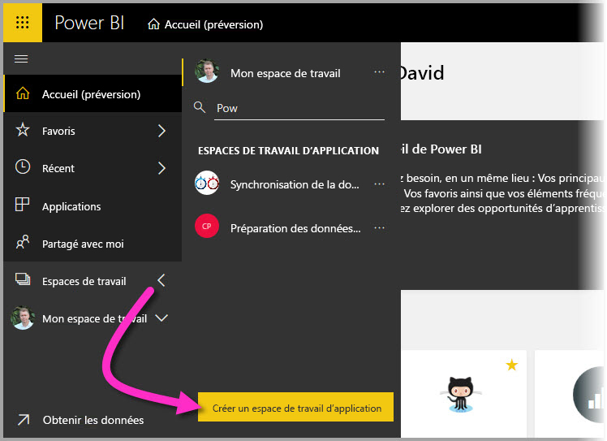

# Configurer les paramètres de flux de données d’un espace de travail (préversion)

Avec Power BI et les flux de données, vous pouvez stocker les fichiers de données et de définition de flux de données d’un espace de travail dans votre compte Azure Data Lake Storage Gen2. Les administrateurs d’espaces de travail peuvent pour cela configurer Power BI, suivant les étapes détaillées dans cet article. 

Pour que vous puissiez configurer l’emplacement de stockage des flux de données d’un espace de travail, l’administrateur général de votre entreprise doit connecter le compte de stockage de votre organisation à Power BI et activer les autorisations d’affectation de stockage sur ce compte de stockage. *[Connecter Azure Data Lake Storage Gen2 pour le stockage de dataflows (préversion)](service-dataflows-connect-azure-data-lake-storage-gen2.md)* 

Il y a deux façons de configurer les paramètres de stockage de flux de données de l’espace de travail : 

* lors de la création de l’espace de travail ;
* en modifiant un espace de travail existant.

Nous allons examiner ces deux possibilités dans les sections suivantes. 

> [!IMPORTANT]
> Le paramètre de stockage de flux de données de l’espace de travail n’est modifiable que si l’espace de travail ne contient pas de flux de données. Par ailleurs, cette fonctionnalité est uniquement disponible dans la nouvelle expérience d’espace de travail. Plus d’informations sur le nouvel espace de travail, voir l’article [Créer les nouveaux espaces de travail (préversion) dans Power BI](service-create-the-new-workspaces.md).

## Créer un espace de travail et configurer son stockage de flux de données

Pour créer un espace de travail dans le service Power BI, sélectionnez **Espaces de travail > Créer un espace de travail**.

Dans la boîte de dialogue Créer un espace de travail, une zone jaune intitulée **Afficher un aperçu des espaces de travail améliorés** peut apparaître. Dans cette zone, sélectionnez **Essayer maintenant**.

Dans la boîte de dialogue qui s’affiche, vous pouvez donner un nom unique à votre nouvel espace de travail. Ne sélectionnez pas **Enregistrer** pour le moment, car des paramètres avancés sont nécessaires.

Ensuite, développez la zone **Avancé** de la boîte de dialogue **Créer un espace de travail** et activez le paramètre **Stockage de dataflows (préversion)** .

Sélectionnez **Enregistrer** pour créer l’espace de travail. Tous les flux de données créés dans cet espace de travail stockeront leur fichier de définition (fichier model.json) et leurs données dans le compte Azure Data Lake Storage Gen2 de votre organisation. 

## Mettre à jour le stockage de flux de données pour un espace de travail existant

Nous avons vu comment créer un espace de travail. Vous pouvez également mettre à jour un espace de travail existant pour stocker le fichier de définition et les données dans le compte Azure Data Lake Storage Gen2 de votre organisation. Gardez à l’esprit que le paramètre de stockage de flux de données n’est modifiable que si l’espace de travail ne contient pas encore de flux de données.

Pour modifier un espace de travail, sélectionnez les points de suspension **(…)** , puis **Modifier l’espace de travail**. 

Dans la fenêtre **Modifier l’espace de travail** qui s’affiche, développez **Avancé**, puis **activez** le paramètre **Stockage de flux de données (préversion)** . 

Ensuite, sélectionnez **Enregistrer** : tous les flux de données créés dans cet espace de travail stockent leur fichier de définition et leurs données dans le compte Azure Data Lake Storage Gen2 de votre organisation.

## Obtenir l’URI de fichiers de flux de données stockés

Après avoir créé un flux de données dans un espace de travail affecté au compte Azure Data Lake de votre organisation, vous pouvez accéder directement à ses fichiers de définition et de données. Leur emplacement est indiqué sur la page **Paramètres de flux de données**. Pour y accéder, suivez les étapes ci-dessous :

Sélectionnez les points de suspension **(…)**  à côté d’un flux de données listé sous **Flux de données** dans l’espace de travail. Dans le menu qui s’affiche, sélectionnez **Paramètres**.

Dans les informations qui s’affichent, l’emplacement du dossier CDM du flux de données apparaît sous **Emplacement de stockage de flux de données**, comme l’illustre l’image suivante.

> [!NOTE]
> Power BI configure le propriétaire des flux de données avec des autorisations de lecture sur le dossier CDM où sont stockés les fichiers de flux de données. Seul le propriétaire du compte de stockage peut accorder l’accès à l’emplacement de stockage de flux de données à d’autres personnes ou services (dans Azure).

## Considérations et limitations

Certaines fonctionnalités de flux de données ne sont pas prises en charge lorsque les flux de données sont stockés dans Azure Data Lake Storage Gen2 : 

Espaces de travail Power BI Pro, Premium et Embedded :
* La fonctionnalité **entités liées** n’est prise en charge qu’entre espaces de travail du même compte de stockage.
* Les autorisations de l’espace de travail ne s’appliquent pas aux flux de données stockés dans Azure Data Lake Storage Gen2 ; seul le propriétaire du flux de données peut y accéder.
* Toutes les autres fonctionnalités de préparation des données sont les mêmes que pour les flux de données stockées dans le stockage Power BI.

Autres considérations à prendre en compte :

* Une fois l’emplacement de stockage de flux de données configuré, il n’est pas modifiable.
* Seul le propriétaire d’un flux de données stocké dans Azure Data Lake Storage Gen2 peut accéder à ses données.
* Les sources de données locales, dans les capacités partagées de Power BI, ne sont pas prises en charge dans les flux de données stockés dans le compte Azure Data Lake Storage Gen2 de votre organisation.

Les clients **Power BI Desktop** n’ont pas accès aux flux de données stockés dans un compte Azure Data Lake Storage Gen2, sauf s’ils sont propriétaires du flux de données. Prenons la situation suivante :

1.  Anna crée un espace de travail et le configure de façon à stocker les dataflows dans le lac de données de l’organisation.
2.  Ben, qui est également membre de l’espace de travail créé par Anna, veut utiliser Power BI Desktop et le connecteur de flux de données pour obtenir des données à partir du flux de données créé par Anna.
3.  Ben reçoit une erreur, car il n’a pas été autorisé à accéder au dossier CDM du flux de données dans le Data Lake.

    

## Étapes suivantes

Cet article aide à configurer le stockage d’espace de travail pour les flux de données. Pour plus d’informations, voir les articles suivants :

Pour plus d’informations sur les flux de données, le format CDM et Azure Data Lake Storage Gen2, voir les articles suivants :

* [Flux de données et intégration à Azure Data Lake (préversion)](service-dataflows-azure-data-lake-integration.md)
* [Ajouter un dossier CDM à Power BI sous forme de flux de données (préversion)](service-dataflows-add-cdm-folder.md)
* [Connecter Azure Data Lake Storage Gen2 pour le stockage de flux de données (préversion)](service-dataflows-connect-azure-data-lake-storage-gen2.md)

Pour plus d’informations sur les flux de données en général, voir les articles suivants :

* [Créer et utiliser des flux de données dans Power BI](service-dataflows-create-use.md)
* [Utilisation d’entités calculées sur Power BI Premium (préversion)](service-dataflows-computed-entities-premium.md)
* [Utilisation de flux de données avec des sources de données locales (préversion)](service-dataflows-on-premises-gateways.md)
* [Ressources du développeur pour les flux de données Power BI (préversion)](service-dataflows-developer-resources.md)

Pour plus d’informations sur le stockage Azure, voir les articles suivants :

* [Guide de sécurité sur le Stockage Azure](https://docs.microsoft.com/azure/storage/common/storage-security-guide)
* [Bien démarrer avec les exemples GitHub d’Azure Data Services](https://aka.ms/cdmadstutorial)

Pour plus d’informations sur le modèle Common Data Model, vous pouvez lire son article de présentation :

* [Vue d’ensemble du modèle CMD (Common Data Model) ](https://docs.microsoft.com/powerapps/common-data-model/overview)
* [Dossiers CDM](https://go.microsoft.com/fwlink/?linkid=2045304)
* [Définition du fichier model CDM](https://go.microsoft.com/fwlink/?linkid=2045521)

Vous pouvez aussi [poser des questions à la Communauté Power BI](https://community.powerbi.com/).
