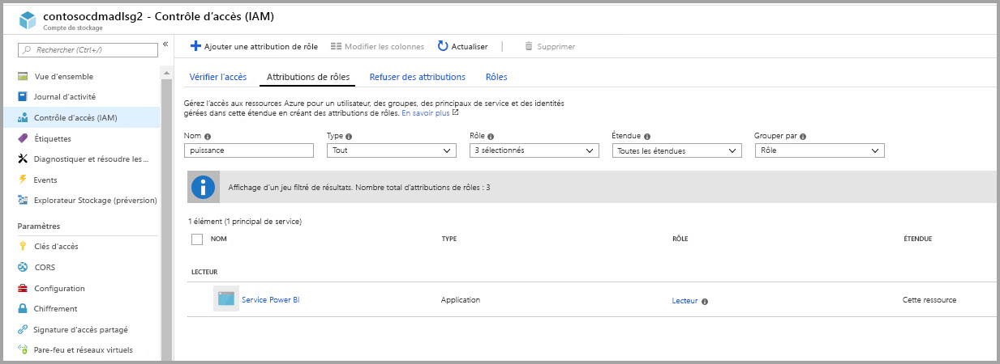
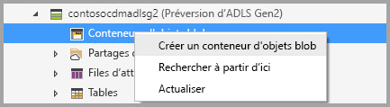
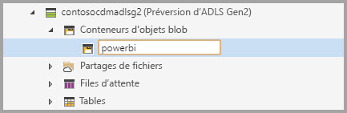
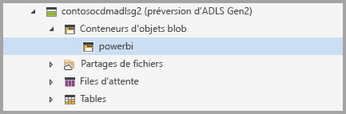
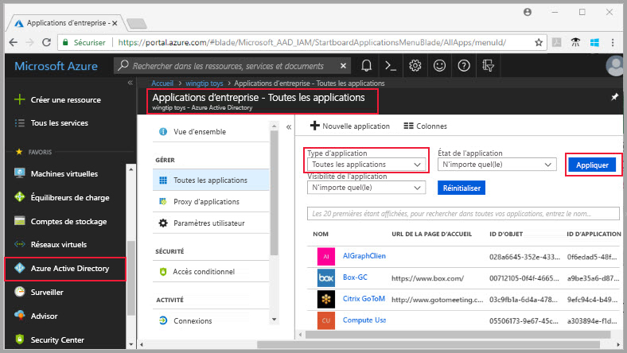
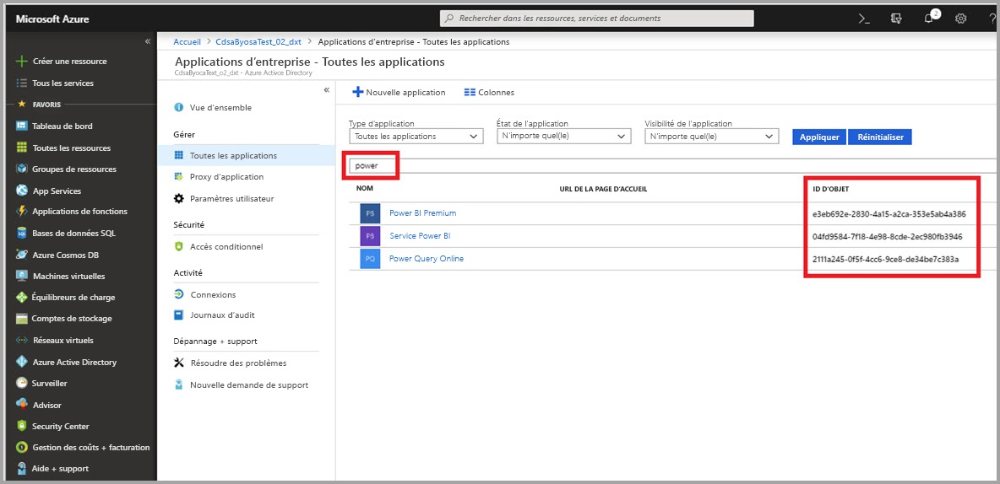
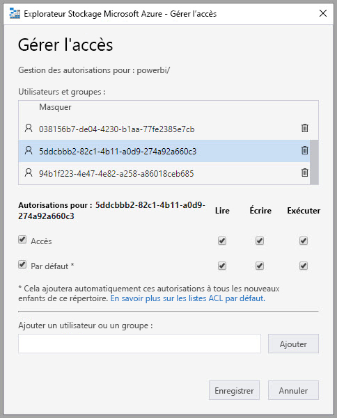
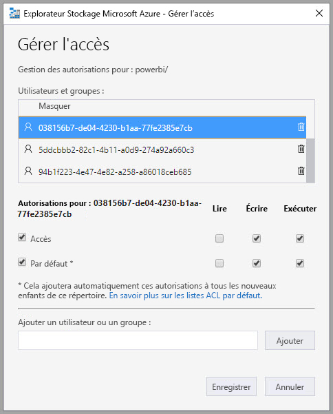
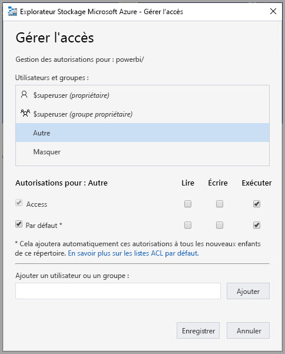
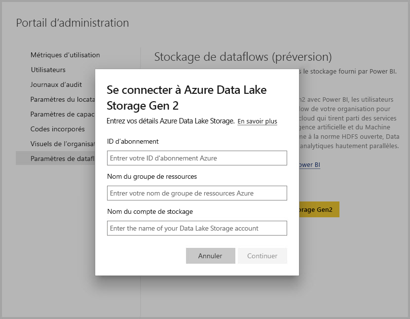

# Connecter Azure Data Lake Storage Gen2 pour le stockage de flux de données (préversion)

Vous pouvez configurer des espaces de travail Power BI pour stocker des flux de données dans le compte Azure Data Lake Storage Gen2 de votre organisation. Cet article décrit les étapes générales nécessaires pour ce faire et fournit des conseils et meilleures pratiques tout au long du processus. Il existe quelques avantages à la configuration des espaces de travail pour stocker les définitions de flux de données et les fichiers de données dans votre Data Lake, notamment :

* Azure Data Lake Storage Gen2 fournit un support de stockage des données extrêmement scalable
* Les fichiers de définition et les données de flux de données peuvent être exploités par les développeurs de votre service informatique pour tirer parti d’Azure Data et des services d’intelligence artificielle (AI) comme illustré dans les [exemples GitHub d’Azure Data Services](https://aka.ms/cdmadstutorial)
* Permet aux développeurs de votre organisation d’intégrer les données de flux de données dans les applications internes et les solutions métier, à l’aide des ressources de développeur pour les flux de données et Azure

Pour utiliser Azure Data Lake Storage Gen2 pour les flux de données, vous avez besoin des éléments suivants :

* **Locataire Power BI** : au moins un compte de votre locataire Azure Active Directory (AAD) doit avoir souscrit à Power BI
* **Un compte d’administrateur général** : ce compte est nécessaire pour la connexion et la configuration de Power BI afin de stocker la définition de flux de données, et les données, dans votre compte Azure Data Lake Storage Gen2
* **Un abonnement Azure** : vous avez besoin d’un abonnement Azure pour utiliser Azure Data Lake Storage Gen2
* **Groupe de ressources** : utilisez un groupe de ressources que vous possédez déjà ou créez-en un
* **Un compte de stockage Azure avec la fonctionnalité Data Lake Storage Gen2 activée** 

> [!TIP]
> Si vous n’avez pas d’abonnement Azure, créez un [compte gratuit](https://azure.microsoft.com/free/) avant de commencer.

> [!WARNING]
> Une fois l’emplacement de stockage de flux de données configuré, il n’est pas modifiable. Consultez la section [considérations et limitations](#considerations-and-limitations) près de la fin de cet article pour connaître les autres éléments importants à prendre en compte.

## Préparation de votre Azure Data Lake Storage Gen2 pour Power BI

Avant de pouvoir configurer Power BI avec un compte Azure Data Lake Storage Gen2, vous devez créer et configurer un compte de stockage. Jetons un œil à la configuration requise pour Power BI :

1. Le compte de stockage doit être créé dans le même locataire AAD que votre locataire Power BI.
2. Le compte de stockage doit être créé dans la même région que votre locataire Power BI. Pour savoir où se trouve votre locataire Power BI, consultez [Où est situé mon locataire Power BI ?](service-admin-where-is-my-tenant-located.md).
3. Le compte de stockage doit avoir la fonctionnalité *Espace de noms hiérarchique* activée.
4. Le service Power BI doit avoir le rôle *Lecteur* sur le compte de stockage.
5. Un système de fichiers nommé **powerbi** doit être créé.
6. Les services Power BI doivent être autorisés dans le système de fichiers **powerbi** que vous créez.

Les sections suivantes vous guident à travers les étapes nécessaires à la configuration de votre compte Azure Data Lake Storage Gen2.

### Créer le compte de stockage

Suivez les étapes de l’article [Créer un compte de stockage Azure Data Lake Storage Gen2](https://docs.microsoft.com/azure/storage/blobs/data-lake-storage-quickstart-create-account).

1. Assurez-vous de sélectionner le même emplacement que celui de votre locataire Power BI et définissez votre stockage en tant que **StorageV2 (usage général v2)**
2. Veillez à activer la fonctionnalité d’espace de noms hiérarchique
3. Il est recommandé de définir le paramètre de réplication **Stockage géoredondant avec accès en lecture (RA-GRS)**

### Accorder le rôle Lecteur au service Power BI

Ensuite, vous devez accorder au service Power BI un rôle Lecteur dans votre compte de stockage créé. Il s’agit d’un rôle intégré, par conséquent, les étapes sont simples. 

Suivez les étapes indiquées dans [Affecter un rôle RBAC intégré](https://docs.microsoft.com/azure/storage/common/storage-auth-aad-rbac#assign-a-built-in-rbac-role).

Dans la fenêtre **Ajouter une attribution de rôle**, sélectionnez le rôle **Lecteur** à attribuer au service Power BI. Puis, utilisez Rechercher pour localiser **Service Power BI**. L’illustration suivante montre le rôle **Lecteur** attribué au service Power BI.

> [!NOTE]
> Accordez au moins 30 minutes pour que l’autorisation se propage à Power BI à partir du portail. Chaque fois que vous modifiez des autorisations dans le portail, prévoyez 30 minutes pour que ces autorisations soient reflétées dans Power BI. 

### Créer un système de fichiers pour Power BI

Vous devez créer un système de fichiers nommé *powerbi* avant de pouvoir ajouter votre compte de stockage à Power BI. Il existe de nombreuses façons de créer le système de fichiers, y compris à l’aide d’Azure Databricks, HDInsight, AZCopy ou Explorateur Stockage Azure. Cette section vous montre un moyen simple de créer un système de fichiers à l’aide de l’Explorateur Stockage Azure.

Cette étape nécessite que vous installiez l’Explorateur Stockage Azure version 1.6.2 ou version ultérieure. Pour installer l’Explorateur Stockage Azure pour Windows, Macintosh ou Linux, consultez [Explorateur Stockage Azure](https://azure.microsoft.com/features/storage-explorer/).

1. Une fois que vous avez installé l’Explorateur Stockage Azure, lors du premier lancement, la fenêtre Explorateur Stockage Microsoft Azure - Connexion s’affiche. Bien que l’Explorateur Stockage offre plusieurs façons de se connecter à des comptes de stockage, une seule méthode est actuellement prise en charge pour la configuration requise. 

2. Dans le volet de gauche, recherchez et développez le compte de stockage que vous avez créé précédemment.

3. Cliquez avec le bouton droit sur Conteneurs Blob puis, dans le menu contextuel, sélectionnez Créer un conteneur Blob.

   

4. Une zone de texte s’affiche sous le dossier Conteneurs Blob. Entrez le nom *powerbi* 

   

5. Appuyez sur Entrée lorsque vous avez terminé pour créer le conteneur Blob

   

Dans la section suivante, vous accordez à la famille de services Power BI l’accès complet au système de fichiers que vous avez créé. 

### Accorder à Power BI des autorisations sur le système de fichiers

Pour accorder des autorisations sur le système de fichiers, vous appliquez des paramètres Liste de contrôle d’accès (ACL) qui accordent l’accès au service Power BI. La première étape consiste à obtenir l’identité des services Power BI dans votre locataire. Vous pouvez afficher vos applications Azure Active Directory (AAD) dans la section **Applications d’entreprise** du portail Azure.

Pour rechercher des applications de votre locataire, procédez comme suit :

1. Dans le [portail Azure](https://portal.azure.com/), sélectionnez **Azure Active Directory** dans le volet de navigation de gauche.
2. Dans le panneau Azure **Active Directory**, sélectionnez **Applications d’entreprise**.
3. Dans le menu déroulant **Type d’application**, sélectionnez **Toutes les applications** , puis sélectionnez **Appliquer**. Un échantillon des applications de votre locataire s’affiche, similaire à l’image suivante.

    

4. Dans la barre de recherche, tapez *Power* et une collection d’ID d’objet pour les applications Power BI et Power Query s’affiche. Vous aurez besoin des trois valeurs dans les étapes suivantes.  

    

5. Sélectionnez et copiez les ID d’objet du service Power BI et de Power Query en ligne à partir des résultats de votre recherche. Soyez prêt à coller ces valeurs dans les étapes suivantes.

7. Ensuite, utilisez **Explorateur Stockage Azure** pour accéder au système de fichiers *powerbi* que vous avez créé dans la section précédente. Suivez les instructions de la section [Gestion de l’accès](https://docs.microsoft.com/azure/storage/blobs/data-lake-storage-how-to-set-permissions-storage-explorer#managing-access) de l’article [Définir des autorisations au niveau du fichier et du répertoire à l’aide de l’Explorateur Stockage Azure](https://docs.microsoft.com/azure/storage/blobs/data-lake-storage-how-to-set-permissions-storage-explorer).

8. Pour chacun des deux ID d’objet Power BI collectés à l’étape 5, attribuez l’accès **Lecture**, **Écriture**, **Exécuter** et les ACL par défaut à votre système de fichiers *powerbi*.

   

9. Pour l’ID d’objet Power Query Online collecté à l’étape 4, attribuez les accès **Écriture**, **Exécuter** et les ACL par défaut à votre système de fichiers *powerbi*.

   

10. En outre, pour **Autre**, attribuez l’accès **Exécuter** et les ACL par défaut.

    

## Connexion de votre Azure Data Lake Storage Gen2 à Power BI

Une fois que vous avez configuré votre compte Azure Data Lake Storage Gen2 dans le portail Azure, vous le connectez à Power BI dans le **Portail d’administration Power BI**. Vous gérez également le stockage de flux de données Power BI dans la section des paramètres **Stockage de flux de données** du portail d’administration de Power BI. Pour obtenir des conseils sur le lancement et l’utilisation de base, consultez [Guide pratique pour accéder au portail d’administration](service-admin-portal.md).

Vous connectez votre compte **Azure Data Lake Storage Gen2** en procédant comme suit :

1. Accédez à l’onglet **Paramètres du flux de données** du **Portail d’administration de Power BI**

     

2. Sélectionnez le bouton **Connecter votre Azure Data Lake Storage Gen2**. La fenêtre suivante s’affiche.

     

3. Fournissez **l’ID d’abonnement** du compte de stockage.
4. Fournissez le **nom du groupe de ressources** dans lequel le compte de stockage a été créé.
5. Fournissez le **nom du compte de stockage**.
6. Sélectionnez **Se connecter**.

Une fois ces étapes terminées, votre compte Azure Data Lake Storage Gen2 est connecté à Power BI. 

> [!NOTE]
> Pour configurer une connexion à Azure Data Lake Storage Gen2 dans le portail d’administration Power BI, vous devez avoir les autorisations d’administrateur général. Toutefois, les administrateurs généraux ne peuvent pas connecter un stockage externe dans le portail d’administration.  

Ensuite, vous devez permettre aux personnes de votre organisation de configurer leurs espaces de travail, ce qui leur permet d’utiliser ce compte de stockage pour le stockage des données et de la définition de flux de données. Nous allons le faire dans la section suivante. 

## Autoriser les administrateurs à attribuer des espaces de travail

Par défaut, les fichiers de données et de la définition de flux de données sont stockés dans le stockage fourni par Power BI. Pour accéder aux fichiers de flux de données dans votre propre compte de stockage, les administrateurs de l’espace de travail doivent tout d’abord configurer l’espace de travail pour autoriser l’affectation et le stockage de flux de données dans le nouveau compte de stockage. Avant que l’administrateur d’un espace de travail puisse configurer les paramètres de stockage de flux de données, l’administrateur doit disposer d’autorisations d’attribution de stockage dans le **portail d’administration Power BI**.

Pour accorder des autorisations d’attribution de stockage, accédez à l’onglet **Paramètres de flux de données** dans le **portail d’administration Power BI**. Il existe un bouton radio pour *Autoriser les administrateurs d'espace de travail à attribuer des espaces de travail à ce compte de stockage* qui doit être défini sur **Autoriser**. Une fois ce curseur activé, sélectionnez le bouton **Appliquer** pour que la modification prenne effet. 

 

Voilà. Les administrateurs d’espace de travail Power BI peuvent désormais attribuer des flux de travail au système de fichiers que vous avez créé.

## Considérations et limitations

Il s’agit d’une fonctionnalité en préversion, et son comportement peut changer lors de sa mise en production. Voici quelques considérations et limitations à prendre en compte lorsque vous utilisez votre stockage de flux de données :

* Une fois qu’un emplacement de stockage de flux de données est configuré, il ne peut pas être modifié.
* Seuls les propriétaires d’un flux de données stocké dans le stockage Azure Data Lake Storage Gen2 peuvent accéder à ses données par défaut. Pour autoriser d’autres personnes à accéder au flux de données stocké dans Azure, vous devez les ajouter au dossier CDM du flux de données 
* La création de flux de données avec des entités liées est uniquement possible lorsqu’elles sont stockées dans le même compte de stockage
* Les sources de données locales, dans les capacités Power BI partagées, ne sont pas prises en charge dans le flux de données stocké dans le Data Lake de votre organisation
* Les captures instantanées ne sont pas supprimées automatiquement sur ADLS Gen 2. Si vous souhaitez libérer de l’espace, vous pouvez créer une fonction Azure pour nettoyer périodiquement les anciennes captures instantanées.

Il existe également quelques problèmes connus, comme décrit dans cette section.

Les clients de Power BI Desktop ne peuvent pas accéder aux flux de données stockés dans un **compte de stockage Azure Data Lake Storage** , sauf s’ils propriétaires du flux de données ou ont été autorisés dans le dossier CDM dans le Data Lake. Le scénario est le suivant :

1. Anna a créé un nouvel espace de travail d’application et l’a configuré pour stocker les flux de données dans Data Lake de l’organisation. 
2. Ben, qui est également membre de l’espace de travail créé par Anna, aimerait tirer parti de Power BI Desktop et du connecteur de flux de données pour obtenir des données à partir du flux de données créé par Anna.
3. Ben reçoit une erreur similaire, car il n’a pas été autorisé à accéder au dossier CDM du flux de données dans le Data Lake.

Questions et réponses courantes :

**Question :** Que se passe-t-il si j’avais précédemment créé des flux de données dans un espace de travail et que je souhaite modifier leur emplacement de stockage ?

**Réponse :** Vous ne pouvez pas modifier l’emplacement de stockage d’un flux de données après sa création. 

**Question :** Quand puis-je modifier l’emplacement de stockage de flux de données d’un espace de travail ?

**Réponse :** La modification de l’emplacement de stockage de flux de données d’un espace de travail est uniquement autorisée si l’espace de travail ne contient aucun flux de données.

## Étapes suivantes

Cet article fournit des conseils sur la façon de se connecter à un Azure Data Lake Gen2 pour le stockage de flux de données. Pour plus d’informations, consultez les articles suivants :

Pour plus d’informations sur les flux de données, le format CDM et Azure Data Lake Storage Gen2, voir les articles suivants :

* [Flux de données et intégration à Azure Data Lake (préversion)](service-dataflows-azure-data-lake-integration.md)
* [Configurer les paramètres de flux de données d’espace de travail (préversion)](service-dataflows-configure-workspace-storage-settings.md)
* [Ajouter un dossier CDM à Power BI comme en tant que flux de données (préversion)](service-dataflows-add-cdm-folder.md)

Pour plus d’informations générales sur les flux de données, consultez les articles suivants :

* [Créer et utiliser des flux de données dans Power BI](service-dataflows-create-use.md)
* [Utilisation d’entités calculées sur Power BI Premium](service-dataflows-computed-entities-premium.md)
* [Utilisation de flux de données avec des sources de données locales](service-dataflows-on-premises-gateways.md)
* [Ressources du développeur pour les flux de données Power BI](service-dataflows-developer-resources.md)

Pour plus d’informations sur le stockage Azure, voir les articles suivants :
* [Guide de sécurité sur le Stockage Azure](https://docs.microsoft.com/azure/storage/common/storage-security-guide)

Pour plus d’informations sur le modèle Common Data Model, vous pouvez lire son article de présentation :
* [Vue d’ensemble du modèle CMD (Common Data Model) ](https://docs.microsoft.com/powerapps/common-data-model/overview)
* [Dossiers CDM](https://go.microsoft.com/fwlink/?linkid=2045304)
* [Définition du fichier model CDM](https://go.microsoft.com/fwlink/?linkid=2045521)

Vous pouvez aussi [poser des questions à la Communauté Power BI](http://community.powerbi.com/).
