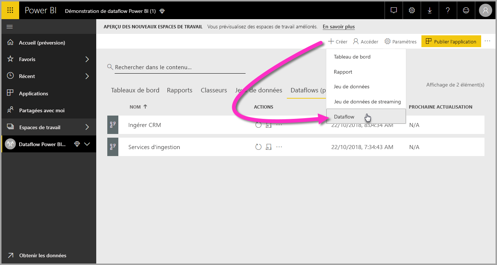

# Création et utilisation de flux de données dans Power BI

Avec la préparation des données avancée disponible dans **Power BI**, vous pouvez créer une collection de données appelée flux de données, que vous pouvez ensuite utiliser pour vous connecter avec des données métier à partir de diverses sources, pour nettoyer les données, pour les transformer, puis pour les charger dans le stockage Power BI.

Un **dataflow** est une collection d’*entités* (les entités sont similaires aux tables) créées et gérées dans des espaces de travail du service Power BI. Vous pouvez ajouter et modifier des entités dans votre flux de données, ainsi que gérer des planifications d’actualisation des données, directement à partir de l’espace de travail dans lequel votre flux de données a été créé.

Une fois que vous avez créé un flux de données, vous pouvez utiliser **Power BI Desktop** et le **service Power BI** pour créer des jeux de données, des rapports, des tableaux de bord et des applications basés sur les données entrées dans les flux de données Power BI Desktop, ce qui vous permet d’avoir des informations sur vos activités métier.

L’utilisation d’un flux de données comporte trois étapes principales :

1. Créer le flux de données à l’aide d’outils Microsoft conçus pour que cela soit simple
2. Planifier la fréquence d’actualisation des données que vous souhaitez importer dans votre flux de données
3. Créer le jeu de données à l’aide de votre flux de données, avec Power BI Desktop 

Dans les sections suivantes, nous examinons chacune de ces étapes et nous familiarisons avec les outils fournis pour effectuer chaque étape. Nous pouvons commencer.

## Création d’un flux de données
Pour créer un dataflow, lancez le service Power BI dans un navigateur, puis sélectionnez un **espace de travail** (les dataflows ne sont pas disponibles dans la section *Mon espace de travail* du service Power BI) à partir du volet de navigation sur la gauche, comme le montre l’écran suivant. Vous pouvez également créer un espace de travail dans lequel créer votre nouveau flux de données. 

Une fois que vous êtes dans une zone d’**espace de travail** où vous pouvez créer un dataflow, le bouton **+ Créer** s’affiche dans le coin supérieur droit du canevas. Sélectionnez le bouton **+ Créer**, puis sélectionnez **Flux de données** dans la liste déroulante. 

Il est important de savoir que chaque flux de données n’a qu’*un seul propriétaire*, à savoir la personne qui le crée. Seul le propriétaire peut modifier le flux de données. Tous les membres de l’**espace de travail** qui ont des autorisations de lecture ou d’écriture pour l’espace de travail où le dataflow a été créé peuvent se connecter au dataflow à partir de **Power BI Desktop**, comme cela est décrit plus loin dans cette article.

À partir de là, vous ajoutez des **entités**, que nous décrivons plus en détail dans la section suivante.

### Ajouter des entités

Une **entité** est un ensemble de champs utilisés pour stocker des données, à l’instar d’une table dans une base de données. Dans l’image suivante, vous voyez la sélection de sources de données à partir desquelles vous pouvez ingérer des données dans Power BI.

Lorsque vous sélectionnez une source de données, vous êtes invité à fournir les paramètres de connexion, y compris le compte à utiliser lors de la connexion à la source de données, comme le montre l’illustration suivante.

Une fois connecté, vous pouvez sélectionner les données à utiliser pour votre entité. Lorsque vous choisissez des données et une source, Power BI se reconnecte par la suite à la source de données afin de garder les données de votre flux de données actualisées, à la fréquence que vous sélectionnerez plus loin dans le processus d’installation.

Une fois que vous sélectionnez les données à utiliser dans l’entité, vous pouvez utiliser l’éditeur de flux de données pour former ou transformer ces données dans le format nécessaire pour une utilisation dans votre flux de données.

### Utilisation de l’éditeur de flux de données

Une fois que vous sélectionnez les données de votre source à utiliser pour votre entité, vous pouvez former votre sélection de données de la manière qui convient le mieux à votre entité, à l’aide de l’expérience d’édition Power Query, qui est similaire à l’**éditeur Power Query** dans  **Power BI Desktop**. Pour en savoir plus sur Power Query (Power Query est intégré dans Power BI Desktop en tant qu’éditeur Power Query) lisez l’[article de présentation de Query](desktop-query-overview.md) pour Power BI Desktop. 

Si vous voulez voir le code généré par l’Éditeur de requête à chaque étape ou créer votre propre code de mise en forme, vous pouvez utiliser l’ **Éditeur avancé**. 

### Flux de données et Common Data Model (CDM)

Les entités de flux de données incluent de nouveaux outils qui permettent de mapper facilement vos données métier avec le Common Data Model (schéma standardisé de Microsoft), de les enrichir avec des données Microsoft et des données tierces et d’obtenir un accès simplifié au machine Learning. Ces nouvelles fonctionnalités peuvent être exploitées pour fournir des informations intelligentes et exploitables sur les données de votre entreprise. Une fois que vous avez terminé toutes les transformations à l’étape de modification des requêtes, vous pouvez mapper des colonnes de vos tables de sources de données vers des champs d’entité standard tels qu’ils sont définis par le modèle Common Data Model. Les entités standard ont un schéma connu défini par le modèle Common Data Model.

Vous trouverez plus d’informations sur cette approche, ainsi que sur le modèle Common Data Model, dans l’article [Common Data Model, qu’est-ce que c’est](https://docs.microsoft.com/powerapps/common-data-model/overview).

Pour tirer parti du modèle Common Data Model avec votre flux de données, cliquez sur la transformation **Mapper vers standard** dans la boîte de dialogue **Modifier les requêtes**. Dans l’écran **Mapper des entités** qui s’affiche, vous pouvez sélectionner l’entité standard vers laquelle vous souhaitez mapper.

Lorsque vous mappez une colonne source à un champ standard, les événements suivants se produisent :

1. La colonne source prend le nom du champ standard (la colonne est renommée si les noms sont différents)
2. Les données de la colonne des sources sont de type standard

Pour conserver l’entité standard du modèle Common Data Model, tous les champs standard qui ne sont pas mappés obtiennent des valeurs *Null*.

Toutes les colonnes sources qui ne sont pas mappés restent comme telles pour garantir que le résultat du mappage est une entité standard avec des champs personnalisés.

Une fois que vous avez terminé vos sélections et que votre entité et ses paramètres de données sont prêts à être enregistrés, vous pouvez sélectionner **Enregistrer** dans le menu. Notez que vous pouvez créer plusieurs entités en sélectionnant le bouton **Ajouter des entités**, et que vous pouvez modifier des entités pour affiner les requêtes et les entités que vous avez créées.

Lorsque vous sélectionnez **Enregistrer**, vous êtes invité à nommer votre flux de données et à fournir une description.

Lorsque vous êtes prêt et que vous sélectionnez le bouton **Enregistrer**, une fenêtre qui vous permet de savoir que votre **flux de données** a été créé s’affiche. 

Génial, vous êtes maintenant prêt pour l’étape suivante, qui planifie la fréquence d’actualisation de vos sources de données.

## Planifier la fréquence d’actualisation

Une fois que votre flux de données a été enregistré, vous souhaitez planifier la fréquence d’actualisation pour chacune de vos sources de données connectées.

Le processus d’actualisation des données permet aux flux de données Power BI de maintenir vos données à jour. Dans le **service Power BI**, dans la section **espace de travail**, il y a une collection de zones où vos informations, notamment les dataflows, peuvent être listées, comme le montre l’illustration suivante.

L’entrée *flux de données Dynamics* dans l’image précédente est le flux de données que nous avons créé dans la section précédente. Pour planifier l’actualisation, sélectionnez l’icône **Planifier l’actualisation** dans la section **Actions**, comme le montre l’illustration suivante. 

Lorsque vous sélectionnez l’icône **Planifier l’actualisation**, vous êtes redirigé vers le volet **Planifier l’actualisation**, ce qui vous permet de définir la fréquence et l’heure d’actualisation du flux de données.

Pour plus d’informations sur la planification de l’actualisation, consultez l’article sur la [configuration de l’actualisation planifiée](refresh-scheduled-refresh.md), qui décrit le comportement d’actualisation des jeux de données Power BI. Les flux de données ont le même comportement que les jeux de données Power BI en termes de paramètres d’actualisation. 

## Vous connecter à votre flux de données dans Power BI Desktop

Une fois que vous avez créé votre flux de données et que vous avez planifié la fréquence d’actualisation pour chaque source de données qui remplira le modèle, vous êtes prêt pour la troisième et dernière étape, qui est la connexion à votre flux de données depuis **Power BI Desktop**. 

Pour vous connecter aux flux de données, dans Power BI Desktop, sélectionnez **Obtenir des données > Power BI > Flux de données Power BI (bêta)** comme le montre l’illustration ci-dessous.

À partir de là, accédez à l’**espace de travail** où vous avez enregistré votre dataflow, sélectionnez le dataflow, puis sélectionnez les entités que vous avez créées à partir de la liste.

Vous pouvez également utiliser la **barre de recherche** près du haut de la fenêtre pour trouver rapidement le nom de votre flux de données ou de vos entités parmi de nombreuses entités de flux de données.

Lorsque vous sélectionnez l’entité, puis le bouton **Charger**, les entités s’affichent dans le volet **Champs** dans **Power BI Desktop**. Elles s’affichent et se comportent comme des **tables** de n’importe quel autre jeu de données.

## Utiliser des flux de données stockés dans Azure Data Lake Storage Gen2

Certaines organisations souhaitent utiliser leur propre stockage pour la création et la gestion des flux de données. Vous pouvez intégrer des flux de données avec Azure Data Lake Storage Gen2, si vous suivez les spécifications et gérez correctement les autorisations. La documentation de la configuration requise pour cette approche commence par le document de vue d’ensemble, [Flux de données et intégration à Azure Data Lake (préversion)](service-dataflows-azure-data-lake-integration.md).

## Résolution des problèmes liés à la connexion de données

La connexion à des sources de données pour des flux de données peut poser des problèmes. Cette section fournit des conseils de dépannage pour y remédier. 

* **Connecteur Salesforce** : l’utilisation d’un compte d’évaluation pour Salesforce avec des flux de données entraîne un échec de connexion sans qu’aucune information ne soit fournie. Pour résoudre ce problème, utilisez un compte Salesforce de production ou un compte de développeur pour les tests.

* **Connecteur SharePoint** : veillez à fournir l’adresse de la racine du site SharePoint, sans sous-dossiers ni documents. L’URL peut par exemple ressembler à ce qui suit : https://microsoft.sharepoint.com/teams/ObjectModel/ 

* **Connecteur de fichier JSON** : actuellement, vous pouvez vous connecter à un fichier JSON à l’aide de l’authentification de base uniquement.  La connexion à un fichier JSON en fournissant les informations d’identification dans l’URL (par exemple, https://XXXXX.blob.core.windows.net/path/file.json?sv=2019-01-01&si=something&sr=c&sig=123456abcdefg...) n’est **pas** prise en charge.  

* **Azure SQL Data Warehouse** : les flux de données ne prennent pas en charge l’authentification Azure Active Directory (AAD) pour Azure SQL Data Warehouse. Utilisez l’authentification de base pour ce scénario.

## Étapes suivantes

Cet article décrit comment vous pouvez créer votre propre **flux de données** et créer un rapport dans **Power BI Desktop** pour en tirer parti. Les articles suivants sont utiles pour accéder à des informations et à des scénarios supplémentaires lors de l’utilisation de flux de données :

* [Préparation des données en libre-service avec des flux de données](service-dataflows-overview.md)
* [Utilisation d’entités calculées sur Power BI Premium](service-dataflows-computed-entities-premium.md)
* [Utilisation de flux de données avec des sources de données locales](service-dataflows-on-premises-gateways.md)
* [Ressources du développeur pour les flux de données Power BI](service-dataflows-developer-resources.md)
* [Flux de données et intégration à Azure Data Lake (préversion)](service-dataflows-azure-data-lake-integration.md)

Pour plus d’informations sur le modèle Common Data Model, vous pouvez lire son article de présentation :
* [Vue d’ensemble du modèle CMD (Common Data Model) ](https://docs.microsoft.com/powerapps/common-data-model/overview)
* [En savoir plus sur le schéma du modèle Common Data Model et sur les entités sur GitHub](https://github.com/Microsoft/CDM)

Articles de Power BI Desktop connexes :

* [Se connecter à des jeux de données dans le service Power BI à partir de Power BI Desktop](desktop-report-lifecycle-datasets.md)
* [Présentation des requêtes dans Power BI Desktop](desktop-query-overview.md)

Articles connexes du service Power BI Desktop :
* [Configuration d’une actualisation planifiée](refresh-scheduled-refresh.md)
