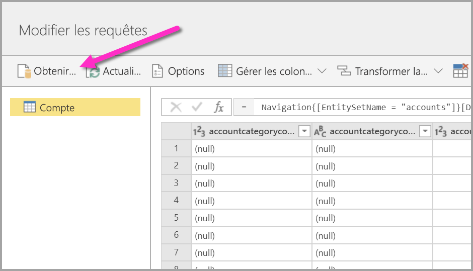
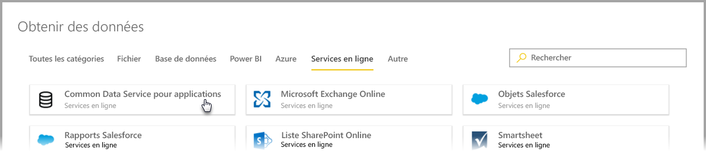
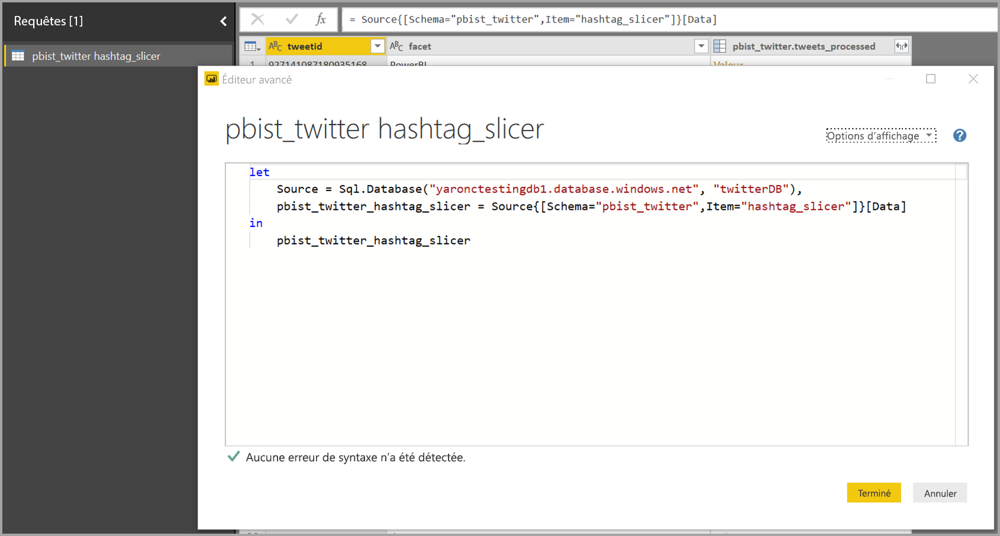

# Se connecter à des sources de données pour les dataflows Power BI (préversion)

Avec les dataflows Power BI, vous pouvez vous connecter à différentes sources de données pour créer de nouveaux dataflows ou ajouter de nouvelles entités à un dataflow existant.

Cet article liste les nombreuses sources de données disponibles pour créer ou compléter des dataflows, puis explique comment créer ces dataflows à l’aide de ces sources de données.

Pour une vue d’ensemble de la création et de l’utilisation de dataflows, consultez [Création et utilisation de dataflows dans Power BI (préversion)](service-dataflows-create-use.md).

## Créer un dataflow à partir d’une source de données

Pour se connecter à des données, à partir du **service Power BI**, sélectionnez l’élément de menu **+ Créer**, puis sélectionnez **dataflow** dans le menu qui s’affiche. Cette sélection faite, l’image suivante apparaît dans la zone de dessin du service Power BI. 

Si votre dataflow existe déjà, vous pouvez y ajouter de nouvelles entités en sélectionnant **Ajouter des entités**, comme indiqué ci-dessous, ou en sélectionnant **Obtenir des données** dans l’outil de création de dataflows.

L’image suivante illustre le bouton **Obtenir des données** de l’outil de création de dataflows. 

## Sources de données des dataflows

Vous pouvez afficher les sources de données disponibles en sélectionnant **Obtenir des données** depuis l’outil de création de dataflows, qui affiche alors une boîte de dialogue permettant de sélectionner les catégories et chaque source de données, comme l’illustre l’image suivante.

Les sources de données des dataflows sont organisées dans les catégories suivantes, lesquelles apparaissent dans la partie supérieure de la boîte de dialogue **Obtenir des données** :

* Toutes les catégories
* Fichier
* Base de données
* Power BI
* Azure
* Online Services
* Autre

La catégorie **Toutes les catégories** contient toutes les sources de données, de toutes les catégories. 

La catégorie **Fichier** comprend les connexions de données disponibles suivantes pour les dataflows :

* Accès
* Excel
* JSON
* Texte/CSV
* XML

La catégorie **Base de données** comprend les connexions de données disponibles suivantes pour les dataflows :

* Base de données IBM DB2
* Base de données MySQL
* Base de données Oracle
* Base de données PostgreSQL
* Base de données SQL Server
* Base de données Sybase
* Base de données Teradata

La catégorie **Power BI** comprend les connexions de données disponibles suivantes pour les dataflows :

* Dataflows Power BI

La catégorie **Azure** comprend les connexions de données disponibles suivantes pour les dataflows :

* Objets blob Azure
* Azure Data Explorer
* Azure SQL Data Warehouse
* Azure SQL Database
* Tables Azure

La catégorie **Services en ligne** comprend les connexions de données disponibles suivantes pour les dataflows :

* Common Data Service pour applications
* Microsoft Exchange Online
* Objets Salesforce
* Rapports Salesforce
* Liste SharePoint Online
* Smartsheet

La catégorie **Autres** comprend les connexions de données disponibles suivantes pour les dataflows :

* Active Directory
* OData
* Liste SharePoint
* API web
* Page web
* Table vide
* Requête vide

## Connexion à une source de données

Pour vous connecter à une source de données, sélectionnez-la. Nous allons utiliser un seul exemple pour montrer comment fonctionne le processus, mais chaque connexion de données se produit de la même façon pour tous les dataflows. Les différents connecteurs peuvent nécessiter des informations d’identification spécifiques ou d’autres informations, mais le flux est similaire. Dans notre exemple, vous voyez dans l’image suivante que **Common Data Service for Apps** est sélectionné dans la catégorie de connexions de données **Services en ligne**.

Une fenêtre de connexion s’affiche pour la connexion de données sélectionnée. Si des informations d’identification sont nécessaires, vous êtes invité à les fournir. L’image suivante illustre l’entrée d’une URL de serveur pour la connexion à un serveur Common Data Service for Apps.

Une fois que l’URL du serveur ou les informations de connexion aux ressources sont fournies, sélectionnez **Se connecter** pour entrer les informations d’identification à utiliser pour l’accès aux données, puis sélectionnez **Suivant**.

**Power Query Online** lance et établit la connexion à la source de données, puis présente les tables disponibles à partir de cette source dans la fenêtre **Navigateur**, illustrée dans l’image suivante.

Vous pouvez sélectionner des tables et des données à charger en cochant la case en regard de chacune d’elles dans le volet gauche. Pour charger les données, sélectionnez **OK** dans la partie inférieure du volet **Navigateur**. Une boîte de dialogue Power Query Online s’affiche, où vous pouvez modifier des requêtes et effectuer toutes les autres transformations que vous souhaitez sur les données sélectionnées.

C’est tout. Les autres sources de données ont des flux similaires et elles utilisent Power Query Online pour modifier et transformer les données que vous importez dans votre dataflow.

## Connexion à d’autres sources de données

Il existe des connecteurs de données supplémentaires qui ne figurent pas dans l’interface utilisateur des dataflows Power BI. Ceux-ci sont pris en charge avec quelques étapes supplémentaires. 

Vous pouvez effectuer les étapes suivantes pour créer une connexion à un connecteur qui ne figure pas dans l’interface utilisateur :

1. Ouvrez **Power BI Desktop**, puis sélectionnez **Obtenir des données**.
2. Ouvrez l’**éditeur Power Query** dans Power BI Desktop, puis cliquez avec le bouton droit sur la requête appropriée et ouvrez l’**éditeur avancé**, comme illustré dans l’image suivante. À partir de là, vous pouvez copier le script M qui s’affiche dans l’éditeur avancé.

     

3. Ouvrez le dataflow Power BI, puis sélectionnez **Obtenir des données** pour une requête vide, comme illustré dans l’image suivante.

     

4. Collez la requête copiée dans la requête vide pour le dataflow.

     

Votre script se connecte alors à la source de données que vous avez spécifiée. 

La liste suivante indique quels connecteurs vous pouvez actuellement utiliser en copiant et en collant la requête M dans une requête vide :

* Amazon Redshift
* SAP Business Warehouse 
* SAP HANA
* Analysis Services
* Azure Analysis Services
* Google Analytics
* Adobe Analytics
* ODBC
* OLE DB
* Dossier
* Dossier SharePoint Online
* Dossier SharePoint
* HDFS Hadoop
* Azure HDInsight (HDFS)
* Fichier Hadoop (HDFS)
* Informix (bêta)
* Vertica

C’est là tout ce qu’il faut savoir pour se connecter à des sources de données dans des dataflows Power BI !

## Étapes suivantes

Cet article vous a montré à quelles sources de données vous pouvez vous connecter pour des dataflows. Les articles suivants définissent plus en détail les scénarios d’utilisation courants pour les flux de données. 

* [Préparation des données en libre-service dans Power BI (préversion)](service-dataflows-overview.md)
* [Créer et utiliser des flux de données dans Power BI](service-dataflows-create-use.md)
* [Utilisation d’entités calculées sur Power BI Premium (préversion)](service-dataflows-computed-entities-premium.md)
* [Utilisation de flux de données avec des sources de données locales (préversion)](service-dataflows-on-premises-gateways.md)
* [Ressources du développeur pour les flux de données Power BI (préversion)](service-dataflows-developer-resources.md)
* [Flux de données et intégration d’Azure Data Lake (préversion)](service-dataflows-azure-data-lake-integration.md)

Pour plus d’informations sur Power Query et l’actualisation planifiée, vous pouvez consulter ces articles :
* [Présentation des requêtes dans Power BI Desktop](desktop-query-overview.md)
* [Configuration d’une actualisation planifiée](refresh-scheduled-refresh.md)

Pour plus d’informations sur le modèle Common Data Model, vous pouvez lire son article de présentation :
* [Vue d’ensemble du modèle CMD (Common Data Model) ](https://docs.microsoft.com/powerapps/common-data-model/overview)

