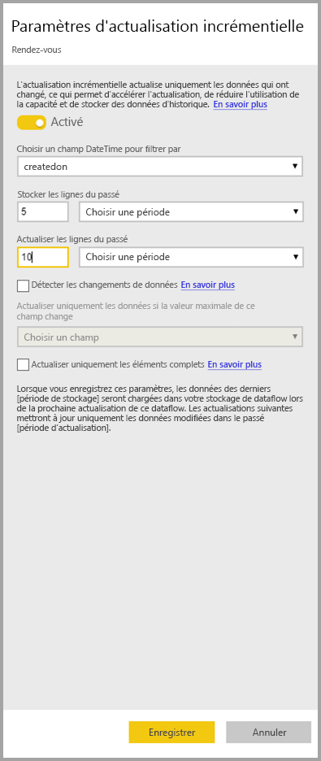

# Utilisation d’une actualisation incrémentielle avec des flux de données Power BI (préversion)

Avec les flux de données, vous pouvez injecter de grandes quantités de données dans Power BI pour créer des rapports et des analyses utiles. Dans certains cas, toutefois, il n’est pas pratique de mettre à jour une copie complète des données source dans chaque actualisation. Une bonne alternative consiste à effectuer une **actualisation incrémentielle**, qui offre les avantages suivants an niveau des flux de données :

* **Actualisation plus rapide** : seules les données modifiées doivent être actualisées. Par exemple, vous pouvez actualiser uniquement les données des 5 derniers jours dans un flux de données de 10 ans.
* **Actualisation plus fiable** : vous n’avez notamment pas besoin de conserver des connexions longues à des systèmes sources volatiles.
* **Consommation de ressources réduite** : comme il y a moins de données à actualiser, la consommation globale de mémoire et d’autres ressources diminue.

L’actualisation incrémentielle pour des flux de données Power BI nécessite que l’espace de travail dans lequel le flux de données réside dans la [capacité Premium](service-premium.md) pour s’exécuter, et la source de données ingérée dans le flux de données doit avoir un champ *datetime* comme filtre pour l’actualisation incrémentielle. 

## Configuration de l’actualisation incrémentielle pour les flux de données

Un flux de données peut contenir de nombreuses entités. L’actualisation incrémentielle est configurée au niveau entité, ce qui permet à un flux de données de stocker à la fois des entités entièrement actualisées et des entités actualisées de manière incrémentielle.

Pour configurer une entité avec actualisation incrémentielle, commencez par configurer votre entité comme vous le feriez pour toute autre entité. Pour en savoir plus sur la configuration des flux de données, consultez [Préparation des données en libre-service dans Power BI (préversion)](service-dataflows-overview.md).

Une fois le flux de données créé et enregistré, sélectionnez l’icône d’**actualisation incrémentielle** dans la vue de l’entité, comme indiqué dans l’image suivante :

Lorsque vous cliquez sur l’icône, la fenêtre **Paramètres d’actualisation incrémentielle** s’affiche. Vous pouvez configurer votre actualisation incrémentielle en basculant le commutateur sur la position **On**, .

La liste suivante décrit les paramètres de la fenêtre **Paramètres d’actualisation incrémentielle**. 

1. **Commutateur d’actualisation incrémentielle** : ce curseur active ou désactive la stratégie d’actualisation incrémentielle pour l’entité
2. **Liste déroulante du champ de filtre** : sélectionne le champ de requête sur lequel l’entité doit être filtrée selon des incréments. Ce champ contient uniquement des valeurs *datetime*. Vous ne pouvez pas utiliser l’actualisation incrémentielle si votre entité ne contient pas un champ *datetime*.
3. **Stocker les lignes des derniers/dernières** : l’exemple suivant expliquer quelques paramètres.

    Pour cet exemple, nous définissons une stratégie d’actualisation qui permet de stocker cinq ans de données au total et d’actualiser de manière incrémentielle 10 jours de données. Si l’entité est actualisée quotidiennement, les étapes suivantes sont effectuées à chaque opération d’actualisation :

    * Ajout d’un nouveau jour de données.
    * Actualisation des données des dix derniers jours avant la date actuelle.
    * Suppression des années calendaires qui sont antérieures aux cinq années précédant la date actuelle. Par exemple, si la date actuelle est le 1er janvier 2019, l’année 2013 est supprimée.

    La première actualisation de flux de données peut prendre un certain temps pour importer ces cinq années, mais les actualisations suivantes s’exécuteront en une fraction de la durée d’actualisation initiale.

4. **Détecter les changements de données** : l’actualisation incrémentielle de 10 jours est beaucoup plus efficace que l’actualisation complète de 5 ans, mais il est possible de faire encore mieux. Si vous cochez la case **Détecter les changements de données**, vous pouvez sélectionner une colonne date/heure afin d’identifier et d’actualiser uniquement les jours où les données ont changé. Cela suppose que cette colonne existe dans le système source, généralement à des fins d’audit. La valeur maximale de cette colonne est évaluée pour chacune des périodes définies dans la plage incrémentielle. Si ces données n’ont pas changé depuis la dernière actualisation, la période n’a pas besoin d’être actualisée. Dans l’exemple, cela peut réduire les jours concernés par l’actualisation incrémentielle de dix à deux.

> [!TIP]
> Dans la conception actuelle, la colonne utilisée pour détecter les changements de données doit être persistante et mise en mémoire cache. Essayez l’une des techniques suivantes pour réduire la consommation de mémoire et la cardinalité :
>
>    * Conservez uniquement la valeur maximale de cette colonne persistante au moment de l’actualisation, éventuellement à l’aide d’une fonction Power Query.
>    * Diminuez la précision à un niveau acceptable en fonction de vos exigences de fréquence d’actualisation.

5. **Actualiser uniquement les périodes complètes** : supposons que votre actualisation est planifiée pour s’exécuter à 4 h 00 tous les matins. Vous ne voudrez peut-être pas prendre en compte les données éventuellement ajoutées au système source pendant ces quatre premières heures de la journée. Certaines métriques métier, par exemple le nombre de barils par jour dans le secteur du pétrole et du gaz, ne sont pas pratiques ou adaptés à un calcul en jours partiels.

    Autre exemple où seule une actualisation de périodes complètes est adaptée : l’actualisation des données provenant d’un système financier. Prenons un système financier où les données du mois précédent sont approuvées le 12e jour calendaire du mois. Vous pouvez définir une plage incrémentielle d’un mois et planifier l’actualisation le 12e jour du mois. En activant cette option, les données de janvier (dernière période mensuelle complète) sont actualisées le 12 février.

> [!NOTE]
> L’actualisation incrémentielle de flux de données détermine les dates selon la logique suivante : si une actualisation est planifiée, l’actualisation incrémentielle de flux de données utilise le fuseau horaire défini dans la stratégie d’actualisation. S’il n’existe aucune planification de l’actualisation, l’actualisation incrémentielle utilise l’heure de l’ordinateur qui exécute l’actualisation.

## Requête d’actualisation incrémentielle

Une fois l’actualisation incrémentielle configurée, le flux de données modifie automatiquement votre requête pour inclure le filtre par date. Vous pouvez modifier la requête générée automatiquement à l’aide de l’outil **Advanced Power Query Editor** afin d’affiner ou de personnaliser votre actualisation. La section suivante fournit plus d’informations sur l’actualisation incrémentielle et son fonctionnement.

## Actualisation incrémentielle et entités liées/calculées

Pour les entités *liées*, l’actualisation incrémentielle met à jour l’entité source. Comme les entités liées représentent simplement un pointeur vers l’entité d’origine, l’actualisation incrémentielle n’a aucun impact sur l’entité liée. Lorsque l’entité source est actualisée en fonction de sa stratégie d’actualisation définie, l’entité liée suppose que les données dans la source sont actualisées.

Les entités *calculées* reposent sur les requêtes en cours d’exécution sur une banque de données, éventuellement un autre flux de données. Par conséquent, les entités calculées se comportent de la même façon que les entités liées.

Dans la mesure où les entités calculées et les entités liées se comportent de la même façon, la configuration requise et les étapes de configuration sont identiques. La différence est que pour les entités calculées, dans certaines configurations, l’actualisation incrémentielle ne peut pas s’exécuter de manière optimisée en raison de la façon dont les partitions sont créées. 

## Basculement d’une actualisation incrémentielle à une actualisation complète

Les flux de données prennent en charge le basculement de la stratégie d’actualisation entre une actualisation incrémentielle et une actualisation complète. Lorsqu’un changement intervient dans une de ces directions (complète à incrémentielle ou incrémentielle à complète), la modification affecte le flux de données après la prochaine actualisation.

Lorsque vous faites passer un flux de données d’une actualisation complète à une actualisation incrémentielle, la nouvelle logique d’actualisation met à jour le flux de données selon la fenêtre d’actualisation et l’incrément, comme défini dans les paramètres d’actualisation incrémentielle.

Lorsque vous faites passer un flux de données d’une actualisation incrémentielle à une actualisation complète, toutes les données accumulées dans l’actualisation incrémentielle sont remplacées par la stratégie définie dans l’actualisation complète. Vous devez approuver cette action.

## Actualisation incrémentielle de flux de données et jeux de données

L’actualisation incrémentielle de flux de données et l’actualisation incrémentielle de jeux de données sont conçues pour fonctionner en tandem. Vous pouvez avoir une entité qui s’actualise de façon incrémentielle dans un flux de données, entièrement chargée dans un jeu de données, ou une entité entièrement chargée dans un flux de données chargé de façon incrémentielle dans un jeu de données. 

Les deux approches varient selon vos définitions spécifiées dans les paramètres d’actualisation.
Vous trouverez plus d’informations sur l’actualisation incrémentielle dans la rubrique [Actualisation incrémentielle dans Power BI Premium](service-premium-incremental-refresh.md).

## Prise en charge du fuseau horaire dans l’actualisation incrémentielle

L’actualisation incrémentielle de flux de données dépend de l’heure à laquelle elle est exécutée. Le filtrage de la requête dépend du jour où il est exécuté.

Pour prendre en compte ces dépendances et garantir la cohérence des données, l’actualisation incrémentielle pour les flux de données implémente la logique heuristique suivante pour les scénarios *Actualiser maintenant* :

* Si une actualisation planifiée est définie dans le système, l’actualisation incrémentielle utilise les paramètres de fuseau horaire provenant de l’actualisation planifiée. Cela garantit que, quel que soit le fuseau horaire où se trouve la personne qui actualise le flux de données, les données resteront cohérentes par rapport à la définition du système.

* Si aucune actualisation planifiée n’est définie, les flux de données utilisent le fuseau horaire de l’ordinateur de l’utilisateur qui effectue l’actualisation.

L’actualisation incrémentielle peut également être appelée à l’aide d’API. Dans ce cas, l’appel à l’API peut contenir un paramètre de fuseau horaire utilisé dans l’actualisation. Les API peuvent être utiles à des fins de test et de validation.

## Détails de l’implémentation d’une actualisation incrémentielle

Les flux de données utilisent le partitionnement pour l’actualisation incrémentielle. Lorsque des points de terminaison XMLA pour Power BI Premium sont disponibles, les partitions deviennent visibles. L’actualisation incrémentielle dans les flux de données conserve le nombre minimal de partitions pour répondre aux critères de la stratégie d’actualisation. Les anciennes partitions hors plage sont supprimées pour maintenir une fenêtre continue. Les partitions sont fusionnées de façon opportuniste, ce qui réduit le nombre total de partitions requises. Cela améliore la compression et, dans certains cas, les performances de la requête.

Les exemples de cette section partagent la stratégie d’actualisation suivante :

* Stocker les lignes du dernier : trimestre
* Actualiser les lignes du dernier : 10 jours
* Détecter les changements de données = False
* Actualiser uniquement les jours complets = True

### Fusionner des partitions

Dans cet exemple, les partitions de jours sont automatiquement fusionnées au niveau du mois dès qu’elles sortent de la plage incrémentielle. Les partitions figurant dans la plage incrémentielle doivent être gérées avec une granularité quotidienne pour autoriser uniquement l’actualiser de ces jours.
L’opération d’actualisation avec la valeur *Run Date 12/11/2016* (date d’exécution le 11/12/2016) fusionne les jours en novembre car ils se situent en dehors de la plage incrémentielle.

### Supprimer d’anciennes partitions

Les anciennes partitions qui se situent en dehors de la plage totale sont supprimées. L’opération d’actualisation avec la valeur *Run Date 1/2/2017* (date d’exécution le 2/1/2017) supprime la partition pour le troisième trimestre 2016 car elle se situe en dehors de la plage totale.

### Récupération après une panne prolongée

Cet exemple simule la façon dont le système récupère correctement après une panne prolongée. Supposons que l’actualisation ne s’exécute pas correctement car les informations d’identification de la source de données ont expiré, et que la résolution du problème nécessite 13 jours. La plage incrémentielle est uniquement de 10 jours.

La prochaine opération d’actualisation, dont la valeur est *Run Date 1/15/2017* (date d’exécution le 15/1/2017), doit renvoyer les 13 jours manquants puis les actualiser. Elle doit également actualiser les 9 jours précédents car ils n’ont pas été actualisés selon la planification normale. En d’autres termes, la plage incrémentielle est passée de 10 à 22 jours.

La prochaine opération d’actualisation, avec la valeur *Run Date 1/16/2017* (date d’exécution le 16/1/2017), permet de fusionner les jours de décembre et les mois dans le 4e trimestre 2016.

## Étapes suivantes

Cet article décrit l’actualisation incrémentielle pour les flux de données. Voici d’autres articles qui peuvent vous être utiles.

* [Préparation des données en libre-service avec des flux de données](service-dataflows-overview.md)
* [Créer et utiliser des flux de données dans Power BI](service-dataflows-create-use.md)
* [Utilisation de flux de données avec des sources de données locales (préversion)](service-dataflows-on-premises-gateways.md)
* [Ressources du développeur pour les flux de données Power BI (préversion)](service-dataflows-developer-resources.md)

Pour plus d’informations sur Power Query et l’actualisation planifiée, vous pouvez consulter ces articles :
* [Présentation des requêtes dans Power BI Desktop](desktop-query-overview.md)
* [Configuration d’une actualisation planifiée](refresh-scheduled-refresh.md)

Pour plus d’informations sur le modèle Common Data Model, vous pouvez lire son article de présentation :
* [Vue d’ensemble du modèle CMD (Common Data Model) ](https://docs.microsoft.com/powerapps/common-data-model/overview)

