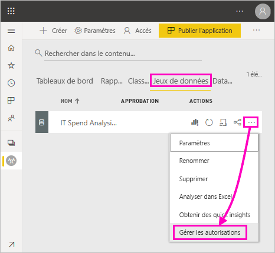

# Autorisation de génération pour les jeux de données partagés (préversion)

En tant que créateur de *modèles de données* dans Power BI Desktop, vous pouvez les partager en tant que *jeux de données* dans le service Power BI. Les créateurs de rapports peuvent alors facilement découvrir et réutiliser les jeux de données que vous avez partagés. Découvrez comment garder le contrôle de qui peut accéder aux données à l’aide de l’autorisation de génération.

L’autorisation de génération concerne uniquement les jeux de données. Lorsque vous accordez aux utilisateurs l’autorisation de génération, ils peuvent créer un nouveau contenu sur un jeu de données, comme des rapports, des tableaux de bord, des vignettes épinglées à partir de Q&R et Insights Discovery. Elles peuvent également générer un nouveau contenu sur le jeu de données hors de Power BI, comme des feuilles Excel par le biais de la fonctionnalité Analyser dans Excel, XMLA, et exporter des données sous-jacentes.

## Méthodes pour accorder l’autorisation de génération

Vous accordez l'autorisation de génération pour un jeu de données de différentes façons :

- Les membres d’un espace de travail avec au moins le rôle Contributeur disposent automatiquement de l’autorisation de génération de jeux de données dans cet espace de travail, ainsi que de l’autorisation de copier un rapport.
 
- Les membres de l’espace de travail où se trouve le jeu de données peuvent attribuer l’autorisation à des utilisateurs ou des groupes de sécurité spécifiques dans le Centre des autorisations. Si vous êtes membre de l’espace de travail, sélectionnez les points de suspension (...) en regard d’un jeu de données > **Gérer les autorisations**.

    

    Cette opération ouvre le Centre des autorisations pour ce jeu de données, où vous pouvez définir et modifier les autorisations.

    

- Un administrateur ou un membre de l’espace de travail où se trouve le jeu de données peut décider, pendant la publication de l’application, que les utilisateurs autorisés à accéder à l’application reçoivent également des autorisations de génération pour les jeux de données sous-jacents. Voir [Partager un jeu de données](service-datasets-share.md) pour plus de détails.

- Imaginons que vous disposez des autorisations de repartage et de génération sur un jeu de données. Quand vous partagez un rapport ou un tableau de bord reposant sur ce jeu de données, vous pouvez spécifier que les destinataires obtiennent également l’autorisation de génération pour le jeu de données sous-jacent.

    

Vous pouvez supprimer l’autorisation de création dont dispose un utilisateur pour un jeu de données. Dans ce cas, ils peuvent toujours voir le rapport généré sur le jeu de données partagé, mais ils ne peuvent plus le modifier. Voir la section suivante pour plus de détails.

## Supprimer l’autorisation de génération pour un jeu de données

À un moment donné, vous devrez peut-être supprimer l'autorisation de génération pour certains utilisateurs d'un jeu de données partagé. 

1. Dans un espace de travail, allez à la page de la liste des **jeux de données**. 
1. Sélectionnez les points de suspension (...) en regard du jeu de données > **Gérer les autorisations**.

    

1. Sélectionnez les points de suspension (...) en regard d'un nom > **Supprimer l'autorisation de génération**.

    

    Ils peuvent toujours voir le rapport généré sur le jeu de données partagé, mais ils ne peuvent plus le modifier.

### Supprimer l’autorisation de génération pour un jeu de données dans une application

Supposons que vous ayez distribué une application d'un espace de travail à un groupe de personnes. Plus tard, vous décidez de supprimer l'accès à l'application pour certaines personnes. La suppression de leur accès à l'application ne supprime pas automatiquement leurs autorisations de génération et de partage. Il s’agit d’une étape supplémentaire. 

1. Dans une page de la liste des espaces de travail, sélectionnez **Mettre à jour l’application**. 

    

1. Dans l'onglet **Autorisations**, sélectionnez **X** pour supprimer la personne ou le groupe. 

    
1. Sélectionnez **Mettre à jour l’application**.

    Un message vous explique que vous devez aller à la section **Gérer autorisations** afin de supprimer les autorisations de génération pour les utilisateurs disposant d’un accès. 

    

1. Sélectionnez **Mettre à jour**.

1. Dans l'espace de travail, allez à la page de la liste des **jeux de données**. 
1. Sélectionnez les points de suspension (...) en regard du jeu de données > **Gérer les autorisations**.

    

1. Sélectionnez les points de suspension (...) en regard du nom > **Supprimer l'autorisation de génération**.

    

    Ils peuvent toujours voir le rapport généré sur le jeu de données partagé, mais ils ne peuvent plus le modifier.

## Autorisations plus granulaires

Power BI a introduit l’autorisation de génération en juin 2019 en complément des autorisations existantes : lecture et repartage. Tous les utilisateurs qui, à ce moment-là, disposaient déjà de l’autorisation de lecture pour les jeux de données par le biais des autorisations d’application, du partage ou de l’accès aux espaces de travail obtenaient aussi l’autorisation de génération pour ces mêmes jeux de données. Ils obtenaient automatiquement l’autorisation de génération car l’autorisation de lecture leur accordait déjà le droit de générer du nouveau contenu basé sur le jeu de données, en utilisant la fonctionnalité Analyser dans Excel ou Export.

Avec cette autorisation de génération plus granulaire, vous pouvez choisir qui peut uniquement afficher le contenu du rapport ou du tableau de bord existant et qui peut créer du contenu connecté aux jeux de données sous-jacents.

Si votre jeu de données est actuellement utilisé par un rapport hors de l’espace de travail du jeu de données, vous ne pouvez pas supprimer ce jeu de données. Au lieu de cela, un message d’erreur s’affiche.

Vous pouvez supprimer l’autorisation de génération. Si vous le faites, les personnes dont vous avez révoqué les autorisations peuvent toujours visualiser le rapport, mais elles ne peuvent plus le modifier ni exporter des données sous-jacentes. Les utilisateurs disposant de l’autorisation en lecture seule peuvent toujours exporter les données récapitulatives. 

## Étapes suivantes

- [Utiliser des jeux de données dans des espaces de travail (préversion)](service-datasets-across-workspaces.md)
- Vous avez des questions ? [Essayez d’interroger la communauté Power BI](http://community.powerbi.com/)
