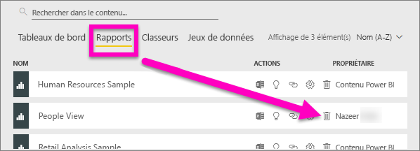
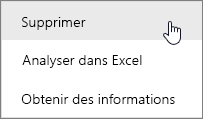
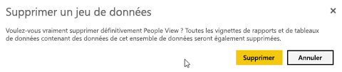
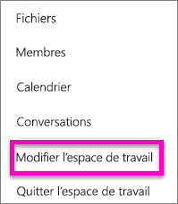
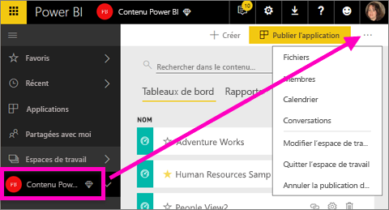
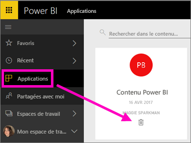

# Supprimer pratiquement tout élément dans le service Power BI
Cet article explique comment supprimer un tableau de bord, un rapport, un classeur, un jeu de données, une application, une visualisation ou un espace de travail dans le service Power BI.

## Supprimer un tableau de bord
Vous pouvez supprimer des tableaux de bord. La suppression du tableau de bord n’entraîne pas celle du jeu de données sous-jacent ou des rapports éventuellement associés à ce tableau de bord.

* Si vous êtes le propriétaire du tableau de bord, vous pouvez le supprimer. Si vous avez partagé le tableau de bord avec des collègues, sa suppression de votre espace de travail Power BI a pour effet de l’effacer également de leur espace de travail Power BI.
* Si on a partagé un tableau de bord avec vous et que vous ne voulez plus le voir, vous pouvez l’effacer.  Le fait d’effacer un tableau de bord n’a pas pour effet de l’effacer de l’espace de travail Power BI de quiconque.
* Si un tableau de bord fait partie d’un [pack de contenu d’organisation](service-organizational-content-pack-disconnect.md), le seul moyen de le supprimer est de supprimer le jeu de données associé.

### Pour supprimer un tableau de bord
1. Dans votre espace de travail, sélectionnez l’onglet **Tableaux de bord**.
2. Recherchez le tableau de bord à supprimer et sélectionnez l’icône Supprimer .

    

## Supprimer un rapport
La suppression d’un rapport ne doit pas être une source d’inquiétudes : cette opération ne supprime pas le jeu de données sur lequel est basé le rapport.  De même, les visualisations que vous avez épinglées à partir du rapport sont aussi préservées : elles restent sur le tableau de bord tant que vous ne les supprimez pas individuellement.

### Pour supprimer un rapport :
1. Dans votre espace de travail, sélectionnez l’onglet **Rapports**.
2. Recherchez le rapport à supprimer et sélectionnez l’icône Supprimer   .   

    
3. Confirmez la suppression.

   

   > [!NOTE]
   > si le rapport fait partie d’un [pack de contenu](service-organizational-content-pack-introduction.md), vous ne pourrez pas le supprimer en employant cette méthode.  Voir [Suppression de votre connexion à un pack de contenu d’organisation](service-organizational-content-pack-disconnect.md).
   >
   >

## Supprimer un classeur
Vous pouvez supprimer des classeurs. Toutefois, la suppression d’un classeur a également pour effet de supprimer l’ensemble des rapports et vignettes de tableau de bord contenant des données de ce classeur.

Si le classeur est stocké sur OneDrive Entreprise, sa suppression de Power BI n’a pas pour effet de le supprimer de OneDrive.

### Pour supprimer un classeur
1. Dans votre espace de travail, sélectionnez l’onglet **Classeurs**.
2. Recherchez le classeur à supprimer et sélectionnez l’icône Supprimer  .

    
3. Confirmez la suppression.

   

## Supprimer un jeu de données
Vous pouvez supprimer des jeux de données. Toutefois, la suppression d’un jeu de données a également pour effet de supprimer l’ensemble des rapports et vignettes de tableau de bord contenant des données de ce jeu de données.

Si un jeu de données fait partie d’un ou plusieurs [packs de contenu d’organisation](service-organizational-content-pack-disconnect.md), la seule manière de le supprimer est de le retirer des packs de contenu dans lesquels il est utilisé, d’attendre la fin du traitement de l’opération, puis de réessayer de le supprimer.

### Pour supprimer un jeu de données
1. Dans votre espace de travail, sélectionnez l’onglet **Jeux de données**.
2. Localisez le jeu de données à supprimer, puis sélectionnez les points de suspension (…).  

    
3. Dans la liste déroulante, sélectionnez **Supprimer**.

   
4. Confirmez la suppression.

   

## Supprimer un espace de travail d’application
> [!WARNING]
> Lorsque vous créez un espace de travail d’application, vous créez un groupe Office 365. Et lorsque vous supprimez un espace de travail d’application, vous supprimez un groupe Office 365. Cela signifie que le groupe est également supprimé des autres produits Office 365 comme SharePoint et Microsoft Teams.
>
>

En tant qu’auteur de l’espace de travail de l’application, vous pouvez supprimer celui-ci. Lorsque vous le supprimez, l’application associée est également supprimée pour tous les membres du groupe et supprimée de votre AppSource si vous l’aviez publiée pour toute l’organisation. Supprimer un espace de travail d’application diffère de quitter un espace de travail d’application.

### Pour supprimer un espace de travail d’application, si vous êtes un administrateur
1. Dans le volet de navigation de gauche, sélectionnez **Espaces de travail**.

    
2. Sélectionnez les points de suspension (…) à droite de l’espace de travail à supprimer, puis choisissez **Modifier l’espace de travail**.

   
3. Dans la fenêtre **Modifier l’espace de travail**, sélectionnez **Supprimer l’espace de travail** > **Supprimer**.

    

### Pour supprimer un espace de travail d’application de votre liste
Si vous ne souhaitez plus être un membre d’un espace de travail d’application, vous pouvez le ***quitter***. Il est alors supprimé de votre liste. Lorsque vous quittez un espace de travail, celui-ci reste en place pour tous ses autres membres.  

> [!IMPORTANT]
> Si vous êtes l’unique administrateur de l’espace de travail d’application, Power BI ne vous autorise pas à quitter celui-ci.
>
>

1. Démarrez dans l’espace de travail d’application que vous souhaitez supprimer.
2. Dans l’angle supérieur droit, sélectionnez les points de suspension (…), puis choisissez **Quitter l’espace de travail** > **Quitter**.

      

   > [!NOTE]
   > Les options qui apparaissent dans la liste déroulante varient selon que vous êtes un administrateur ou un membre de cet espace de travail d’application.
   >
   >

## Supprimer ou retirer une application
Vous pouvez facilement supprimer des applications de la page de votre liste d’applications. En revanche, seul un administrateur d’une application peut supprimer celle-ci définitivement.

### Supprimer une application de la page de votre liste d’applications
La suppression d’une application de la page de votre liste d’applications n’a pas pour effet de supprimer l’application pour les autres membres.

1. Dans la volet de navigation de gauche, sélectionnez **Applications** pour ouvrir la page de la liste d’applications.
2. Pointez sur l’application à supprimer, puis sélectionnez l’icône Supprimer .

   

   Si vous supprimez accidentellement une application, vous disposez de plusieurs options pour la récupérer.  Vous pouvez demander au créateur de l’application de la renvoyer, rechercher l’e-mail d’origine contenant le lien vers l’application, consulter votre [centre de notifications](service-notification-center.md) pour voir si la notification relative à cette application y figure toujours, ou vérifier l’[AppSource](service-install-use-apps.md) de votre organisation.

## Considérations et résolution des problèmes
Cet article a expliqué comment supprimer les principaux blocs de construction principaux du service Power BI. Mais il existe d’autres éléments que vous pouvez supprimer dans Power BI.  

* [Supprimer votre tableau de bord par défaut](service-dashboard-featured.md#change-the-featured-dashboard)
* [Retirer un tableau de bord des favoris](service-dashboard-favorite.md)
* [Supprimer une page de rapport](service-delete.md)
* [Supprimer une vignette de tableau de bord](service-dashboard-edit-tile.md)
* [Supprimer une visualisation de rapport](service-delete.md)

D’autres questions ? [Posez vos questions à la communauté Power BI](http://community.powerbi.com/)
