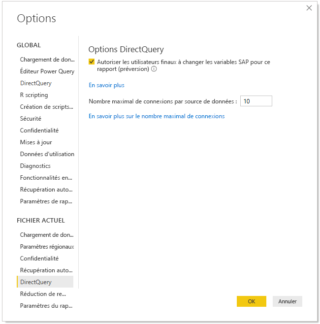
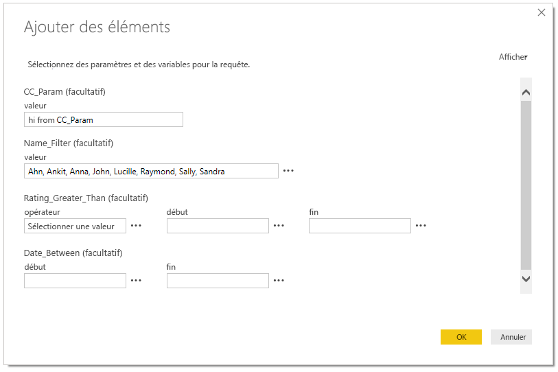
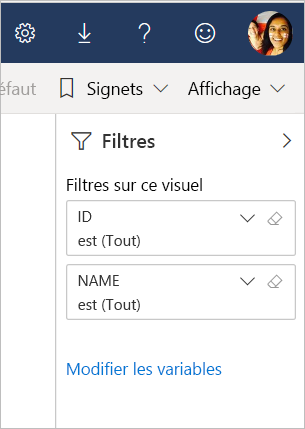

# Modifier les variables SAP dans le service Power BI (préversion)

Quand SAP Business Warehouse ou SAP HANA est utilisé avec DirectQuery, les auteurs de rapports peuvent désormais autoriser les utilisateurs finaux à modifier les variables SAP dans le **service Power BI** pour les espaces de travail Premium.

Ce document décrit les conditions requises pour modifier les variables dans Power BI, explique comment activer cette fonctionnalité de préversion et où modifier les variables dans le service Power BI.

## Conditions requises pour modifier les variables SAP

Il convient de respecter quelques conditions pour pouvoir utiliser la fonctionnalité de modification de variables SAP. La liste suivante décrit ces conditions.

**Nouvelle expérience de filtre obligatoire** – Vous devez activer la [nouvelle expérience de filtre](power-bi-report-filter.md) pour votre rapport. Voici comment l’activer pour votre rapport dans Power BI Desktop :
- Dans Power BI Desktop, sélectionnez **Fichier** > **Options et paramètres** > **Options**.
- Dans la barre de navigation de gauche, sous **Fichier actuel**, sélectionnez **Paramètres du rapport**.
- Sous **Expérience de filtrage**, sélectionnez **Activer le volet de filtre mis à jour**.

**Connexions DirectQuery obligatoires** – Vous devez vous connecter à la source de données SAP à l’aide de DirectQuery. Les connexions d’importation ne sont pas prises en charge.

**Abonnement Power BI Premium obligatoire** – La fonctionnalité de modification de variables SAP n’est actuellement opérationnelle que dans les abonnements Power BI Premium.

**Configuration de l’authentification unique obligatoire** – Pour que cette fonctionnalité soit opérationnelle, l’authentification unique (SSO) doit être configurée. Pour plus d’informations, consultez [Vue d’ensemble de l’authentification unique (SSO)](service-gateway-sso-overview.md).

**Nouveaux bits de passerelle obligatoires** – Téléchargez la dernière passerelle et mettez à jour votre passerelle existante. Pour plus d’informations, consultez [Passerelle de service](service-gateway-onprem.md).

**Modèles multidimensionnels uniquement pour SAP HANA** – Pour SAP HANA, la fonctionnalité de modification de variables SAP n’est opérationnelle qu’avec les modèles multidimensionnels et ne fonctionne pas sur les sources relationnelles.

**Absence de prise en charge dans les clouds souverains** – Power Query Online n’est actuellement pas disponible dans les clouds souverains ; par conséquent, cette fonctionnalité n’est pas non plus prise en charge dans les clouds souverains.

## Comment activer la fonctionnalité

Pour activer la fonctionnalité de **modification de variables SAP**, dans Power BI Desktop, connectez-vous à une source de données SAP HANA ou SAP BW. Accédez ensuite à **Fichier > Options et paramètres > Options** puis, dans la section Fichier actif du volet gauche, sélectionnez **DirectQuery**. Quand vous sélectionnez cette option, vous voyez dans le volet droit des options DirectQuery et une case à cocher vous permettant d’**autoriser les utilisateurs finaux à changer les variables SAP dans le rapport (préversion)** , comme illustré dans l’image suivante.

## Utiliser la modification de variables SAP dans Power BI Desktop

Quand vous utilisez la modification de variables SAP dans Power BI Desktop, vous pouvez modifier les variables en sélectionnant le lien Modifier les variables dans le menu**Modifier les requêtes** dans le ruban. C’est alors que la boîte de dialogue suivante s’affiche. Cette fonctionnalité est disponible dans Power BI Desktop depuis un certain temps. Les créateurs de rapports peuvent sélectionner des variables pour le rapport à partir de la boîte de dialogue suivante.

## Utiliser la modification de variables SAP dans le service

Une fois que le rapport a été publié dans le service Power BI, les utilisateurs peuvent voir le lien **Modifier les variables** dans le nouveau volet Filtre. Si vous publiez le rapport pour la première fois, 5 minutes peuvent être nécessaires avant que le lien Modifier les variables s’affiche. S’il ne s’affiche pas, actualisez manuellement le jeu de données.
Voici comment faire :

1. Dans le service Power BI, sélectionnez l’onglet **Jeux de données** dans la liste de contenu d’un espace de travail.

2. Recherchez le jeu de données que vous devez actualiser, puis sélectionnez l’icône **Actualiser**.

    

3. Le fait de sélectionner le lien Modifier les variables fait apparaître la boîte de dialogue **Modifier les variables**, d’où les utilisateurs peuvent remplacer les variables. Si vous sélectionnez le bouton **Réinitialiser**, les variables sont réinitialisées avec les valeurs d’origine qui figuraient dans cette boîte de dialogue au moment de s’ouvrir.

    

4. Les modifications apportées dans la boîte de dialogue **Modifier les variables** sont conservées uniquement pour cet utilisateur (conformément aux autres comportements de persistance observés dans Power BI). En sélectionnant l’option **Rétablir les valeurs par défaut**, illustrée dans l’image suivante, vous restaurez l’état d’origine du rapport, tel qu’il a été créé par son auteur, y compris les variables.

    

Quand le propriétaire d’un rapport publié dans le service Power BI travaille sur ce rapport avec SAP HANA ou SAP BW et en ayant la fonctionnalité **Modifier les variables** activée, il peut modifier ces valeurs par défaut. Le propriétaire du rapport peut modifier les variables en mode d’édition et enregistrer le rapport pour que ces paramètres deviennent les *nouveaux paramètres par défaut* de ce rapport. Les autres utilisateurs qui accèdent au rapport après que le propriétaire du rapport a apporté ces modifications voient ces nouveaux paramètres comme valeurs par défaut.

## Problèmes et éléments à prendre en considération

Pour l’heure, la fonctionnalité de modification de variables SAP n’est pas prise en charge dans les applications.

## Étapes suivantes

Pour plus d’informations sur SAP HANA, SAP BW ou DirectQuery, lisez les articles suivants :

- [Utiliser SAP HANA dans Power BI Desktop](desktop-sap-hana.md)
- [DirectQuery et SAP Business Warehouse (BW)](desktop-directquery-sap-bw.md)
- [DirectQuery et SAP HANA](desktop-directquery-sap-hana.md)
- [Utilisation de DirectQuery dans Power BI](desktop-directquery-about.md)