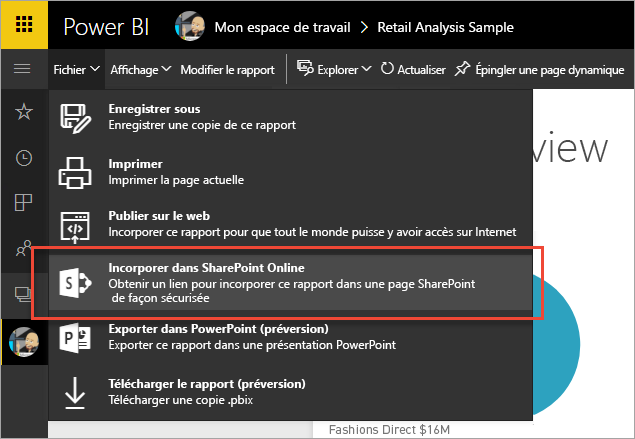
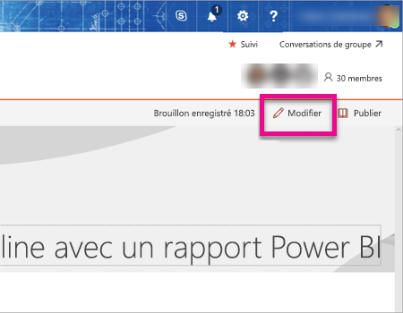
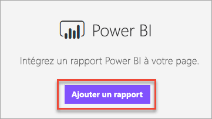

# Incorporer avec le composant WebPart Rapport dans SharePoint Online

Avec le nouveau composant WebPart Rapport pour SharePoint Online, vous pouvez incorporer facilement des rapports Power BI interactifs dans les pages SharePoint Online.

Quand vous utilisez la nouvelle option **Incorporer dans SharePoint Online**, les rapports incorporés sont entièrement sécurisés. Vous pouvez ainsi créer facilement des portails internes sécurisés.

## Configuration requise

Il existe quelques exigences à respecter pour que les rapports **Incorporer dans SharePoint Online** fonctionnent.

* Le composant WebPart Power BI pour SharePoint Online nécessite des [pages modernes](https://support.office.com/article/Allow-or-prevent-creation-of-modern-site-pages-by-end-users-c41d9cc8-c5c0-46b4-8b87-ea66abc6e63b).

## Incorporer votre rapport

Pour incorporer votre rapport dans SharePoint Online, vous devez d’abord obtenir l’URL associée, puis utiliser cette dernière avec le nouveau composant WebPart Power BI dans SharePoint Online.

### Obtenir l’URL de votre rapport

1. Affichez le rapport dans le service Power BI.

2. Sélectionnez l’option de menu **Fichier**.

3. Sélectionnez **Incorporer dans SharePoint Online**.
   
    

4. Copiez l’URL à partir de la boîte de dialogue.

    

   > [!NOTE]
   > Vous pouvez également utiliser l’URL qui s’affiche dans la barre d’adresse de votre navigateur web lorsque vous affichez un rapport. Cette URL contient la page de rapport que vous affichez actuellement. Pour utiliser une autre page, vous devez supprimer la section du rapport de l’URL.

### Ajouter le rapport Power BI à une page SharePoint Online

1. Ouvrez la page souhaitée dans SharePoint Online et sélectionnez **Modifier**.

    

    Ou créez une page de site moderne en sélectionnant **+ Nouveau** dans SharePoint Online.

    

2. Sélectionnez **+**, puis le composant WebPart **Power BI**.

    

3. Sélectionnez **Ajouter un rapport**.

    

4. Collez l’URL du rapport dans le volet des propriétés. Il s’agit de l’URL que vous avez copiée au cours de la procédure ci-dessus. Le rapport est chargé automatiquement.

    

5. Sélectionnez **Publier** pour que les utilisateurs de SharePoint Online puissent voir les modifications.

    

## Accorder l’accès aux rapports

Incorporer un rapport dans SharePoint Online n’accorde pas automatiquement aux utilisateurs l’autorisation d’afficher le rapport. Les autorisations pour afficher le rapport sont définies dans le service Power BI.

> [!IMPORTANT]
> Veillez à passer en revue les utilisateurs qui peuvent afficher le rapport dans le service Power BI et à accorder l’accès à ceux qui ne sont pas répertoriés.

Il existe deux moyens de fournir un accès au rapport au sein du service Power BI. Si vous utilisez un groupe Office 365 pour créer votre site d’équipe SharePoint Online, répertoriez l’utilisateur en tant que membre de l’espace de travail d’application dans le service Power BI. Cela permet de garantir que les utilisateurs peuvent afficher le contenu de ce groupe. Pour plus d’informations, voir [Créer et distribuer des applications dans Power BI](service-create-distribute-apps.md).

Vous pouvez également accorder aux utilisateurs l’accès à votre rapport en procédant comme suit.

1. Ajoutez une vignette de votre rapport à un tableau de bord.

2. Partagez le tableau de bord avec les utilisateurs qui ont besoin d’accéder au rapport. Pour plus d’informations, consultez [Partager un tableau de bord avec vos collègues et les autres utilisateurs](service-share-dashboards.md).

## Paramètres des composants WebPart

Voici une description des paramètres qui peuvent être ajustés pour le composant WebPart Power BI dans SharePoint Online.

| Propriété | Description |
| --- | --- |
| Nom de la page |Définit la page par défaut qui est affichée par le composant WebPart. Sélectionnez une valeur dans la liste déroulante. Si aucune page ne s’affiche, votre rapport ne contient qu’une seule page ou l’URL que vous avez collée contient un nom de page. Supprimez la section du rapport de l’URL pour sélectionner une page spécifique. |
| Affichage |Option qui permet de définir la façon dont le rapport est ajusté à la page SharePoint Online. |
| Afficher le volet de navigation |Affiche ou masque le volet de navigation Page. |
| Afficher le volet Filtre |Affiche ou masque le volet Filtre. |

## Multi-Factor Authentication

Si votre environnement Power BI requiert que vous vous connectiez à l’aide de Multi-Factor Authentication, vous pouvez être invité à vous connecter avec un dispositif de sécurité pour vérifier votre identité. Cela se produit si vous ne vous êtes pas connecté à SharePoint Online à l’aide de Multi-Factor Authentication, mais que votre environnement Power BI nécessite un compte validé par un dispositif de sécurité.

> [!NOTE]
> Multi-Factor Authentication n’est pas encore pris en charge dans Azure Active Directory 2.0. Les utilisateurs reçoivent un message indiquant une *erreur*. Si l’utilisateur se reconnecte à SharePoint Online à l’aide de son dispositif de sécurité, il peut afficher le rapport.

## Rapports qui ne sont pas chargés

Il se peut que votre rapport ne se charge pas dans le composant WebPart Power BI et affiche le message suivant.

*Ce contenu n’est pas disponible.*

Il existe deux raisons habituelles pour ce message.

1. Vous n’avez pas accès au rapport.
2. Le rapport a été supprimé.

Vous devez contacter le propriétaire de la page SharePoint Online pour qu’il vous aide à résoudre le problème.

## Problèmes connus et limitations

* **Erreur : « Une erreur s’est produite. Essayez de vous déconnecter, de vous reconnecter, puis de revenir sur cette page. ID de corrélation : non défini. Statut de la réponse HTTP : 400. Code d’erreur du serveur 10001. Message : jeton d’actualisation manquant »**
  
  Si vous recevez cette erreur, essayez une des opérations suivantes.
  
  1. Déconnectez-vous de SharePoint, puis reconnectez-vous. Veillez à fermer toutes les fenêtres du navigateur avant de vous reconnecter.

  2. Si votre compte utilisateur requiert l’authentification multifacteur (MFA), veillez à vous connecter à SharePoint à l’aide de votre appareil d’authentification multifacteur (application de téléphone, carte à puce, etc.).
  
  3. Les comptes d’utilisateur invités Azure B2B ne sont pas pris en charge. Les utilisateurs verront le logo Power BI qui montre le composant WebPart en cours de chargement, mais le rapport ne s’affichera pas.

* Power BI ne prend pas en charge les mêmes langues localisées que SharePoint Online. Par conséquent, vous risquez de ne pas voir la localisation appropriée dans le rapport incorporé.

* Vous pouvez rencontrer des problèmes si vous utilisez Internet Explorer 10. Vous pouvez passer en revue les [navigateurs pris en charge par Power BI](service-browser-support.md) et [Office 365](https://products.office.com/office-system-requirements#Browsers-section).

* Le composant WebPart Power BI n’est pas disponible pour les [clouds souverains](https://powerbi.microsoft.com/en-us/clouds/).

* Le serveur SharePoint classique n’est pas pris en charge avec ce composant WebPart.

## Étapes suivantes

[Autoriser ou empêcher la création de pages de site moderne par les utilisateurs finaux](https://support.office.com/article/Allow-or-prevent-creation-of-modern-site-pages-by-end-users-c41d9cc8-c5c0-46b4-8b87-ea66abc6e63b)  
[Créer et distribuer une application dans Power BI](service-create-distribute-apps.md)  
[Partager un tableau de bord avec vos collègues et les autres utilisateurs](service-share-dashboards.md)  
[Qu’est-ce que Power BI Premium ?](service-premium.md)  

D’autres questions ? [Essayez d’interroger la communauté Power BI](http://community.powerbi.com/) 

