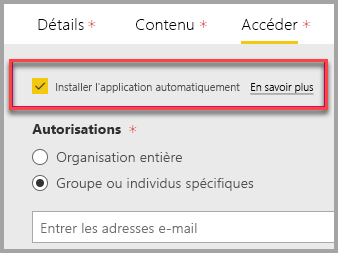

# Incorporer avec le composant WebPart Rapport dans SharePoint Online

Avec le nouveau composant WebPart Rapport pour SharePoint Online, vous pouvez incorporer facilement des rapports Power BI interactifs dans les pages SharePoint Online.

Lorsque vous utilisez la nouvelle **incorporer dans SharePoint Online** option, les rapports incorporés sont entièrement sécurisées, afin de créer facilement des portails internes sécurisés.

## Configuration requise

Pour **incorporer dans SharePoint Online** rapports fonctionnent, les éléments suivants sont requis :

* Une licence Power BI Pro ou un [capacité Power BI Premium (EM ou référence (SKU) P)](service-premium-what-is.md) avec une licence Power BI.
* Le composant WebPart Power BI pour SharePoint Online nécessite des [pages modernes](https://support.office.com/article/Allow-or-prevent-creation-of-modern-site-pages-by-end-users-c41d9cc8-c5c0-46b4-8b87-ea66abc6e63b).

## Incorporer votre rapport
Pour incorporer votre rapport dans SharePoint Online, vous devez obtenir l’URL de rapport et l’utiliser avec nouvelle partie web de Power BI SharePoint Online.

### Obtenir une URL de rapport

1. Dans Power BI, affichez le rapport.

2. Sélectionnez le **fichier** menu déroulant, puis sélectionnez **incorporer dans SharePoint Online**.

    

3. Copiez l’URL de rapport à partir de la boîte de dialogue.

    

### Ajouter le rapport Power BI à une page SharePoint Online

1. Ouvrez la page cible dans SharePoint Online et sélectionnez **modifier**.

    

    Ou, dans Sharepoint Online, sélectionnez **+ nouveau** pour créer une nouvelle page de site moderne.

    

2. Sélectionnez le **+** liste déroulante, puis sélectionnez le **Power BI**.

    

3. Sélectionnez **Ajouter un rapport**.

      

4. Collez l’URL de rapport précédemment copiés dans le **lien du rapport Power BI** volet. Le rapport se charge automatiquement.

    

5. Sélectionnez **Publier** pour que les utilisateurs de SharePoint Online puissent voir les modifications.

    

## Accorder l’accès aux rapports

Incorporer un rapport dans SharePoint Online n’automatiquement autoriser les utilisateurs à afficher le rapport, vous devez définir des autorisations d’affichage dans Power BI.

> [!IMPORTANT]
> Veillez à passer en revue les utilisateurs qui peuvent afficher le rapport dans le service Power BI et à accorder l’accès à ceux qui ne sont pas répertoriés.

Il existe deux moyens de fournir l’accès aux rapports dans Power BI. Le premier, si vous utilisez un groupe Office 365 pour développer votre site d’équipe SharePoint Online, consiste à répertorier l’utilisateur en tant que membre de la **espace de travail application au sein du service Power BI** et **page SharePoint**. Pour plus d’informations sur la gestion d’un espace de travail d’application, consultez [Gérer l’espace de travail de votre application](service-manage-app-workspace-in-power-bi-and-office-365.md).

La deuxième consiste à incorporer un rapport dans une application et le partager directement avec les utilisateurs :  

1. L’auteur (doit être un utilisateur Pro) crée un rapport dans un espace de travail d’application. Pour partager avec **utilisateurs gratuits de Power BI**, l’espace de travail doit être définie comme un **espace de travail Premium**.

2. L’auteur publie l’application et l’installe. Il faut que l’auteur, veillez à installer l’application pour accéder à l’URL de rapport qui sert à incorporer dans SharePoint Online.

3. Maintenant, tous les utilisateurs finaux doivent aussi installer l’application. Vous pouvez également utiliser le **installer l’application automatiquement** fonctionnalité, vous pouvez activer dans le [portail d’administration Power BI](service-admin-portal.md), pour que l’application préinstallée, pour les utilisateurs finaux.

   

4. L’auteur ouvre l’application et accède au rapport.

5. L’auteur copie l’URL de rapport incorporé à partir de l’état de l’application est installée. **N’utilisez pas l’URL de rapport d’origine à partir de l’espace de travail d’application.**

6. Créez un nouveau site d’équipe dans SharePoint Online.

7. Ajoutez l’URL de rapport précédemment copiés au composant WebPart Power BI.

8. Ajoutez tous les utilisateurs finaux et/ou groupes qui auront besoin des données dans la page SharePoint Online et dans l’application Power BI que vous avez créée.

    > [!NOTE]
    > **Les utilisateurs ou les groupes doivent avoir accès à la page SharePoint Online et au rapport dans l’application Power BI pour voir le rapport dans la page SharePoint.**

Les utilisateurs finaux peuvent maintenant accéder au site d’équipe dans SharePoint Online et consulter les rapports dans la page.

## Multi-Factor Authentication

Si votre environnement Power BI nécessite une connexion via l’authentification multifacteur, vous pouvez être invité à vous connecter avec un dispositif de sécurité pour vérifier votre identité. Cela se produit si vous l’avez fait pas vous connecter à SharePoint Online à l’aide de l’authentification multifacteur, mais votre environnement Power BI requiert un dispositif de sécurité pour valider un compte.

> [!NOTE]
> Azure Active Directory 2.0 ne prend pas en charge l’authentification multifacteur, les utilisateurs verront un message d’erreur. Si l’utilisateur se reconnecte à SharePoint Online en utilisant son dispositif de sécurité, il peut visualiser le rapport.

## Paramètres des composants WebPart

Voici les paramètres que vous pouvez ajuster pour le composant WebPart Power BI pour SharePoint Online.

| Propriété | Description |
| --- | --- |
| Nom de la page |Définit la page de valeur par défaut du composant. Sélectionnez une valeur dans la liste déroulante. Si aucune page ne s’affiche, votre rapport ne contient qu’une seule page ou l’URL que vous avez collée contient un nom de page. Supprimez la section du rapport de l’URL pour sélectionner une page spécifique. |
| Display |Ajuste la façon dont le rapport est adaptée à la page SharePoint Online. |
| Afficher le volet de navigation |Affiche ou masque le volet de navigation Page. |
| Afficher le volet Filtre |Affiche ou masque le volet Filtre. |

## Rapports qui ne sont pas chargés

Si votre rapport ne se charge pas dans le composant WebPart Power BI, vous pouvez voir le message suivant :

Il existe deux raisons habituelles pour ce message.

1. Vous n’avez pas accès aux rapports.
2. Le rapport a été supprimé.

Contactez le propriétaire de page SharePoint Online pour aider à résoudre le problème.

## Licensing

Les utilisateurs affichant un rapport dans SharePoint ont besoin au choix d’une **licence Power BI Pro** ou le contenu doit se trouver dans un espace de travail qui se trouve dans une  **[capacité Power BI Premium (référence SKU EM ou P)](service-admin-premium-purchase.md)** .

## Problèmes connus et limitations

* Erreur : « Une erreur s’est produite. Essayez de vous déconnecter, de vous reconnecter, puis de revenir sur cette page. ID de corrélation : indéfini, état de la réponse http : 400, code d’erreur du serveur 10001, message : Jeton d’actualisation manquant »
  
  Si vous recevez cette erreur, essayez l’une des étapes de dépannage ci-dessous.
  
  1. Déconnectez-vous de SharePoint, puis reconnectez-vous. Veillez à fermer toutes les fenêtres du navigateur avant de vous reconnecter.

  2. Si votre compte d’utilisateur nécessite une authentification multifacteur (MFA), puis connectez-vous à SharePoint à l’aide de votre appareil de l’authentification Multifacteur (application de téléphone, carte à puce, etc.).
  
  3. Les comptes d’utilisateur invités Azure B2B ne sont pas pris en charge. Les utilisateurs voient le logo Power BI qui montre que le composant WebPart se chargement, mais le rapport ne s’affiche pas.

* Power BI ne prend pas en charge les mêmes langues localisées que SharePoint Online. Par conséquent, vous risquez de ne pas voir la localisation appropriée dans le rapport incorporé.

* Vous pouvez rencontrer des problèmes si vous utilisez Internet Explorer 10. Vous pouvez passer en revue les [navigateurs pris en charge par Power BI](consumer/end-user-browsers.md) et [Office 365](https://products.office.com/office-system-requirements#Browsers-section).

* Le composant WebPart Power BI n’est pas disponible pour les [clouds nationaux](https://powerbi.microsoft.com/clouds/).

* Le serveur SharePoint classique n’est pas pris en charge avec ce composant WebPart.

* Les [filtres d’URL](service-url-filters.md) ne sont pas pris en charge avec le composant WebPart SPO.

## Étapes suivantes

* [Autoriser ou empêcher la création de pages de site moderne par les utilisateurs finaux](https://support.office.com/article/Allow-or-prevent-creation-of-modern-site-pages-by-end-users-c41d9cc8-c5c0-46b4-8b87-ea66abc6e63b)  
* [Créer et distribuer une application dans Power BI](service-create-distribute-apps.md)  
* [Partager un tableau de bord avec vos collègues et les autres utilisateurs](service-share-dashboards.md)  
* [Qu’est-ce que Power BI Premium ?](service-premium-what-is.md)
* [Incorporer un rapport dans un site web ou portail sécurisé](service-embed-secure.md)

D’autres questions ? [Essayez d’interroger la communauté Power BI](http://community.powerbi.com/)