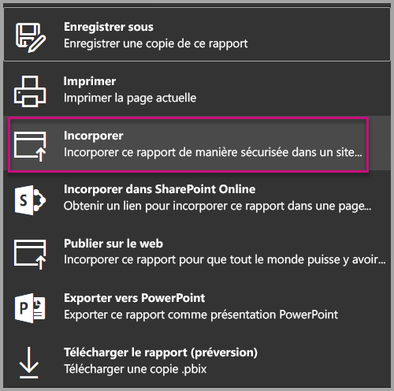

# <a name="embed-a-report-in-a-secure-portal-or-website"></a>Incorporer un rapport dans un site web ou portail sécurisé

La nouvelle option **Incorporer** sécurisée pour les rapports dans Power BI permet aux utilisateurs d’incorporer facilement et en toute sécurité des rapports dans les portails web internes, qu’ils soient **basés sur cloud** ou **hébergées en local**, comme SharePoint 2019. Les rapports incorporés de cette façon respectent toutes les autorisations d’élément et les données de sécurité via la sécurité au niveau des lignes (RLS). La fonctionnalité est conçue pour permettre l’intégration sans code dans n’importe quel portail qui accepte l’incorporation d’une URL ou d’un iFrame.

L’option **Incorporer** également prend en charge les [filtres URL](service-url-filters.md) et les paramètres d’URL. L’option **Incorporer** vous permet d’intégrer les portails à l’aide d’une approche avec peu de code qui nécessite une connaissance élémentaire de HTML et de JavaScript.

## <a name="how-to-embed-power-bi-reports-into-portals"></a>Comment **incorporer** des rapports Power BI dans des portails

1. La nouvelle option **Incorporer** est disponible dans le menu **Fichier** pour les rapports dans le service Power BI.

    

2. Sélectionnez l’option Incorporer pour ouvrir une boîte de dialogue qui fournit un lien et un iFrame utilisé pour incorporer le rapport en toute sécurité.

    

3. Après avoir incorporé votre URL dans votre portail web, ou si vous ouvrez directement l’URL, l’utilisateur est authentifié avant d’accéder au rapport. Ci-dessous, l’utilisateur ne s’est pas connecté à Power BI dans la session de navigateur. Lorsqu’il appuie sur **Connexion**, l’ouverture d’une nouvelle fenêtre de navigateur ou d’un nouvel peut être nécessaire. Vérifiez les bloqueurs de fenêtres contextuelles si vous n’êtes pas invité à vous connecter.

    

4. Une fois que l’utilisateur s’est connecté, le rapport s’ouvre, affichant les données et permettant aux utilisateurs de naviguer entre les pages et de définir des filtres. Le rapport est uniquement accessible aux utilisateurs qui sont autorisés à l’afficher dans Power BI. Toutes les règles de sécurité au niveau des lignes (RLS) sont également appliquées. Enfin, l’utilisateur doit disposer d’une licence correcte. Il doit avoir une licence Power BI Pro, ou le rapport doit être dans un espace de travail qui se trouve dans une capacité Power BI Premium. L’utilisateur doit se connecter chaque fois qu’il ouvre une nouvelle fenêtre de navigateur, mais une fois qu’il s’est connecté une fois les autres rapports se chargent automatiquement.

    

5. Lorsque vous utilisez l’option iFrame, il est préférable de modifier le code HTML fourni pour spécifier la hauteur et la largeur souhaitées selon la page web de votre portail.

    

## <a name="granting-access-to-reports"></a>Accorder l’accès aux rapports

L’option Incorporer ne permet pas automatiquement aux utilisateurs d’afficher le rapport. Les autorisations pour afficher le rapport sont définies dans le service Power BI.

Pour fournir l’accès au rapport dans le service Power BI, vous pouvez partager le rapport avec les utilisateurs qui ont besoin d’accéder au rapport incorporé. Si vous utilisez un groupe Office 365, vous pouvez répertorier l’utilisateur en tant que membre de l’espace de travail d’application dans le service Power BI. Pour plus d’informations sur la gestion d’un espace de travail d’application, consultez [Gérer l’espace de travail de votre application](service-manage-app-workspace-in-power-bi-and-office-365.md).

## <a name="licensing"></a>Licensing

Les utilisateurs affichant le rapport incorporé ont besoin au choix d’une licence Power BI Pro ou le contenu doit se trouver dans un espace de travail qui se trouve dans une [capacité Power BI Premium (référence SKU EM ou P)](service-admin-premium-purchase.md).

## <a name="customize-your-embed-experience-using-url-settings"></a>Personnaliser votre expérience d’incorporation à l’aide des paramètres d’URL

L’URL d’incorporation prend en charge plusieurs paramètres d’entrée qui vous aident à personnaliser votre expérience utilisateur. Si vous utilisez l’iFrame fourni, assurez-vous de mettre à jour l’URL dans les paramètres src de l’iFrame.

| Propriété  | Description  |  |  |  |
|--------------|-----------------------------------------------------------------------------------------------------------------------------------------------------------------------------------------------------------------------|---|---|---|
| pageName  | Vous pouvez utiliser le paramètre de chaîne de requête **pageName** pour définir la page du rapport à ouvrir. La valeur **pageName** correspond à la fin de l’URL du rapport lorsque vous affichez un rapport dans le service Power BI, comme indiqué ci-dessous. |  |  |  |
| Filtres d’URL  | Vous pouvez utiliser des [filtres d’URL](service-url-filters.md) dans l’URL d’incorporation que vous avez reçue à partir de l’interface utilisateur de Power BI pour filtrer le contenu de l’objet incorporé. Ainsi, vous pouvez créer des intégrations avec peu de code et des connaissances de base de HTML et de JavaScript.  |  |  |  |

## <a name="set-which-page-opens-when-the-report-is-embedded"></a>Définir la page qui s’ouvre lorsque le rapport est incorporé

La valeur fournie dans le paramètre *pageName* correspond à la fin de l’URL du rapport lorsque vous affichez un rapport dans le service Power BI.

1. Ouvrez le rapport à partir du service Power BI dans votre navigateur web et copiez l’URL à partir de la barre d’adresses.

    

2. Ajoutez le paramètre *pageName* à l’URL.

    

## <a name="filter-report-content-using-url-filters"></a>Filtrer le contenu du rapport à l’aide de filtres d’URL

Pour certaines fonctionnalités avancées, vous pouvez utiliser des [filtres d’URL](service-url-filters.md) pour générer plus d’expériences à l’aide du rapport. Par exemple, l’URL ci-dessous filtre le rapport pour afficher les données pour le secteur de l’énergie.

L’utilisation de la combinaison de **pageName** et de [filtres d’URL](service-url-filters.md) peut être très puissante. Vous pouvez créer des expériences à l’aide de code HTML et JavaScript de base.

Par exemple, voici comment vous pouvez ajouter un bouton à une page HTML :

```html
<button class="textLarge" onclick='show("ReportSection", "Energy");' style="display: inline-block;">Show Energy</button>
```

Lorsque l’utilisateur appuie dessus, le bouton appelle une fonction pour mettre à jour l’iFrame avec une URL mise à jour, qui inclut le filtre pour le secteur de l’énergie.

```javascript
function show(pageName, filterValue)

{

var newUrl = baseUrl + "&pageName=" + pageName;

if(null != filterValue && "" != filterValue)

{

newUrl += "&$filter=Industries/Industry eq '" + filterValue + "'";

}

//Assumes there’s an iFrame on the page with id=”iFrame”

var report = document.getElementById("iFrame")

report.src = newUrl;

}
```


Vous pouvez ajouter autant de boutons que vous le souhaitez pour créer une expérience personnalisée avec peu de code. 

## <a name="considerations-and-limitations"></a>Considérations et limitations

* Ne prend pas en charge les utilisateurs invités externes avec Azure B2B.

* L’incorporation sécurisée fonctionne pour les rapports publiés sur le service Power BI.

* L’utilisateur doit se connecter pour afficher le rapport à chaque fois qu’il ouvre une nouvelle fenêtre de navigateur.

* Certains navigateurs vous obligent à actualiser la page après la connexion, en particulier lorsque vous utilisez les modes InPrivate ou Incognito.

* Pour obtenir une expérience d’authentification unique, utilisez l’option Incorporer dans SharePoint Online, ou générez une incorporation personnalisée à l’aide de l’approche [les données appartiennent à l’utilisateur](developer/embed-sample-for-your-organization.md). En savoir plus sur [les données appartiennent à l’utilisateur](developer/embed-sample-for-your-organization.md).

* La fonctionnalité d’authentification automatique fournie avec l’option **Incorporer** ne fonctionne pas avec l’API JavaScript Power BI. Pour l’API JavaScript Power BI, utilisez l’approche [les données appartiennent à l’utilisateur](developer/embed-sample-for-your-organization.md) pour l’incorporation. En savoir plus sur [les données appartiennent à l’utilisateur](developer/embed-sample-for-your-organization.md).

## <a name="next-steps"></a>Étapes suivantes

* [Méthodes de partage du travail](service-how-to-collaborate-distribute-dashboards-reports.md)

* [Filtres d’URL](service-url-filters.md)

* [Composant web du rapport SharePoint Online](service-embed-report-spo.md)

* [Publication sur le web](service-publish-to-web.md)