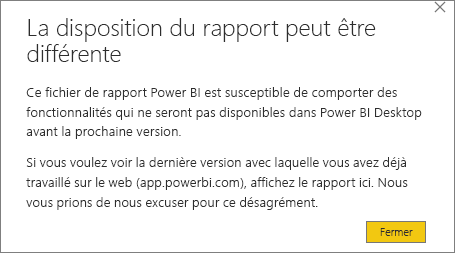
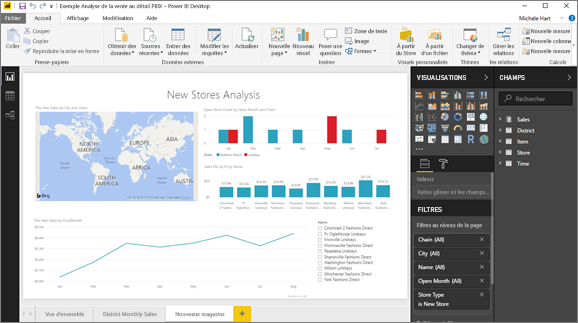

# Exporter un rapport du service Power BI vers Power BI Desktop (version préliminaire)
Dans Power BI Desktop, vous pouvez exporter (*télécharger*) un rapport dans le service Power BI en l’enregistrant et en sélectionnant **Publier**. Vous pouvez également exporter dans l’autre sens également et télécharger un rapport du service Power BI vers Power BI Desktop. L’extension des fichiers en cours d’exportation, dans les deux directions, est *.pbix*.

Il existe quelques limites et considérations à prendre en compte (voir plus loin dans cet article).

## Télécharger le rapport au format .pbix
Pour télécharger le fichier .pbix, procédez comme suit :

1. Dans le **service Power BI**, ouvrez le rapport que vous souhaitez télécharger en [mode Edition](consumer/end-user-reading-view.md).
2. Dans la barre de menus, sélectionnez **Fichier > Télécharger le rapport**.
   
   > [!NOTE]
   > Pour être téléchargeable, le rapport doit avoir été [créé avec Power BI Desktop](guided-learning/publishingandsharing.yml?tutorial-step=2) après le 23 novembre 2016 et mis à jour depuis. Sinon, l’option de menu *Télécharger le rapport* dans le service Power BI apparaît en grisé.
   > 
   > 
3. Lorsque le fichier .pbix est en cours de création, une bannière d’état affiche la progression. Lorsqu’il est prêt, vous êtes invité à l’ouvrir ou l’enregistrer. Le nom du fichier correspond au titre du rapport.
   
    
   
    Vous avez maintenant la possibilité d’ouvrir le fichier .pbix dans le service Power BI (app.powerbi.com) ou dans Power BI Desktop.     
4. Pour ouvrir immédiatement le rapport sur Power BI Desktop, sélectionnez **Ouvrir**. Pour enregistrer le fichier dans un emplacement spécifique, sélectionnez **Enregistrer > Enregistrer sous**. Si vous ne l’avez pas déjà fait, installez [Power BI Desktop](desktop-get-the-desktop.md).
   
    Lorsque vous ouvrez le rapport dans Power BI Desktop, un message d’avertissement peut vous faire savoir que certaines fonctionnalités disponibles dans le rapport du service Power BI ne sont peut-être pas disponibles dans Power BI Desktop.
   
    

5. L’éditeur de rapport dans le service Power BI et l’éditeur de rapport dans Power BI Desktop sont très similaires.  
   
    

## Considérations et résolution des problèmes
Voici quelques considérations et limitations associées au téléchargement (à l’exportation) d’un fichier *.pbix* à partir du service Power BI.

* Pour télécharger le fichier, vous devez disposer des droits de modification sur le rapport.
* Le rapport doit avoir été créé avec **Power BI Desktop** et *publié* sur le **service Power BI** ; à défaut, le .pbix doit avoir été *chargé* dans le service.
* Les rapports doivent être publiés ou mis à jour après le 23 novembre 2016. Les rapports publiés avant cette date ne sont pas téléchargeables.
* Cette fonctionnalité ne fonctionne pas avec les rapports créés à l’origine dans le **service Power BI**, y compris les packs de contenu.
* Vous devez toujours utiliser la dernière version de **Power BI Desktop** lors de l’ouverture des fichiers téléchargés. Il se peut que les fichiers *.pbix* téléchargés ne s’ouvrent pas dans des anciennes versions de **Power BI Desktop**.
* Si votre administrateur a désactivé la possibilité d’exporter des données, cette fonctionnalité n’est pas visible dans le **service Power BI**.
* Vous ne pouvez pas télécharger un jeu de données avec une actualisation incrémentielle dans un fichier *.pbix*.

## Étapes suivantes
Regardez la vidéo d’une minute **Guy in a Cube** qui présente cette fonctionnalité :

<iframe width="560" height="315" src="https://www.youtube.com/embed/ymWqU5jiUl0" frameborder="0" allowfullscreen></iframe>

En outre, voici quelques articles supplémentaires qui peuvent vous aider à apprendre à utiliser le **service Power BI** :

* [Rapports dans Power BI](consumer/end-user-reports.md)
* [Power BI – Concepts de base](consumer/end-user-basic-concepts.md)

Après avoir installé **Power BI Desktop**, consultez le contenu suivant pour apprendre à maîtriser l’application :

* [Prise en main de Power BI Desktop](desktop-getting-started.md)

D’autres questions ? [Posez vos questions à la communauté Power BI](http://community.powerbi.com/)   

