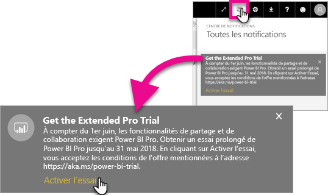
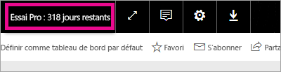

# Activation de l’essai Pro prolongé
À partir du 1er juin 2017, tous les utilisateurs éligibles pourront choisir l’essai Pro prolongé du service Power BI.

<iframe width="640" height="360" src="https://www.youtube.com/embed/tPsNoPyY9aA?showinfo=0" frameborder="0" allowfullscreen></iframe>

Lors de l’[annonce de Power BI Premium, le 3 mai  2017](https://powerbi.microsoft.com/blog/microsoft-accelerates-modern-bi-adoption-with-power-bi-premium/), Microsoft a communiqué les modifications du service Power BI gratuit effectives à compter du 1er juin 2017. Ces modifications incluent l’extension de l’accès à toutes les sources de données, des limites de stockage supérieures pour l’espace de travail et des vitesses d’actualisation et de diffusion  en continu plus élevées pour le service gratuit, ce qui fait de ce service l’équivalent de Power BI Pro.

Il a également été annoncé que les fonctions de partage et de collaboration seront réservées aux utilisateurs de Power BI Pro, notamment le partage de tableau de bord d’égal à égal, les espaces de travail de groupe (maintenant appelés espaces de travail d’application), l’exportation vers PowerPoint et l’analyse dans Excel avec les applications Power BI. L’exportation vers CSV/Excel et PowerPoint a été identifiée dans la communication du 3 mai comme une fonctionnalité limitée à Power BI Pro, mais après réception de commentaires de la communauté élargie des utilisateurs, la stratégie a évolué de manière à rendre la fonction disponible également pour les utilisateurs du service gratuit.

À compter du 1er juin 2017, les utilisateurs existants du service gratuit qui ont été actifs au cours de l’année précédente (ou avant le 2 mai 2017) seront éligibles pour un essai gratuit prolongé de 12 mois de Power BI Pro. Cette offre permettra aux utilisateurs de tirer parti de toutes les fonctionnalités de Power BI Pro pendant l’année à venir, en guise de remerciement envers la communauté et pour laisser aux utilisateurs le temps de s’adapter aux modifications.

Le 1er juin 2017, quand ils se connecteront au service, les utilisateurs éligibles recevront une notification les informant que les modifications sont entrées en vigueur, avec un message les invitant à s’inscrire pour bénéficier de l’offre d’essai prolongé de Power BI Pro. L’administrateur informatique d’un utilisateur ne contrôle pas les notifications dans le produit et l’administrateur informatique ne peut pas s’inscrire à l’offre d’essai prolongé de Power BI Pro pour le compte d’un utilisateur. Chaque utilisateur éligible doit agir individuellement pour effectuer ce processus.

Les utilisateurs peuvent choisir de s’inscrire à l’offre à tout moment pendant la période de 12 mois, mais l’essai Pro prolongé prendra fin pour tous les utilisateurs le 31 mai 2018, quelle que soit la date à laquelle ils auront accepté l’offre. Les utilisateurs auront alors la possibilité soit d’acheter Power BI Pro soit de passer à la version gratuite de Power BI, sans les fonctionnalités de collaboration et de partage, s’ils choisissent de ne pas agir en achetant Power BI Pro.

Aucune modification n’est apportée à Power BI Pro. Ces utilisateurs ne seront pas affectés et ne recevront pas de notifications lorsqu’ils se connecteront au service le 1er juin 2017 ou ultérieurement. Les utilisateurs qui refusent l’offre d’essai prolongé de Power BI Pro ou ne sont pas éligibles pour l’offre continueront d’utiliser la version gratuite de Power BI, sans les fonctionnalités de collaboration et de partage. Ils pourront s’inscrire à tout moment pour l’essai standard de Power BI Pro de 60 jours en visitant le [site Web](https://powerbi.microsoft.com/get-started/) Power BI .

## Éligibilité à l’essai Pro prolongé
Votre compte doit remplir les conditions suivantes pour pouvoir bénéficier de l’offre d’essai Pro prolongé.

* Les utilisateurs de Power BI gratuit actifs entre le 3 mai 2016 et le 2 mai 2017 sont éligibles pour un essai Pro prolongé.
* Les utilisateurs qui ont déjà utilisé ou utilisent actuellement *la version d’évaluation Pro du produit valable pendant une période de 60 jours* restent éligibles pour l’essai Pro prolongé.

> [!NOTE]
> Les utilisateurs qui détiennent une licence pour Power BI Pro ou la version d’évaluation de Power BI Pro obtenue depuis Office 365 sont exclus de cette offre.
> 
> 

## Comment effectuer l’activation
Il existe deux façons d’activer l’essai Pro prolongé. Premièrement, lorsque vous vous connectez à Power BI. Si vous n’avez pas activé l’essai à ce moment-là, une option s’affichera également dans la zone de notification.

> [!NOTE]
> Les communications sur le produit ne sont pas contrôlées par l’administrateur et seront adressées aux utilisateurs éligibles.
> 
> 

### Expérience à la connexion
Lorsque vous vous connectez au service Power BI et que vous êtes éligible, un message s’affiche dans une fenêtre contextuelle. Sélectionnez **Activer la version d’évaluation** pour commencer l’essai Pro prolongé. Aucune action supplémentaire ne sera nécessaire.

Vous aurez ensuite la possibilité d’accéder à tous les tableaux de bord partagés et rapports existants pendant la durée de l’essai.

Si vous avez sélectionné **Pas maintenant**, l’essai Pro prolongé pourra être activé à tout moment jusqu’à la fin de la période d’évaluation, fixée au 31 mai 2018.

### Activation à une date ultérieure
Si vous avez fait disparaître la fenêtre contextuelle en sélectionnant **Pas maintenant**, l’essai Pro prolongé pourra être activé à tout moment jusqu’à la fin de la période d’évaluation, fixée au 31 mai 2018. Cela pourra se faire dans le **centre de notifications**.

Une notification concernant l’essai Pro prolongé s’affichera dans ce dernier. La notification sera disponible jusqu’à ce que l’utilisateur la fasse disparaître.

Dans la notification, vous pourrez sélectionner **Activer la version d’évaluation** pour commencer l’essai. Aucune action supplémentaire ne sera nécessaire.

Vous aurez ensuite la possibilité d’accéder à tous les tableaux de bord partagés et rapports existants pendant la durée de l’essai.

## Après l’activation
Après l’activation, vous voyez le nombre de jours restants dans votre période d’essai dans le coin supérieur droit.

Vous pouvez passer en revue les conditions dans les [termes et conditions de l’offre de période d’essai Pro prolongée](https://aka.ms/power-bi-trial). L’essai Pro prolongé est valable jusqu’au 31 mai 2018 pour tous les utilisateurs éligibles.

## Forum Aux Questions
**Que se passe-t-il pour les nouveaux utilisateurs qui se sont inscrits après le 3 mai 2017 ?**

Les utilisateurs qui se sont inscrits à Power BI (gratuit) à partir du 3 mai 2017 ne sont pas éligibles pour la version d’essai Pro prolongé. Ils peuvent cependant prétendre à la version d’essai Pro standard de 60 jours.

**Comment savoir quels utilisateurs de mon organisation sont éligibles pour la version d’essai Pro prolongé ?**

Il n’existe aucun moyen direct de le savoir, mais vous pouvez consulter le rapport Applications intégrées Azure Active Directory pour Power BI pour voir quels sont les utilisateurs actifs au sein de votre organisation sur les 30 derniers jours. Cela peut vous donner une idée des personnes qui sont susceptibles d’être éligibles. Pour plus d’informations, consultez la page [Trouver les utilisateurs Power BI qui se sont connectés](service-admin-access-usage.md).

Les utilisateurs actifs qui sont dans la période d’éligibilité et qui utilisent des licences gratuites recevront la notification. 

> [!NOTE]
> Le rapport Azure AD n’indique pas si un utilisateur utilise une version gratuite ou Pro dans Power BI. Il recense uniquement les utilisateurs qui se sont connectés à Power BI et à quel moment. Le fait qu’un utilisateur figure dans ce rapport ne signifie par forcément qu’il est éligible pour la version d’évaluation Pro prolongée.
> 
> 

**Les administrateurs peuvent-ils empêcher un utilisateur d’activer la version d’essai Pro prolongé ?**

Non. Les administrateurs n’ont aucun moyen d’empêcher les utilisateurs d’activer la version d’essai Pro prolongé ou la version d’essai de 60 jours en service de Power BI Pro.

## Étapes suivantes
[Termes et conditions de l’offre d’essai Pro prolongé](https://aka.ms/power-bi-trial)  
[Contrat du service Power BI pour les utilisateurs individuels](https://powerbi.microsoft.com/terms-of-service/)  
[Annonce de Power BI Premium](https://aka.ms/pbipremium-announcement)  
[Trouver les utilisateurs Power BI qui se sont connectés](service-admin-access-usage.md)

D’autres questions ? [Essayez d’interroger la communauté Power BI](https://community.powerbi.com/)

