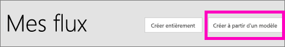
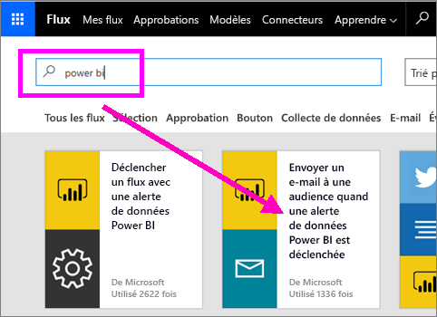
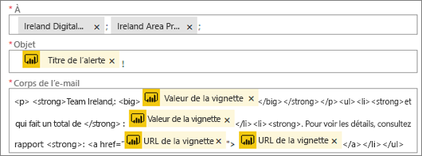
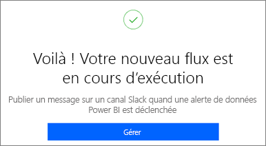
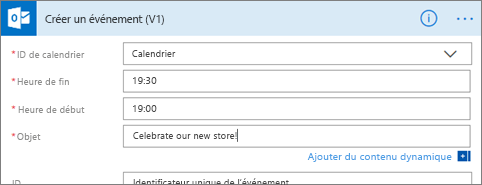

# Microsoft Flow et Power BI

[Microsoft Flow](https://flow.microsoft.com/en-us/documentation/getting-started) est une offre SaaS pour l’automatisation des flux de travail dans un nombre croissant d’applications et de services SaaS dont dépendent les utilisateurs professionnels. Flow vous permet d’automatiser des tâches en intégrant vos applications et services favoris (y compris Power BI) pour obtenir des notifications, synchroniser des fichiers, collecter des données et bien plus encore. Les tâches répétitives sont simplifiées grâce à l’automatisation des flux de travail.

[Prenez en main Flow dès maintenant.](https://flow.microsoft.com/documentation/getting-started)

Découvrez la façon dont Sirui crée un flux qui envoie un message détaillé à ses collègues quand une alerte Power BI est déclenchée. Suivez ensuite les instructions détaillées sous la vidéo pour essayer vous-même.

<iframe width="560" height="315" src="https://www.youtube.com/embed/YhmNstC39Mw" frameborder="0" allowfullscreen></iframe>

## Créer un flux déclenché par une alerte de données Power BI

### Conditions préalables
Ce didacticiel vous montre comment créer deux flux différents : un à partir d’un modèle et l’autre à partir de zéro. Pour la suite, [définissez une alerte de données dans Power BI](service-set-data-alerts.md), créez un compte Slack gratuit et [inscrivez-vous gratuitement à Microsoft Flow](https://flow.microsoft.com/en-us/#home-signup).

## Créer un flux qui utilise Power BI - à partir d’un modèle
Dans cette tâche, vous allez utiliser un modèle pour créer un simple flux qui est déclenché par une alerte de données Power BI (notification).

1. Connectez-vous à Microsoft Flow (flow.microsoft.com).
2. Sélectionnez **Mes flux**.
   
   
3. Sélectionnez **Créer à partir d’un modèle**.
   
    
4. Utilisez la zone de recherche pour trouver des modèles Power BI et sélectionnez **Envoyer un e-mail à n’importe quelle audience quand une alerte de données Power BI est déclenchée > Continuer**.
   
    

### Créer le flux
Ce modèle a un déclencheur (alerte de données Power BI en cas de nouvelles médailles olympiques pour l’Irlande) et une action (envoyer un e-mail). Lorsque vous sélectionnez un champ, Flow affiche du contenu dynamique que vous pouvez inclure.  Dans cet exemple, nous avons inclus la valeur de vignette et l’URL de vignette dans le corps du message.

1. Dans la liste déroulante des déclencheurs, sélectionnez une alerte de données Power BI. Sélectionnez **New medal for Ireland** (Nouvelle médaille pour l’Irlande). Pour savoir comment créer une alerte, voir [Alertes de données dans Power BI](service-set-data-alerts.md).
   
   
2. Entrez une ou plusieurs adresses e-mail valides, puis sélectionnez **Modifier** (voir ci-dessous) ou **Ajouter du contenu dynamique**. 
   
   

3. Flow crée un titre et un message que vous pouvez conserver ou modifier. Toutes les valeurs définies lors de la création de l’alerte dans Power BI sont utilisables : placez votre curseur dessus et sélectionnez-les dans la zone grise en surbrillance. 

   

1.  Par exemple, si vous avez créé le titre d’alerte **Nous avons gagné une autre médaille** dans Power BI, vous pouvez sélectionner **Titre de l’alerte** pour ajouter ce texte au champ Objet de votre adresse e-mail.

    

    De même, vous pouvez accepter le corps de l’e-mail par défaut ou créer le vôtre. Dans l’exemple ci-dessus, quelques modifications ont été apportées au message.

1. Lorsque vous avez terminé, sélectionnez **Créer un flux** ou **Enregistrer le flux**.  Le flux est créé et évalué.  Flow vous indique s’il trouve des erreurs.
2. S’il en détecte, sélectionnez **Modifier le flux** pour les corriger ; sinon, sélectionnez **Terminé** pour exécuter le nouveau flux.
   
   
5. Lorsque l’alerte de données se déclenche, un e-mail est envoyé aux adresses que vous avez indiquées.  
   
   

## Créer entièrement un flux qui utilise Power BI
Dans cette tâche, vous allez créer entièrement un simple flux qui est déclenché par une alerte de données Power BI (notification).

1. Connectez-vous à Microsoft Flow.
2. Sélectionnez **Mes flux** > **Créer entièrement**.
   
   
3. Utilisez la zone de recherche pour trouver un déclencheur Power BI et sélectionnez **Power BI - quand une alerte de données est déclenchée**.

### Créer votre flux
1. Dans la liste déroulante, sélectionnez le nom de l’alerte.  Pour savoir comment créer une alerte, voir [Alertes de données dans Power BI](service-set-data-alerts.md).
   
    
2. Sélectionnez **Nouvelle étape** > **Ajouter une action**.
   
   
3. Recherchez **Outlook** et sélectionnez **Créer un événement**.
   
   
4. Complétez les champs de l’événement. Lorsque vous sélectionnez un champ, Flow affiche du contenu dynamique que vous pouvez inclure.
   
   
5. Quand vous avez terminé, sélectionnez **Créer un flux**.  Flow enregistre et évalue le flux. S’il n’y a pas d’erreurs, sélectionnez **Terminé** pour exécuter ce flux.  Le nouveau flux est ajouté à votre page **Mes flux**.
   
   
6. Lorsque le flux est déclenché par l’alerte de données Power BI, vous recevez une notification d’événement Outlook semblable à celle-ci.
   
    

## Étapes suivantes
* [Prise en main de Microsoft Flow](https://flow.microsoft.com/en-us/documentation/getting-started/)
* [Définir des alertes de données dans le service Power BI](service-set-data-alerts.md)
* [Définir des alertes de données sur votre iPhone](mobile-set-data-alerts-in-the-mobile-apps.md)
* [Définir des alertes dans l’application mobile Power BI pour Windows 10](mobile-set-data-alerts-in-the-mobile-apps.md)
* D’autres questions ? [Posez vos questions à la communauté Power BI](http://community.powerbi.com/)

