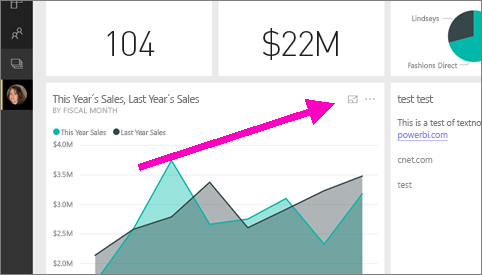
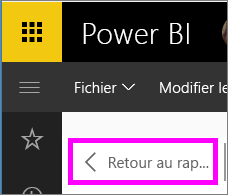

# Afficher une vignette de tableau de bord ou un élément visuel de rapport en mode Focus
<iframe width="560" height="315" src="https://www.youtube.com/embed/dtdLul6otYE" frameborder="0" allowfullscreen></iframe>

## Qu’est-ce que le mode Focus ?
Le mode ***Focus*** permet de développer (dans une nouvelle fenêtre) une vignette de tableau de bord ou un élément visuel de rapport, pour afficher plus de détails.  En mode Focus, vous pouvez afficher et modifier les filtres qui ont été appliqués lors de la création de ce visuel.  

> [!NOTE]
> Le mode Focus est différent du [mode Plein écran](service-tile-fullscreen-mode.md).
> 
> 

1. Placez le curseur sur la vignette ou l’élément visuel, puis sélectionnez l’icône du **mode Focus** .  
   
   
2. Il/elle s’ouvre et remplit la totalité du canevas. Le mode Focus pour les vignettes de tableau de bord et les visualisations de rapport est presque identique, mais il existe quelques différences. Par exemple, pour quitter le mode Focus dans un rapport, sélectionnez **Retour au rapport**. Pour quitter le mode Focus dans un tableau de bord, sélectionnez **Quitter le mode Focus**. Pour découvrir les autres différences, consultez **Considérations et résolution des problèmes** ci-dessous.
   
   
3. Développez le volet des filtres pour afficher tous les filtres appliqués à cet élément visuel.
   
   
4. Poursuivez votre exploration en modifiant les filtres. Si vous trouvez quelque chose d’intéressant, épinglez l’élément visuel à un tableau de bord.   
5. Fermez le mode Focus et revenez au tableau de bord en sélectionnant **< Quitter le mode focus** (dans le coin supérieur gauche du visuel).
   
        
   
    Fermez le mode Focus et revenez à la page de rapport en sélectionnant **Retour au rapport**.    
   
    

## Passer du mode Focus au mode plein écran
Une fois en mode Focus, la vignette ou le visuel peut être [affiché en mode Plein écran (mode TV).](service-tile-fullscreen-mode.md) Le mode Plein écran s’affiche pour ne pas vous distraire avec des menus et boutons de navigation.

## Considérations et résolution des problèmes
* Lorsque vous utilisez le mode Focus avec une visualisation dans un rapport, vous pouvez afficher et modifier tous les filtres : à savoir ceux de niveau visuel, page et rapport.    
* Lorsque vous utilisez le mode Focus avec une visualisation sur un tableau de bord, vous pouvez afficher et modifier uniquement les filtres de niveau visuel.

D’autres questions ? [Posez vos questions à la communauté Power BI](http://community.powerbi.com/)

