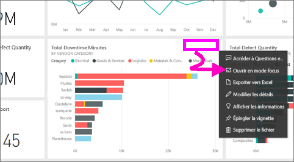
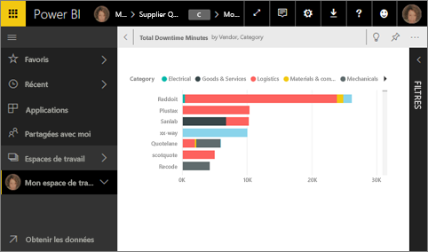
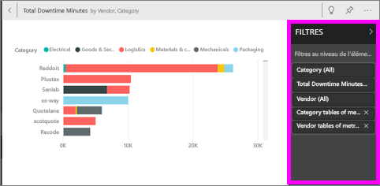
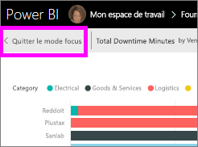

# Afficher une vignette de tableau de bord ou un visuel de rapport en mode Focus
<iframe width="560" height="315" src="https://www.youtube.com/embed/dtdLul6otYE" frameborder="0" allowfullscreen></iframe>

## Qu’est-ce que le mode Focus ?
Le mode ***Focus*** permet de développer (dans une nouvelle fenêtre) une vignette de tableau de bord ou un élément visuel de rapport, pour afficher plus de détails.  En mode Focus, vous pouvez afficher et modifier les filtres qui ont été appliqués lors de la création de ce visuel.  

> [!NOTE]
> Le mode Focus est différent du [mode Plein écran](service-fullscreen-mode.md).
> 
## Mode Focus pour les vignettes de tableau de bord
1. Pointez sur la visualisation de la vignette, sélectionnez les points de suspension (...) et choisissez **Ouvrir en mode Focus** 

    .
   
2. La vignette s’ouvre et remplit la totalité du canevas de rapport. 

   

3. Développez le volet des filtres pour afficher tous les filtres appliqués à cet élément visuel.
   
   

4. Poursuivez votre exploration en modifiant les filtres. Si vous trouvez quelque chose d’intéressant, épinglez l’élément visuel à un tableau de bord.

5. Fermez le mode Focus et revenez au tableau de bord en sélectionnant **< Quitter le mode focus** (dans le coin supérieur gauche du visuel).
   
        

## Mode Focus pour les visualisations de rapports

1. Pointez sur la visualisation de rapport, puis sélectionnez l’icône du **mode Focus** .  
   
   
2. La visualisation s’ouvre et remplit la totalité du canevas. 

   
   
3. Développez le volet des filtres pour afficher tous les filtres appliqués à cet élément visuel.
   
   
4. Poursuivez votre exploration en modifiant les filtres. Si vous trouvez quelque chose d’intéressant, épinglez l’élément visuel à un tableau de bord.   
5. Fermez le mode Focus et revenez au rapport en sélectionnant **Revenir au rapport** (dans le coin supérieur gauche du visuel). 
   
      

## Passer du mode Focus au mode plein écran
Une fois en mode Focus, la vignette ou l’élément visuel peut être [affiché en mode plein écran (mode TV).](service-fullscreen-mode.md) Le mode plein écran affiche la vignette seule, sans les menus et boutons de navigation susceptibles de vous distraire.

## Considérations et résolution des problèmes
* Lorsque vous utilisez le mode Focus avec une visualisation dans un rapport, vous pouvez afficher et modifier tous les filtres : au niveau de l’élément visuel, de la page et du rapport.    
* Lorsque vous utilisez le mode Focus avec une visualisation sur un tableau de bord, vous pouvez afficher et modifier uniquement les filtres au niveau de l’élément visuel.

D’autres questions ? [Posez vos questions à la communauté Power BI](http://community.powerbi.com/)

