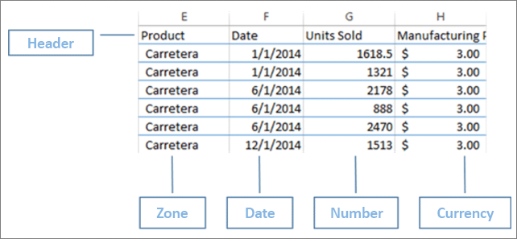
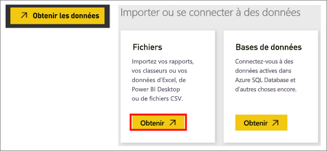
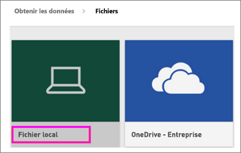
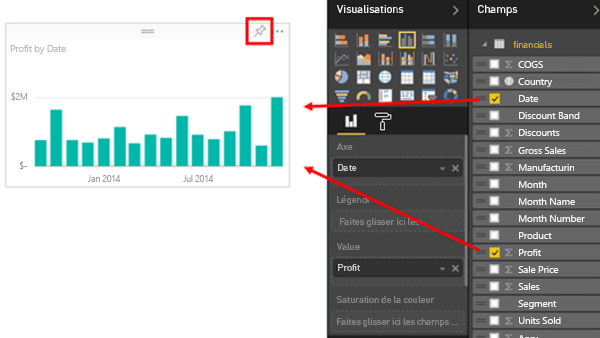
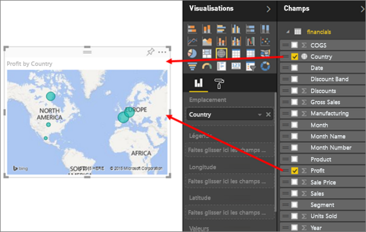
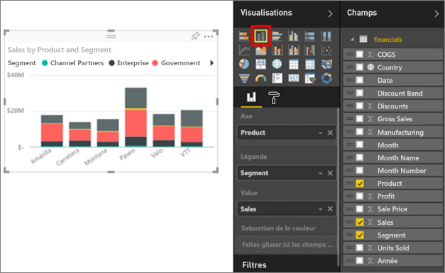
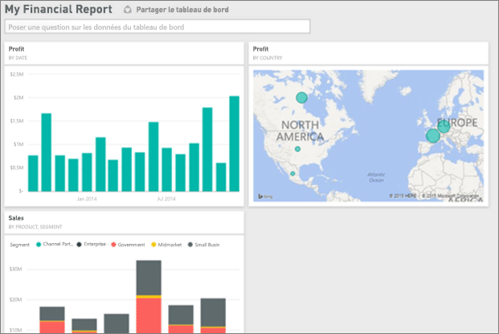
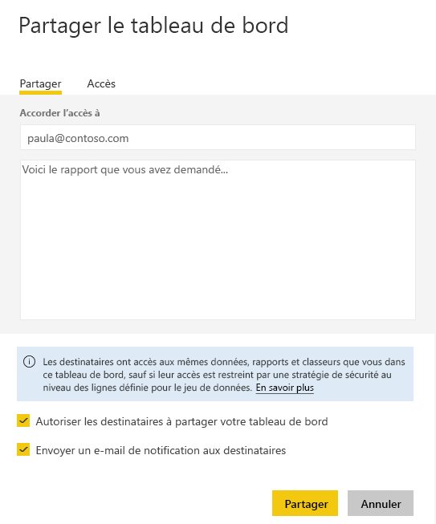

# Générer des rapports exceptionnels en un clin d’œil à partir d’un classeur Excel
Votre responsable attend de vous un rapport présentant vos chiffres de vente les plus récents et vos dernières impressions concernant la campagne avant la fin de la journée. Vos données les plus récentes sont stockées sur différents systèmes tiers et sur des fichiers de votre ordinateur portable. Auparavant, plusieurs heures étaient nécessaires pour créer des éléments visuels et mettre en forme un rapport. Vous commencez à vous inquiéter.

Tout va bien de passer. Avec Power BI, vous pouvez créer un rapport de superbe qualité sans délai.

Dans cet exemple, nous allons charger un fichier Excel à partir d’un système local, créer un rapport et le partager avec vos collègues, tout cela depuis Power BI.

## Préparez vos données
Prenons un simple fichier Excel comme exemple. Avant de charger votre fichier Excel dans Power BI, vous devez organiser vos données dans un « tableau plat ». Cela signifie que chaque colonne contient le même type de données, par exemple, du texte, des dates, des chiffres ou des devises. Vous devez disposer d’une ligne d’en-tête, mais aucune colonne ou ligne ne doit afficher des totaux.

Mettez ensuite en forme vos données sous forme de tableau : Dans Excel, sous l’onglet Accueil, dans le groupe Styles, sélectionnez **Mettre sous forme de tableau**. Sélectionnez un style de tableau à appliquer à votre feuille de calcul. Votre feuille de calcul Excel peut maintenant être chargée dans Power BI.

## Télécharger votre fichier Excel dans Power BI
Power BI se connecte à de nombreuses sources de données, y compris des fichiers Excel stockés sur votre ordinateur. Pour commencer, connectez-vous à Power BI. Si vous n’êtes pas encore inscrit, [vous pouvez le faire gratuitement](https://powerbi.com).

Vous voulez créer un tableau de bord. Ouvrez **Mon espace de travail**, puis sélectionnez l’icône **+ Créer**.

Sélectionnez **Tableau de bord**, entrez un nom, puis sélectionnez **Créer**. Le nouveau tableau de bord affiche, sans données.

En bas du volet de navigation de gauche, sélectionnez **Obtenir les données**. Sur la page Obtenir des données, sous Importer ou Se connecter aux données, dans la zone Fichiers, sélectionnez **Obtenir**.

Dans la page Fichiers, sélectionnez **Fichier local**. Accédez au classeur Excel sur votre ordinateur et sélectionnez-le pour le charger dans Power BI. Sélectionnez **Importer**.

> **REMARQUE** : pour suivre le reste de ce didacticiel, utilisez le [classeur d’exemple Financier](sample-financial-download.md).
> 
> 

## Créez votre rapport
Après que Power BI a importé le fichier Excel, commencez à créer votre rapport. Lorsque le message **Votre jeu de données est prêt** s’affiche, sélectionnez **Afficher le jeu de données**.  Power BI s’ouvre en mode Édition et affiche le canevas de rapport. À droite figurent les volets Visualisations, Filtres et Champs.

Notez que les données du tableau de votre classeur Excel s’affichent dans le volet Champs. Sous le nom du tableau, Power BI répertorie les en-têtes de colonne en tant que champs individuels.

Vous pouvez maintenant commencer à créer des visualisations. Votre responsable veut voir l’historique des bénéfices. Dans le volet Champs, faites glisser **Bénéfices** dans le canevas du rapport. Par défaut, Power BI affiche un graphique à barres. Ensuite, faites glisser **Date** dans le canevas du rapport. Power BI met à jour le graphique à barres pour afficher les bénéfices par date.

> **CONSEIL** : si votre graphique ne ressemble pas à celui attendu, vérifiez vos agrégations. Par exemple, dans la zone **Valeur**, cliquez avec le bouton droit sur le champ que vous venez d’ajouter et vérifiez que les données sont agrégées comme vous le souhaitez.  Dans notre exemple, nous utilisons **Somme**.
> 
> 

Votre responsable veut savoir quels pays sont les plus rentables. Imprimez-lui une visualisation de type Carte. Sélectionnez une zone vide sur le canevas et, dans le volet Champs, faites simplement glisser les champs **Pays** puis **Bénéfices**. Power BI crée un élément visuel de type Carte dont les bulles représentent les bénéfices relatifs de chaque emplacement.

Vous voulez afficher un élément visuel montrant les ventes par produit et segment ? C’est facile. Dans le volet Champs, sélectionnez les cases à cocher en regard des champs Vente, Bénéfices et Segment. Power BI crée immédiatement un graphique à barres. Modifiez le type de graphique en choisissant une icône dans le menu Visualisations. Par exemple, remplacez-le par un graphique à barres empilées.  Pour organiser le graphique, cliquez sur les points de suspension (...) > **Trier par**.

Épinglez tous vos éléments visuels à votre tableau de bord. Vous êtes prêt à partager ce dernier avec vos collègues.

## Partagez votre tableau de bord
Vous voulez partager votre tableau de bord avec Marie, votre responsable. Vous pouvez partager votre tableau de bord et le rapport sous-jacent avec vos collègues disposant d’un compte Power BI. Ceux-ci peuvent interagir avec votre rapport, mais ne peuvent pas enregistrer les modifications.

Pour partager votre rapport, en haut du tableau de bord, sélectionnez **Partager**.

Power BI affiche la page Partager le tableau de bord. Dans la zone située en haut, entrez l’adresse de messagerie des destinataires. Ajoutez un message dans le champ situé dessous. Pour autoriser les destinataires à partager votre tableau de bord avec d’autres personnes, sélectionnez l’option **Autoriser les destinataires à partager votre tableau de bord**. Sélectionnez **Partager**.

Étapes suivantes

* [Prise en main du service Power BI](service-get-started.md)
* [Prise en main de Power BI Desktop](desktop-getting-started.md)
* [Power BI – Concepts de base](service-basic-concepts.md)
* D’autres questions ? [Posez vos questions à la communauté Power BI](http://community.powerbi.com/)

