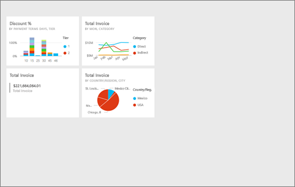
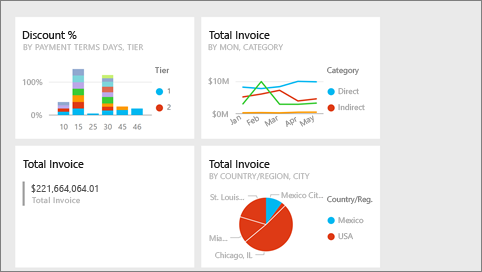
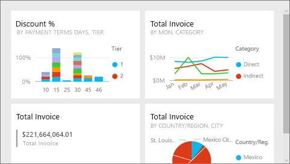
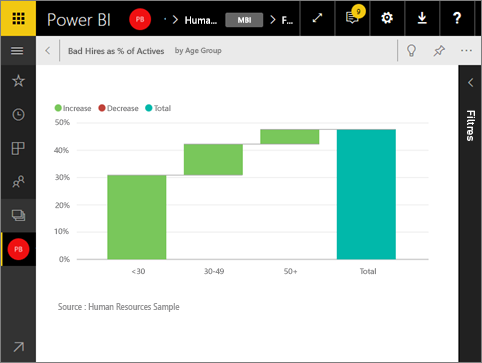

# Mode Plein écran dans Power BI
## Qu’est-ce que le mode plein écran ?

Affichez votre contenu (tableaux de bord, pages de rapport, vignettes et visualisations) sans vous laisser distraire par les menus et barres de navigation.  Vous disposez en permanence d’une vue instantanée complète, et sans fioritures, de votre contenu. Cet affichage est parfois appelé Mode TV. Les fonctionnalités disponibles en mode Plein écran varient selon le contenu.  

Le mode plein écran peut être utile pour les utilisations suivantes :

* Présentation de vos tableaux de bord, vignettes, éléments visuels ou rapports lors d’une réunion ou d’une conférence
* Affichage dans un bureau, à l’aide d’un grand écran dédié ou d’un projecteur
* Affichage sur un petit écran
* Consultation en mode verrouillé ; vous pouvez toucher l’écran ou passer le curseur de la souris sur les vignettes sans ouvrir le rapport ou le tableau de bord sous-jacent

> **REMARQUE** : Le mode Plein écran est différent du mode [Focus (Ouvrir dans une nouvelle fenêtre)](service-focus-mode.md).
> 
> 

Regardez Amanda ouvrir et parcourir son tableau de bord en mode plein écran, puis appliquer des paramètres d’URL pour contrôler l’affichage par défaut. Suivez ensuite les instructions détaillées sous la vidéo pour essayer vous-même.

<iframe width="560" height="315" src="https://www.youtube.com/embed/c31gZkyvC54" frameborder="0" allowfullscreen></iframe>

## Tableaux de bord et pages de rapport en mode Plein écran
1. Dans la barre de menus de Power BI située au-dessus de votre tableau de bord ou rapport, sélectionnez l’icône **icône Plein écran** . Le canevas de tableau de bord ou la page de rapport occupe tout l’écran. L’exemple ci-dessous est un tableau de bord.
   
      
2. En mode Plein écran, vous disposez de plusieurs options de menu.  Pour afficher le menu, déplacez votre souris ou le curseur. 
   
     Menu pour les tableaux de bord    
         
   
     Menu pour les pages de rapport    
        
   
        
    Utilisez le bouton **Précédent** pour accéder à la page précédente de votre navigateur. Si la page précédente était une page Power BI, elle s’affiche en mode Plein écran.  Le mode Plein écran est conservé jusqu’à ce que vous le fermiez.
   
        
    Utilisez ce bouton pour imprimer votre page de rapport ou tableau de bord en mode Plein écran. 
   
        
    Utilisez le bouton **Ajuster à l’écran** pour afficher votre tableau de bord à la taille maximale possible sans avoir recours à des barres de défilement.     
   
    
   
    Icône        
    Il arrive que les barres de défilement ne vous soient pas utiles mais que vous souhaitiez que le tableau de bord remplisse toute la largeur disponible. Sélectionnez le bouton **Ajuster à la largeur**.    
   
    
   
           
    Dans les rapports en mode Plein écran, utilisez ces flèches pour vous déplacer entre les pages du rapport.    
3. Pour quitter le mode Plein écran, sélectionnez l’icône **Quitter le plein écran**.
   
      

## Visualisations et vignettes de tableau de bord en mode Plein écran
1. Pour afficher des vignettes de tableau de bord et des visualisations de rapport en mode Plein écran, la vignette ou visualisation voulue doit déjà être en [mode Focus](service-focus-mode.md). 
   
    
2. Sélectionnez ensuite l’icône Plein écran   pour la vignette ou le visuel en question. La vignette ou le visuel s’affiche en plein écran sans menus ni barres de navigation.
   
    

## Étapes suivantes
[Tableaux de bord dans Power BI](service-dashboards.md)  
[Mode Focus pour les tableaux de bord et les vignettes de tableau de bord](service-focus-mode.md)    

D’autres questions ? [Posez vos questions à la communauté Power BI](http://community.powerbi.com/)

