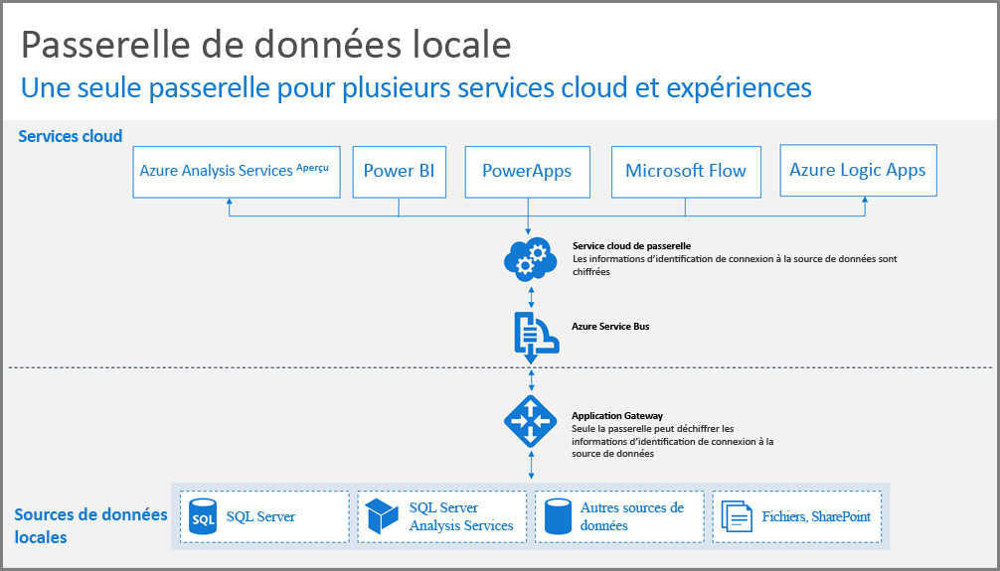
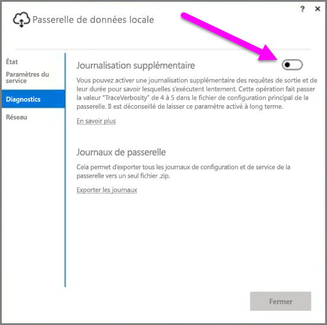
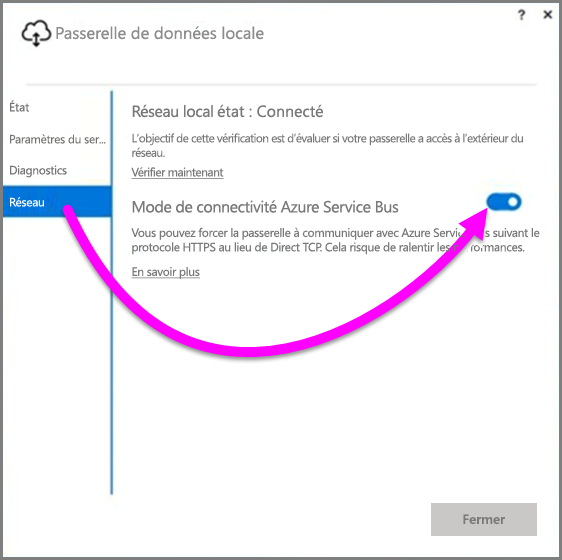
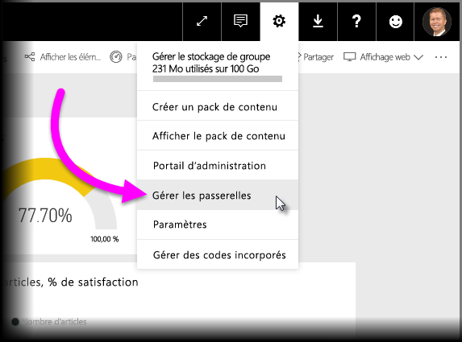

# Conseils relatifs au déploiement d’une passerelle de données pour Power BI

Cet article fournit des conseils et indications sur le déploiement d’une passerelle de données dans votre environnement réseau. Une **passerelle** est un logiciel qui facilite l’accès aux données résidant sur un réseau local privé en vue de leur utilisation ultérieure dans un service cloud tel que Power BI. Cet article décrit le processus de déploiement et fournit des conseils sur l’installation de la **passerelle de données locale**.

Pour obtenir plus d’informations sur la **passerelle de données locale**, ainsi qu’un lien d’installation, consultez le [billet de blog](https://powerbi.microsoft.com/blog/power-bi-gateways-march-update/).

## Installation de la passerelle de données locale
Avant d’entrer dans les détails de l’installation et du déploiement, différents éléments doivent être pris en compte. Les sections suivantes décrivent les principaux éléments à prendre en compte.

### Nombre d’utilisateurs
Le nombre d’utilisateurs qui utilisent un rapport par le biais de la passerelle est l’un des principaux critères à prendre en compte pour déterminer où installer la passerelle. Posez-vous les questions suivantes :

* Les utilisateurs utilisent-ils ces rapports à différents moments de la journée ?
* Quels types de connexions utilisent-ils (mode DirectQuery ou Importer) ?
* Tous les utilisateurs utilisent-ils le même rapport ?

Si tous les utilisateurs accèdent quotidiennement à un rapport donné au même moment, vous devez installer la passerelle sur un ordinateur capable de gérer toutes ces requêtes (reportez-vous aux sections suivantes pour en savoir plus sur les compteurs de performances et sur la configuration minimale requise).

Dans la mesure où **Power BI** n’autorise qu’*une* seule passerelle par *rapport*, même si un rapport repose sur plusieurs sources de données, toutes ces sources doivent transiter par une passerelle unique. Toutefois, si un tableau de bord repose sur *plusieurs* rapports, vous pouvez dédier une passerelle à chaque rapport contributeur afin de répartir la charge entre les différents rapports qui contribuent à ce tableau de bord.

### Type de connexion
**Power BI** propose deux types de connexion : **DirectQuery** et **Importer**. Certaines sources de données ne prennent pas en charge ces deux types de connexion, et vous pouvez être amené à choisir l’un plutôt que l’autre pour différentes raisons (exigences de sécurité, performances, limites de données, taille des modèle de données, etc.). Pour en savoir plus sur le type de connexion et sur les sources de données prises en charge, consultez la section *Liste des types de sources de données disponibles* de l’article [Passerelle de données locale](service-gateway-onprem.md).

Selon le type de connexion, l’utilisation de la passerelle peut être différente. Par exemple, dans la mesure du possible, vous devez tenter de séparer les sources de données **DirectQuery** des sources de données **Actualisation planifiée** (si elles se trouvent dans des rapports différents et qu’elles peuvent être séparées). Vous éviterez ainsi la mise en file d’attente de milliers de requêtes DirectQuery dans la passerelle au moment de l’actualisation matinale planifiée d’un modèle de données volumineux utilisé pour le tableau de bord principal de l’entreprise. Voici les éléments à prendre en compte pour les deux types de sources de données :

* Pour l’**Actualisation planifiée** : selon la taille de vos requêtes et le nombre d’actualisations quotidiennes, vous pouvez vous en tenir à la configuration matérielle minimale recommandée ou procéder à une mise à niveau vers un ordinateur plus performant. Si une requête donnée n’est pas traitée, des transformations interviennent sur l’ordinateur passerelle, d’où la nécessité de disposer d’une mémoire RAM suffisante sur celui-ci.
* Pour **DirectQuery** : une requête est envoyée chaque fois qu’un utilisateur ouvre le rapport ou examine des données. Par conséquent, si vous savez que plus de 1 000 utilisateurs risquent d’accéder simultanément aux données, veillez à ce que les composants matériels de votre ordinateur soient suffisamment robustes et fiables. Dans le cadre d’une connexion **DirectQuery**, un nombre accru de cœurs d’UC offre un meilleur débit.

La configuration requise pour l’ordinateur sur lequel vous installez une **passerelle de données locale** est la suivante :

**Configuration minimale :**

* .NET Framework 4.5
* Version 64 bits de Windows 7/Windows Server 2008 R2 (ou version ultérieure)

**Configuration recommandée :**

* Processeur 8 cœurs
* 8 Go de mémoire
* Version 64 bits de Windows 2012 R2 (ou version ultérieure)

### Emplacement
L’emplacement d’installation de la passerelle peut avoir un impact significatif sur les performances de vos requêtes. Par conséquent, veillez à ce que votre passerelle, les emplacements de vos sources de données et le locataire Power BI soient aussi proches que possible les uns des autres afin de minimiser les temps de réponse du réseau. Pour déterminer l’emplacement de votre locataire Power BI, dans le service Power BI, sélectionnez l’icône **?** en haut à droite de l’écran, puis choisissez **À propos de Power BI**.

### Surveillance des passerelles
Différents outils sont disponibles pour surveiller l’utilisation et les performances des passerelles installées.

#### Compteurs de performances
De nombreux compteurs de performances peuvent être utilisés pour évaluer et estimer l’activité de la passerelle. Les compteurs peuvent vous aider à déterminer l’importance d’un volume d’activités en fonction du type spécifique. Vous pouvez ainsi être invité à déployer une nouvelle passerelle.

> [!NOTE]
> Ces compteurs ne capturent pas la durée spécifique des tâches.
> 
> 

Outre les compteurs de votre ordinateur, le *compteur de la passerelle* vous donne une idée de la charge gérée par votre ordinateur et peut vous aider à déterminer si la capacité des ressources serveur est atteinte ou dépassée.

Ces compteurs sont accessibles à partir de l’**Analyseur de performances Windows** et peuvent être utilisés par les outils de création de rapports auxquels vous avez recours. Pour des instructions détaillées sur l’utilisation de l’analyseur de performances de la passerelle avec Power BI, consultez le billet de blog suivant.

* [Surveiller les passerelles de données locales](https://insightsquest.com/2016/08/08/monitor-on-premises-data-gateways/)

#### Journaux
Les journaux de configuration et de service fournissent d’autres informations sur le fonctionnement de votre passerelle. N’hésitez pas à consulter les journaux de votre passerelle si votre connexion ne fonctionne pas comme prévu, car le service Power BI n’affiche pas tous les messages d’erreur.

Pour afficher tous les fichiers journaux sur votre ordinateur local, la méthode la plus simple consiste à utiliser le bouton *Exporter les journaux* de la **passerelle de données locale** quand vous la rouvrez au terme de l’installation initiale, puis à sélectionner **Diagnostics > Exporter les journaux**.

#### Journalisation supplémentaire
Par défaut, la passerelle procède à une journalisation de base. Si vous recherchez les causes d’un problème de passerelle et souhaitez obtenir des informations détaillées sur la connexion à la requête, vous pouvez temporairement activer la *journalisation détaillée* afin de recueillir des informations supplémentaires. Pour ce faire, dans la passerelle installée, sélectionnez **Diagnostics > Journalisation supplémentaire**.

Selon l’utilisation de la passerelle, l’activation de ce paramètre peut considérablement augmenter la taille du journal. Par conséquent, une fois les journaux consultés, nous vous recommandons de désactiver la **journalisation supplémentaire**. Nous vous déconseillons de laisser ce paramètre activé dans le cadre de l’utilisation normale de la passerelle.

#### Configuration du réseau
La passerelle crée une connexion sortante vers **Azure Service Bus**. La passerelle communique sur des ports de sortie suivants :

* TCP 443 (par défaut)
* 5671
* 5672
* 9350 à 9354

La passerelle ne nécessite *pas* de ports d’entrée. Tous les ports requis sont répertoriés dans la liste ci-dessus.

Nous vous recommandons d’ajouter les adresses IP de votre région de données à la liste verte dans votre pare-feu. Vous pouvez télécharger la liste des adresses IP à partir de la [liste des adresses IP du centre de données Microsoft Azure](https://www.microsoft.com/download/details.aspx?id=41653). Cette liste est mise à jour toutes les semaines. La passerelle communique avec **Azure Service Bus** à l’aide de l’adresse IP spécifiée et du nom de domaine complet. Si vous forcez la passerelle à communiquer à l’aide du protocole HTTPS, elle utilise uniquement le nom de domaine complet, et aucune communication n’est établie au moyen des adresses IP.

#### Forcer les communications HTTPS avec Azure Service Bus
Vous pouvez forcer la passerelle à communiquer avec **Azure Service Bus** en utilisant HTTPS au lieu d’une connexion TCP directe. Mais cela réduit légèrement les performances. Vous pouvez également forcer la passerelle à communiquer avec **Azure Service Bus** en utilisant HTTPS à l’aide de l’interface utilisateur de la passerelle (à partir de la version de mars 2017 de la passerelle).

Pour ce faire, dans la passerelle, sélectionnez **Réseau**, puis définissez le paramètre **Mode de connectivité Azure Service Bus** sur **Activé**.

### Conseils supplémentaires
Cette section fournit des conseils supplémentaires sur le déploiement et la gestion des passerelles.

* Évitez d’avoir recours à un point de défaillance unique. Si possible, répartissez vos sources de données locales sur plusieurs passerelles ; ainsi, si un ordinateur devient indisponible, vous pouvez toujours actualiser une partie de vos données et cette fonctionnalité n’est pas intégralement perdue.
* Vous ne pouvez pas installer la passerelle sur un contrôleur de domaine.
* N’installez jamais une passerelle sur un ordinateur qui peut être mis hors tension ou en veille, ou qui risque d’être déconnecté d’Internet (comme un ordinateur portable), car l’exécution de la passerelle est alors impossible.
* Évitez d’installer une passerelle sur un réseau sans fil car les performances pourraient en pâtir.

#### Récupération de la passerelle
Vous pouvez récupérer votre passerelle existante ou la déplacer vers un nouvel ordinateur à l’aide de la **clé de récupération**. La clé de récupération est fournie à l’utilisateur qui installe la passerelle et elle *n’est pas* modifiable. La clé de récupération est à la fois utilisée pour le chiffrement des données et pour la récupération de la passerelle.

Pour récupérer votre passerelle, vérifiez que vous en êtes l’administrateur, que vous connaissez son nom, que vous disposez de la clé de récupération qui convient et qu’un nouvel ordinateur aux performances similaires est disponible.

Connectez-vous, puis sélectionnez l’option **Migrer une passerelle existante**. Choisissez la passerelle à récupérer ou migrer, entrez la clé de récupération, puis sélectionnez Configurer. Au terme de cette étape, l’ancienne passerelle est remplacée par la nouvelle, qui hérite de son nom et de toutes les sources de données précédemment configurées. Toutes les sources de données transitent alors par le nouvel ordinateur, sans qu’il soit nécessaire de republier quoi que ce soit. Le basculement automatique n’est pas encore pris en charge, mais l’équipe Passerelle y réfléchit.

#### Administrateurs
La liste des administrateurs de passerelles est disponible sur le **service Power BI**. Une fois que vous êtes connecté au service **Power BI**, sélectionnez **Paramètres** (icône d’engrenage) > **> Gérer les passerelles > Interface utilisateur des passerelles**.  

Il vous suffit alors de sélectionner une passerelle pour consulter la liste des administrateurs. Les administrateurs répertoriés peuvent accéder à la passerelle, la récupérer et la supprimer. Ils peuvent également ajouter et supprimer des sources de données. Pour vérifier que tous les administrateurs de l’organisation ont accès à l'ensemble des passerelles de leur groupe, suivez les recommandations ci-dessous :

* Créez un groupe de sécurité **AAD** et ajoutez-y d’autres utilisateurs, puis ajoutez ce groupe de sécurité à la liste des administrateurs de passerelles. Plusieurs personnes ont ainsi accès à la passerelle en cas de défaillance, ou en cas de nécessité de restauration ou de migration de celle-ci. En outre, les autres administrateurs voient les passerelles en cours d’utilisation dans leur groupe et les sources de données disponibles sur chaque passerelle.

## Étapes suivantes
[Configuration des paramètres de proxy](service-gateway-proxy.md)  
[Résolution des problèmes de passerelle de données locale](service-gateway-onprem-tshoot.md)  
[FAQ Passerelle de données locale](service-gateway-onprem-faq.md)  

D’autres questions ? [Posez vos questions à la communauté Power BI](http://community.powerbi.com/)

