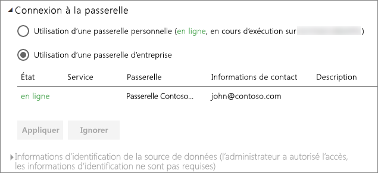

# Gérer votre source de données - Importation/actualisation planifiée

[!INCLUDE [gateway-rewrite](includes/gateway-rewrite.md)]

Une fois que vous avez [installé la passerelle de données locale](/data-integration/gateway/service-gateway-install), vous devez [ajouter des sources de données](service-gateway-data-sources.md#add-a-data-source) qui peuvent être utilisées avec la passerelle. Cet article examine comment travailler avec des passerelles et des sources de données utilisées pour l’actualisation planifiée, et non pas avec des connexions actives ou DirectQuery.

## Ajouter une source de données

Pour plus d’informations sur la façon d’ajouter une source de données, consultez [Ajouter une source de données](service-gateway-data-sources.md#add-a-data-source).

Tous les types de sources de données répertoriées peuvent être utilisés à des fins d’actualisation planifiée avec la passerelle de données locale. Vous pouvez utiliser Analysis Services, SQL Server et SAP HANA pour l’actualisation planifiée ou des connexions actives/DirectQuery.

Vous devez ensuite renseigner les informations relatives à la source de données, notamment les informations sur la source et les informations d’identification utilisées pour accéder à la source de données.

> [!NOTE]
> Toutes les requêtes à la source de données sont exécutées à l’aide de ces informations d’identification. Pour plus d’informations sur la façon dont les informations d’identification sont stockées, consultez [Stockage d’informations d’identification chiffrées dans le cloud](service-gateway-data-sources.md#storing-encrypted-credentials-in-the-cloud).

Pour obtenir la liste des types de sources de données qui peuvent être utilisées avec l’actualisation planifiée, consultez [Liste des types de sources de données disponibles](service-gateway-data-sources.md#list-of-available-data-source-types).

Sélectionnez **Ajouter** une fois toutes les informations renseignées. Vous pouvez à présent utiliser cette source de données pour l’actualisation planifiée avec vos données locales. L’indication *Connexion réussie* apparaît une fois la connexion établie.

### Paramètres avancés

Vous pouvez aussi configurer le niveau de confidentialité de votre source de données. Ceci contrôle la façon dont les données peuvent être combinées. Cette option concerne uniquement l’actualisation planifiée ; Pour plus d’informations sur les niveaux de confidentialité de votre source de données, consultez [Niveaux de confidentialité (Power Query)](https://support.office.com/article/Privacy-levels-Power-Query-CC3EDE4D-359E-4B28-BC72-9BEE7900B540).

## Utilisation de la source de données pour une actualisation planifiée

Une fois la source de données créée, elle peut être utilisée avec des connexions DirectQuery ou par le biais d’une actualisation planifiée.

> [!NOTE]
> Le nom du serveur et celui de la base de données doivent correspondre entre Power BI Desktop et la source de données dans la passerelle de données locale.

Le lien entre votre jeu de données et la source de données dans la passerelle est basé sur le nom de votre serveur et sur le nom de votre base de données. Ils doivent correspondre. Par exemple, si vous fournissez une adresse IP pour le nom du serveur, dans Power BI Desktop, vous devez utiliser l’adresse IP de la source de données dans la configuration de la passerelle. Si vous utilisez *SERVEUR\INSTANCE*, dans Power BI Desktop, vous devez utiliser la même valeur dans la source de données configurée pour la passerelle.

Si vous êtes listé sous l’onglet **Utilisateurs** de la source de données configurée dans la passerelle, et que le nom du serveur et celui de la base de données correspondent, la passerelle s’affiche comme option à utiliser avec l’actualisation planifiée.

> [!WARNING]
> Si votre jeu de données contient plusieurs sources de données, chaque source de données doit être ajoutée au sein de la passerelle. Si une ou plusieurs sources de données ne sont pas ajoutées à la passerelle, vous ne verrez pas la passerelle comme étant disponible pour l’actualisation planifiée.

## Limites

OAuth n’est pas un schéma d’authentification pris en charge avec la passerelle de données locale. Vous ne pouvez pas ajouter des sources de données qui nécessitent OAuth. Si votre jeu de données contient une source de données nécessitant OAuth, vous ne pourrez pas utiliser la passerelle pour une actualisation planifiée.

## Étapes suivantes

* [Résolution des problèmes de passerelle de données locale](/data-integration/gateway/service-gateway-tshoot)
* [Résoudre les problèmes liés aux passerelles - Power BI](service-gateway-onprem-tshoot.md)

D’autres questions ? [Posez vos questions à la communauté Power BI](http://community.powerbi.com/)
