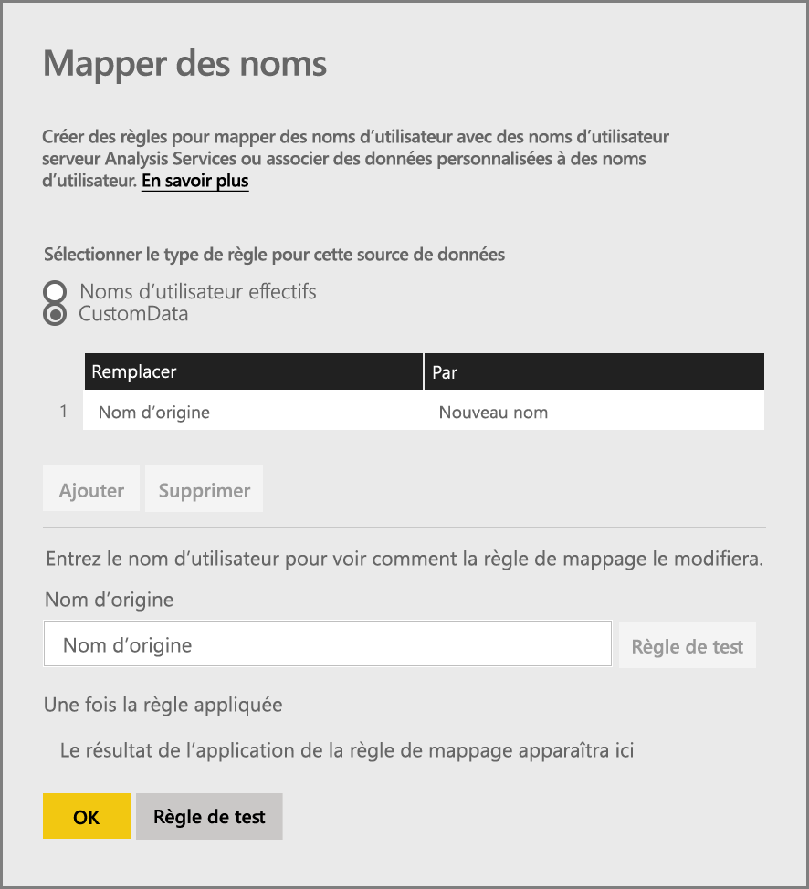
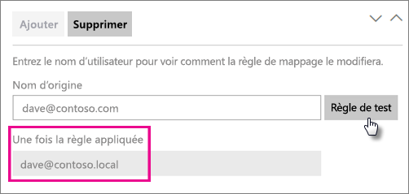
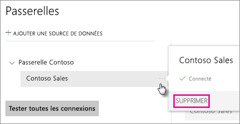
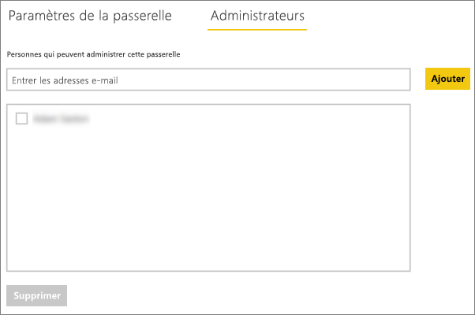
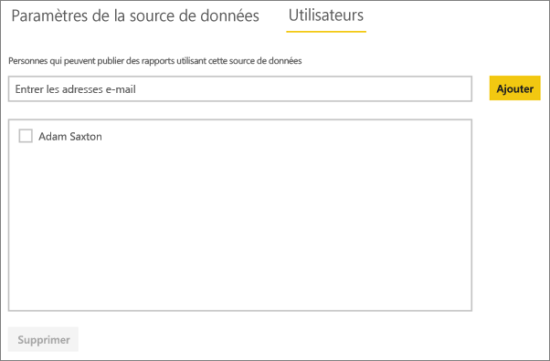

# Gérer votre source de données - Analysis Services
Une fois que vous avez installé la passerelle de données locale, vous devez ajouter des sources de données qui peuvent être utilisées avec la passerelle. Cet article décrit comment utiliser les passerelles et les sources de données. Vous pouvez utiliser la source de données Analysis Services pour l’actualisation planifiée ou les connexions actives.

<iframe width="560" height="315" src="https://www.youtube.com/embed/ownIGbcRAAU" frameborder="0" allowfullscreen></iframe>

## Télécharger et installer la passerelle
Vous pouvez télécharger la passerelle à partir du service Power BI. Sélectionnez **Téléchargements** > **Passerelle de données** ou accédez à la [page de téléchargement de la passerelle](https://go.microsoft.com/fwlink/?LinkId=698861).

## Limitations des connexions actives Analysis Services
Vous pouvez utiliser une connexion active à des instances tabulaires ou multidimensionnelles.

| **Version du serveur** | **Référence (SKU) requise** |
| --- | --- |
| 2012 SP1 CU4 ou version ultérieure |Business Intelligence et Enterprise |
| 2014 |Business Intelligence et Enterprise |
| 2016 |Référence (SKU) standard ou version ultérieure |

* Les fonctionnalités de mise en forme au niveau de la cellule et les fonctions de traduction ne sont pas prises en charge.
* Actions et jeux nommés ne sont pas exposés à Power BI, mais vous pouvez toujours vous connecter à des cubes multidimensionnels qui contiennent également les propriétés Actions ou Jeux nommés et créer des rapports et des éléments visuels.

## Ajouter une passerelle
Pour ajouter une passerelle, [téléchargez](https://go.microsoft.com/fwlink/?LinkId=698861) et installez la passerelle sur un serveur de votre environnement. Une fois la passerelle installée, elle apparaît dans les listes de passerelles sous **Gérer les passerelles**.

> [!NOTE]
> **Gérer les passerelles** n’apparaît pas si vous n’êtes pas administrateur d’au moins une passerelle. Pour cela, vous devez être ajouté en tant qu’administrateur ou installer et configurer une passerelle.
> 
> 

## Supprimez une passerelle
La suppression d’une passerelle entraîne celle de toutes les sources de données associées.  Elle entraîne également l’arrêt des éventuels tableaux de bord et rapports qui reposent sur ces sources de données.

1. Sélectionnez l’icône Engrenage  en haut à droite > **Gérer les passerelles**.
2. Passerelle > **Supprimer**
   
   

## Ajouter une source de données
Pour ajouter une source de données, sélectionnez une passerelle, puis cliquez sur **Ajouter une source de données**, ou accédez à Passerelle > **Ajouter une source de données**.

Vous pouvez ensuite sélectionner le **type de source de données** dans la liste. Sélectionnez Analysis Services si vous vous connectez à un serveur tabulaire ou multidimensionnel.

Vous devez ensuite renseigner les informations relatives à la source de données, notamment le **serveur** et la **base de données**.  

La passerelle utilise le **nom d’utilisateur** et le **mot de passe** que vous entrez pour se connecter à l’instance Analysis Services.

> [!NOTE]
> Le compte Windows que vous utilisez doit disposer des autorisations d’administrateur de serveur pour l’instance à laquelle vous vous connectez. Si le mot de passe de ce compte s’accompagne d’une date d’expiration, une erreur de connexion peut survenir si le mot de passe n’a pas été mis à jour pour la source des données. Pour plus d’informations, consultez l’article sur la passerelle de données locale principale qui indique la façon dont les [informations d’identification](service-gateway-onprem.md#credentials) y sont stockées.
> 
> 

Vous pouvez cliquer sur **Ajouter** après avoir renseigné toutes les informations.  Vous pouvez à présent utiliser cette source de données pour l’actualisation planifiée ou des connexions actives sur une instance Analysis Services locale.  L’indication *Connexion réussie* apparaît une fois la connexion établie.

### Paramètres avancés
Vous pouvez configurer le niveau de confidentialité de votre source de données pour contrôler le mélange (« mashup ») des données. Cette option concerne uniquement l’actualisation planifiée ; elle ne s’applique pas aux connexions actives. [En savoir plus](https://support.office.com/article/Privacy-levels-Power-Query-CC3EDE4D-359E-4B28-BC72-9BEE7900B540)

## Noms d’utilisateur avec Analysis Services
Chaque fois qu’un utilisateur interagit avec un rapport connecté à Analysis Services, le nom de l’utilisateur effectif est transmis à la passerelle, puis à votre serveur Analysis Services local. L’adresse de messagerie utilisée pour vous connecter à Power BI est celle que nous transmettrons à Analysis Services en tant qu’utilisateur effectif. Ces informations sont passées dans la propriété de connexion [EffectiveUserName](https://msdn.microsoft.com/library/dn140245.aspx#bkmk_auth). Cette adresse de messagerie doit correspondre à un nom UPN défini dans le domaine Active Directory local. L’UPN est une propriété de compte Active Directory. Ce compte Windows doit ensuite se trouver dans un rôle d’Analysis Services. S’il n’existe aucune correspondance dans Active Directory, la connexion est impossible. [En savoir plus](https://msdn.microsoft.com/library/ms677605.aspx)

Vous pouvez également mapper votre nom de connexion Power BI à un UPN (nom d’utilisateur principal) de répertoire local. [En savoir plus](service-gateway-enterprise-manage-ssas.md#map-user-names)

<iframe width="560" height="315" src="https://www.youtube.com/embed/Qb5EEjkHoLg" frameborder="0" allowfullscreen></iframe>

### Comment savoir quel est mon UPN ?
Vous ne savez pas peut-être pas quel est votre UPN, et vous n’êtes peut-être pas un administrateur de domaine. Vous pouvez utiliser la commande suivante à partir de votre station de travail pour connaître l’UPN de votre compte.

    whoami /upn

Le résultat ressemblera à une adresse de messagerie, mais il s’agit de l’UPN qui se trouve sur votre compte de domaine. Si vous utilisez une source de données Analysis Services pour les connexions actives, et si cela ne correspond pas à l’adresse de messagerie avec laquelle vous vous connectez à Power BI, vous souhaiterez peut-être examiner comment [Mapper des noms d’utilisateur](#map-user-names).

## Mapper des noms d’utilisateur
<iframe width="560" height="315" src="https://www.youtube.com/embed/eATPS-c7YRU" frameborder="0" allowfullscreen></iframe>

Vous pouvez mapper les noms d’utilisateur Analysis Services de deux manières :

1. Remappage manuel des utilisateurs 
2. Recherche de propriétés Active Directory locale pour remapper les UPN (nom d’utilisateur principal) AAD avec les utilisateurs Active Directory (mappage de recherche AD)

Bien qu’il soit possible d’effectuer un mappage manuel à l’aide de la deuxième approche, cette dernière est fastidieuse et difficile à gérer, notamment lorsque la mise en correspondance des modèles ne suffit pas, par exemple lorsque les noms de domaine sont différents entre AAD et AD en local ou lorsque les noms de compte d’utilisateur sont différents entre AAD et AD. Par conséquent, le mappage manuel avec la deuxième approche n’est pas recommandé.

Nous décrivons ces deux approches, dans l’ordre, dans les deux sections suivantes.

### Remappage manuel des noms d’utilisateur
Pour les sources de données Analysis Services, vous pouvez configurer des règles UPN (nom d’utilisateur principal) personnalisées. Cela vous aidera si vos noms de connexion au service Power BI ne correspondent pas à votre UPN de répertoire local. Par exemple, si vous vous connectez à Power BI avec john@contoso.com, mais que votre UPN de répertoire local est john@contoso.local, vous pouvez configurer une règle de mappage pour que john@contoso.local soit transmis à Analysis Services.

Pour accéder à l’écran de mappage de nom UPN, procédez comme suit.

1. Accédez à l’**icône Engrenage**, puis sélectionnez **Gérer les passerelles**.
2. Développez la passerelle qui contient la source de données Analysis Services. Ou, si vous n’avez pas créé la source de données Analysis Services, vous pouvez aussi le faire à ce stade.
3. Sélectionnez la source de données, puis sélectionnez l’onglet **Utilisateurs**.
4. Sélectionnez **Mapper les noms d’utilisateur**.
   
    

Vous verrez alors des options permettant d’ajouter des règles ainsi que d’effectuer un test pour un utilisateur donné.

> [!NOTE]
> Vous pouvez modifier par inadvertance un utilisateur alors que vous ne le vouliez pas. Par exemple, si votre valeur **Remplacer (Nom d’origine)** est *@contoso.com* et que votre valeur **Avec (Nouveau nom)** est *@contoso.local*, tous les utilisateurs disposant d’une connexion qui contient *@contoso.com* sont alors remplacés par *@contoso.local*. De plus, si votre valeur **Remplacer (Nom d’origine)** est *dave@contoso.com* et que votre valeur **Avec (Nouveau nom)** est *dave@contoso.local*, un utilisateur disposant d’une connexion v-dave@contoso.com serait envoyé en tant que v-dave*@contoso.local*.
> 
> 

### Mappage de recherche AD
Pour effectuer la recherche de propriétés Active Directory en local afin de remapper les UPN AAD avec les utilisateurs Active Directory, suivez les étapes de cette section. Pour commencer, voyons comment cela fonctionne.

Dans le **service Power BI**, voici ce qui se passe :

- Pour chaque requête effectuée par un utilisateur AAD Power BI à un serveur SSAS local, une chaîne d’UPN est transmise au format suivant :      firstName.lastName@contoso.com

> [!NOTE]
> Les mappages manuels d’utilisateurs UPN définis dans la configuration de la source de données Power BI sont toujours appliqués *avant* l’envoi de la chaîne de nom d’utilisateur à la passerelle de données locale.
> 
> 

Sur la passerelle de données locale avec le mappage d’utilisateur personnalisé configurable défini, procédez comme suit :

1. Recherchez le répertoire Active Directory à rechercher (automatique ou configurable)
2. Recherchez l’attribut de la personne AD (tel que le *courrier électronique*) en fonction d’une chaîne UPN entrante (« firstName.lastName@contoso.com ») à partir du **service Power BI**.
3. Si la recherche AD échoue, elle tente d’utiliser l’UPN transmis en tant qu’utilisateur effectif à SSAS.
4. Si la recherche AD réussit, elle récupère le nom d’utilisateur principal (*UserPrincipalName*) de cette personne AD. 
5. Elle transmet le courrier *UserPrincipalName* en tant que *EffectiveUser* à SSAS comme suit : *Alias@corp.on-prem.contoso*

Comment configurer votre passerelle pour qu’elle effectue la recherche AD :

1. Téléchargez et installez la passerelle la plus récente.
2. Dans la passerelle, vous devez modifier le **service de passerelle de données locale** pour qu’il s’exécute avec un compte de domaine (au lieu d’un compte de service local, sinon la recherche AD ne fonctionne pas correctement lors de l’exécution). Vous devez redémarrer le service de passerelle pour que les modifications entrent en vigueur.  Accédez à l’application de passerelle sur votre ordinateur (effectuez une recherche sur le terme « passerelle de données locale »). Pour ce faire, accédez à **Paramètres de service > Modifier le compte de service**. Vérifiez que vous disposez de la clé de récupération pour cette passerelle, car vous devrez la restaurer sur le même ordinateur, sauf si vous souhaitez créer une passerelle à la place. 
3. Accédez au dossier d’installation de la passerelle *C:\Program Files\Passerelle de données locale* en tant qu’administrateur pour vérifier que vous disposez d’autorisations d’écriture, puis modifiez le fichier suivant :
   
       Microsoft.PowerBI.DataMovement.Pipeline.GatewayCore.dll.config 
4. Modifiez les deux valeurs de configuration suivantes en fonction *des* configurations d’attributs Active Directory de vos utilisateurs AD. Les valeurs de configuration illustrées ci-dessous sont des exemples uniquement : vous devez les spécifier en fonction de votre configuration Active Directory. 
   
   
5. Redémarrez le service **Passerelle de données locale** pour que les modifications de configuration entrent en vigueur.

### Utilisation des règles de mappage
Pour créer une règle de mappage, entrez une valeur pour **Nom d’origine** et pour **Nouveau nom**, puis sélectionnez **Ajouter**.

| Champ | Description |
| --- | --- |
| Remplacer (nom d’origine) |Adresse e-mail avec laquelle que vous vous êtes connecté à Power BI. |
| Par (nouveau nom) |Valeur par laquelle vous voulez la remplacer. Le résultat du remplacement est ce qui sera passé à la propriété *EffectiveUserName* pour la connexion Analysis Services. |

Quand vous sélectionnez un élément dans la liste, vous pouvez choisir de modifier son ordre à l’aide des **icônes représentant des chevrons**, ou de **Supprimer** l’entrée.

### Utilisation de caractères génériques (\*)
Vous pouvez utiliser un caractère générique pour votre chaîne **Remplacer (nom d’origine)**. Il peut être utilisé seul uniquement, et non avec une autre partie de la chaîne. Cela vous permet de prendre tous les utilisateurs et de transmettre une valeur unique à la source de données. Cela est utile lorsque vous souhaitez que tous les utilisateurs de votre organisation utilisent le même utilisateur dans votre environnement local.

### Tester une règle de mappage
Vous pouvez valider ce par quoi un nom d’origine sera remplacé en entrant une valeur pour **Nom d’origine**, puis en sélectionnant **Tester la règle**.

> [!NOTE]
> Quelques minutes sont nécessaires avant que les règles enregistrées commencent à être utilisées par le service. Dans le navigateur, la règle fonctionne immédiatement.
> 
> 

### Limitations relatives aux règles de mappage
* Le mappage s’applique à la source de données spécifique en cours de configuration. Il ne constitue pas des paramètres globaux. Si vous avez plusieurs sources de données Analysis Services, vous devez mapper les utilisateurs pour chaque source de données.

## Supprimez une source de données.
La suppression d’une source de données entraîne l’arrêt des éventuels tableaux de bord ou rapports qui reposent sur la source de données en question.  

Pour supprimer une source de données, accédez à Source de données > **Supprimer**.

## Gérer les administrateurs
Sous l’onglet Administrateurs de la passerelle, vous pouvez ajouter et supprimer des utilisateurs (ou des groupes de sécurité) qui peuvent administrer la passerelle.

## Gérer les utilisateurs
Sous l’onglet Utilisateurs, pour la source de données, vous pouvez ajouter et supprimer des utilisateurs ou des groupes de données qui peuvent utiliser cette passerelle.

> [!NOTE]
> La liste des utilisateurs contrôle uniquement les personnes autorisées à publier des rapports. Les propriétaires des rapports peuvent créer des tableaux de bord ou des packs de contenu et les partager avec d’autres utilisateurs.
> 
> 

## Utilisation de la source de données
Une fois la source de données créée, elle peut être utilisée avec des connexions actives ou via une actualisation planifiée.

> [!NOTE]
> Le nom du serveur et celui de la base de données doivent correspondre entre Power BI Desktop et la source de données dans la passerelle de données locale.
> 
> 

Le lien entre votre jeu de données et la source de données dans la passerelle est basé sur le nom de votre serveur et sur le nom de votre base de données. Ils doivent correspondre. Par exemple, si vous fournissez une adresse IP pour le nom du serveur, dans Power BI Desktop, vous devez utiliser l’adresse IP de la source de données dans la configuration de la passerelle. Si vous utilisez *SERVEUR\INSTANCE*, dans Power BI Desktop, vous devez utiliser la même valeur dans la source de données configurée pour la passerelle.

C’est le cas pour les connexions actives et pour l’actualisation planifiée.

### Utilisation de la source de données avec des connexions actives
Vous devez vérifier que le nom du serveur et celui de la base de données correspondent entre Power BI Desktop et la source de données configurée pour la passerelle. Vous devez également vérifier que votre utilisateur est répertorié sous l’onglet **Utilisateurs** de la source de données afin de publier des jeux de données de connexion active. Pour les connexions actives, la sélection se produit dans Power BI Desktop la première fois que vous importez des données.

Une fois la publication effectuée, que ce soit à partir de Power BI Desktop ou de l’option **Obtenir les données**, vos rapports doivent commencer à fonctionner. Après la création de la source de données dans la passerelle, plusieurs minutes peuvent être nécessaires pour que la connexion puisse être utilisée.

### Utilisation de la source de données avec une actualisation planifiée
Si vous êtes répertorié sous l’onglet **Utilisateurs** de la source de données configurée dans la passerelle, et que le nom du serveur et celui de la base de données correspondent, la passerelle s’affiche comme option à utiliser avec l’actualisation planifiée.

## Étapes suivantes
[Passerelle de données locale](service-gateway-onprem.md)  
[Informations approfondies sur la passerelle de données locale](service-gateway-onprem-indepth.md)  
[Résolution des problèmes de passerelle de données locale](service-gateway-onprem-tshoot.md)  
D’autres questions ? [Posez vos questions à la communauté Power BI](http://community.powerbi.com/)

