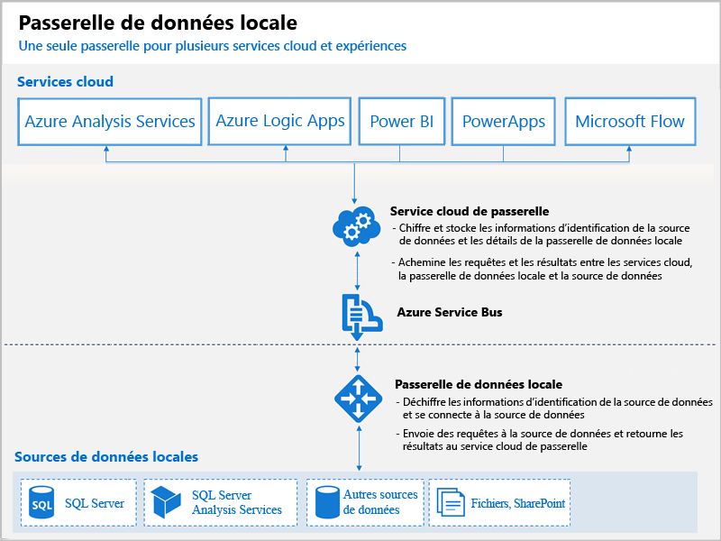

# Présentation des passerelles Power BI

Une passerelle Power BI est un logiciel qui s’installe sur un réseau local et facilite l’accès aux données de ce réseau. Il s’agit d’une sorte d’opérateur de contrôle qui écoute les demandes de connexion des utilisateurs et n’y accède que lorsqu’elles remplissent certains critères. Cela permet aux organisations de conserver les bases de données et d’autres sources de données sur leurs réseaux locaux, tout en utilisant en toute sécurité ces données locales dans les tableaux de bord et rapports Power BI.

Le diagramme suivant montre un aperçu général, dans lequel la passerelle gère les demandes provenant du cloud de trois ordinateurs locaux. Nous reviendrons dessus dans la suite de l’article.

## Types de passerelles

Power BI propose deux passerelles correspondant à deux scénarios différents :

* **Passerelle de données locale (mode personnel)**  : elle permet à un utilisateur de se connecter aux sources et ne peut pas être partagée avec d’autres utilisateurs. Elle peut être utilisée uniquement avec Power BI. Cette passerelle est adaptée aux scénarios dans lesquels vous êtes la seule personne qui crée des rapports et vous n’avez pas besoin de partager les sources de données avec d’autres utilisateurs.

* **Passerelle de données locale** : elle permet à plusieurs utilisateurs de se connecter à différentes sources de données locales. Elle est utilisable par Power BI, PowerApps, Flow, Azure Analysis Services et Azure Logic Apps, au sein d’une même installation de passerelle. Cette passerelle est particulièrement adaptée à des scénarios complexes, dans lesquels plusieurs utilisateurs accèdent à différentes sources de données. 

## Utiliser une passerelle

L’utilisation d’une passerelle passe par quatre grandes étapes :

1. **Installer la passerelle** sur un ordinateur local, suivant le mode adapté.
2. **Ajouter des utilisateurs à la passerelle**, afin qu’ils puissent accéder aux sources de données locales.
3. **Se connecter à des sources de données**, pour pouvoir les utiliser dans les rapports et tableaux de bord.
4. **Actualiser les données locales**, afin de maintenir les rapports Power BI à jour.

Il est possible d’installer une passerelle autonome ou d’ajouter une passerelle à un *cluster*, ce qui est recommandé dans un objectif de haute disponibilité.

## Comment fonctionnent les passerelles

La passerelle installée s’exécute comme un service Windows, la **passerelle de données locale**. Ce service local est inscrit auprès du service cloud de passerelle avec Azure Service Bus. Le diagramme suivant illustre le flux entre les données locales et les services cloud qui utilisent la passerelle.

Requêtes et flux de données :

1. Une requête est créée par le service de cloud avec les informations d’identification chiffrées de la source de données locale. Elle est ensuite envoyée à une file d’attente pour être traitée par la passerelle.
2. Le service cloud de passerelle analyse la requête et l’envoie (push) à Azure Service Bus.
3. La passerelle de données locale interroge Azure Service Bus pour savoir s’il existe des requêtes en attente.
4. La passerelle récupère la requête, déchiffre les informations d’identification et les utilise pour se connecter aux sources de données.
5. Elle envoie la requête à la source de données afin de l’exécuter.
6. Les résultats sont renvoyés à la passerelle, à partir de la source de données, puis sur le service cloud et votre serveur.

## Étapes suivantes
[Installer la passerelle de données locale](service-gateway-install.md)

D’autres questions ? [Posez vos questions à la communauté Power BI](http://community.powerbi.com/)

