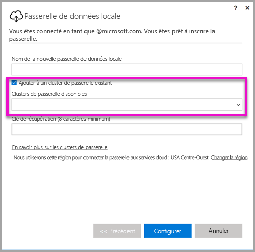

# <a name="high-availability-clusters-for-on-premises-data-gateway"></a>Clusters à haute disponibilité pour la passerelle de données locale
Vous pouvez créer des **clusters à haute disponibilité** d’installations de **passerelle de données locale**, pour vous assurer que votre organisation peut accéder aux ressources de données locales utilisées dans les tableaux de bord et rapports Power BI. Ces clusters permettent aux administrateurs de passerelles de regrouper les passerelles afin d’éviter des points de défaillance uniques lors de l’accès aux ressources de données locales. Cet article décrit les étapes à suivre pour créer un cluster à haute disponibilité de passerelles de données locales et partage les meilleures pratiques de configuration. Les clusters de passerelles à haute disponibilité nécessitent d’appliquer la mise à jour de novembre 2017 ( ou version ultérieure) à la passerelle de données locale.


## <a name="setting-up-high-availability-clusters-of-gateways"></a>Configuration de clusters à haute disponibilité de passerelles de données locales

Lors du processus d’installation de la **passerelle de données locale**, vous pouvez spécifier si la passerelle doit être ajoutée à un cluster de passerelles existant. 



Pour ajouter une passerelle à un cluster existant, vous devez fournir la *clé de récupération* de l’instance de la passerelle principale pour le cluster auquel la nouvelle passerelle sera jointe. La passerelle principale du cluster doit exécuter la mise à jour de passerelle de novembre 2017 ou ultérieure. 


## <a name="managing-a-gateway-cluster"></a>Gestion d’un cluster de passerelles

Une fois qu’un cluster de passerelles est composé de deux ou plusieurs passerelles, toutes les opérations de gestion des passerelles, telles que l’ajout d’une source de données ou l’octroi d’autorisations d’administration à une passerelle, s’appliquent à toutes les passerelles qui font partie du cluster. 

Quand les administrateurs utilisent l’élément de menu **Gérer les passerelles**, situé sous l’icône d’engrenage dans le **service Power BI**, ils voient la liste des clusters ou des passerelles, mais pas les instances de passerelles spécifiques qui sont membres du cluster.

Tous les nouvelles opérations DirectQuery et demandes **d’actualisation planifiée** sont automatiquement routées vers l’instance principale d’un cluster de passerelles donné. Si l’instance de passerelle principale n’est pas en ligne, la demande est routée vers une autre instance de passerelle dans le cluster.

## <a name="powershell-support-for-gateway-clusters"></a>Prise en charge par PowerShell des clusters de passerelles

Des scripts PowerShell sont disponibles dans le dossier d’installation de la passerelle de données locale. Par défaut, ce dossier se trouve dans *C:\Program Files\Passerelle de données locale*. Vous devez utiliser la version 5 ou ultérieure de PowerShell pour que ces scripts fonctionnent correctement. Les scripts PowerShell permettent aux utilisateurs d’effectuer les opérations suivantes :

-   Récupérer la liste des clusters de passerelles disponibles pour un utilisateur
-   Récupérer la liste des instances de passerelle inscrites dans un cluster, ainsi que leur état en ligne ou hors connexion
-   Modifier l’état Activé/désactivé d’une instance de passerelle dans un cluster, ainsi que d’autres propriétés de passerelle
-   Supprimer une passerelle

Pour exécuter les commandes PowerShell indiquées dans le tableau, vous devez tout d’abord suivre les étapes suivantes :

1. Ouvrez une fenêtre de commande PowerShell en tant qu’administrateur.
2. Exécutez ensuite la commande PowerShell suivante à usage unique (cela suppose que vous n’avez jamais exécuté de commandes PowerShell sur l’ordinateur actuel) :

    ```
    Set-ExecutionPolicy -ExecutionPolicy Unrestricted -Force
    ```

3. Ensuite, accédez au dossier d’installation de la passerelle de données locale dans la fenêtre PowerShell, puis importez le module nécessaire à l’aide de la commande suivante :

    ```
    Import-Module .\OnPremisesDataGatewayHAMgmt.psm1
    ```

Une fois que vous avez effectué ces étapes, vous pouvez utiliser les commandes indiquées dans le tableau suivant pour gérer vos clusters de passerelles.

| **Commande** | **Description** | **Paramètres** |
| --- | --- | --- |
| *Login-OnPremisesDataGateway* |Cette commande permet à un utilisateur de se connecter pour gérer ses propres clusters de passerelles de données locales.  Vous devez exécuter cette commande et vous connecter *avant* que les autres commandes de haute disponibilité puissent fonctionner correctement. Remarque : le jeton d’authentification AAD acquis dans le cadre d’un appel de connexion est uniquement valide pendant 1 heure, après quoi il expire. Vous pouvez réexécuter la commande de connexion pour acquérir un nouveau jeton.| Nom d’utilisateur AAD et mot de passe (fournis dans le cadre de l’exécution de la commande, et non lors de l’appel initial)|
| *Get-OnPremisesDataGatewayClusters* | Récupère la liste des clusters de passerelles pour l’utilisateur connecté. | Si vous le souhaitez, vous pouvez passer des paramètres de mise en forme de cette commande pour une meilleure lisibilité, par exemple : *Format-Table -AutoSize -Wrap* |
| *Get-OnPremisesDataClusterGateways* | Récupère la liste des passerelles dans le cluster spécifié, ainsi que des informations supplémentaires pour chaque passerelle (état en ligne/hors connexion, nom de l’ordinateur, etc.) | *-ClusterObjectID xyz* (où *xyz* est remplacé par une valeur réelle d’ID objet cluster, qui peut être récupérée à l’aide de la commande *Get-OnPremisesDataGatewayClusters*)|
| *Set-OnPremisesDataGateway* | Vous permet de définir les valeurs des propriétés d’une passerelle donnée dans un cluster, y compris la possibilité d’activer ou de désactiver une instance de passerelle spécifique  | *-ClusterObjectID xyz* (*xyz* doit être remplacé par une valeur d’ID objet cluster proprement dit, qui peut être récupérée à l’aide de la commande *Get-OnPremisesDataGatewayClusters*) *-GatewayObjectID abc*  (*abc* doit être remplacé par une valeur d’ID objet passerelle réelle, qui peut être récupérée à l’aide de la commande *Get-OnPremisesDataClusterGateways*, étant donné un ID d’objet cluster) |
| *Get-OnPremisesDataGatewayStatus* | Vous permet de récupérer l’état d’une instance de passerelle donnée au sein d’un cluster  | *-ClusterObjectID xyz* (*xyz* doit être remplacé par une valeur d’ID objet cluster proprement dit, qui peut être récupérée à l’aide de la commande *Get-OnPremisesDataGatewayClusters*) *-GatewayObjectID abc*  (*abc* doit être remplacé par une valeur d’ID objet passerelle réelle, qui peut être récupérée à l’aide de la commande *Get-OnPremisesDataClusterGateways*, étant donné un ID d’objet cluster) |
| *Remove-OnPremisesDataGateway*  | Vous permet de supprimer une instance de passerelle d’un cluster. Notez que la passerelle principale du cluster ne peut pas être supprimée tant que toutes les autres passerelles du cluster n’ont pas été supprimées.| *-ClusterObjectID xyz* (*xyz* doit être remplacé par une valeur d’ID objet cluster proprement dit, qui peut être récupérée à l’aide de la commande *Get-OnPremisesDataGatewayClusters*) *-GatewayObjectID abc*  (*abc* doit être remplacé par une valeur d’ID objet passerelle réelle, qui peut être récupérée à l’aide de la commande *Get-OnPremisesDataClusterGateways*, étant donné un ID d’objet cluster) |


## <a name="next-steps"></a>Étapes suivantes

-   [Gérer votre source de données - Analysis Services](service-gateway-enterprise-manage-ssas.md)  
-   [Gérer votre source de données - SAP HANA](service-gateway-enterprise-manage-sap.md)  
-   [Gérer votre source de données - SQL Server](service-gateway-enterprise-manage-sql.md)  
-   [Gérer votre source de données - Oracle](service-gateway-onprem-manage-oracle.md)  
-   [Gérer votre source de données - Importation/actualisation planifiée](service-gateway-enterprise-manage-scheduled-refresh.md)  
-   [Informations approfondies sur la passerelle de données locale](service-gateway-onprem-indepth.md)  
-   [Passerelle de données locale (mode personnel)](service-gateway-personal-mode.md)
-   [Configuration des paramètres de proxy de la passerelle de données locale](service-gateway-proxy.md)  
-   [Utiliser Kerberos pour l’authentification unique (SSO) de Power BI à des sources de données locales](service-gateway-kerberos-for-sso-pbi-to-on-premises-data.md)  

D’autres questions ? [Posez vos questions à la communauté Power BI](http://community.powerbi.com/)
