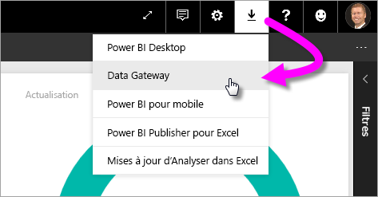
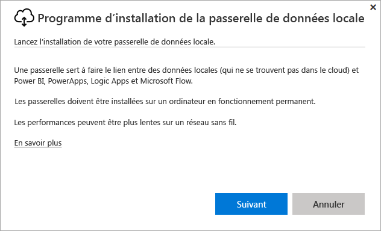
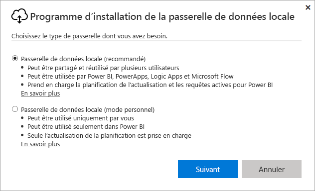
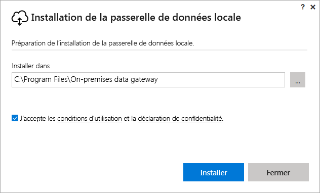
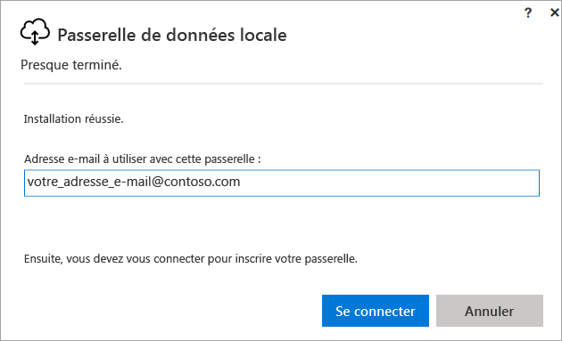
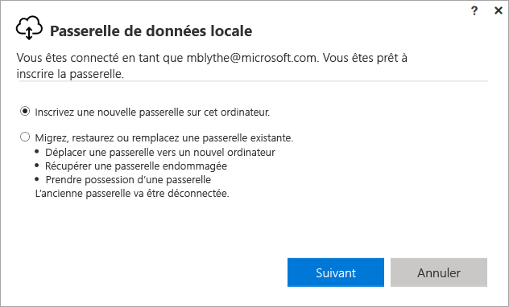
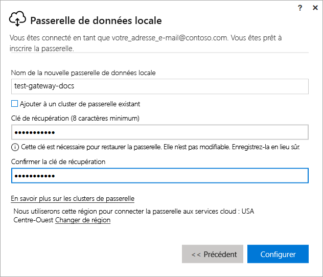
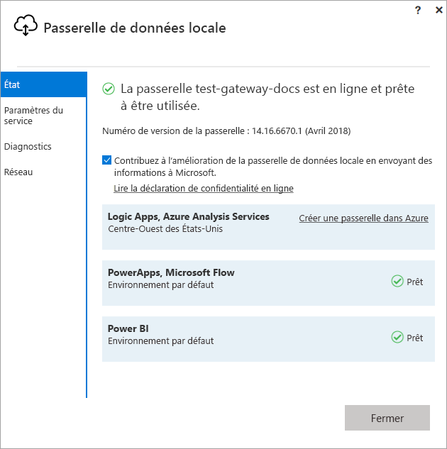
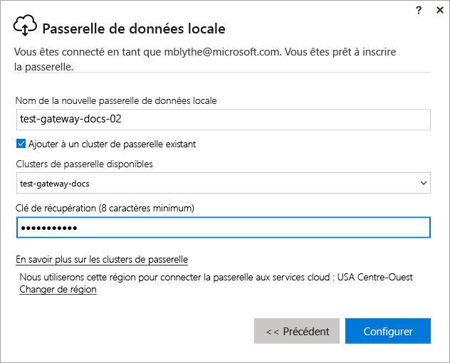

# Installer une passerelle pour Power BI

Une passerelle Power BI est un logiciel qui s’installe sur un réseau local et facilite l’accès aux données de ce réseau. Comme décrit dans la [vue d’ensemble](service-gateway-getting-started.md), vous pouvez installer une passerelle en mode personnel ou en mode standard (recommandé). En mode standard, il est possible d’installer une passerelle autonome ou d’ajouter une passerelle à un *cluster*, ce qui est recommandé pour la haute disponibilité. Dans cet article, nous vous indiquons comment installer une passerelle standard, puis comment ajouter une autre passerelle pour créer un cluster.

Si vous n’êtes pas inscrit à Power BI, [inscrivez-vous à un essai gratuit](https://app.powerbi.com/signupredirect?pbi_source=web) avant de commencer.

## Télécharger et installer une passerelle

La passerelle s’exécute sur l’ordinateur sur lequel vous l’installez. Vérifiez par conséquent que vous l’installez sur un ordinateur toujours allumé. Pour de meilleures performances et une fiabilité optimale, nous recommandons d’utiliser un ordinateur connecté à un réseau câblé plutôt qu’un réseau sans fil.

1. Dans l’angle supérieur droit du service Power BI, sélectionnez l’**icône de téléchargement**  > **Passerelle de données**.

    

2. Dans la page de téléchargement, sélectionnez le bouton **Télécharger la passerelle**.

3. Sélectionnez **Suivant**.     

    

4. Sélectionnez **Passerelle de données locale (recommandé)** > **Suivant**.

    

5. Conservez le chemin d’installation par défaut, puis acceptez les conditions > **Installer**.

    

6. Entrez le compte que vous utilisez pour vous connecter à Power BI > **Connexion**.

    

    La passerelle est associée à votre compte Power BI, et vous gérez les passerelles depuis le service Power BI. Vous êtes maintenant connecté à votre compte.

7. Sélectionnez **Inscrire une nouvelle passerelle sur cet ordinateur** > **Suivant**.

    

8. Entrez un nom pour la passerelle (doit être unique sur l’ensemble du locataire) et une clé de récupération. Vous aurez besoin de cette clé pour récupérer ou déplacer votre passerelle. Sélectionnez **Configurer**.

    

    Notez l’option **Ajouter à un cluster de passerelle existant**. Nous utiliserons cette option dans la section suivante de l’article.

9. Passez en revue les informations de la dernière fenêtre. Notez que la passerelle est disponible pour Power BI mais aussi PowerApps et Flow, car j’utilise le même compte pour ces trois applications. Sélectionnez **Fermer**.

    

Maintenant vous avez installé une passerelle, vous pouvez ajouter une autre passerelle pour créer un cluster.

## Ajouter une autre passerelle pour créer un cluster

Un cluster permet aux administrateurs de passerelles d’éviter d’avoir un point de défaillance unique pour l’accès aux données locales. Si la passerelle principale n’est pas disponible, les requêtes de données sont acheminées vers la seconde passerelle que vous ajoutez, et ainsi de suite. Vous pouvez installer une seule passerelle standard sur un ordinateur, mais vous devez installer la seconde passerelle pour le cluster sur un autre ordinateur. Cette procédure est logique car vous souhaitez bénéficier d’une redondance dans le cluster.

Les clusters de passerelles à haute disponibilité nécessitent d’appliquer la mise à jour de novembre 2017 ( ou version ultérieure) à la passerelle de données locale.

1. Téléchargez puis installez la passerelle sur un autre ordinateur.

2. Une fois connecté à votre compte Power BI, inscrivez la passerelle. Sélectionnez **Ajouter à un cluster existant**. Sous **Clusters de passerelle disponibles**, sélectionnez la première passerelle que vous avez installée (la *passerelle principale*), puis entrez la clé de récupération de cette passerelle. Sélectionnez **Configurer**.

    

## Étapes suivantes

[Gérer une passerelle Power BI](service-gateway-manage.md)

D’autres questions ? [Posez vos questions à la communauté Power BI](http://community.powerbi.com/)