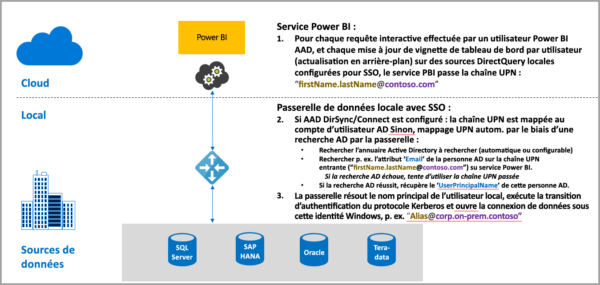
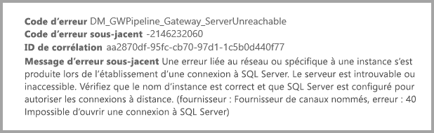
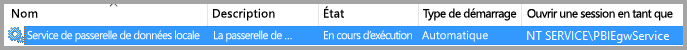
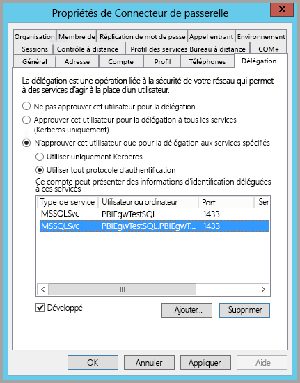
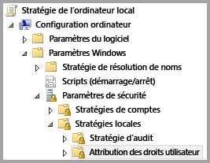
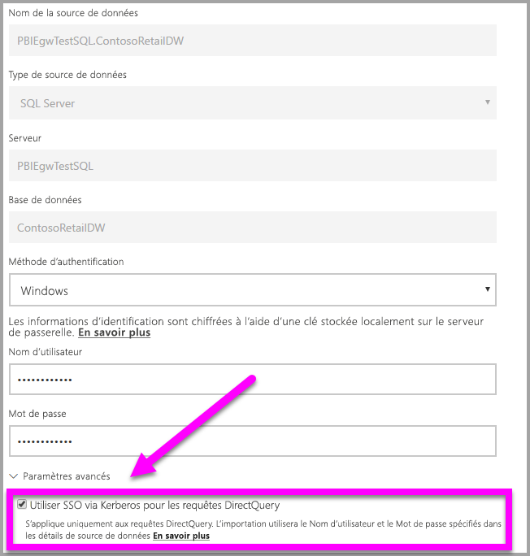
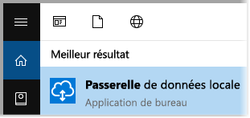
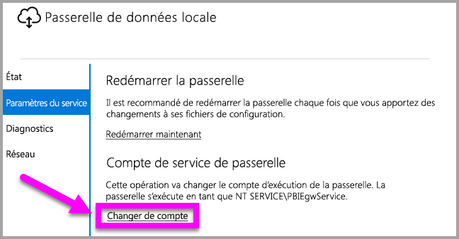

# Utiliser Kerberos pour l’authentification unique (SSO) de Power BI à des sources de données locales
Vous pouvez obtenir une connectivité avec authentification unique transparente, permettant la mise à jour de rapports et tableaux de bord Power BI à partir de données locales, en configurant votre passerelle de données locale avec Kerberos. La passerelle de données locale facilite l’authentification unique (SSO) à l’aide de DirectQuery qu’elle utilise pour se connecter à des sources de données locales.

Les sources de données SQL Server, SAP HANA et Teradata, toutes basées sur une [délégation Kerberos contrainte](https://technet.microsoft.com/library/jj553400.aspx) sont actuellement prises en charge.

* SQL Server
* SAP HANA
* Teradata

Quand un utilisateur interagit avec un rapport DirectQuery dans le service Power BI, chaque opération de filtrage croisé, de découpage, de tri et de modification de rapport peut entraîner des requêtes en direct sur la source de données locale sous-jacente.  Lorsque l’authentification unique est configurée pour la source de données, les requêtes s’exécutent sous l’identité de l’utilisateur interagissant avec Power BI via l’interface expérience web ou des applications mobiles Power BI. Ainsi, chaque utilisateur voit précisément les données qu’il est autorisé à consulter dans la source de données sous-jacente. Quand l’authentification unique est configurée, il n’y a pas de mise en cache de données partagées entre les différents utilisateurs.

## Étapes de l’exécution d’une requête avec une authentification unique
Une requête exécutée avec une authentification unique comprend trois étapes, comme illustré dans le diagramme suivant.

> [!NOTE]
> L’authentification unique (SSO) pour Oracle n’est pas encore activée, mais elle est en cours de développement et sera disponible bientôt.
> 
> 

Des détails supplémentaires concernant ces étapes figurent ci-dessous :

1. Pour chaque requête, le **service Power BI** inclut le *nom d’utilisateur principal* (UPN) lors de l’envoi d’une demande de requête à la passerelle configurée.
2. La passerelle doit mapper l’UPN Active Directory Azure à une identité Active Directory locale.
   
   a.  Si AAD DirSync (également appelé *AAD Connect*) est configuré, le mappage fonctionne automatiquement dans la passerelle.
   
   b.  Autrement, la passerelle peut rechercher et mapper l’UPN AD Azure à un utilisateur local en effectuant une recherche dans le domaine Active Directory local.
3. Le processus du service de passerelle emprunte l’identité de l’utilisateur local mappé, ouvre la connexion à la base de données sous-jacente, et envoie la requête. Il n’est pas nécessaire d’installer la passerelle sur la même machine que la base de données.
   
   - L’emprunt d’identité de l’utilisateur et la connexion à la base de données ne réussissent que si le compte de service de passerelle est un compte de domaine (ou SID ddu service), et si une délégation Kerberos contrainte a été configurée pour la base de données afin d’accepter des tickets Kerberos en provenance du compte de service de passerelle.  
   
   > [!NOTE]
   > En ce qui concerne le SID du service, si AAD DirSync/Connect est configuré et que des comptes d’utilisateurs sont synchronisés, le service de passerelle n’a pas besoin d’effectuer de recherches Active Directory locales lors de l’exécution, et vous pouvez utiliser le SID du service local (au lieu d’exiger un compte de domaine) pour le service de passerelle.  Les étapes de configuration de délégation Kerberos contrainte décrites dans ce documents sont les mêmes (simplement appliquées sur la base du SID du service, au lieu du compte de domaine).
   > 
   > 

> [!NOTE]
> Pour activer l’authentification unique pour SAP HANA, vous devez vous assurer que les configurations propres à HANA suivantes sont correctes pour SAP :
>    1. Vérifiez que le serveur SAP HANA exécute la version 2.00.022* ou supérieure/ultérieure. 
>    2. Sur l’ordinateur de la passerelle, installez le pilote ODBC HANA SAP le plus récent.  La version minimale est HANA ODBC 2.00.020.00 datant d’août 2017.
>
> Les liens suivants vers les correctifs et les mises à niveau à partir de SAP peuvent être utiles. Notez que vous devez vous connecter aux ressources suivantes avec votre compte SAP Support, et que SAP peut-changer ou mettre à jour ces liens.
> 
> * [HANA 2 SPS 01 Rev 012.03](https://launchpad.support.sap.com/#/notes/2557386) 
> * [HANA 2 SPS 02 Rev 22](https://launchpad.support.sap.com/#/notes/2547324) 
> * [HANA 1 SP 12 Rev 122.13](https://launchpad.support.sap.com/#/notes/2528439)

## Erreurs d’une configuration insuffisante de Kerberos
Si le serveur de base de données sous-jacent et la passerelle ne sont pas configurés correctement pour une **délégation Kerberos contrainte**, il se peut que vous receviez le message d’erreur suivant :

Et les détails techniques associés au message d’erreur peuvent se présenter comme suit :

Le résultat est qu’en raison de la configuration insuffisante de Kerberos, la passerelle n’a pas pu emprunter l’identité de l’utilisateur d’origine correctement, et que la tentative de connexion de base de données a échoué.

## Préparation d’une délégation Kerberos contrainte
Plusieurs éléments doivent être configurés pour qu’une délégation Kerberos contrainte fonctionne correctement, dont les *noms de principal du service* (SPN) et les paramètres de délégation sur les comptes de service.

### Condition préalable 1 : installer et configurer la passerelle de données locale
Cette version de la passerelle de données locale prend en charge une mise à niveau sur place, ainsi qu’une prise de contrôle des paramètres de passerelles existantes.

### Condition préalable 2 : exécuter le service Windows de passerelle en tant que compte de domaine
Dans une installation standard, la passerelle s’exécute en tant que compte de service local de machine (en particulier, *NT Service\PBIEgwService*) comme illustré dans l’image suivante :

Pour activer une **délégation Kerberos contrainte**, la passerelle doit opérer en tant que compte de domaine, sauf si votre AAD est déjà synchronisé avec votre Active Directory local (à l’aide de AAD DirSync/Connect). Pour que cette modification compte fonctionne correctement, vous avez deux options :

* Si vous avez démarré avec une version précédente de la passerelle de données locale, suivez précisément dans l’ordre les 5 étapes (y compris l’exécution de l’outil de configuration de passerelle à l’étape 3) décrites dans l’article suivant :
  
  * [Remplacement du compte de service de passerelle par un utilisateur de domaine](https://powerbi.microsoft.com/documentation/powerbi-gateway-proxy/#changing-the-gateway-service-account-to-a-domain-user)
  * Si vous déjà installé la préversion de la passerelle de données locale, il existe une nouvelle approche guidée par interface utilisateur pour changer de compte de service directement à partir de l’outil de configuration de la passerelle. Voir la section **Basculement de la passerelle vers un compte de domaine** vers la fin de cet article.

> [!NOTE]
> Si AAD DirSync/Connect est configuré et que des comptes d’utilisateurs sont synchronisés, le service de passerelle n’a pas besoin d’effectuer de recherches Active Directory locales lors de l’exécution, et vous pouvez utiliser le SID du service local (au lieu d’exiger un compte de domaine) pour le service de passerelle. Les étapes de configuration de délégation Kerberos contrainte décrites dans cet article sont les mêmes que celle de cette configuration (elles sont simplement appliquées sur la base du SID de service, au lieu du compte de domaine).
> 
> 

### Condition préalable 3 : obtenir des droits d’administrateur de domaine pour configurer les noms de principal du service (SetSPN) et les paramètres de délégation Kerberos contrainte
S’il est techniquement possible pour un administrateur de domaine ne disposant pas de droits d’administrateur de domaine d’accorder temporairement ou définitivement à quelqu’un d’autre les droits de configurer des noms de principal du service et une délégation Kerberos, cette approche n’est pas recommandée. La section suivante décrit en détail les étapes de configuration nécessaires pour la **Condition préalable 3**.

## Configuration de la délégation Kerberos contrainte pour la passerelle et la source de données
Pour configurer correctement le système, nous devons configurer ou valider les deux éléments suivants :

1. Si nécessaire, configurez un nom de principal du service pour le compte de domaine du service de passerelle (si aucun nom n’a encore été créé).
2. Configurez les paramètres de délégation sur le compte de domaine du service de passerelle.

Notez que, pour effectuer ces deux étapes de configuration, vous devez être administrateur de domaine.

Les sections suivantes décrivent ces étapes successivement.

### Configurer un nom de principal du service pour le compte de service de passerelle
Tout d’abord, déterminez si un nom de principal du service a déjà été créé pour le compte de domaine utilisé en tant que compte de service de passerelle, mais en procédant comme suit :

1. En tant qu’administrateur de domaine, lancez **Utilisateurs et ordinateurs Active Directory**.
2. Cliquez avec le bouton droit sur le domaine, sélectionnez **Trouver**, puis tapez le nom du compte de service de passerelle.
3. Dans la zone de recherche, cliquez avec le bouton droit sur le compte de service de passerelle, puis sélectionnez **Propriétés**.
   
   * Si l’onglet **Délégation** est visible dans la boîte de dialogue **Propriétés**, cela signifie qu’un nom de principal du service a déjà été créé et que vous pouvez passer directement à la sous-section suivante relative à la configuration des paramètres de délégation.

Si aucun onglet **Délégation** ne figure dans la boîte de dialogue **Propriétés**, vous pouvez créer manuellement un nom de principal du service sur ce compte, ce qui a pour effet d’ajouter l’onglet **Délégation** (il s’agit de la façon la plus simple de configurer les paramètres de délégation). Il est possible de créer un nom de principal du service à l’aide de l’[outil setspn](https://technet.microsoft.com/library/cc731241.aspx) qui est fourni avec Windows (pour ce faire, vous avez besoin de droits d’administrateur de domaine).

Par exemple, imaginez que le compte de service de passerelle est « PBIEgwTest\GatewaySvc », et que le nom de la machine sur lequel s’exécute le service de passerelle est **Machine1**. Dans cet exemple, pour définir le nom de principal du service pour le compte de service de passerelle pour cette machine, vous exécuteriez la commande suivante :

Cette étape étant terminée, nous pouvons passer à la configuration des paramètres de délégation.

### Configurer les paramètres de délégation sur le compte de service de passerelle
La deuxième exigence de configuration a trait aux paramètres de délégation sur le compte de service de passerelle. Différents outils permettent d’accomplir ces étapes. Dans cet article, nous allons utiliser **Utilisateurs et ordinateurs Active Directory**, composant logiciel enfichable de Microsoft Management Console (MMC) que vous pouvez utiliser pour administrer et publier des informations dans le répertoire, disponible par défaut sur les contrôleurs de domaine. Vous pouvez également l’activer via une configuration de **fonctionnalité Windows** sur d’autres machines.

Nous devons configurer une **délégation Kerberos contrainte** avec transit de protocole. Avec une délégation contrainte, vous devez être explicite concernant les services auxquels vous souhaitez déléguer. Par exemple, seul votre serveur SQL Server ou votre serveur SAP HANA accepte les appels de délégation du compte de service de passerelle.

Cette section suppose que vous avez déjà configuré des noms de principal du service pour vos sources de données sous-jacentes (par exemple, SQL Server, SAP HANA, Teradata, etc.). Pour savoir comment configurer ces noms de principal du service de serveur de source de données, reportez-vous à la documentation technique du serveur de base de données concerné. Vous pouvez également consulter le billet de blog qui décrit le [*nom de principal du service dont votre application a besoin*](https://blogs.msdn.microsoft.com/psssql/2010/06/23/my-kerberos-checklist/).

Dans les étapes suivantes, nous supposons un environnement local avec deux machines : un machine passerelle et un serveur de base de données (base de données SQL Server). Et aux fins de cet exemple, nous supposons également les paramètres et noms suivants :

* Nom de la machine de passerelle : **PBIEgwTestGW**
* Compte de service de passerelle : **PBIEgwTest\GatewaySvc** (nom d’affichage du compte : connecteur de passerelle)
* Nom de la machine source de données SQL Server : **PBIEgwTestSQL**
* Compte de service de source de données SQL Server : **PBIEgwTest\SQLService**

Étant donné ces exemples de noms et de paramètres, les étapes de configuration sont les suivantes :

1. Avec des droits d’administrateur de domaine, lancez **Utilisateurs et ordinateurs Active Directory**.
2. Cliquez avec le bouton droit sur le compte de service de passerelle (**PBIEgwTest\GatewaySvc**), puis sélectionnez **Propriétés**.
3. Sélectionnez l’onglet **Délégation**.
4. Sélectionnez **N’approuver cet ordinateur que pour la délégation aux services spécifiés**.
5. Sélectionnez **Utiliser tout protocole d’authentification**.
6. Sous **Ce compte peut présenter des informations d’identification déléguées à ces services**, sélectionnez **Ajouter**.
7. Dans la boîte de dialogue Nouveau, sélectionnez **Utilisateurs ou ordinateurs**.
8. Entrez le compte de service pour le service de base de données SQL Server (**PBIEgwTest\SQLService**), puis sélectionnez **OK**.
9. Sélectionnez le nom de principal du service que vous avez créé pour le serveur de base de données. Dans notre exemple, le nom de principal du service commence par **MSSQLSvc**. Si vous avez ajouté le nom de domaine complet (FQDN) et le nom de principal du service NetBIOS pour votre service de base de données, sélectionnez les deux. Vous ne pouvez en voir qu’un.
10. Sélectionnez **OK**. Le nom de principal du service devrait à présent figurer dans la liste.
11. Vous pouvez également sélectionner **Développé** pour afficher à la fois le nom de domaine complet (FQDN) et le nom de principal du service NetBIOS.
12. Si vous avez activé **Développé**, la boîte de dialogue doit ressembler à ceci.
    
    
13. Sélectionnez **OK**.
    
    Enfin, sur la machine exécutant le service de passerelle (**PBIEgwTestGW** dans notre exemple), la stratégie locale « Emprunter l’identité d’un client après l’authentification » doit être affectée au compte de service de passerelle. Vous pouvez effectuer/vérifier cela dans l’Éditeur d’objets de stratégie de groupe (**gpedit**).
14. Sur la machine de passerelle, exécutez *gpedit.msc*.
15. Accédez à **Stratégie de l’ordinateur local > Configuration ordinateur > Paramètres Windows > Paramètres de sécurité > Stratégies locales > Attribution des droits utilisateur**, comme illustré dans l’image suivante.
    
    
16. Dans la liste des stratégies sous **Attribution des droits utilisateur**, sélectionnez **Emprunter l’identité d’un client après l’authentification**.
    
    
    
    Cliquez avec le bouton droit et ouvrez **Propriétés** pour **Emprunter l’identité d’un client après l’authentification**, puis vérifiez la liste des comptes. Elle doit inclure le compte de service de passerelle (**PBIEgwTest\GatewaySvc**).
17. Dans la liste des stratégies sous **Attribution des droits utilisateur**, sélectionnez **Agir en tant que partie du système d’exploitation (SeTcbPrivilege)**. Assurez-vous que le compte de service de passerelle est également inclus dans la liste des comptes.
18. Redémarrez le processus de service **Passerelle de données locale**.

## Exécution d’un rapport Power BI
Après accomplissement de toutes les étapes de configuration décrites précédemment dans cet article, vous pouvez utiliser la page **Gérer la passerelle** dans Power BI pour configurer la source de données, puis, sous les **Paramètres avancés**, activer l’authentification unique, avant de publier les rapports et jeux de données dépendant de cette source de données.

Cette configuration ne fonctionne pas dans la plupart des cas. Toutefois, avec Kerberos, il peut y avoir différentes configurations en fonction de votre environnement. Si le rapport ne se charge toujours pas, vous devez contacter votre administrateur de domaine pour approfondir la question.

## Basculement de la passerelle vers un compte de domaine
Plus haut dans cet article, nous avons abordé le basculement de la passerelle à partir d’un compte de service local vers une exécution en tant que compte de domaine à l’aide de l’interface utilisateur **Passerelle de données locale**. Les étapes nécessaires à cette fin sont les suivantes.

1. Lancez l’outil de configuration **Passerelle de données locale**.
   
   
2. Sélectionnez le bouton **Connexion** sur la page principale, puis connectez-vous avec votre compte Power BI.
3. Une fois la connexion établie, sélectionnez l’onglet **Paramètre de service**.
4. Cliquez sur **Modifier le compte** pour démarrer la procédure pas à pas, comme illustré dans la figure suivante.
   
   

## Étapes suivantes
Pour plus d’informations sur la **Passerelle de données locale** et **DirectQuery**, consultez les ressources suivantes :

* [Passerelle de données locale](service-gateway-onprem.md)
* [DirectQuery dans Power BI](desktop-directquery-about.md)
* [Sources de données prises en charge par DirectQuery](desktop-directquery-data-sources.md)
* [DirectQuery et SAP BW](desktop-directquery-sap-bw.md)
* [DirectQuery et SAP HANA](desktop-directquery-sap-hana.md)

