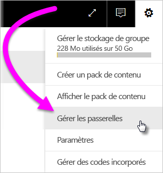
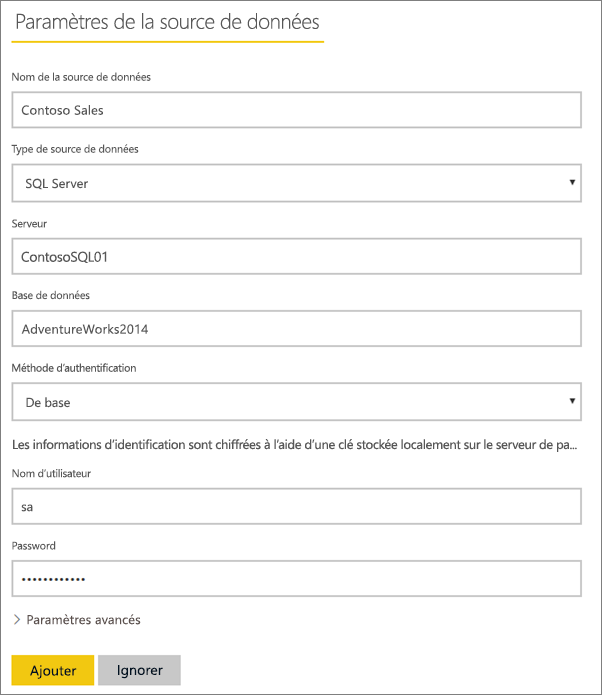
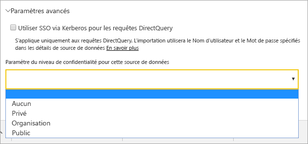
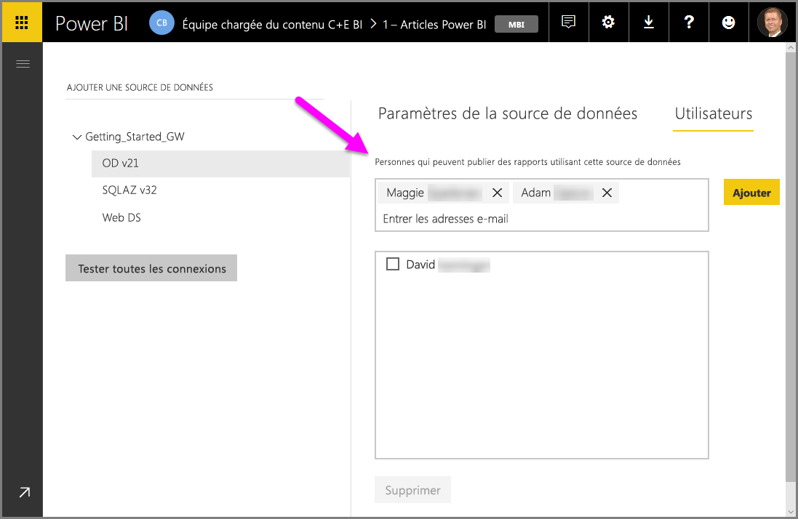
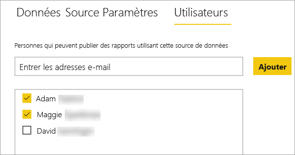
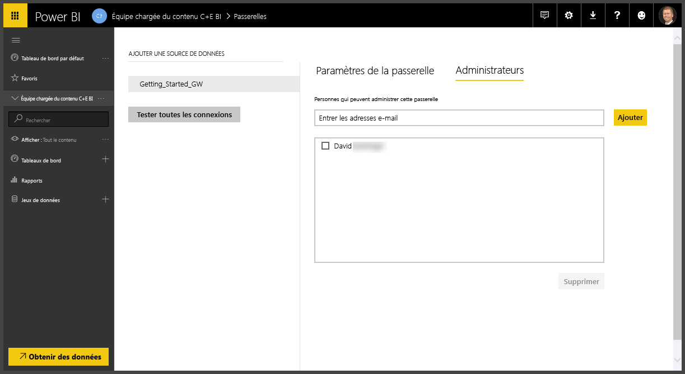
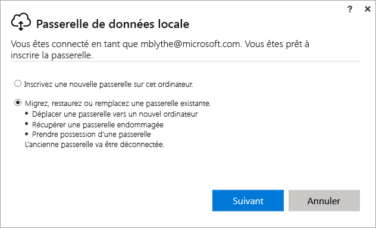
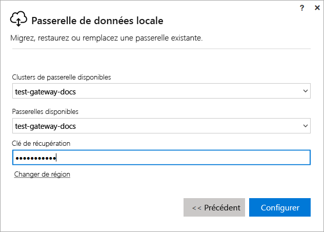

# Gérer une passerelle locale Power BI

Après avoir [installé une passerelle de données Power BI](service-gateway-install.md), vous la gérez en fonction de vos besoins. Dans cette rubrique, vous apprendrez à : ajouter et supprimer des sources de données et des utilisateurs ; redémarrer une passerelle ; migrer, restaurer, reprendre et supprimer une passerelle. 

Vous pouvez gérer une passerelle à l’aide de l’option **Gérer les passerelles** du service Power BI dans l’application de la passerelle sur votre ordinateur local, et avec des scripts PowerShell. Cet article se concentre sur le service Power BI. 

Si vous venez d’installer une passerelle, nous vous recommandons d’[ajouter une source de données](#add-a-data-source), puis d’[ajouter des utilisateurs](#add-users-to-a-data-source) afin d’accéder à la source de données.

## Gérer les sources de données

Power BI prend en charge de nombreuses sources de données locales, chacune ayant ses propres exigences. Une passerelle peut être utilisée pour une seule ou plusieurs sources de données. Pour cet exemple, nous allons vous montrer comment ajouter une source de données SQL Server, mais les étapes sont les mêmes pour d’autres sources de données.

### Ajouter une source de données

1. Dans l’angle supérieur droit du service Power BI, sélectionnez l’ > **Gérer les passerelles**.

    

2. Sélectionnez une passerelle > **Ajouter une source de données**, ou accédez à Passerelles > **Ajouter une source de données**.

    

3. Sélectionnez le **type de source de données**.

    

4. Entrez les informations de la source de données. Pour cet exemple, indiquez le **serveur**, la **base de données** et d’autres informations.  

    

5. Pour SQL Server, vous choisissez la **méthode d’authentification** **Windows** ou **De base** (authentification SQL).  Si vous choisissez **De base**, entrez les informations d’identification de votre source de données.

6. Sous **Paramètres avancés**, vous pouvez si vous le souhaitez configurer le [niveau de confidentialité](https://support.office.com/article/Privacy-levels-Power-Query-CC3EDE4D-359E-4B28-BC72-9BEE7900B540) de votre source de données (ne s’applique pas à [DirectQuery](desktop-directquery-about.md)).

    

7. Sélectionnez **Ajouter**. Le message *Connexion établie* apparaît si l’opération réussit.

    

Vous pouvez maintenant utiliser cette source de données pour inclure des données provenant de SQL Server dans vos tableaux de bord Power BI et vos rapports.

### Supprimez une source de données.

Vous pouvez supprimer une source de données si vous ne l’utilisez plus. Notez que la suppression d’une source de données entraîne l’arrêt des éventuels tableaux de bord ou rapports qui reposent sur cette source de données.

Pour supprimer une source de données, accédez à la source de données puis sélectionnez **Supprimer**.

## Gérer les rôles et les administrateurs

Après avoir ajouté une source de données à une passerelle, vous donnez aux utilisateurs et aux groupes de sécurité l’accès à la source de données spécifique (et non à l’ensemble de la passerelle). La liste des utilisateurs de la source de données contrôle uniquement les personnes autorisées à publier des rapports incluant des données provenant de la source de données. Les propriétaires des rapports peuvent créer des tableaux de bord, des packs de contenu et des apps, puis les partager avec d’autres utilisateurs.

Vous pouvez également donner aux utilisateurs et groupes de sécurité un accès administratif à la passerelle.

### Ajouter des utilisateurs à une source de données

1. Dans l’angle supérieur droit du service Power BI, sélectionnez l’ > **Gérer les passerelles**.

2. Sélectionnez la source de données à laquelle vous souhaitez ajouter des utilisateurs.

3. Sélectionnez **Utilisateurs**, puis entrez un utilisateur de votre organisation auquel vous souhaiter accorder l’accès à la source de données sélectionnée. Dans l’écran suivant, vous pouvez voir que j’ajoute Maggie et Adam.

    

4. Sélectionnez **Ajouter** : le membre ajouté apparaît dans la zone.

    

C’est tout. N’oubliez pas que vous devez ajouter des utilisateurs à chaque source de données à laquelle vous souhaitez accorder l’accès. Chaque source de données dispose d’une liste distincte d’utilisateurs, et vous devez ajouter des utilisateurs séparément à chaque source de données.

### Supprimer des utilisateurs d’une source de données

Sous l’onglet **Utilisateurs** de la source de données, vous pouvez supprimer des utilisateurs et des groupes de données qui peuvent utiliser cette source de données.

### Ajouter et supprimer des administrateurs

Sous l’onglet **Administrateurs** de la passerelle, ajoutez et supprimez des utilisateurs (ou des groupes de sécurité) qui peuvent administrer la passerelle.

## Gérer un cluster de passerelles

Une fois que vous avez créé un cluster de deux ou plusieurs passerelles, toutes les opérations de gestion des passerelles, telles que l’ajout d’une source de données ou l’octroi d’autorisations d’administration à une passerelle, s’appliquent à toutes les passerelles qui font partie du cluster. 

Quand les administrateurs utilisent l’élément de menu **Gérer les passerelles**, situé sous l’icône d’engrenage dans le **service Power BI**, ils voient la liste des clusters ou des passerelles, mais pas les instances de passerelles spécifiques qui sont membres du cluster.

Tous les nouvelles opérations DirectQuery et demandes **d’actualisation planifiée** sont automatiquement routées vers l’instance principale d’un cluster de passerelles donné. Si l’instance de passerelle principale n’est pas en ligne, la demande est routée vers une autre instance de passerelle dans le cluster.

## Partager une passerelle

Vous ne pouvez pas *partager* une passerelle per se, mais vous pouvez lui affecter des administrateurs et ajouter des utilisateurs à ses sources de données. 

Après avoir installé une passerelle, vous êtes par défaut l’administrateur de cette passerelle. Comme indiqué précédemment, vous pouvez ajouter d’autres personnes en tant qu’administrateurs. Ces administrateurs peuvent ajouter des sources de données, configurer et supprimer la passerelle.

Vous pouvez également affecter des utilisateurs aux sources de données que vous créez dans chacune de vos passerelles. Les utilisateurs peuvent ensuite utiliser ces sources de données pour actualiser les rapports Power BI. Cependant, ils ne peuvent pas modifier les sources de données ou les paramètres de la passerelle.

## Migrer, restaurer ou reprendre une passerelle

Exécutez le programme d’installation de la passerelle sur l’ordinateur sur lequel vous souhaitez migrer, restaurer ou reprendre la passerelle.

1. Téléchargez puis installez la passerelle.

2. Une fois connecté à votre compte Power BI, inscrivez la passerelle. Sélectionnez **Migrer, restaurer ou reprendre une passerelle existante** > **Suivant**.

    

3. Sélectionnez parmi les clusters et passerelles disponibles, puis entrez la clé de récupération de la passerelle sélectionnée. Sélectionnez **Configurer**.

    

## Redémarrer une passerelle

La passerelle s’exécute en tant que service Windows. Comme pour n’importe quel service Windows, il existe plusieurs méthodes pour démarrer et arrêter le service. Voici comment faire à partir de l’invite de commandes.

1. Sur l’ordinateur sur lequel la passerelle est en cours d’exécution, lancez une invite de commandes avec les privilèges Administrateur

2. Entrez `net stop PBIEgwService` pour arrêter le service.

3. Entrez `net start PBIEgwService` pour redémarrer le service.

## Supprimez une passerelle

Vous pouvez supprimer une passerelle si vous ne l’utilisez n’est plus. Mais sachez que la suppression d’une passerelle supprime toutes les sources de données sous-jacentes. Elle entraîne l’arrêt des éventuels tableaux de bord et rapports qui reposent sur ces sources de données.

1. Dans l’angle supérieur droit du service Power BI, sélectionnez l’ > **Gérer les passerelles**.

2. Sélectionnez la passerelle > **Supprimer**
   
   

## Étapes suivantes

[Conseils de déploiement d’une passerelle de données](service-gateway-deployment-guidance.md)

D’autres questions ? [Posez vos questions à la communauté Power BI](http://community.powerbi.com/)
