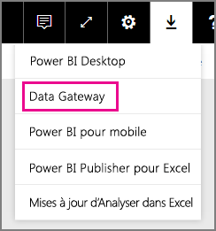
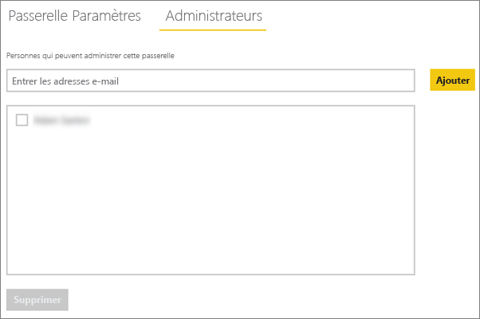

# <a name="manage-your-data-source---oracle"></a>Gérer votre source de données - Oracle
Une fois que vous avez installé la passerelle de données locale, vous devez ajouter des sources de données qui peuvent être utilisées avec la passerelle. Cet article décrit comment utiliser les passerelles et les sources de données. Vous pouvez utiliser la source de données Oracle pour l’actualisation planifiée ou DirectQuery.

## <a name="download-and-install-the-gateway"></a>Télécharger et installer la passerelle
Vous pouvez télécharger la passerelle à partir du service Power BI. Sélectionnez **Téléchargements** > **Passerelle de données** ou accédez à la [page de téléchargement de la passerelle](https://go.microsoft.com/fwlink/?LinkId=698861).



> [!WARNING]
> Pour que la passerelle se connecte à votre serveur Oracle, Oracle Data Provider for .NET (ODP.NET) doit être installé et configuré. Il fait parti des composants d’accès aux données Oracle (ODAC, Oracle Data Access Components). Pour plus d’informations sur la façon de télécharger le fournisseur Oracle, consultez [Installation du client Oracle](#installing-the-oracle-client) ci-dessous.
> 
> 

## <a name="installing-the-oracle-client"></a>Installation du client Oracle
Pour les versions **32 bits** de Power BI Desktop, utilisez le lien suivant pour télécharger et installer le client Oracle **32 bits** :

* [Oracle Data Access Components (ODAC) 32 bits avec Oracle Developer Tools for Visual Studio (12.1.0.2.4)](http://www.oracle.com/technetwork/topics/dotnet/utilsoft-086879.html)

Pour les versions **64 bits** de Power BI Desktop ou pour la passerelle de données locale, utilisez le lien suivant pour télécharger et installer le client Oracle **64 bits** :

* [ODAC 12.2c Release 1 64 bits (12.2.0.1.0) pour Windows x64](http://www.oracle.com/technetwork/database/windows/downloads/index-090165.html)

Une fois qu’il est installé, vous devez indiquer les informations de votre base de données dans votre fichier tnsnames.ora. Power BI Desktop et la passerelle se connectent au nom de service .NET (net_service_name) défini dans le fichier tnsnames.ora. Si le fichier n’est pas configuré, vous ne pouvez pas vous connecter. `[Oracle Home Directory]\Network\Admin\tnsnames.ora` est le chemin d’accès par défaut du fichier tnsnames.ora. Pour plus d’informations sur la configuration des fichiers tnsnames.ora, consultez [Oracle: Local Naming Parameters (tnsnames.ora)](https://docs.oracle.com/cd/B28359_01/network.111/b28317/tnsnames.htm) (Oracle : paramètres de dénomination locaux (tnsnames.ora)).

### <a name="example-tnsnamesora-file-entry"></a>Exemple d’entrée dans le fichier tnsnames.ora
Le format de base d’une entrée dans tnsname.ora est le suivant.

```
net_service_name=
 (DESCRIPTION=
   (ADDRESS=(protocol_address_information))
   (CONNECT_DATA=
     (SERVICE_NAME=service_name)))
```

Voici un exemple qui montre de quelle manière les informations sur le serveur et le port sont indiquées.

```
CONTOSO =
  (DESCRIPTION =
    (ADDRESS = (PROTOCOL = TCP)(HOST = oracleserver.contoso.com)(PORT = 1521))
    (CONNECT_DATA =
      (SERVER = DEDICATED)
      (SERVICE_NAME = CONTOSO)
    )
  )
```

## <a name="add-a-gateway"></a>Ajouter une passerelle
Pour ajouter une passerelle, [téléchargez](https://go.microsoft.com/fwlink/?LinkId=698861) et installez la passerelle sur un serveur de votre environnement. Une fois la passerelle installée, elle apparaît dans les listes de passerelles sous **Gérer les passerelles**.

> [!NOTE]
> **Gérer les passerelles** n’apparaît pas si vous n’êtes pas administrateur d’au moins une passerelle. Pour cela, vous devez être ajouté en tant qu’administrateur ou installer et configurer une passerelle.
> 
> 

## <a name="remove-a-gateway"></a>Supprimez une passerelle
La suppression d’une passerelle entraîne celle de toutes les sources de données associées.  Elle entraîne également l’arrêt des éventuels tableaux de bord et rapports qui reposent sur ces sources de données.

1. Sélectionnez l’icône Engrenage  en haut à droite > **Gérer les passerelles**.
2. Passerelle > **Supprimer**
   
   

## <a name="add-a-data-source"></a>Ajouter une source de données
Pour ajouter une source de données, sélectionnez une passerelle, puis cliquez sur **Ajouter une source de données**, ou accédez à Passerelle > **Ajouter une source de données**.


Vous pouvez ensuite sélectionner le **type de source de données** dans la liste.


Vous devez ensuite renseigner les informations relatives à la source de données, notamment le **serveur** et la **base de données**.  

Vous devez également choisir une **méthode d’authentification**.  Ce peut être **Windows** ou **De base**.  Choisissez **De base** si vous comptez utiliser un compte créé dans Oracle plutôt que l’authentification Windows. Entrez les informations d’identification qui seront utilisées pour cette source de données.

> [!NOTE]
> Toutes les requêtes à la source de données sont exécutées à l’aide de ces informations d’identification. Pour plus d’informations, consultez l’article sur la passerelle de données locale principale qui indique la façon dont les [informations d’identification](service-gateway-onprem.md#credentials) y sont stockées.
> 
> 


Vous pouvez cliquer sur **Ajouter** après avoir renseigné toutes les informations.  Vous pouvez désormais utiliser cette source de données pour l’actualisation planifiée ou DirectQuery sur un serveur Oracle local. L’indication *Connexion réussie* apparaît une fois la connexion établie.


### <a name="advanced-settings"></a>Paramètres avancés
Vous pouvez configurer le niveau de confidentialité de votre source de données pour contrôler le mélange (« mashup ») des données. Cette option concerne uniquement l’actualisation planifiée ; elle ne s’applique pas à DirectQuery. [En savoir plus](https://support.office.com/article/Privacy-levels-Power-Query-CC3EDE4D-359E-4B28-BC72-9BEE7900B540)


## <a name="remove-a-data-source"></a>Supprimez une source de données.
La suppression d’une source de données entraîne l’arrêt des éventuels tableaux de bord ou rapports qui reposent sur la source de données en question.  

Pour supprimer une source de données, accédez à Source de données > **Supprimer**.


## <a name="manage-administrators"></a>Gérer les administrateurs
Sous l’onglet Administrateurs de la passerelle, vous pouvez ajouter et supprimer des utilisateurs (ou des groupes de sécurité) qui peuvent administrer la passerelle.



## <a name="manage-users"></a>Gérer les utilisateurs
Sous l’onglet Utilisateurs, pour la source de données, vous pouvez ajouter et supprimer des utilisateurs ou des groupes de données qui peuvent utiliser cette passerelle.

> [!NOTE]
> La liste des utilisateurs contrôle uniquement les personnes autorisées à publier des rapports. Les propriétaires des rapports peuvent créer des tableaux de bord ou des packs de contenu et les partager avec d’autres utilisateurs. Il n’est pas utile que les utilisateurs qui consomment le rapport ou le tableau de bord soient répertoriés dans la liste des utilisateurs.
> 
> 


## <a name="using-the-data-source"></a>Utilisation de la source de données
Une fois la source de données créée, elle peut être utilisée avec des connexions DirectQuery ou via une actualisation planifiée.

> [!WARNING]
> Le nom du serveur et celui de la base de données doivent correspondre entre Power BI Desktop et la source de données dans la passerelle de données locale.
> 
> 

Le lien entre votre jeu de données et la source de données dans la passerelle est basé sur le nom de votre serveur et sur le nom de votre base de données. Ils doivent être identiques. Par exemple, si vous fournissez une adresse IP pour le nom du serveur, dans Power BI Desktop, vous devez utiliser l’adresse IP de la source de données dans la configuration de la passerelle. Ce nom doit également correspondre à un alias défini dans le fichier tnsnames.ora. Pour plus d’informations sur le fichier tnsnames.ora, consultez [Installation du client Oracle](#installing-the-oracle-client).

C’est le cas pour DirectQuery et pour l’actualisation planifiée.

### <a name="using-the-data-source-with-directquery-connections"></a>Utilisation de la source de données avec des connexions DirectQuery
Vous devez vérifier que le nom du serveur et celui de la base de données correspondent entre Power BI Desktop et la source de données configurée pour la passerelle. Vous devez également vérifier que votre utilisateur est répertorié sous l’onglet **Utilisateurs** de la source de données afin de publier des jeux de données DirectQuery. Pour DirectQuery, la sélection se produit dans Power BI Desktop la première fois que vous importez des données. [En savoir plus](desktop-use-directquery.md)

Une fois la publication effectuée, que ce soit à partir de Power BI Desktop ou de l’option **Obtenir les données**, vos rapports doivent commencer à fonctionner. Après la création de la source de données dans la passerelle, plusieurs minutes peuvent être nécessaires pour que la connexion puisse être utilisée.

### <a name="using-the-data-source-with-scheduled-refresh"></a>Utilisation de la source de données avec une actualisation planifiée
Si vous êtes répertorié sous l’onglet **Utilisateurs** de la source de données configurée dans la passerelle, et que le nom du serveur et celui de la base de données correspondent, la passerelle s’affiche comme option à utiliser avec l’actualisation planifiée.


## <a name="troubleshooting"></a>Résolution des problèmes
Vous pouvez rencontrer plusieurs erreurs dans Oracle lorsque la syntaxe de dénomination est incorrecte ou n’est pas configurée correctement.

* ORA-12154: TNS: could not resolve the connect identifier specified (ORA-12154 : TNS : l’identificateur de connexion indiqué n’a pas pu être résolu)  
* ORA-12514: TNS listener does not currently know of service requested in connect descriptor (ORA-12514 : le processus d’écoute ne connaît pas actuellement le service demandé dans le descripteur de connexion)  
* ORA-12541: TNS: no listener (ORA-12541 : TNS : pas de processus d’écoute)  
* ORA-12170: TNS: Connect timeout occurred (ORA-12170 : TNS : une expiration de la connexion s’est produite)  
* ORA-12504: TNS listener was not given the SERVICE_NAME in CONNECT_DATA (ORA-12504 : le processus d’écoute n’a pas reçu SERVICE_NAME dans CONNECT_DATA)  

Ces erreurs peuvent se produire si le client Oracle n’est pas installé ou s’il n’est pas configuré correctement. S’il est installé, vous pouvez vérifier que le fichier tnsnames.ora est correctement configuré et si vous utilisez le bon nom de service .NET (net_service_name). Vous devez également vérifier que le net_service_name est le même sur l’ordinateur utilisant Power BI Desktop et sur l’ordinateur qui exécute la passerelle. Pour plus d’informations, consultez [Installation du client Oracle](#installing-the-oracle-client).

> [!NOTE]
> Vous pouvez également rencontrer un problème en raison de la compatibilité entre la version du serveur Oracle et la version du client Oracle. Vous voulez généralement que ces éléments correspondent.
> 
> 

Pour plus d’informations sur le dépannage de la passerelle, consultez [Résolution des problèmes de passerelle de données locale](service-gateway-onprem-tshoot.md).

## <a name="next-steps"></a>Étapes suivantes
[Passerelle de données locale](service-gateway-onprem.md)  
[Informations approfondies sur la passerelle de données locale](service-gateway-onprem-indepth.md)  
[Résolution des problèmes de passerelle de données locale](service-gateway-onprem-tshoot.md)  
[Power BI Premium](service-premium.md)

D’autres questions ? [Essayez d’interroger la communauté Power BI](http://community.powerbi.com/)

