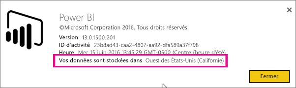
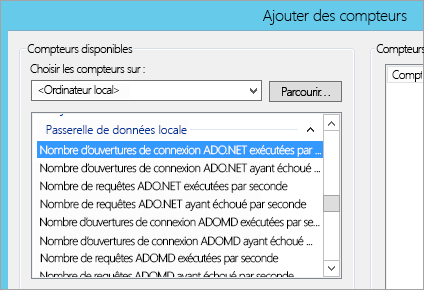
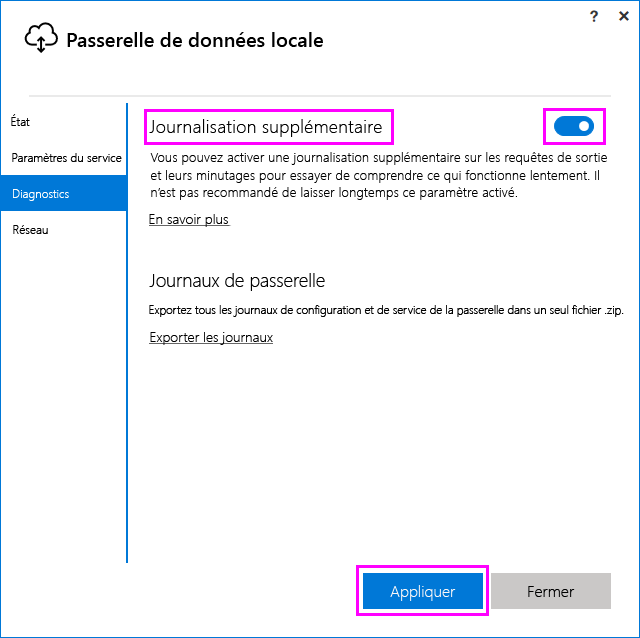
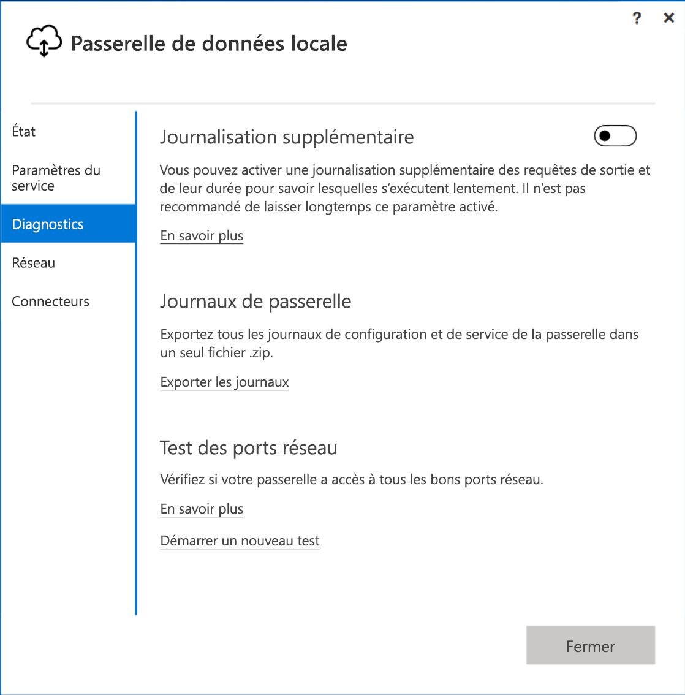
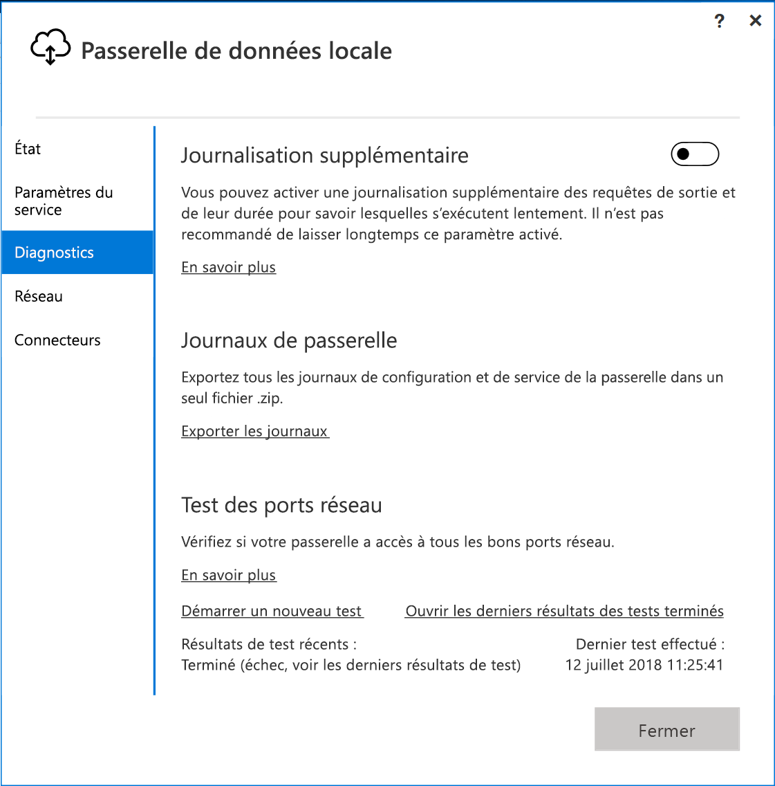
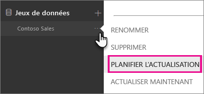
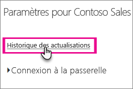

# <a name="troubleshooting-the-on-premises-data-gateway"></a>Dépannage de la passerelle de données locale

Cet article traite de certains problèmes courants rencontrés lors de l’utilisation de la **passerelle de données locale**.

<!-- Shared Community & support links Include -->
[!INCLUDE [gateway-onprem-tshoot-support-links-include](./includes/gateway-onprem-tshoot-support-links-include.md)]

<!-- Shared Troubleshooting Install Include -->
[!INCLUDE [gateway-onprem-tshoot-install-include](./includes/gateway-onprem-tshoot-install-include.md)]

## <a name="configuration"></a>Configuration

### <a name="how-to-restart-the-gateway"></a>Comment redémarrer la passerelle

La passerelle s’exécute comme service Windows. Vous pouvez donc la démarrer et l’arrêter de plusieurs façons. Par exemple, vous pouvez ouvrir une invite de commandes avec des autorisations élevées sur l’ordinateur sur lequel la passerelle est exécutée, puis exécuter l’une des commandes suivantes :

* Pour arrêter le service, exécutez la commande suivante :

    '''   net stop PBIEgwService   '''

* Pour démarrer le service, exécutez la commande suivante :

    '''   net start PBIEgwService   '''

### <a name="error-failed-to-create-a-gateway-try-again"></a>Erreur : Échec de la création d’une passerelle. Réessayez

Tous les détails sont disponibles, mais l’appel au service Power BI a renvoyé une erreur. L’erreur et un ID d’activité sont affichés. Cela peut se produire pour différentes raisons. Pour plus d’informations, vous pouvez collecter et examiner les journaux comme indiqué ci-dessous.

Cela peut également être dû à des problèmes de configuration de proxy. L’interface utilisateur ne permet pas de configurer le proxy. Plus d’informations sur la façon d’apporter des [modifications à la configuration du proxy](service-gateway-proxy.md).

### <a name="error-failed-to-update-gateway-details-please-try-again"></a>Erreur : Échec de la mise à jour des détails de la passerelle. Réessayez

Les informations ont été reçues du service Power BI vers la passerelle. Elles ont été transmises au service Windows local, mais celui-ci n’a rien pu renvoyer. Il est également possible que la génération d’une clé symétrique ait échoué. L’exception interne apparaît sous **Afficher les détails**. Pour plus d’informations, vous pouvez collecter et examiner les journaux mentionnés ci-dessous.

### <a name="error-power-bi-service-reported-local-gateway-as-unreachable-restart-the-gateway-and-try-again"></a>Erreur : Le service Power BI a signalé que la passerelle locale est inaccessible. Redémarrez la passerelle et réessayez.

À la fin de la configuration, le service Power BI est rappelé pour valider la passerelle. Le service Power BI ne signale pas la passerelle comme étant *active*. Le redémarrage du service Windows peut permettre à la communication d’aboutir. Pour plus d’informations, vous pouvez collecter et examiner les journaux comme indiqué ci-dessous.

### <a name="script-error-during-sign-into-power-bi"></a>Erreur de script lors de la connexion à Power BI

Vous pouvez recevoir une erreur de script lorsque vous vous connectez à Power BI dans le cadre de la configuration de la passerelle de données locale. L’installation de la mise à jour de sécurité suivante résout le problème. L’installation peut être effectuée via Windows Update.

[MS16-051 : Mise à jour de sécurité pour Internet Explorer : 10 mai 2016 (KB 3154070)](https://support.microsoft.com/kb/3154070)

### <a name="gateway-configuration-failed-with-a-null-reference-exception"></a>La configuration de la passerelle a échoué avec une exception de référence null

Vous pouvez rencontrer une erreur similaire à ce qui suit.

        Failed to update gateway details.  Please try again.
        Error updating gateway configuration.

Ceci inclut une arborescence des appels de procédure, qui peut inclure le message suivant.

        Microsoft.PowerBI.DataMovement.Pipeline.Diagnostics.CouldNotUpdateGatewayConfigurationException: Error updating gateway configuration. ----> System.ArgumentNullException: Value cannot be null.
        Parameter name: serviceSection

Si vous mettez à niveau à partir d’une ancienne passerelle, nous conservons le fichier de configuration. Il se peut qu’une section soit manquante. Quand la passerelle tente de la lire, nous pouvons obtenir l’exception de référence null ci-dessus.

Pour corriger cela, effectuez les étapes suivantes.

1. Désinstallez la passerelle.
2. Supprimez le dossier suivant.

        c:\Program Files\On-premises data gateway
3. Réinstallez la passerelle.
4. Vous pouvez éventuellement appliquer la clé de récupération pour restaurer une passerelle existante.

### <a name="support-for-tls-1112"></a>Prise en charge de TLS 1.1/1.2

À partir de la mise à jour d’août 2017, la passerelle de données locale utilise, par défaut, le protocole TLS 1.1 ou 1.2 pour communiquer avec le **service Power BI**. Les versions précédentes de la passerelle de données locale utilisent le protocole TLS 1.0 par défaut. Vous devez mettre à niveau vos installations de passerelles de données locales vers la version d’août 2017 ou une version ultérieure, pour que vos passerelles continuent à fonctionner.

>[!NOTE]
>La prise en charge de TLS 1.0 a pris fin le 1er novembre 2017.

Il est important de noter que TLS 1.0 reste pris en charge par la passerelle de données locale jusqu’au 1er novembre 2017, et qu’il est utilisé par celle-ci en tant que mécanisme de secours. Pour vous assurer que tout le trafic de passerelle utilise les protocoles TLS 1.1 ou 1.2 (et pour empêcher l’utilisation du protocole TLS 1.0 sur votre passerelle), vous devez ajouter ou modifier les clés de Registre suivantes sur l’ordinateur exécutant le service de passerelle :

        [HKEY_LOCAL_MACHINE\SOFTWARE\Microsoft\.NETFramework\v4.0.30319]"SchUseStrongCrypto"=dword:00000001
        [HKEY_LOCAL_MACHINE\SOFTWARE\Wow6432Node\Microsoft\.NETFramework\v4.0.30319]"SchUseStrongCrypto"=dword:00000001

> [!NOTE]
> L’ajout ou la modification de ces clés de Registre s’appliquent à toutes les applications .NET. Pour plus d’informations sur les modifications du Registre qui affectent le protocole TLS pour d’autres applications, voir [Paramètres de Registre pour le protocole TLS](https://docs.microsoft.com/windows-server/security/tls/tls-registry-settings).

## <a name="data-sources"></a>Sources de données

### <a name="error-unable-to-connect-details-invalid-connection-credentials"></a>Erreur : connexion impossible. Détails : « Informations d’identification de connexion non valides »

Le message d’erreur reçu de la source de données apparaît dans **Afficher les détails**. Pour SQL Server, vous voyez un message comme celui-ci.

    Login failed for user 'username'.

Vérifiez l’exactitude du nom d’utilisateur et du mot de passe. Vérifiez également que les informations d’identification permettent bien de se connecter à la source de données. Vérifiez que le compte utilisé correspond à la **méthode d’authentification**.

### <a name="error-unable-to-connect-details-cannot-connect-to-the-database"></a>Erreur : connexion impossible. Détails : « Impossible de se connecter à la base de données »

Nous avons établi la connexion au serveur, mais pas à la base de données fournie. Vérifiez le nom de la base de données et que les informations d’identification de l’utilisateur possèdent les autorisations appropriées pour accéder à cette base de données.

Le message d’erreur reçu de la source de données apparaît dans **Afficher les détails**. Pour SQL Server, vous voyez un message comme celui-ci.

    Cannot open database "AdventureWorks" requested by the login. The login failed. Login failed for user 'username'.

### <a name="error-unable-to-connect-details-unknown-error-in-data-gateway"></a>Erreur : connexion impossible. Détails : « Erreur inconnue dans la passerelle de données »

Cette erreur peut se produire pour différentes raisons. Veillez à valider que vous pouvez vous connecter à la source de données à partir de l’ordinateur qui héberge la passerelle. Cela peut être dû au fait que le serveur ne soit pas accessible.

Le code d’erreur **DM_GWPipeline_UnknownError**apparaît dans **Afficher les détails**.

Pour plus d’informations, vous pouvez également consulter les journaux d’événements > **Journaux des applications et des services** > **Service Passerelle de données locale**.

### <a name="error-we-encountered-an-error-while-trying-to-connect-to-server-details-we-reached-the-data-gateway-but-the-gateway-cant-access-the-on-premises-data-source"></a>Erreur : Nous avons rencontré une erreur lors de la tentative de connexion à <server> Détails : « Nous avons pu accéder à la data gateway, mais celle-ci ne peut pas accéder à la source de données locale ».

Nous n’avons pas pu nous connecter à la source de données spécifiée. Veillez à valider les informations fournies pour cette source de données.

Le code d’erreur **DM_GWPipeline_Gateway_DataSourceAccessError**apparaît dans **Afficher les détails**.

Si le message d’erreur sous-jacent est similaire à ce qui suit, cela signifie que le compte que vous utilisez pour la source de données n’est pas un administrateur de serveur pour cette instance d’Analysis Services. [En savoir plus](https://docs.microsoft.com/sql/analysis-services/instances/grant-server-admin-rights-to-an-analysis-services-instance)

    The 'CONTOSO\account' value of the 'EffectiveUserName' XML for Analysis property is not valid.

Si le message d’erreur sous-jacent est similaire à ce qui suit, cela peut signifier qu’un attribut d’annuaire [token-groups-global-and-universal](https://msdn.microsoft.com/library/windows/desktop/ms680300.aspx) (TGGAU) peut être absent du compte de service Analysis Services.

    The username or password is incorrect.

Dans les domaines avec un accès de compatibilité pré-Windows 2000, l’attribut TGGAU est activé. Par contre, il n’est pas activé par défaut dans la plupart des domaines créés récemment. D’autres informations sur ce sujet sont disponible [ici](https://support.microsoft.com/kb/331951).

Pour confirmer cela, procédez comme suit.

1. Connectez-vous à l’ordinateur Analysis Services dans SQL Server Management Studio. Dans les propriétés de connexion avancées, incluez EffectiveUserName pour l’utilisateur en question et voyez si cela reproduit l’erreur.
2. Vous pouvez utiliser l’outil dsacls d’Active Directory pour vérifier si l’attribut est répertorié. Cet outil se trouve sur un contrôleur de domaine. Vous devez connaître le nom de domaine unique du compte et le passer à l’outil.

        dsacls "CN=John Doe,CN=UserAccounts,DC=contoso,DC=com"

    Les résultats doivent avoir l’aspect suivant.

            Allow BUILTIN\Windows Authorization Access Group
                                          SPECIAL ACCESS for tokenGroupsGlobalAndUniversal
                                          READ PROPERTY

Pour corriger ce problème, vous devez activer TGGAU sur le compte utilisé pour le service Windows Analysis Services.

#### <a name="another-possibility-for-username-or-password-incorrect"></a>Autre motif pouvant expliquer un nom d’utilisateur ou un mot de passe incorrect

Cette erreur peut également se produire si le serveur Analysis Services est situé dans un autre domaine que les utilisateurs et s’il n’est pas configuré pour une approbation bidirectionnelle.

Vous devez collaborer avec les administrateurs de domaine pour vérifier la relation d’approbation entre les domaines.

#### <a name="unable-to-see-the-data-gateway-data-sources-in-the-get-data-experience-for-analysis-services-from-the-power-bi-service"></a>Impossible de voir les sources de données de la passerelle de données dans l’expérience « Obtenir les données » pour Analysis Services à partir du service Power BI

Vérifiez que votre compte est répertorié sous l’onglet **Utilisateurs** de la source de données dans la configuration de la passerelle. Si vous n’avez pas accès à la passerelle, contactez son administrateur pour lui demander d’effectuer des vérifications. Seuls les comptes figurant dans la liste **Utilisateurs** peuvent voir la source de données dans la liste Analysis Services.

### <a name="error-you-dont-have-any-gateway-installed-or-configured-for-the-data-sources-in-this-dataset"></a>Erreur : Vous n’avez pas de passerelle installée ou configurée pour les sources de données dans ce jeu de données

Vérifiez que vous avez ajouté une ou plusieurs sources de données à la passerelle, comme décrit dans [Ajouter une source de données](service-gateway-manage.md#add-a-data-source). Si la passerelle n’apparaît pas dans le portail d’administration sous **Gérer les passerelles**, essayez d’effacer le cache de votre navigateur, ou de vous déconnecter du service et de vous y reconnecter.

## <a name="datasets"></a>Jeux de données

### <a name="error-there-is-not-enough-space-for-this-row"></a>Erreur : espace insuffisant pour cette ligne

Ceci se produit si la taille d’une seule ligne est supérieure à 4 Mo. Vous devez identifier la ligne dans votre source de données et essayer de l’éliminer ou d’en réduire la taille.

### <a name="error-the-server-name-provided-doesnt-match-the-server-name-on-the-sql-server-ssl-certificate"></a>Erreur : Le nom de serveur fourni ne correspond pas au nom de serveur du certificat SSL SQL Server

Ceci peut se produire quand le nom commun du certificat correspond au nom de domaine complet du serveur, mais que vous avez fourni seulement le nom NetBIOS du serveur. Ceci provoque une erreur de non-correspondance du certificat. Pour résoudre ce problème, vous devez faire en sorte que le nom de serveur de la source de données de la passerelle et le fichier PBIX utilisent le nom de domaine complet du serveur.

### <a name="i-dont-see-the-on-premises-data-gateway-present-when-configuring-scheduled-refresh"></a>Je ne vois pas la passerelle de données locale quand je configure l’actualisation planifiée

Cela peut être dû à différents scénarios.

1. Le nom du serveur et celui de la base de données ne correspondent pas à ce qui a été entré dans Power BI Desktop et la source de données configurée pour la passerelle. Ces valeurs doivent être identiques. Elles ne sont pas sensibles à la casse.
2. Votre compte n’est pas répertorié sous l’onglet **Utilisateurs** de la source de données dans la configuration de la passerelle. Vous devez contacter l’administrateur de la passerelle pour que celui-ci l’ajoute à cette liste.
3. Votre fichier Power BI Desktop a plusieurs sources de données et celles-ci ne sont pas toutes configurées avec la passerelle. Chaque source de données définie avec la passerelle doit s’afficher dans l’actualisation planifiée.

### <a name="error-the-received-uncompressed-data-on-the-gateway-client-has-exceeded-the-limit"></a>Erreur : Les données non compressées reçues sur le client de la passerelle ont dépassé la limite

La limitation exacte est de 10 Go de données non compressées par table. Si vous rencontrez ce problème, il existe plusieurs options pour l’optimiser et l’éviter. Une solution conseillée est de réduire l’utilisation de valeurs de chaîne très longues et constantes, et d’utiliser à la place une clé normalisée ou de supprimer la colonne (si celle-ci n’est pas utilisée).

## <a name="reports"></a>Rapports

### <a name="report-could-not-access-the-data-source-because-you-do-not-have-access-to-our-data-source-via-an-on-premises-data-gateway"></a>Le rapport n’a pas pu accéder à la source de données, car vous n’avez pas accès à notre source de données via une passerelle de données locale.

Ceci est généralement dû à une des causes suivantes.

1. Les informations de la source de données ne correspondent pas à ce qui est dans le jeu de données sous-jacent. Le nom du serveur et celui de la base de données doivent correspondre entre la source de données définie pour la passerelle de données locale et ce que vous indiquez dans Power BI Desktop. Si vous utilisez une adresse IP dans Power BI Desktop, la source de données pour la passerelle de données locale doit également utiliser une adresse IP.
2. Aucune source de données n’est disponible sur les passerelles au sein de votre organisation. Vous pouvez configurer la source de données sur une passerelle de données locale nouvelle ou existante.

### <a name="error-data-source-access-error-please-contact-the-gateway-administrator"></a>Erreur : Erreur d’accès à la source de données. Contactez l’administrateur de la passerelle

Si ce rapport utilise une connexion Analysis Services en direct, vous pouvez rencontrer un problème dans lequel une valeur est passée à un élément EffectiveUserName qui n’est pas valide ou ne dispose pas des autorisations sur l’ordinateur Analysis Services. En règle générale, un problème d’authentification est dû au fait que la valeur transmise pour EffectiveUserName ne correspond pas au nom d’utilisateur principal local (UPN).

Pour confirmer cela, procédez comme suit.

1. Recherchez le nom d’utilisateur en vigueur dans les [journaux de la passerelle](#logs).
2. Une fois la valeur transmise, validez qu’elle est correcte. S’il s’agit de votre utilisateur, vous pouvez utiliser la commande suivante à partir d’une invite de commandes pour voir le nom d’utilisateur principal. Celui-ci se présente comme une adresse e-mail.

        whoami /upn

Si vous le souhaitez, vous pouvez voir ce que Power BI obtient d’Azure Active Directory.

1. Accédez à [https://developer.microsoft.com/graph/graph-explorer](https://developer.microsoft.com/graph/graph-explorer).
2. Sélectionnez **Se connecter** dans le coin supérieur droit.
3. Exécutez la requête suivante. Vous voyez une réponse JSON assez longue.

        https://graph.windows.net/me?api-version=1.5
4. Recherchez **userPrincipalName**.

Si votre nom d’utilisateur principal Azure Active Directory ne correspond pas à votre nom d’utilisateur principal Active Directory local, vous pouvez utiliser la fonctionnalité [Mapper les noms d’utilisateur](service-gateway-enterprise-manage-ssas.md#map-user-names) pour le remplacer par une valeur valide. Vous pouvez également contacter l’administrateur de votre locataire ou l’administrateur Active Directory local pour qu’il modifie votre nom d’utilisateur principal.

<!-- Shared Troubleshooting Firewall/Proxy Include -->
[!INCLUDE [gateway-onprem-tshoot-firewall-include](./includes/gateway-onprem-tshoot-firewall-include.md)]

Pour trouver la région dans laquelle est situé votre centre de données, procédez comme suit :

1. Sélectionnez le signe **?** dans le coin supérieur droit du service Power BI.
2. Sélectionnez **À propos de Power BI**.
3. La région de vos données est affichée dans **Vos données sont stockées dans**.

    

Si vous n’obtenez pas les informations souhaitées, vous pouvez essayer d’obtenir une trace réseau à l’aide d’un outil tel que [fiddler](#fiddler) ou netsh. Sachez toutefois que ces méthodes de collecte nécessitent un niveau avancé et que vous aurez peut-être besoin d’aide pour analyser les données collectées. Vous pouvez contacter le [support](https://support.microsoft.com) pour obtenir de l’aide.

## <a name="performance"></a>Performances

<iframe width="560" height="315" src="https://www.youtube.com/embed/IJ_DJ30VNk4?showinfo=0" frameborder="0" allowfullscreen></iframe>

### <a name="performance-counters"></a>Compteurs de performance

Plusieurs compteurs de performance permettent d’évaluer les activités de la passerelle. Ils peuvent être utiles pour comprendre si la charge d’activité est conséquente, et s’il faut envisager de mettre en place une nouvelle passerelle. Ces compteurs ne reflètent pas la durée d’exécution d’une opération.

Ils sont accessibles via l’outil Analyseur de performances Windows.



Il existe des groupements généraux de ces compteurs.

| Type de compteur | Description |
| --- | --- |
| ADO.NET |Utilisé pour toute connexion DirectQuery. |
| ADOMD |Utilisé pour Analysis Services 2014 et versions antérieures. |
| OLEDB |Certaines sources de données l’utilisent. Celles-ci incluent SAP HANA et Analysis Services 2016 ou version ultérieure. |
| Mashup |Inclut toute source de données importées. Si vous prévoyez d’actualiser ou d’effectuer une actualisation à la demande, cette opération passe par le moteur Mashup. |

Voici la liste des compteurs de performance disponibles.

| Compteur | Description |
| --- | --- |
| Nombre d’ouvertures de connexion ADO.NET exécutées par seconde |Nombre d’actions d’ouverture de connexion ADO.NET exécutées par seconde (ayant réussi ou échoué). |
| Nombre d’ouvertures de connexion ADO.NET ayant échoué par seconde |Nombre d’actions d’ouverture de connexion ADO.NET ayant échoué par seconde. |
| Nombre de requêtes ADO.NET exécutées par seconde |Nombre de requêtes ADO.NET exécutées par seconde (ayant réussi ou échoué). |
| Nombre de requêtes ADO.NET ayant échoué par seconde |Nombre de requêtes ADO.NET ayant échoué exécutées par seconde. |
| Nombre d’ouvertures de connexion ADOMD exécutées par seconde |Nombre d’actions d’ouverture de connexion ADOMD exécutées par seconde (ayant réussi ou échoué). |
| Nombre d’ouvertures de connexion ADOMD ayant échoué par seconde |Nombre d’actions d’ouverture de connexion ADOMD ayant échoué par seconde. |
| Nombre de requêtes ADOMD exécutées par seconde |Nombre de requêtes ADOMD exécutées par seconde (ayant réussi ou échoué). |
| Nombre de requêtes ADOMD ayant échoué par seconde |Nombre de requêtes ADOMD ayant échoué exécutées par seconde. |
| Nombre d’ouvertures de connexion exécutées par seconde |Nombre d’actions d’ouverture de connexion exécutées par seconde (ayant réussi ou échoué). |
| Nombre d’ouvertures de connexion ayant échoué par seconde |Nombre d’actions d’ouverture de connexion ayant échoué exécutées par seconde. |
| Nombre de requêtes exécutées par seconde |Nombre de requêtes exécutées par seconde (ayant réussi ou échoué). |
| Nombre d’éléments dans le pool de connexions ADO.NET |Nombre d’éléments dans le pool de connexions ADO.NET. |
| Nombre d’éléments dans le pool de connexions OLEDB |Nombre d’éléments dans le pool de connexions OLEDB. |
| Nombre d’éléments dans le pool Service Bus |Nombre d’éléments dans le pool Service Bus. |
| Nombre d’ouvertures de connexion Mashup exécutées par seconde |Nombre d’actions d’ouverture de connexion Mashup exécutées par seconde (ayant réussi ou échoué). |
| Nombre d’ouvertures de connexion Mashup ayant échoué par seconde |Nombre d’actions d’ouverture de connexion Mashup ayant échoué par seconde. |
| Nombre de requêtes Mashup exécutées par seconde |Nombre de requêtes Mashup exécutées par seconde (ayant réussi ou échoué). |
| Nombre de requêtes Mashup ayant échoué par seconde |Nombre de requêtes Mashup ayant échoué exécutées par seconde. |
| Nombre de requêtes de jeux de résultats multiples OLEDB ayant échoué par seconde |Nombre de jeux de résultats multiples de requêtes OLEDB ayant échoué exécutées par seconde. |
| Nombre de jeux de résultats multiples OLEDB de requêtes exécutées par seconde |Nombre de jeux de résultats multiples OLEDB de requêtes exécutées par seconde (ayant réussi ou échoué). |
| Nombre d’ouvertures de connexion OLEDB exécutées par seconde |Nombre d’actions d’ouverture de connexion OLEDB exécutées par seconde (ayant réussi ou échoué). |
| Nombre d’ouvertures de connexion OLEDB ayant échoué par seconde |Nombre d’actions d’ouverture de connexion OLEDB ayant échoué par seconde. |
| Nombre de requêtes OLEDB exécutées par seconde |Nombre de jeux de résultats multiples OLEDB de requêtes exécutées par seconde (ayant réussi ou échoué). |
| Nombre de requêtes OLEDB ayant échoué par seconde |Nombre de jeux de résultats multiples OLEDB de requêtes ayant échoué exécutées par seconde |
| Nombre de requêtes de jeu de résultats unique OLEDB exécutées par seconde |Nombre de requêtes de jeu de résultats unique OLEDB exécutées par seconde (ayant réussi ou échoué). |
| Nombre de requêtes ayant échoué par seconde |Nombre de requêtes ayant échoué exécutées par seconde. |
| Nombre de requêtes OLEDB de jeu de résultats unique ayant échoué par seconde |Nombre de jeu de résultats unique de requêtes OLEDB ayant échoué exécutées par seconde. |

## <a name="reviewing-slow-performing-queries"></a>Examen des requêtes lentes

Il se peut que la réponse via la passerelle soit lente. Par exemple lors de requêtes DirectQuery ou lors de l’actualisation de votre jeu de données importé. Vous pouvez activer une journalisation supplémentaire des requêtes de sortie et de leur durée pour savoir lesquelles s’exécutent lentement. Quand vous trouvez une requête dont l’exécution est longue, d’autres modifications de votre source de données peuvent être nécessaires pour optimiser les performances de la requête. Par exemple le réglage des index pour une requête SQL Server.

Pour déterminer la durée d’une requête, vous devez modifier deux fichiers de configuration.

### <a name="microsoftpowerbidatamovementpipelinegatewaycoredllconfig"></a>Microsoft.PowerBI.DataMovement.Pipeline.GatewayCore.dll.config

Dans le fichier *Microsoft.PowerBI.DataMovement.Pipeline.GatewayCore.dll.config*, modifiez la valeur `EmitQueryTraces` de `False` en `True`. Ce fichier se trouve, par défaut, dans *C:\Program Files\On-premises data gateway*. L’activation de `EmitQueryTraces` entraîne la journalisation des requêtes envoyées depuis la passerelle vers une source de données.

> [!IMPORTANT]
> L’activation de EmitQueryTraces peut augmenter considérablement la taille du journal en fonction de l’utilisation de la passerelle. Quand vous avez terminé d’examiner les journaux, vous pouvez définir EmitQueryTraces sur False. Il n’est pas recommandé de laisser longtemps ce paramètre activé.

```
<setting name="EmitQueryTraces" serializeAs="String">
    <value>True</value>
</setting>
```

**Exemple d’entrée de requête**

```
DM.EnterpriseGateway Information: 0 : 2016-09-15T16:09:27.2664967Z DM.EnterpriseGateway    4af2c279-1f91-4c33-ae5e-b3c863946c41    d1c77e9e-3858-4b21-3e62-1b6eaf28b176    MGEQ    c32f15e3-699c-4360-9e61-2cc03e8c8f4c    FF59BC20 [DM.GatewayCore] Executing query (timeout=224) "<pi>
SELECT
TOP (1000001) [t0].[ProductCategoryName],[t0].[FiscalYear],SUM([t0].[Amount])
 AS [a0]
FROM
(
(select [$Table].[ProductCategoryName] as [ProductCategoryName],
    [$Table].[ProductSubcategory] as [ProductSubcategory],
    [$Table].[Product] as [Product],
    [$Table].[CustomerKey] as [CustomerKey],
    [$Table].[Region] as [Region],
    [$Table].[Age] as [Age],
    [$Table].[IncomeGroup] as [IncomeGroup],
    [$Table].[CalendarYear] as [CalendarYear],
    [$Table].[FiscalYear] as [FiscalYear],
    [$Table].[Month] as [Month],
    [$Table].[OrderNumber] as [OrderNumber],
    [$Table].[LineNumber] as [LineNumber],
    [$Table].[Quantity] as [Quantity],
    [$Table].[Amount] as [Amount]
from [dbo].[V_CustomerOrders] as [$Table])
)
 AS [t0]
GROUP BY [t0].[ProductCategoryName],[t0].[FiscalYear] </pi>"
```

### <a name="microsoftpowerbidatamovementpipelinediagnosticsdllconfig"></a>Microsoft.PowerBI.DataMovement.Pipeline.Diagnostics.dll.config

Dans le fichier *Microsoft.PowerBI.DataMovement.Pipeline.Diagnostics.dll.config*, modifiez la valeur `TracingVerbosity` de `4` en `5`. Ce fichier se trouve, par défaut, dans *C:\Program Files\On-premises data gateway*. La modification de ce paramètre entraîne la journalisation d’entrées détaillées dans le journal de la passerelle. Celles-ci incluent les entrées indiquant une durée. Vous pouvez également obtenir des entrées détaillées en activant le bouton « Journalisation supplémentaire » dans l’application de passerelle locale.

   

> [!IMPORTANT]
> L’activation de TracingVerbosity sur `5` peut augmenter considérablement la taille du journal en fonction de l’utilisation de la passerelle. Quand vous avez terminé d’examiner les journaux, vous devez définir TraceVerbosity sur `4`. Il n’est pas recommandé de laisser longtemps ce paramètre activé.

```
<setting name="TracingVerbosity" serializeAs="String">
    <value>5</value>
</setting>
```

<a name="activities"></a>

### <a name="activity-types"></a>Types d’activités

| Type d’activité | Description |
| --- | --- |
| MGEQ |Requêtes exécutées sur ADO.NET. Incluent les sources de données DirectQuery. |
| MGEO |Requêtes exécutées sur OLEDB. Incluent SAP HANA et Analysis Services 2016. |
| MGEM |Requêtes exécutées à partir du moteur Mashup. Sont utilisées avec des jeux de données importés qui utilisent une actualisation planifiée ou actualisent à la demande. |

### <a name="determine-the-duration-of-a-query"></a>Déterminer la durée d’une requête
Pour déterminer le temps nécessaire pour interroger la source de données, vous pouvez procédez comme suit.

1. Ouvrez le journal de la passerelle.
2. Recherchez un [Activity Type](#activities) (Type d’activité) pour trouver la requête. Un exemple serait MGEQ.
3. Notez le second GUID, car il s’agit de l’ID de la demande.
4. Continuez à rechercher MGEQ jusqu’à trouver l’entrée FireActivityCompletedSuccessfullyEvent indiquant la durée. Vous pouvez vérifier que l’entrée a le même ID de demande. La durée est donnée en millisecondes.

        DM.EnterpriseGateway Verbose: 0 : 2016-09-26T23:08:56.7940067Z DM.EnterpriseGateway    baf40f21-2eb4-4af1-9c59-0950ef11ec4a    5f99f566-106d-c8ac-c864-c0808c41a606    MGEQ    21f96cc4-7496-bfdd-748c-b4915cb4b70c    B8DFCF12 [DM.Pipeline.Common.TracingTelemetryService] Event: FireActivityCompletedSuccessfullyEvent (duration=5004)

   > [!NOTE]
   > FireActivityCompletedSuccessfullyEvent est une entrée détaillée. Cette entrée n’est journalisée que si TraceVerbosity est au niveau 5.

## <a name="firewall-or-proxy"></a>Pare-feu ou proxy

Pour plus d’informations sur la fourniture d’informations de proxy pour votre passerelle, consultez [Configuration des paramètres de proxy pour les passerelles Power BI](service-gateway-proxy.md).

Vous pouvez effectuer un test pour voir si votre pare-feu ou proxy bloque les connexions en exécutant [Test-NetConnection](https://docs.microsoft.com/powershell/module/nettcpip/test-netconnection) à partir d’une invite PowerShell. Ceci teste la connectivité à Azure Service Bus. Ceci teste seulement la connectivité réseau et ne concerne pas le service du serveur cloud ni la passerelle. Il permet de déterminer si votre ordinateur peut réellement atteindre Internet.

    Test-NetConnection -ComputerName watchdog.servicebus.windows.net -Port 9350

> [!NOTE]
> La commande Test-NetConnection est uniquement disponible sur Windows Server 2012 R2 et versions ultérieures. Elle est également disponible sur Windows 8.1 et versions ultérieures. Dans les versions antérieures du système d’exploitation, vous pouvez utiliser Telnet pour tester la connectivité des ports.

Les résultats sont similaires à ceci. La différence est au niveau de TcpTestSucceeded. Si **TcpTestSucceeded** n’a pas la valeur *true*, vous pouvez être bloqué par un pare-feu.

    ComputerName           : watchdog.servicebus.windows.net
    RemoteAddress          : 70.37.104.240
    RemotePort             : 5672
    InterfaceAlias         : vEthernet (Broadcom NetXtreme Gigabit Ethernet - Virtual Switch)
    SourceAddress          : 10.120.60.105
    PingSucceeded          : False
    PingReplyDetails (RTT) : 0 ms
    TcpTestSucceeded       : True

Si vous voulez être exhaustif, remplacez les valeurs **ComputerName** et **Port** par celles répertoriées pour les [ports](https://docs.microsoft.com/power-bi/service-gateway-onprem#ports)

Le pare-feu peut également bloquer les connexions effectuées par Azure Service Bus vers les centres de données Azure. Si tel est le cas, vous pouvez ajouter à la liste verte (débloquer) les adresses IP de votre région pour ces centres de données. Vous pouvez obtenir une liste des adresses IP Azure [ici](https://www.microsoft.com/download/details.aspx?id=41653).

### <a name="network-ports-test"></a>Test des ports réseau

Le test des ports réseau est un outil pour vérifier si votre passerelle peut accéder aux ports appropriés pour tous les serveurs distants nécessaires à votre passerelle pour transférer des données. Si le test des ports réseau ne parvient pas à se connecter à un des ports, votre passerelle peut rencontrer des problèmes réseau. Si vous rencontrez actuellement des problèmes réseau avec votre passerelle, exécutez un test des ports réseau pour vérifier que vous avez un environnement réseau optimal.  

#### <a name="start-a-new-test"></a>Démarrer un nouveau test

Pour exécuter un test des ports réseau dans l’interface utilisateur de la passerelle de données locale.



Lors de l’exécution des tests des ports réseau, votre passerelle récupère la liste des ports et des serveurs auprès d’Azure Service Bus, puis elle tente de se connecter à tous les serveurs et à tous les ports. Quand le lien Démarrer un nouveau test réapparaît, cela signifie que l’exécution du test des ports réseau est terminée.  

#### <a name="test-results"></a>Résultats du test

Vous pouvez consulter un résumé du test dans Résultats de test récents sous le lien Démarrer un nouveau test. Les deux résultats possibles sont Terminé (réussite) et Terminé (échec, voir les derniers résultats des tests). Si le test a réussi, cela signifie que votre passerelle s’est connectée avec succès à tous les ports nécessaires. Si le test a échoué, cela signifie que votre environnement peut bloquer ces ports et ces serveurs nécessaires. 



Pour voir les résultats du dernier test terminé, sélectionnez le lien Ouvrir les derniers résultats des tests terminés, comme indiqué ci-dessous. Les résultats du test s’ouvrent dans l’éditeur de texte par défaut de Windows.  

Les résultats du test listent tous les serveurs, ports et adresses IP qui sont nécessaires à votre passerelle. Si les résultats du test indiquent Fermé pour des ports (comme illustré ci-dessous), vérifiez que votre environnement réseau ne bloque pas la connexion. Il peut être nécessaire de contacter votre administrateur réseau pour ouvrir les ports requis.


## <a name="kerberos"></a>Kerberos

Si le serveur de base de données sous-jacent et la passerelle de données locale ne sont pas configurés correctement pour la [Délégation Kerberos contrainte](service-gateway-kerberos-for-sso-pbi-to-on-premises-data.md), activez la [journalisation détaillée](#microsoftpowerbidatamovementpipelinediagnosticsdllconfig) sur la passerelle et recherchez les erreurs/traces dans les fichiers journaux de la passerelle comme point de départ pour la résolution du problème.

### <a name="impersonationlevel"></a>ImpersonationLevel

ImpersonationLevel est lié à la configuration SPN ou au paramètre de stratégie locale.

```
[DataMovement.PipeLine.GatewayDataAccess] About to impersonate user DOMAIN\User (IsAuthenticated: True, ImpersonationLevel: Identification)
```

**Solution**

Suivez ces étapes pour résoudre le problème :
1. Configurer un SPN pour la passerelle locale
2. Configurer la délégation contrainte dans votre Active Directory (AD)

### <a name="failedtoimpersonateuserexception-failed-to-create-windows-identity-for-user-userid"></a>FailedToImpersonateUserException : Impossible de créer l’identité Windows pour l’ID de l’utilisateur

Une exception FailedToImpersonateUserException se produit si vous n’êtes pas en mesure d’emprunter l’identité d’un autre utilisateur. Cela peut également se produire si le compte dont vous tentez d’emprunter l’identité provient d’un autre domaine que celui du domaine de service de la passerelle (il s’agit d’une limitation).

**Solution**

* Vérifiez que la configuration est correcte conformément à la procédure de la section ImpersonationLevel ci-dessus
* Vérifiez que l’ID utilisateur que vous tentez d’emprunter est un compte Active Directory valide

### <a name="general-error-1033-error-while-parsing-the-protocol"></a>Erreur générale ; erreur 1033 lors de l’analyse du protocole

Vous recevez l’erreur 1033 quand votre ID externe qui est configuré dans SAP HANA ne correspond pas à la connexion si l’emprunt d’identité de l’utilisateur est fait avec l’UPN (alias@domain.com). Dans les journaux, « UPN d’origine ’alias@domain.com’ est remplacé par un nouvel UPN ’alias@domain.com’ en haut des journaux d’erreurs, comme indiqué ci-dessous. »

```
[DM.GatewayCore] SingleSignOn Required. Original UPN 'alias@domain.com' replaced with new UPN 'alias@domain.com.'
```

**Solution**

* SAP HANA oblige l’utilisateur impersonné à utiliser l’attribut sAMAccountName dans Active Directory (alias de l’utilisateur). Si ce n’est pas correct, vous voyez l’erreur 1033.

    

* Dans les journaux, vous voyez sAMAccountName (alias) et non pas l’UPN, qui est l’alias suivi du domaine (alias@doimain.com)

    

```
      <setting name="ADUserNameReplacementProperty" serializeAs="String">
        <value>sAMAccount</value>
      </setting>
      <setting name="ADServerPath" serializeAs="String">
        <value />
      </setting>
      <setting name="CustomASDataSource" serializeAs="String">
        <value />
      </setting>
      <setting name="ADUserNameLookupProperty" serializeAs="String">
        <value>AADEmail</value>
```

### <a name="sap-aglibodbchdb-dllhdbodbc-communication-link-failure-10709-connection-failed-rte-1-kerberos-error-major-miscellaneous-failure-851968-minor-no-credentials-are-available-in-the-security-package"></a>[SAP AG][LIBODBCHDB DLL][HDBODBC] Communication link failure;-10709 Connection failed (RTE:[-1] Kerberos error. Majeur : « Échec divers [851968] », mineur : « Aucune information d’identification disponible dans le package de sécurité

Vous recevez le message d’erreur -10709 Échec de la connexion si votre délégation n’est pas configurée correctement dans Active Directory.

**Solution**

* Assurez-vous que le serveur SAP Hana est dans l’onglet Délégation dans AD pour le compte de service de la passerelle

   

<!-- Shared Troubleshooting tools Include -->
[!INCLUDE [gateway-onprem-tshoot-tools-include](./includes/gateway-onprem-tshoot-tools-include.md)]

### <a name="refresh-history"></a>Historique des actualisations

Lors de l’utilisation de la passerelle pour une actualisation planifiée, **l’historique des actualisations** peut vous aider à déterminer les erreurs qui se sont produites. Vous pouvez aussi y trouver des données utiles si vous devez créer une demande de support. Vous pouvez visualiser à la fois les actualisations planifiées et les actualisations à la demande. Voici comment accéder à l’**historique des actualisations**.

1. Dans le volet de navigation Power BI, dans **Jeux de données**, sélectionnez un jeu de données &gt; Menu Ouvrir &gt; **Planifier l’actualisation**

    
2. Dans **Paramètres pour...** &gt;**Planifier l’actualisation**, sélectionnez **Historique des actualisations**.

    

    

Pour plus d’informations sur la résolution des problèmes d’actualisation, consultez [Scénarios de résolution de problèmes liés à l’actualisation](refresh-troubleshooting-refresh-scenarios.md).

## <a name="next-steps"></a>Étapes suivantes
[Configuration des paramètres de proxy pour les passerelles Power BI](service-gateway-proxy.md)  
[Passerelle de données locale](service-gateway-onprem.md)  
[Informations approfondies sur la passerelle de données locale](service-gateway-onprem-indepth.md)  
[Gérer votre source de données - Analysis Services](service-gateway-enterprise-manage-ssas.md)  
[Gérer votre source de données - SAP HANA](service-gateway-enterprise-manage-sap.md)  
[Gérer votre source de données - SQL Server](service-gateway-enterprise-manage-sql.md)  
[Gérer votre source de données - Importation/actualisation planifiée](service-gateway-enterprise-manage-scheduled-refresh.md)  
D’autres questions ? [Posez vos questions à la communauté Power BI](http://community.powerbi.com/)
