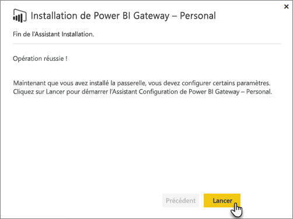
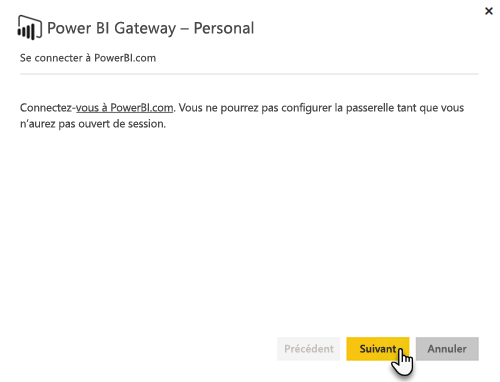
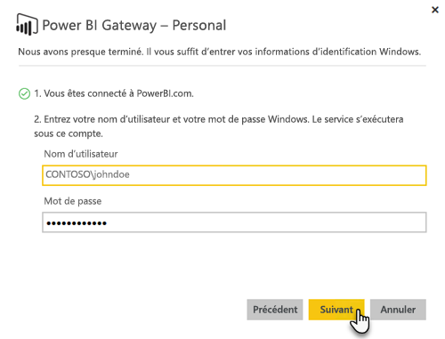

# Passerelle de données locale

La passerelle de données locale agit comme un pont, assurant un transfert de données rapide et sûr entre les données locales (les données qui ne sont pas dans le cloud) et les services Power BI, Microsoft Flow, Logic Apps et PowerApps.

Vous pouvez utiliser une seule passerelle avec différents services en même temps. Si vous utilisez Power BI ainsi que PowerApps, il est possible d’utiliser une seule passerelle pour les deux. Elle dépend du compte que vous utilisez pour vous connecter.

> [!NOTE]
> La passerelle de données locale implémente la compression de données et le chiffrement du transport dans tous les modes.
> 
> 

<!-- Shared Requirements Include -->
[!INCLUDE [gateway-onprem-requirements-include](./includes/gateway-onprem-requirements-include.md)]

### Limitations des connexions actives Analysis Services
Vous pouvez utiliser une connexion active à des instances tabulaires ou multidimensionnelles.

| **Version du serveur** | **Référence (SKU) requise** |
| --- | --- |
| 2012 SP1 CU4 ou version ultérieure |Business Intelligence et Enterprise |
| 2014 |Business Intelligence et Enterprise |
| 2016 |Référence (SKU) standard ou version ultérieure |

* Les fonctionnalités de mise en forme au niveau de la cellule et les fonctions de traduction ne sont pas prises en charge.
* Actions et jeux nommés ne sont pas exposés à Power BI, mais vous pouvez toujours vous connecter à des cubes multidimensionnels qui contiennent également les propriétés Actions ou Jeux nommés et créer des rapports et des éléments visuels.

<!-- Shared Install steps Include -->
[!INCLUDE [gateway-onprem-datasources-include](./includes/gateway-onprem-datasources-include.md)]

## Télécharger et installer la passerelle de données locale
Pour télécharger la passerelle, sélectionnez **Passerelle de données** dans le menu Téléchargements. Téléchargez la [passerelle de données locale](http://go.microsoft.com/fwlink/?LinkID=820925).

<!-- Shared Install steps Include -->
[!INCLUDE [gateway-onprem-install-include](./includes/gateway-onprem-install-include.md)]

## Installer la passerelle en mode personnel
> [!NOTE]
> Le mode Personal ne fonctionne qu’avec Power BI.
> 
> 

Une fois la passerelle personnelle installée, vous devez lancer l’Assistant de configuration **Power BI Gateway - Personal**.

Vous devez ensuite vous connecter à Power BI pour inscrire la passerelle auprès du service cloud.

Vous devez également fournir le nom d’utilisateur Windows et le mot de passe avec lesquels le service Windows s’exécutera. Vous pouvez spécifier un autre compte Windows à partir du vôtre. Le service de passerelle s’exécute à l’aide de ce compte.

Une fois l’installation terminée, vous devez accéder à vos jeux de données dans Power BI et vérifier que les informations d’identification ont été entrées pour vos sources de données locales.

## Stockage d’informations d’identification chiffrées dans le cloud
Lorsque vous ajoutez une source de données à la passerelle, vous devez fournir les informations d’identification associées. Toutes les requêtes à la source de données sont exécutées à l’aide de ces informations d’identification. Les informations d’identification sont chiffrées en toute sécurité, à l’aide d’un chiffrage asymétrique de sorte qu’elles ne soient pas déchiffrées dans le cloud, avant qu’elles soient stockées dans le cloud. Les informations d’identification sont envoyées à l’ordinateur exécutant la passerelle en local, où elles sont déchiffrées lorsque les sources de données sont consultées.

<!-- Account and Port information -->
[!INCLUDE [gateway-onprem-accounts-ports-more](./includes/gateway-onprem-accounts-ports-more.md)]

<!-- How the gateway works -->
[!INCLUDE [gateway-onprem-how-it-works-include](./includes/gateway-onprem-how-it-works-include.md)]

## Considérations et limitations
* [Azure Information Protection](https://docs.microsoft.com/en-us/microsoft-365/enterprise/protect-files-with-aip
) n’est pas pris en charge actuellement
* [L’accès en ligne](https://products.office.com/en-us/access) n’est pas pris en charge actuellement

## Administration au niveau locataire 

Actuellement, les administrateurs de locataires n’ont aucun endroit où ils peuvent gérer toutes les passerelles que les autres utilisateurs ont installées et configurées.  Si vous êtes administrateur de locataires, nous vous recommandons de demander aux utilisateurs de votre organisation de vous ajouter comme administrateur pour chaque passerelle qu’ils installent. Vous pourrez ainsi gérer toutes les passerelles de votre organisation en utilisant la page Paramètres de la passerelle ou les [commandes PowerShell](https://docs.microsoft.com/power-bi/service-gateway-high-availability-clusters#powershell-support-for-gateway-clusters). 

## Résolution des problèmes
Si vous rencontrez des difficultés lors de l’installation et de la configuration d’une passerelle, consultez [Résolution des problèmes liés à la passerelle de données locale](service-gateway-onprem-tshoot.md). Si vous pensez que vous rencontrez un problème avec votre pare-feu, consultez la section [pare-feu ou proxy](service-gateway-onprem-tshoot.md#firewall-or-proxy) dans l’article de résolution des problèmes.

Si vous pensez que vous rencontrez des problèmes de proxy avec la passerelle, consultez [Configuration des paramètres de proxy pour les passerelles Power BI](service-gateway-proxy.md).

## Étapes suivantes
[Gérer votre source de données - Analysis Services](service-gateway-enterprise-manage-ssas.md)  
[Gérer votre source de données - SAP HANA](service-gateway-enterprise-manage-sap.md)  
[Gérer votre source de données - SQL Server](service-gateway-enterprise-manage-sql.md)  
[Gérer votre source de données - Oracle](service-gateway-onprem-manage-oracle.md)  
[Gérer votre source de données - Importation/actualisation planifiée](service-gateway-enterprise-manage-scheduled-refresh.md)  
[Informations approfondies sur la passerelle de données locale](service-gateway-onprem-indepth.md)  
[Passerelle de données locale (mode personnel) - nouvelle version de la passerelle personnelle](service-gateway-personal-mode.md)
[Configuration des paramètres de proxy pour la passerelle de données locale](service-gateway-proxy.md)  
D’autres questions ? [Posez vos questions à la communauté Power BI](http://community.powerbi.com/)

